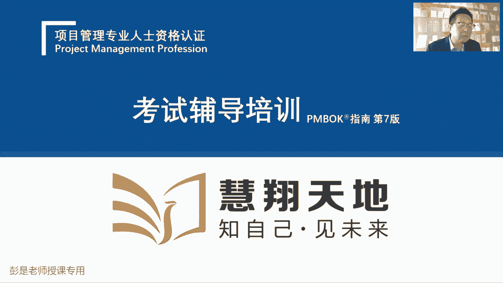
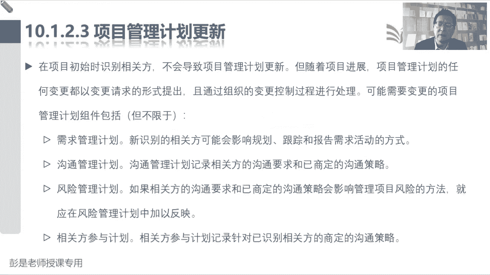

# 2024年最新版PMP考试第七版零基础一次通过项目管理认证 - P63：2.10.1 识别相关方 - 慧翔天地 - BV1qC411E7Mw

干性管理，后面大家复习的时候也可以看到超级快了，根据刚才给大家大概的介绍啊，再快速想一想这个管理过程，识别相关方主要工作是什么呢，就是找到人做分析，然后排排序，看看是不是和风险管理异曲同工啊，识别风险。

找风险，定性分析做排序，只不过到了钢琴管理，咱不需要这么啰嗦，对不对，不需要把它分成两个管理过程，一个过程就全都包括进去了，找到人分析，打标签，看看他们都是一群什么样的人，然后呢人分369等。

根据我们分析的结果，对这对这些人做分组做排序，那接下来第二个管理过程主打一个什么呢，态度看看这些人对项目的态度是什么，至少现在能猜到两种态度，一种叫反对，一种叫支持，就是不支持和支持吧，诶对态度对。

就是对你态度不好，对你态度好，所以以此类推对不对，那管理干系人参与呢就是在执行过程，在执行过程中，天天这些人哪可能今天有今天有个想法，明天有个问题，后天人之间有冲突，再后天有人提了个变更。

看看这些乱七八糟的事情，需要谁参与，和这些人进行沟通，进行协作，进行沟通，进行协作，以此类推，最后呢就是看看这些人的态度有没有发生变化，是不是在朝着我们预期的方向在发展，定期的监督，定期的监控。

看看人有没有变化，看看态度有没有变化，所以这一章其实比较重要的，就是前两个管理过程，因为后两个管理过程啊超好理解，搞定，那看看这一章的综述，没没什么解释的了，识别相关方，识别干系人，会输出干系人登记册。

该型登记册里面写什么内容呢，这是刚才三部分啊，看看都有谁，然后做分析，然后，做分组，所以就包括了基本信息分析，评估的信息和分组排序的信息，这就是干系人登记册主要的内容，然后接下来第二个管理过程。

这个单词要记住，它和其他管理过程不一样，我们叫范围管理计划，进度管理计划，成本管理计划，沟通管理计划，到了干行，到了相关方，就把这个管理两个字变成了参与，因为在强调参与参与参与的重要性。

为什么强调参与的重要性呢，比如说我想买车诶，要不要征求一下家人的意见，对不对，我想结婚，要不要征求一下家人的意见，看看这个事都需要谁参与到什么程度，对不对，不能让家人不知情啊，对以此类推了吧。

所以着重主打一个参与参与参与参与度诶，去分析他们的参与程度，然后呢，后两个管理过程它的输入输出没有什么东西啊，嗯搞定，那再往下概述这段文字说什么是干系人，什么是相关方呢，前面第一天上课大概就说了吧。

相关方包括能够影响项目，会受到项目影响，甚至一些自认为受到影响的人，总之尽量的尽量的把干系人的范畴想得更广，避免有遗漏，但不代表着所有人都要重点管理谁，在call back call back回去啊。

所以识别单行我们要去找到这些人，了解都有哪些人，然后呢对这些人进行打标签做分析，咱再接下来对这些人做分组做排序好，所以我们要识别这些人，然后分析这些人，分析这些人的分析。

分析分析完了不就可以分组就可以排序了吧，人分369等了之后，我们就要制定合适的管理策略，来有效调动相关方参与项目的决策和执行，然后再往下就没有什么需要解释的了啊，好那看四个管理过程，这段文字也不见了。

然后核心概念这段文字，基本上后面复习的时候看一遍就可以了，说呀每个项目都有干系人，他们会受到影响，或者能对项目产生影响，或者自认为受到项目，对自认为对项目产生影响，第一我们要结构化的对识别相关方。

然后进行相关方排序，引导相关方参与的重要性，结构化方法是什么意思呢，这个大家看看工作中会不会听过这个单词，什么叫结构化呀，没有人反馈，那我就说了啊，什么叫结构化，它主打一个什么呢，调理。

这干事情要有章法，有规律，有条理，有逻辑，对不对，不不不要动，东一榔头，西一棒槌，像无头苍蝇一样吧，那什么叫结构化的方法，什么叫调理呢，就是先去看看咱内部人都有谁，看看外人都有谁，外人呐又可以分呐。

什么客户啊，政府啊，供应商啊，以此类推的吧，这是思维导图，思维导图的存在的目的不就是梳理信息吗，让他有条理，有层级，有逻辑，WBS也是结构化的东西啊，这是我们的主要成果，然后这是我们的生命周期。

或者是或者是成果的细分，再往下再往在这都是条理这种东西啊，知道意思就够了啊，总之识别相关方，进行相关方的排序，人分369等，然后规划相关方参与，还在强调前两个过程的重要性，好那再往下说，像官方的满意度。

巴拉巴拉就不念了，后面这段文字呢，说，我们需要需要需要不断的不断的开展，这些管理过程，为什么，因为项目进入生命周期的不同阶段，参与的人群群体可能不一样，相关方不再与工作有关人不一样。

组织内部和重大区域的相关方，社群发生重大变化，人不一样，都在说人可能会有变化，人一旦有了变化，我们就需要去识别干系人，紧接着规划干系人参与就在说这个事儿啊，好那10。1识别相关方，输入没啥需要去记得。

所有东西都可以用来识别感，写输出就是相关方登记册，它的内容，基本信息分析评估信息，分组排序信息，一会看文字要重点记了工具记住看看啊，专家问卷头脑风暴，相关方分析，这是打标签，文件分析分析这一堆收入的。

唯一需要记的高频考点，就是这个相关方映射分析和表现，并且这个单词啊，基本上正式考试也不会用这个单词，所以一会儿我们看工具基础，它里面就分成了，各种各样的方格，什么立方体凸显模型影响方向。

它有很多这种这种图形化的工具，来帮助我们对相关方做分组做排序，这个一会儿讲工具的时候要记住它好，那再往下这个管理过程，什么是该数值不一样了吧，输入没有新的知识点，所有东西都可以用来识别改写。

输出呢相关方登记册，基本情况，打标签经过相关方分析分析的结果是什么，权利啊，作用啊，影响啊，利益啊，需求啊，期望啊，把这些标签都给他贴上去，贴完了标签之后，就可以根据我们分析的结果做分组，分组做排序。

所以其实大家手里的手机里面的各种app，什么淘宝啊，天猫啊，京东啊，什么携程啊，都在对我们做分析啊，抖音小红书头条都在对我们做分析，分析的是什么呢，你是一个什么样的人，然后根据分析的结果对不对。

就给你对吧，就给你做了一大堆，做了一大堆重要重要程度的划分，哪些人是我们的重要客户，优质客户，哪些人不重要，以此类推，根据重要程度来定策略，定套路，就这意思啊，好然后变更请求。

