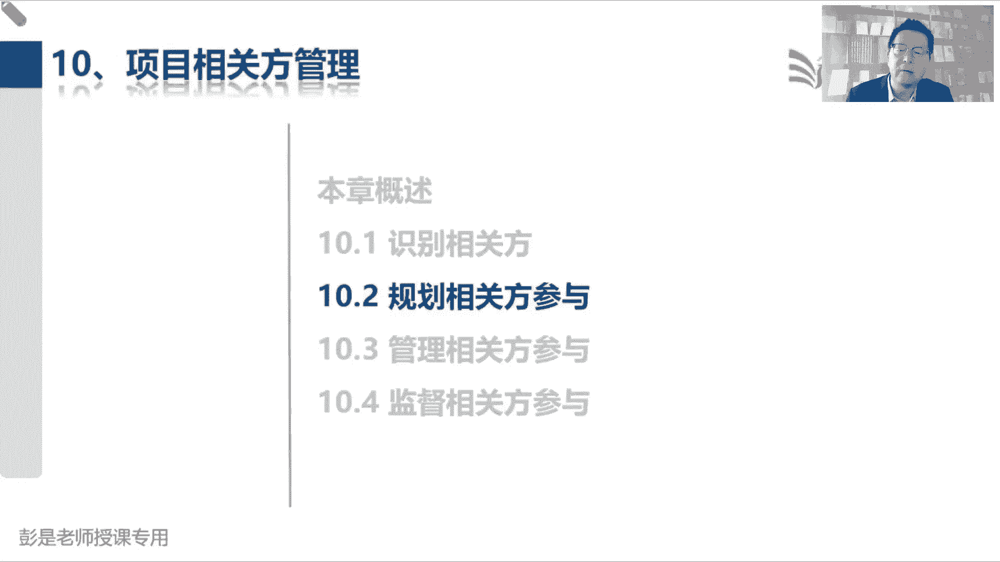
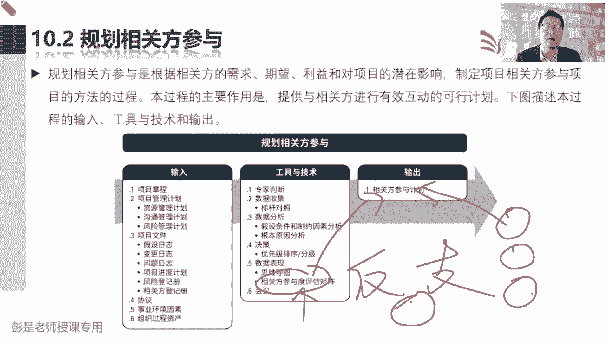
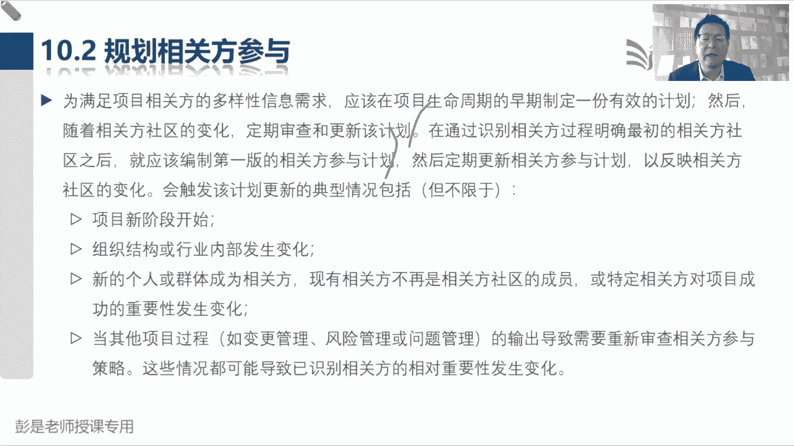
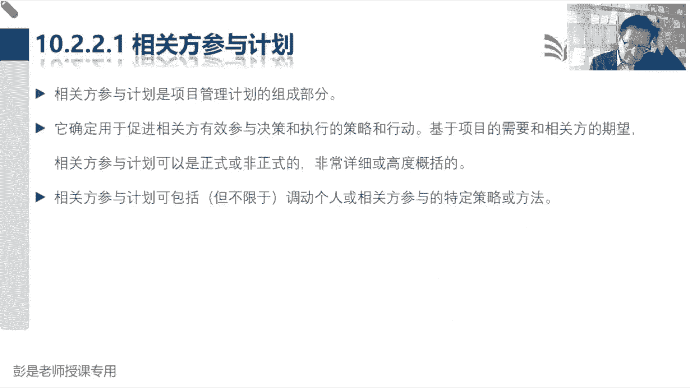

# 2024年最新版PMP考试第七版零基础一次通过项目管理认证 - P64：2.10.2 规划相关方参与 - 慧翔天地 - BV1qC411E7Mw

10。2规划干型参与它的输入，也没有什么需要去记得输出呢，相关方参与计划，相关方参与计划就牢牢记住态度问题，我们要根据他的态度分析，应该采取什么样的策略，什么样的套路去想办法让他支持项目。

因为有的人反对我们的人就敌人来了，有猎枪朋友来了，有酒吃，这个意思吧，这不是不同的策略，不同的不同的套路吗，根据他的参与度定的这个策略，那它的工具记住没有什么需要去记的东西，就是刚才我们见过的这个术语。

这是这个管理过程非常非常重要的工具，相关方参与度评估矩阵，它的主要作用，就是分析一下他目前的参与度是什么，再评估一下我们期望他参与到什么程度，然后呢定策略定策略，想办法让它达到我们期望的程度。

就这意思吧，好，所以就是根据相关方参与的评估矩阵，评估的结果，然后呢把它写到相关方参与计划里，然后定最终的这个套路，这个策略，比如说粗暴，举个例子啊，我想买个新手机，我娘不同意诶，他目前的态度是反对。

那我希望她支持我买个新手机，那怎么定这个策略呢，不就看人吗，对什么什么套路，什么招数对我娘好使，比如说一哭二闹三上吊，我娘俩刀死得流豆腐心呢，就看不得人掉眼泪，那我就一哭二闹三上吊对吧，卖惨卖惨哎。

这就是套路，这就叫策略，以此类推了吧，就这样粗暴，有个认知，有个印象就够了，因为考试也没有办法考，没有办法办法办法考，我们对这个人应该采用什么样的策略，一定是千人千面的面对不同的人，面对不同的人。

我们的套路，我们的策略肯定是不一样的，就没有办法去评价这个策略，这个套路的好与坏，对不对，所以他没办法考，只是考理论，考理论就是我们要知道相关方参与度，评估矩阵的作用，看看他目前的参与程度。

看看我们期望的参与程度，然后还要知道相关方参与计划的内容，就包括目前参与程度，希望参与程度，还有定的这个套路，这个管理过程就下班了好。

所以再往下找啊，有小细节，就这句话标一下，我们在通过识别相关方过程，明确最初的相关方社群之后，就应该编制第一版的相关方参与计划，然后定期的去进行更新，变成变成人话，就是说呀识别干系人之后。

其他管理过程可能也没开展呢，我们紧接着就要规划干系人参与，因为需要马上去分析这些人对项目的态度，也就是参与度，这还能听懂吧，好，所以这两个管理过程不一定说，我们等到规划过程组什么什么这些东西。

这些东西开展完，然后再去规划干系人参与，不需要啊，他这逻辑上没有这么严格的区分，识别干系人，规划干系人参与，甚至可以就直接把它合并，因为他俩需要紧密协作，这就是这句话稍稍有一点点印象。

后面的这一大段文字都在说。

人有变化就不解释了，输入没东西，没有新的知识啊，好输出现官方参与计划，就这么一句话，目前的参与程度，我们期望的参与程度，然后定特定的策略和方法就粗暴了，想一想刚才说过的场景对吧。

一哭二闹三上吊是一种策略，威逼利诱是一种策略，晓之以理，动之以情，是一种策略对吧，可以卖惨，可以吓唬他，可以哄他，可以骗他，这都叫套路，都叫策略，总之中心思想想办法让大家。

第二让他朝着我们期望的参与度去前进，那期望的参与度是什么呢，至少至少都要支持我们这个事情，如果全世界人民都支持我，我这个项目肯定会成功啊，这意思吧，然后学学完了这个识别干系。

识别相关方和规划干系人参与之后，就不得不提到一个隐藏的小知识点，说识别感谢，那我们做了什么事呢，了解这些人的基本情况，然后呢对这些人打了标签，因为我们要去分析他的权利作用，影响利益。

兴趣爱好方方面面方方面面的东西啊，分析完了之后呢，我们又对这些人大，通过各种各样的方法做了分组，做了排序，说分析一下谁重要谁不重要，分的优先级，这是识别该行开展的工作工作，紧接着规划干系人参与。

我们去分析一下他对项目的态度到底是啥，因为有的人可能是反对项目，有的人可能是支持项目，然后呢你又写了个策略和套路，那接下来带出来的考点是啥呢，大家都随便想场景啊，随便想场景，我启动个项目。

张总是我的领导，他跟这个事儿啊好像没什么关系诶，他我就把它放到不重要的人群里了，然后呢，他对这个项目还不知情，那我跟他沟通沟通，让他知道这个事就可以了，他态度啊可能是反对，但也不重要。

吓唬吓唬到就可以了，就像刚才这些话，刚才这些话他适不适合你把它公开呢，适不适合把这些东西发出去呢，想一下，就get到这个知识点了，张总不重要，反对就反对吧，无所谓啊，吓唬吓唬他，对这所以这一章很特殊啊。

因为最后这结论啊，因为我们这这两个管理过程，分析的对象是人人的心海底针呐，关于人的这些分析呀，评估啊这些结果呀，他比较敏感，对不对，就像各位同学，你敢不敢把你对对你领导的领导的评估，分析的结果发给他呢。

好像不够不适合不合适，这些信息要不要传达给你身边的同事呢，好像也不一定，对不对，因为他比较敏感，所以呢所以呢公开之前发布之前要慎重思考，慎重思考，它不适合发出去，对不对，知道这个意思啊。

搞定就这张很特殊，其他的你的需求啊，范围啊，进度啊，成本啊，质量啊，对事情的分析和评估，这事儿没关系啊，无所谓，除非一些涉密，除非这种涉密的东西吧，比如说你的用户名密码，这玩意儿怎么发，要讲究一下。

除此之外。

