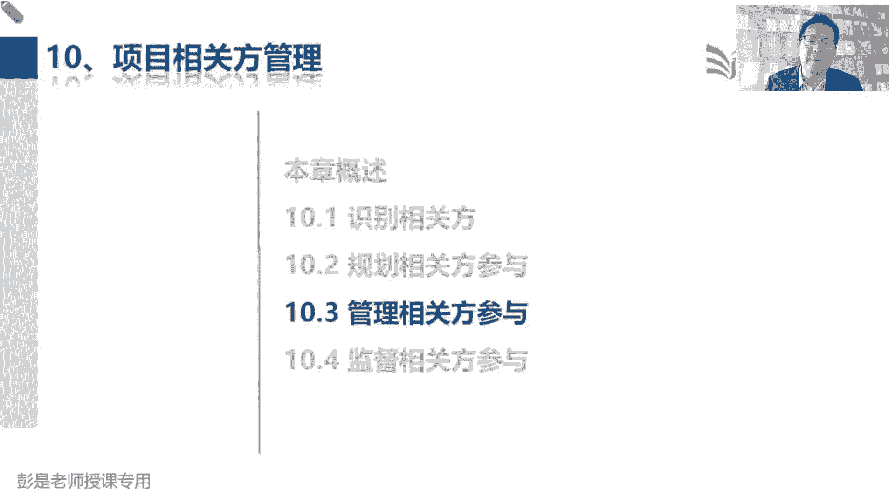
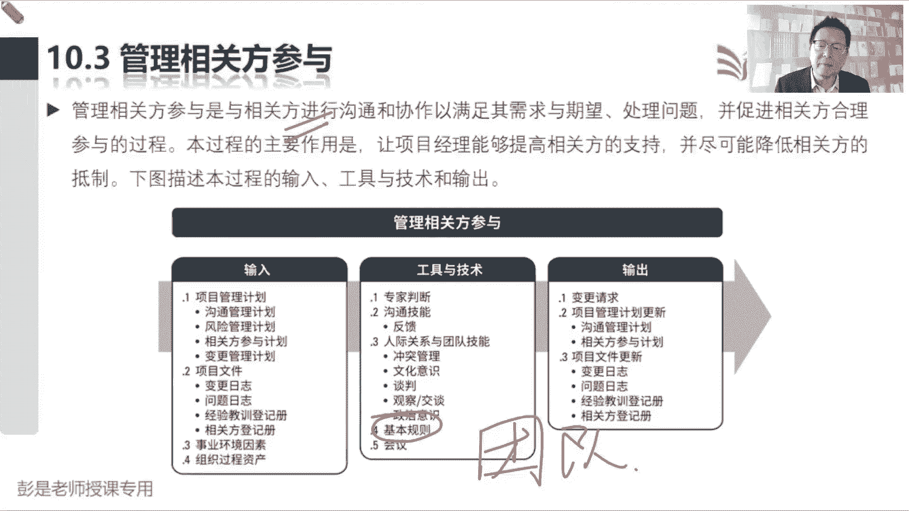
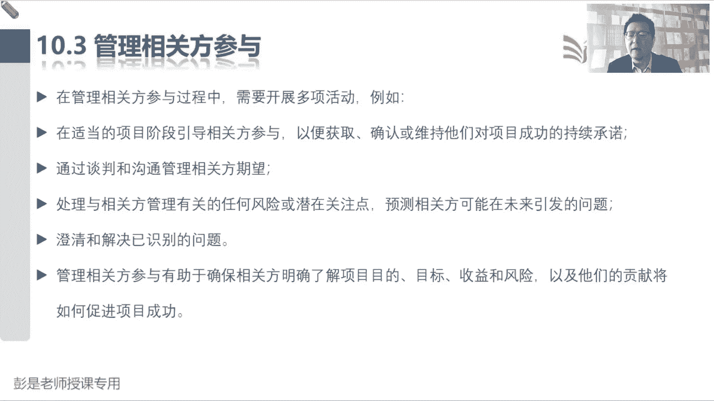
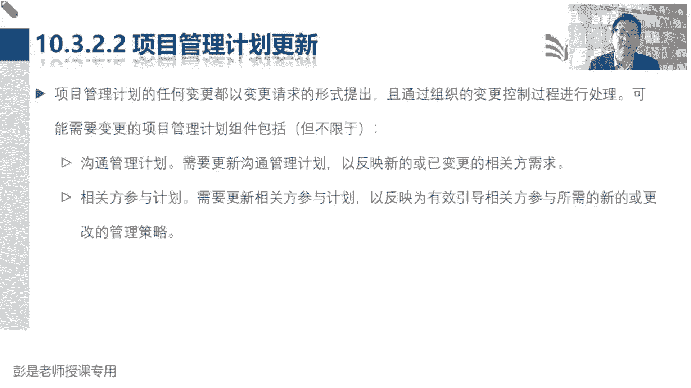

# 2024年最新版PMP考试第七版零基础一次通过项目管理认证 - P65：2.10.3 管理相关方参与 - 慧翔天地 - BV1qC411E7Mw

那10。3这个管理过程后面复习的时候，包括后面最后一个管理过程，10。4就快速的看看一遍就完事儿了，这个管理过程在执行过程中，就是大家每天每天都要做的事情，对对今天看看客户开心不开心啊，满意不满意啊。

看看老板开心不开心啊，满意不满意啊，沟通沟通对不对，所以这是和相关方进行沟通，进行协作来满足需求啊，期望啊，处理问题啊，处理冲突啊，噼里啪啦干这个事儿啊，就是持续开展的事情好。

所以它的输入工具输出都没有什么新的知识点，输入，没东西输出，没有什么需要去记的，像什么冲突文化仪式，谈判观察交谈都见过了吧，基本规则还记得吗，基本规则对应到哪个东西。

基本规则是哪个管理过程的哪一个输出了诶，团队章程规划资源管理，上节课刚回顾完哦，这个稍稍有一丢丢印象就够了啊，看到基本规则能够反应过来，这玩意就叫团队章程，为什么呢，我们希望肝系能够支持项目。

但是像行贿受贿这事能不能能不能干呢，能不能喝大酒啊，对不对，哎这些东西可能违背一些规则，这不能改不能改，这有印象就可以了，基本上也不大会考。

那再往下这段文字就真的没有，没有什么可解释的了哈。

全都是纯粹的字面意思，复习的时候看一遍，知道熟悉这些概念就可以。

