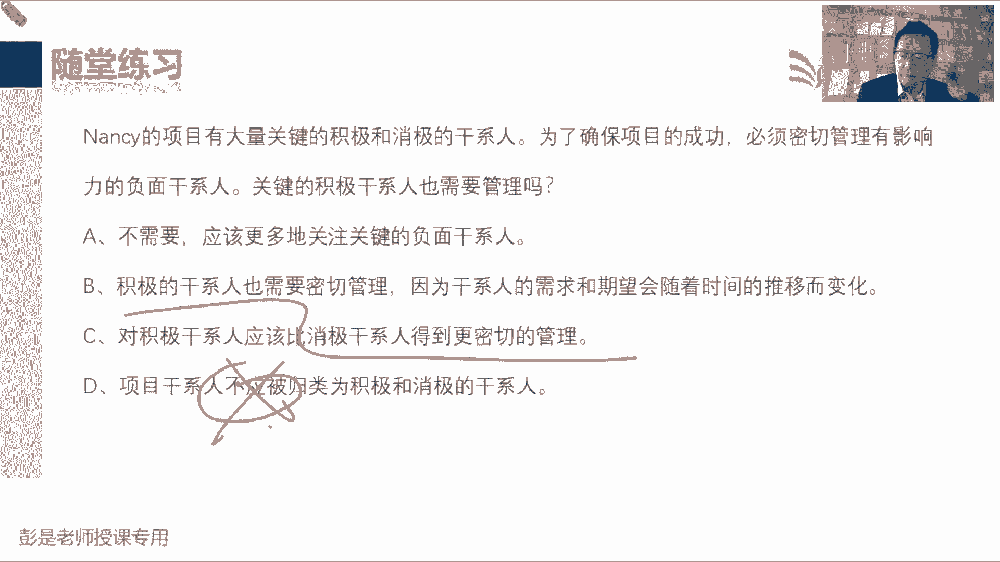
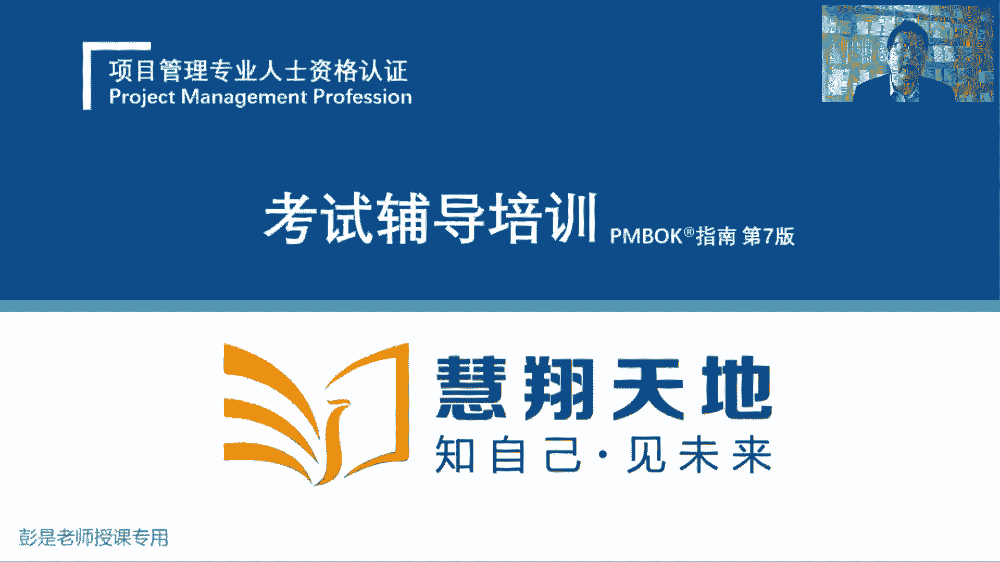
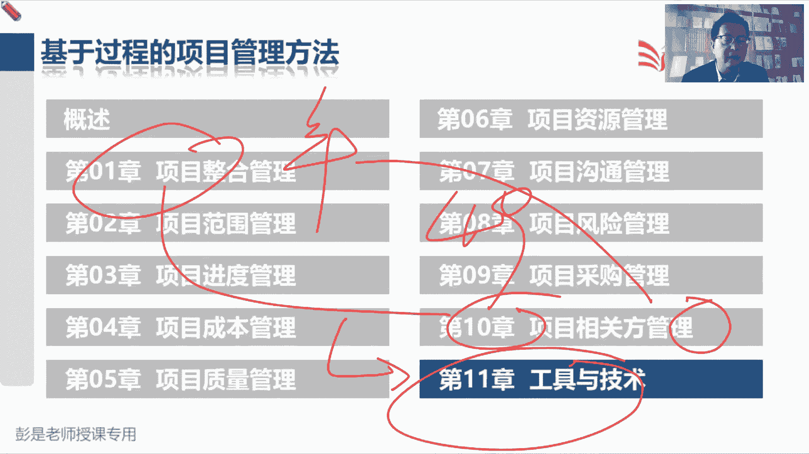

# 2024年最新版PMP考试第七版零基础一次通过项目管理认证 - P66：2.10.4 监督相关方参与 - 慧翔天地 - BV1qC411E7Mw

看猛一看挺多呀，不要被吓到，不要被吓到，都见过了，这个管理过程最重要的作用，知道它是啥就行了对吧，就是随着进展情况情况情况，然后改进，所以他的输入输出工具记住，没有需要去记的东西。

工作基调数据经过分析和评估，得到工作机调信息，然后备选根本原因，相关方分析，这都见过了，见过了见过了见过了，不需要去解释了，也不需要去记住它，不需要记它，没有什么有代表性的工具，没有什么特点好。

这是字中仅此而已，所以接下来输入啊，这都全都不念了，这就是咱传说中的49个管理过程，恭喜各位同学，基本上全都听完了好，那接下来后面大家复习的时候，一定要听话听音，听话听音啊。

有些管理过程大概知道怎么回事就可以啦，比如说什么规划范围呀，规划进度啊，规划成本呐，对他没有太多需要记住的实质性的内容，但是到了质量这一章不一样了，质量管理计划里面有一个质量标准，这还需要记住吧。

然后资源管理计划里面有什么架构啊，责任分配矩阵啊，它有一些实质性的内容需要记住吧，沟通管理计划呢没什么实质性的内容，沟通的方方面面都在里边了，风险管理计划，有一些概率会影响等级的定义和那个矩阵。

还有RBS风险分类，这需要记住吧，所以有实质性内容的东西都是考点，剩下假大空的虚的东西啊，基本上不会考，对不对，所以后面复习的时候有一些管理过程，还记得一开始说49个管理过程，背诵的技巧吗。

整合这一章单独记九个规划过程，九个监控过程，识别干系人确认范围，嘿一共有二十二十七个管理过程了，剩下22个，这是需要重点看重点照顾的东西了吧，好那接下来看看干型这一章，大家目前记到什么东西啊。

干型人登记册包括什么内容，就牢牢记住刚才说的那，反复说了好几遍那个东西吧，看看都有谁，然后打标签，然后人分369等，所以答案是A，项目经理正在启动一个新项目，识别所有干系人的主要原因是什么呢，都选B啊。

没有不同观点和意见吗，好有同学选C了，D就没有道理吗，A好像也有关系啊，所以这道题考的考的技能是啥呢，总结归纳干型可能会涉及到我们的范围，进度成本质量，资源沟通风险采购，对不对。

所以再一总结拔个高度就叫期望，他可能关于项目的各个知识领域都有期望啊，那干型干型，接下来最重要的就是想办法，把这种正面的影响最大化，负面的影响最小化对好，所以答案就是B啊。

期望需求就包括了方方面面的期望，方方面面的要求，这道题呢，好恭喜大家答对了，说问题日志用来记录和监督问题的解决情况，以下哪一项确保问题解决最有用，A把问题作为一个单独的活动，这不一定啊。

B把问题的解决方案作为一个工作包，这也不一定啊，因为它取决于这个解决方案的大小规模，对不对咳，C项目经理亲自负责，这也神经病不一定啊，具体问题具体分析，项目经理不一定能够亲自搞定所有的问题啊。

专业的事找专业的人，所以呢这就是原则，就是其实这个考点就对，报道责任分配分配矩阵那个知识点了吧，不管是工作包啊，还是活动啊，ram呀，还是RACI呀，我们要确保任何一个层级，只有一个A要落实到人。

所以就是为问题解决指定责任人，并规定解决日期，解决解决日期，就涉及到我们讲过的一个smart原则，目标管理，因为任何事情，最好最好最好最好都有一个明确的开始接触，日期，时间上要明确，否则可能遥遥无期。

没下文了，好说，在一个项目之中，干系人对项目有不同的期望，下面哪一个东西可以帮助我们协调干系的期望，来调动干系人参与整个项目生命周期呢，这是总分题吧，有一个同学选了B啊，其实沟通管理计划呢你还有用。

但是大家要思考了，B和C这是先有鸡还是先有蛋啊，他俩的逻辑关系是是谁在前面呢，如果我们希望希望干系人支持项目，是先规划参与还是先规划沟通，干型在前吧，为什么呢，因为策略错别字啊，我也不会写了。

策略就决定了如何沟通吧，思考一哭二闹，三上吊，就决定了怎么沟通，晓之以理，动之以情，就决定了怎么沟通，和颜悦色，好好说话就决定了怎么沟通对吧，面目狰狞，威逼利诱就决定了怎么沟通，所以干系人参与计划。

就指导我们如何和对方去沟通，从而引导对方支持项目，所以先规划参与再规划沟通，后面大家复习的时候，你就会发现就会发现啊，这两个管理过程它的输入输出是交叉的，规划干系人参与输出，干系人的参与计划。

这个参与计划就作为规划沟通的输入，因为我们要根据参与计划的指导去思考，去怎么和人，怎么和对方沟通，这个事儿就会输出沟通计划，那沟通计划呢又作为规划干系人参与的输入，为什么呢。

因为我们可以根据沟通计划去分析，他对项目的参与程度，为什么，可以根据沟通计划去分析他对项目的参与度呢，大家生活中工作中都遇到过这样的场景吧，张总说，这个会我不参加那个会，我也不参加，文档资料不要发给我。

我也不进你们的微信群，邮件都不要抄送给我，我就不想知道你们这个项目的情况，说明他的态度可能会有问题，对不参与度可能有问题啊，哎所以他俩输入输出相互交叉的，但是要把要能把这个逻辑想明白啊。

一定是先规划参与，再规划沟通，然后呢我们再可以结合到所有的计划，所有的文件去分析和评估他对项目的参与程度，好再看这道题呢，这纯粹是考管理过程的概念，就是判断一下他在这个事情的频率，就可以分析出来了吧。

和我们这些人呐天天进行沟通，项目经理主要工作不就是沟通吗，协作吗，指导啊，辅导啊，帮助啊这些事情吧，所以和干行人进行沟通，进行协作，满足需求期望解决实际发生问题，就是在执行过程组管理干型参与。

所以答案是D，好这道题呢，由于组织结构变化，干系人A承担了新的职责，从指导委员会辞职，来了个新的替代者，干系人B提出和商业利益有关的问题，我们首先应该做什么，就把咱刚才说的那个逻辑再串一串哈。

人有了变化，首先识别干系人，因为我们要更新干系人登记册，对不对，看看都有谁分析评估分组排序，紧接着就去规划干系人参与，因为我们要去分析和评估他对项目的参与程度，和我们期望的参与程度，从而定策略，定套路。

规划完了参与成参与，规划完了参与之后，根据我们定的策略和套路，再去规划沟通管理这三个，这三个就可以完全可以把它串起来好，所以找选项了，那恭喜大家答对了，这是更新这个玩意儿，然后参考该型参与计划。

这道题呢项目经理感觉项目的会议成效很差，与会者都没有做好准备，无法遵照会议的议程，我们应该怎么做来改变团队的态度，准备了啊，买定离手啊，54321要能读明白题啊，总结归纳一下题目目前是一个什么情况。

对说与会者都没准备，然后无法遵照会议的议程所导致，会议的成效很差，A肯定不能选吧，D肯定不能全吧，就BC挑一个，B，是编写一份关于会议文化和会议规则的备忘录，C在下次会议开始之前讨论会议的重要性。

就是啊能想到对应的什么知识点，什么会议没结果，什么效果差也不准备，你还不遵守议程，最后一总结，它体现的是什么呢，没规矩，能反应过来啊，没规矩没规矩，对不对，那咱就定规则呗，所以团队章程会议的指南。

会议的规则，团队章程啊，能反应过来这个东西就行了对吧，变成大家很好理解，耳熟能详的场景，比如说每天挤公交，挤地铁不排队，也不先下后上，也不给老幼病残孕做，若是群体让座就没规矩啊。

在车厢里面什么手机外放吃臭豆腐，这都是没规则没规矩的表现，那咱就先定规则，定规则，因为写下来比用嘴说效果会好得多对吧，这是底层逻辑啊，写下来比用嘴说效果好得多呀，好再往下说，我们制定了一份干系人登记册。

我们应该识别以下哪一项，这个简单，基本信息，分析和评估的信息，分组排序的信息，所以答案是D，参与度不再干系人登记，特在干系人参与计划里面，搞定说客户已经接受所有的可交付成果，我们为什么还要和客户接触呢。

你打完车叫外卖，叫叫完外卖，钱货两清，为什么还要人家给你发一个什么玩意呢，对求亲给个好评，亲你满意不满意，对我们的服务做个评价呀，因为客户满意度是衡量项目成功不成功，一个重要的因素之一啊，所以答案是B。

这好好猜啊，说J某为一家政府机构管理一个路网设计项目，他目前正在为该项目制定干闲人参与计划，以下哪个文件将为JIM提供啊，这送分题不念了吧，正在规划干协参与什么东西，能够得到这个肝闲人的名单呢。

就是A这超超简单不解释了啊，看看LUCY有什么问题，选C的同学就再帮你实锤一下，就牢牢记住刚才我们依稀听过的一个词啊，察言观色呀，对不对，持续的关注干系人的参与度有没有发生变化，所以呢答案就是C。

A肯定不对，B肯定不对，D肯定不对，说干系人的参与和影响力一直很重要，在这种情况下，对干系人的参与监控应该持续开展，持续开展察言观色呀，随时看看他的态度是不是发生了变化，所以在粗暴随便说个场景啊。

比如说我昨天晚上，然后不学习玩游戏，玩游戏要持续的观察，持续的观察对吧，我娘的我娘的表情，看看是不是脸色变变凝重了，变深沉了，万一万一这个态度朝着不好的预期去发展，要及时的采取措施。

防止防止他反对这个事情，就这意思吧，所以要持续开展，根据项目的实际情况去分析啊，好这道题呢，它要搜什么模板，把题目读懂，这道题答案就出来了，说呀他最近确定并分析了他主要项目干型。

现在呢正在搜索组织过程资产来寻找一个模板，利用这个模板，我们就可以更新该分析的结果，以及有效参与干系人所需的计划战略，那你要搜哪一个模板呢，所以答案是A对不对，我要找个资料，找个参考的东西。

然后呢以便于制定干系人参与计划的战略，所以是A干先参与计划的内容，看看桑德拉有什有什么问题啊，这题简单吧，我说正在管理一个软件开发项目，说有许多负面态度不开心，怎么管理这种消极得敢选呢。

哎巧云同学说的没错啊，咳所以再给大家巩固一下这个这个大道理啊，说人家反对你负面消极，不开心，不满意，不喜欢就想啊，各位同学，你看过的电影都可以总结成这种经验的，说我想抢银行，警察反对我怎么办呢。

怎么办呢，这样他上贼船不就完事了吗，对所以为什么，我们提倡的是成员参与计划的制定，成员参与了计划的制定，可以为我们贡献出他的专业呀，经验呐，知识啊，对不对，另外成员参与的计划的制定。

可以提高他们的主人翁意识，责任心，主观能动性诶，就拉他上贼船就可以啦，他这个主观能动性都释放出来了，他可以帮你积极地制定政策计划，让这个计划更合理，更可行，更靠谱，是这意思吧，所以就是参与参与参与。

让成员参与我们的决策，参与我们工作的规划，执行和控制，想办法打造一个成熟的自组织团队，就结合到塔克曼，结合到管理型呃，领导力风格，对不对，结合到我们编制计划的过程中，一个重要的原则，全员参与，全员参与。

结合到知识管理，把这些东西混到一起，最后就是A好，所以记住啊，参与决策不代表着说他就一定说了算，这不是一回事吧，参与决策不代表着说他一定说了算，这是两回事啊，因为最终进行决策的方法，还有很多种方式呢。

可以一票否决制，对不对，也可以半数以上或者叫相对多数啊，所以参与决策，不要不要把这个东西想狭隘了啊，不要不要把它想窄了好，所以正确的答答案就是A，这道题看NANCY又有了点小状况啊，这个简单。

好54321买定离手，恭喜大家答对了，收积极的干闲人也需要管理吗，A肯定是错的，对B积极的安全人也需要密切管理，因为二八这是对的，C说对，积极的干系人比消极的干系人，得到更密切的管理，为什么不选C呢。

你是更关注消极的人，还是更关注积极的人，消极吧，哎所以C说反了，C说反了好，D呢干系人不应该被归类为不能D选项排除掉，他说错了。

所以最后的答案就是第二个选项，这就是大概干型这一章的重要重要考点，重要知识点。

那接下来咱终于搞定了49个管理过程，十大知识领域。

五大过程组，然后呢休息一下，我们就带着大家全面的回顾一下，我们从第一章到第十章所涉及到的这些工具，技术，就按照顺序来，从咱第一个管理过程制定项目章程开始对吧，什么专家判断，什么访谈会议管理引导。

以此类推吧，从第一个管理过程，一直到刚才最后一个管理过程，监督干选人参与中间49个管理过程，所涉及到的工具基础，咱做一个全面的回顾，并且呢之前有一些工具没怎么讲，大概讲了讲。

然后呢咱通过今天的课程再给大家细化一下，相当于复习了，其实那讲工具之前呢，咱休息一下吧，现在11。10分。

