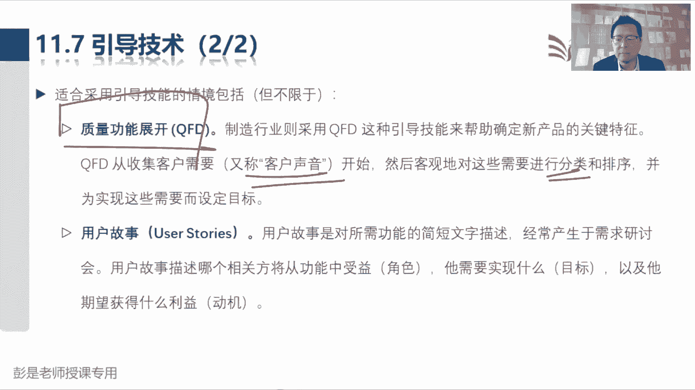
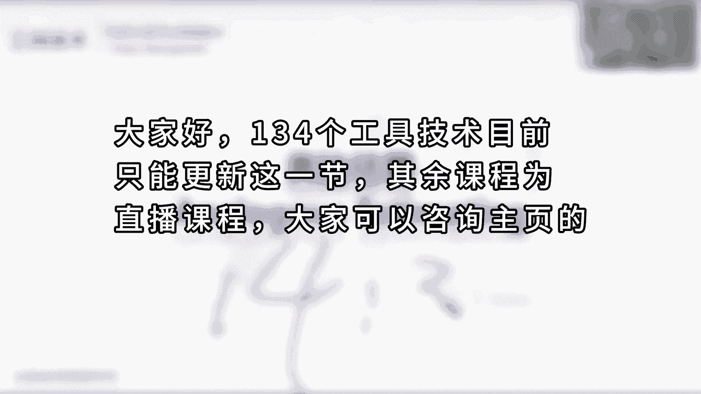

# 2024年最新版PMP考试第七版零基础一次通过项目管理认证 - P67：第二部分 工具与技术 - 慧翔天地 - BV1qC411E7Mw

接下来咱。不。讲工具技术。全面回顾这49个管理过程所涉及到的工具工具技术，大家学习的重点一定是先听个大道理啊。啊，这么多管理过程，有一些管理过程有自己专用的对？有代表性的工具。

比如说刚才我们刚讲过规划沟通管理，涉及到沟通需求分析和沟通风格评估。这两个玩意儿一听，其他管理过程用不上，这就需要稍稍印象深一点。除此之外，大部分的工具都是通用的，在很多管理过程里边都可以用。

那么就不需要去记住它是不是属于这个管理过程，他也不大会考。好，那接下来啊。😊，这段内容非常快呀，先抬头看PPT就可以了。先不着急做笔记啊，专家判断需要解释吗？想一想专家是什么样的人呢？

他在某些方面有经验啊、知识啊、诀窍啊、技巧啊，他就是这个领域的专家。我们主要工作重心是分析什么时间，做什么事情，需要什么样的专业知识。然后去分析谁有这个专业知识找到他，对不对？这不就是识别干写吗？

规划干写人参与啊，然后引导这个人参与到项目之中，帮助我们提出合理化大建议和见解，然后促进项目成功，支持项目，就这意思吧。专业的事找专业的人。哎，所以他基本上不大会考啊，这很好很很简单的知识点，不解释了。

头脑风暴需要解释吗？哎，怎么看看有没有新的创意。比如说今天中午吃点啥，看看各位同学有没有什么新的观点呢，新的想法呀，它是一种发散思维创新，这也没什么考点。头脑写作这个单词就需要稍稍印象深了。

因为看名字可能猜不出来啊。头脑写作头脑写作它是什么玩意儿呢？Yeah。Okay。不。没错。Okay。这是让大家在头脑风暴之前有时间想一想做一些准备，这样可以有效的提高咱头脑风暴这个会议的效率，对不对？

英文不需要去记啊。英文不用记。好，所以头脑写作其实就就是头脑风暴的升级升级版，让大家头脑风暴会议之前有时间准备一下，避免呢一开会就懵了。所以就是让个人参与者有时间在小组创意讨论开始之前单独想一想。

对不对？所以变成场景就是张三李四王五照六10分钟以后，我们去会议室脑爆一下，今天中午吃点啥，给大家一些时间去思考这个事情。Yeah。好，访谈这不解释了吧，这是什么沟通交流，这这不解释了啊。

焦点小组还记得吗？嗯。教练小组第一次见到他是在哪个哪个管理过程，不需要记住啊，但是它的主要作用是什么呢？主题。Yeah。这是主题聚焦聚焦聚焦。从第一个管理过程甚至到最后一个管理过程。

我们可能会组织各种各样的会议，各种各样的沟通，各种各样的探讨。但是呢不要偏离话题，就这意思吧？所以焦点和小组是召集预定预定的相关方和主题专家，由一个什么主持人引导大家进行讨论，从而在预定的主题之内。

所以要聚焦于这个主题啊，不要偏离话题，这基本上也不大会考。好。那前面这堆工具都比较简单，接下来就需要记住的都是冲突管理的策略，这一定是一个高频考点。冲突管理冲突管理。首先搞定啊，什么叫冲突呢？

各种各样你能认知的东西都叫冲突啊。优先级。抢座。抢座儿。个人的观点的不一致，意见的不一致，工作风格、工作方法的不一致都可以认为是冲突。所以冲突的主要来源包括资源稀缺。为什么坐地铁上班早高峰，大家都抢呢？

因为抢座啊，因为少啊。然后进度优先级排序就是先来后到，为什么要排队呢？咱得有先来后到啊。包括个人风格什么工作风格，工作方法，哎，这都这这种差异都会产生冲突。比如说有人喜欢麦当劳，有人喜欢肯德基。

这也是冲突啊，对不对？然后第二个知识点是什么呢？我们采用基本规则，团队规范及成熟的项目管理实践，可以帮助我们有效的减少一些冲突的数量。坐地铁抢座，那咱就定规则呗，对不对？先到先得先到先得。然后呢。

我们还要预留一些座位，照顾一些弱势群体，老幼病残运专座爱心专座，哎，可以有效的减少一些中毒。但是呢。没有有效的方法可以避免所有的冲突，因为观点的不一致，意见的不一致，每个人的三观不一样啊。

世界观、价值观、道德观、每个人的经历、背景、认知都不同，不可能大家达成共识，这不现实。哎，知道这意思啊。那再往下说冲突管理啊。冲突冲突不一定都会产生负面影响，有效的冲突管理可以提高生产力，改进工作关系。

这能想到什么什么典故呢？冲突不一定都是坏事儿冲突不一定都是坏事啊。咱古人说不打不成交，对不对？打一架反而有可能能促进双方的关系啊，所以冲突不一定都是坏事。记住这个结论。所以后面说。

如果管理管理得当这种意见的分歧，有利于提高创造力和改进决色。后边这一段文字需要大家不需要去记它具体的具体的描述啊，总结归纳就可以了。总之，中心思想就是。负面影响最小化，正面影响考虑最大化。

所以冲突发生的时候，如果根据我们的分析，它可能会产生负面的影响。建议呢就是私下处理。记住现在科技上给大家写出这个结论就可以了。因为我们要去判断这个冲突，冲突涉及到的人都有哪些，不一定是成员啊。

所以书上这段文字其实写的不好，他说意见分歧为负面因素，应该首先由团队成员负责解决，可能是成员之间的冲突，也可能是成员和项目经理的冲突的，也可能我们知道了一个负面冲突，那怎么怎么管呢？

所以中心思想就是私下处理。不一定需要公开。比如说张三跟你说，老板我想涨工资，李思友跟你说，老板，我想涨工资哎。这个事情如果让其他人都知道了，哎，可能会产生不好的影响，对不对？以此类推了吧。

这个事呢最好最好私下处理。Okay。好，知道这个意思啊。后边这一段说，如果冲突升级，项目经理应该提供协助，这也不需要去不需要去记住这个东这个这这句话啊，不需要记，不需要记，不需要去记。

后边这半段就总结一下，就叫问题升级。事不过三，知不知不知道什么意思啊？张三迟到了，私下跟他个聊一聊。第四张三又迟到了，私下再跟他聊一聊，张三还迟到不行了，对对？该发钱罚钱，该扣绩效，扣绩效，该扣工资。

扣工资。所以这种负面的东西如果继续存在，那么我们可以考虑使用正式的棱据，包括采取惩戒措施。Good。好，所以这段文字总结归纳就可以了啊，千万不要去记住书上这些字。能听懂吧？负面冲突最小化私下处理。

如果继续存在，那么就先理后兵，就这意思吧，哎，事不过三。记这个结论。那再往下说，冲影响冲突解决方法的因素，包括这些东西不需要去记，主要是记策略。所以高频考点就是有5种常见的冲突解决方法。

每种技巧有各自的作用和用途，包括撤退回避、缓和包容、妥协调解，强迫命令，最后最后的合作解决问题。Yeah。这玩意儿怎么地呢？带场景就拿大家天天耳熟能详的挤地铁。坐公交车去思考。比如说。Oh。Yeah。

就这两个人了。我们坐地铁发现张三和李四产生了冲突。现在这两个人在干啥呢？大打出手。血光四箭。然后经过分析和评估啊，发现张三1。9米，李四1。8米，我1。6米，没有能力制止这场冲突。你采取什么样的策略呢？

找吧。我没能力制止啊，打不过他们呀，这事儿好像咱也没有权利去去管这个事吧，那怎么办呢？撤退，这就是第一个解决策略。撤撤撤，所以我们从实际或潜在冲突中退出，将问题推迟到准备充分的时候。

🎼推迟到准备充分的时候，换句话说，不就是现在没条件解决吗？对不对？我们没有条件，没有这个能力去制止这场冲突。第二个，或者是把问题推给其他人去解决，找谁呀？找谁呀？找找民警啊，对不对？找警察呀，找保安呢。

哎，这就是撤退这个策略。这是需要大家掌握的第一个思路啊，正向正向分析。第二个需要掌握的是什么呢？采用了这个。冲突解决方法之后啊，这个冲突目前有没有得到解决呢？也就是最终的结果。

如果采用了撤退回避这个策略，冲突有没有解决呢？没有。哎，所以他不解决冲突。还要记住它的结果，这是第一个知识点。And。🎼，搞定好，那第二个啊换场景换场景啊，张三和李四在地铁上起了冲突。

两个人没有大打出手。但是呢两个人呢。脸红脖的粗。双方剑拔弩张，气氛紧张，情绪激动，两个人开始对骂了，用什么策略？两个人没动手，嘿在那对骂，这时候你考虑怎么做呢？这事儿咱咋能。咱能干点啥事了吧。

可以采取行动了吧。嘿，没动手没动手，反正过去也打不着你，那就劝呗，劝劝劝就用第二个缓和和包容。缓和包容缓和包容，不要去记。第一句话，强制一致而非差异，强调一致而非差异。强调一致而非差异是什么呢？

强调一致性啊。对，就是告诉大家，咱挤地铁呀，都是为了上班，都是打工族，都是打工人。对咱。何苦呵对吧？就像校长同学说的啊，何苦为难打工人，大家都不容易。

就这个大家日常日常劝对方劝对方常见的这些套路这些话术吧，劝的目的是什么呢？不要根据晨曦不满同学，不要根据你对这些单词的认知找选项。不要根据你对这些单词的认知找选项，先听我说。🎼所以这叫缓和和包容。

不理解的同学就硬背硬背啊，最终的目的是维持和谐关系。维持和谐关系就是不要紧张，不要激动，不要生气。不要暴躁，不要焦虑，不要惶恐，消除这些负面的情绪。哎，所以这叫缓和和包容。所以它通常适用于什么呢？

气氛紧张，情绪激动，让对方恢复理智，心平气和。🎼恢复理智，心平气和，恢复理智，心平气和。所以他通常就适用于看到气氛紧张，情绪激动，对吧？大家工作中生活中都在用吧，不要担心，不要焦虑，不要惶恐。系。

这是正向的解释啊，还要记住他的结论，那现在有没有解决冲突呢？🎼Yeah。没有吧，因为我们缓和和包容的缓和和包容的让大家互相理解，不要生气。他缓解的是气氛、情绪、心理的东西啊，所以他不解决冲突，这是。

看的结论。搞定。😡，好。😊，那下一个场景，张三和李四在地铁上提了冲突，两个人呢没有打架，没有动手，两个人呢心平气和，不生气，不紧张。但是呢两个人呢就在那摆事实讲道理。张三说，李四啊，你应该先给我道歉。

李四说，张三呢，你应该先给我道歉。两个人现在他的观点难难以达成共识，你会考虑怎么样呢？没动手。也不生气，但是呢很固执。不愿意做出退让。🎼Yeah。这时候采用妥协和调解。不要转移话题啊。两个人也不生气。

你转移话题干啥，对不对？嘿，这时候才用妥协和调解。那妥协调解的目的是什么呢？折中。找到一个双方双方双方都能有一定程度满意的折中的解决方案。比如说同时道歉。🎼那既然是折中是同时道歉。

张三和李四的一部分需求得到了满足，因为对方向你道歉了。但是呢先后顺序这个需求没有得到满足，所以折中折中这种解决方法妥协调解，叫暂时和部分解决冲突，寻找让双方在一定程度上满意的解决方案，一定程度满意。

这个角度看叫双赢。但是只有一定程度的满意，也就意味着说还有一定程度的不满。嗯。还有一定程度的不满，这种结论又是双输。再强调一遍，不要根据你的认知去理解这些单词的意思，实在不理解，看英文记英文吧。

先听先听，根据我给你讲解的东西，记知识点啊，不要。空杯心态啊，亲不要再退要再浪费时间去解释这种东西了。好，如果你还坚持你的原则，你就按照你的理解去学去考试，那这道题就容易做错，就这么理解啊。好。

所以妥协调解妥协调解是找一个折中的解决方案。大家日常工作中生活中也都在用啊，公司觉得你能力不行，想要辞退你给你1万块钱，你觉得公司啊应该给我2万块钱，最后人家调解说15000，这是不是折中呢。

是不是一定程度的满意呢？这是不是调解呢？劳动监察大队，是不是做调解呢？就这意思吧。好，所以。这就是他适用的场景。通常适用于冲突也不激烈，冲突也冲突也不激烈。冲突呢双方气氛呢也不生气，也不着急，也不紧张。

也不焦虑。但是呢不愿意做出退让，很固执。这种情况下，你考虑找一个折中的解决方案，所以它既是双赢，又是双输。一定程度满意是双赢，一定程度不满就是双输。但是他至少解决了一部分冲突。好，那再往下强迫和命令。

张三和李四在地铁上大打出手，警察来了，他用什么解决方法呢？这就是强迫命令适用的场景。Okay。用权利。强行解决经急问题。对吧带走铐起来关静闭拘留，人家手里边有权利啊。所以他通常通常通常。

还记得那个紧急情况下这种场景吗？通常在紧急情况下需要当机立断。那么那么我们就用全力来做这个主，就是来不及了吧。好。所以他通常就是一方赢一方输，谁有权利谁就赢，谁有权利，谁说了算你就赢了。

这就是强迫和命令他常用的场景，紧急情况下用权力做主。所以啊题目给你描述说需要当机立断，需要马上做决策。那其他策略可能现在就不合适了，不合适了啊，咱就用全力一拍板临为来不及了。那最后一个合作解决问题。

Yeah。🎼，Yeah。🎼最完整的话术应该是这样的，大家合作面对问题，不要逃避问题，合作一起解决问题，而不是解决提出问题的人，他这是最好的冲突解决方法。所以他说综合考虑不同的观点和意见采用。合作的态度。

开放式的对话，引导大家达成共识。那最终的结果就是大家都开心，大家都满意。双赢。这就是冲突冲突常见的5种解决策略。一定要记住刚才给大家说的这个场景和最后的结论。这个玩意儿。🎼不解决冲突。

但是呢可能现在没有条件解决冲突，对不对？或者是可以其他人去解决冲突，咱就撤。缓和和包容，就是看到气氛紧张、情绪激动这个场景，那就考虑先让双方恢复理智，心平气和。你爸说，现在经济形势不好，公司可能会裁员。

大家目前可能无心工作，每天呢都在焦虑不安、惶恐中度日如年，那怎么办呢？缓和和包容。因为我们要调节我们要缓和的是大家的气氛，情绪、心理上的东西啊。那妥协和调解适用的场景就是双方的观点不一致，意见不一致。

现在可能也找不到，最终大家都开心满意的解决方法怎么办呢？先尝试着找一个折中的解决方案，所以是一定程度满意，一定程度不满。然后紧急情况下，我们就用权力拍板，最后最好的永远是合作面对问题，解决问题。

这就是大家。需要掌握的5种冲突解决方法。最后再说一遍，不要再让让我废话了。不要按照大家自己对这些中文单词的理解去分析，应该通过我的讲解，根据你对这个讲解的理解去记住这些冲突冲突方法。

在什么情况下应该考虑用什么策略。好，那做做这些题。解决冲突最有效的方法是什么？Okay。嗯。嗯。嗯。🎼Yeah。就照那个最好的吧，合作，面对问题，解决问题。好，Jim和苏。

J姆和苏正在争论项目要采用哪些方法？苏有一些好的看法，不过Jim很受打击，生气的走出了会议室。J姆展示的是哪一种冲突解决技术？Oh。嗯。嗯。🎼Okay。看看这个单词是什么策略。这个单词是什么策略？

是吧什么男女朋友生气了。不搭理你。冷战这是什么呢？嘿，这就是撤退，不理你，对不对？所以答案就是A，不跟你聊了。这是回避冲突撤退。好，再往下了啊。嗯。两个程序员找你，因为他们的观点意见不一致。Yeah。

Oh。要来个。好ら。Okay。Yes。🎼张三说是麦当劳，然后呢，你也没听李四的意见，就说哎你说了算吧，这不就是强迫吗，对不对？所以你听取了第一个程序员的意见，没有仔细考虑什么了。

就决定采纳他的想法就是直接拍板了。所以呢就是B强迫。只要掌握到刚才前面这段知识点的讲解的精髓，应该问题不大了。两个成员对于要使用哪一个技术方案意见不一致。在这种情况下，首先做什么呢？Yeah。Yeah。

嗯。Okay。可有。就记住那个大套路吧，反正我们是一个热情的服务型领导。哎，遇到问题遇到问题啊，这合作面对问题，解决问题。所以答案是。D。A选项这种选项通常不选。所以刚才特地强调过吧。

千万不要去记住书上那句话，不要记住书上那句话，不然会影响你的判断的。Oh。这这知识点我都不知道咋讲课了，不要记住那句话，因为告诉成员自行解决问题。第一，你没有办法判断这个冲突是不是负面的。第二。

告诉人家自己解说说这事儿我不管跟我没关系，显得咱不热情，不主动。对不对？就无为无为，这也不行啊。所以B这种选项通常不选。显得冷冰冰，显得冷冰冰。好，这道题呢。不。Okay。嗯。Yeah。Oh。🎼嗯。

🎼Yeah。嗯。嗯。嗯。这是啥？现在有了决策结果了吗？没有。🎼没有决策结果，所以肯定不是妥协。没有决策结果肯定不是强迫，没有决策结果更不是合作了。所以只能找到C的吧。不开会了，我跟你聊了，冷战撤了。

所以答案是C。Yeah。没结论，从冲突中退出了。好，这道题呢。Yeah。Yeah。🎼，🎼Yeah。Okay。Oh。Yeah。Okay。Oh。Okay。看。Yeah。好好。Yeah。就这个意思吧。

一个人说先写。在工作，一个人说一边工作一边写，最后你给结论是什么呢？啊。文档完成80%的时候开始工作。哎，一个人说串行，一个人说并行，你最后给出了一个又串又并的解决方案，这不就是折中吗？所以就是妥协。

对。所以就是妥学妥协啊，还选不对的同学再回顾刚才那一小段课程吧，不要根据你对这个单词的认知找选项。好，这就是关于冲突解决策略。非常重要的考点，要能分析现在应该用什么策略比较合适。

还要能够反向去判断他在用什么策略。对，升奇的走出会议室撤退，不跟你说话了，撤退以此列对啊。这是非常重要的一段考点。那再往下引导记住。看到引导机组还能想到什么场景，我们要考虑引导吗？

为什么要引导引导的目的是什么呢？哎，说不同人群三观不一样。大家的背景啊、专业知识啊、经验啊都不一样吧。所以看到不同职能、不同种族、不同宗教。哎，这样的不同人群，我们需要想需要想办法让大家能够互相理解。

有同理心，换位思考，从而达成共识，避免对牛弹琴，避免鸡同压脚。知道这个中心思想找关键词一标搞定。好，所以引导记住巴拉巴拉巴拉巴拉可以用于快速定义跨职能需求，然后协调相关方的需求上的差异。

因为不同职能不同职能它的需求不一样。对不对？所以考试超简单，看到什么跨职能啊、跨种族啊、跨宗教啊，哎跨文化呀，我们需要想办法引导大家达成共识。让大家互相理解。那他带出来的衍生出来的考点啊。

接下来有这么几个单词需要有印象。这个GAD因为它只适用于软件开发行业，其他行业的人用不上，所以不需要记住它。不需要记住它，但是要能通过阅读这段文字，更好更好的理解什么叫引导。

所GAD会议适用于软件开发行业，这种研讨会注重把业务主题专家和开发团队集中在一起来收集需求，改进软件开发过程。也就是业务人员和技术人员。因为大家的背景不一样，所以很可能会有。

这种需求上的差异很可能会难以相互理解，没有同理心，不太会善，不太会换位思考。所以面对着不同人群，我们需要想办法让大家达成共识。这这个单词不需要去记住啊，更好的理解场景仅此而已。

那再往下需要记住的东西就出来了。QFD这个单词需要记住说QFD啊叫质量功能展开。制造行业采用QFD引导技能来帮助确定新产品的关键特性。他从客户收集客户需要，又称为客户新生客户声音开始。

然后客观的对需求进行分类和排序，并未实现这些需求设设定目标。这需要记什么呢？Yeah。嗯。等我找个空白的地方啊。

需要记住这么几个单词，刚才说QFD。制造业制造业制造业怎么想办法引导大家达成公司，对需求做分类做分组，做排序的？需要记住三个这么三个单词，说制造业的特点是啥？先能想明白这个逻辑。量产。生产的东西很多。

达到规模效益，规模经济才能够利润利润最大化。生产的越多，分摊的成本不就越低嘛？就这个道理吧，我花10万块钱买了一台设备，只生产了。一个手机。那这个手机的成本就是10万呢，对不对？如果生产1亿台手机。

哎这10万块钱就可以分摊到1亿台上去了，生产的越多。🎼成本就越低，利润就越高，哎，就需要源源不断的生产。🎼那生产这么多产品，万一客户不喜欢，万一客户不喜欢。哎，说这东西我用不上。

不满足我的要求和我的期望不一致。这东西卖不出去，咱公司就废了。所以他一定要想办法了解客户到底需要啥，了解客户到底喜欢啥。那了解到客户的需求和期望之后，他需要对需求做分组。

接下来需要大家掌握的就是需求分组的常见三种分类。第一种分类是什么呢？叫基本需求。Okay。嗯。基本需求基本需求。这不用解释了吧，就实在用户眼里这个产品所需要具备的一些基本功能基本特点，对不对？

比如说我去超市买矿泉水，这水至少要能喝吧。我去买个手机，这手机至少要能打电话吧，我买个电脑，这个电脑至少要能干活，干活，打开什么wordPPT吧，就以此类推吧，这是最基本的需求。那基本需求在用户这边啊。

在用户这侧，他有可能会明确的提出，也有可能不会明确的提出。因以为有一些基本需求在用户眼里可能是没必要说的。看。因为没有人去超市买矿泉水的时候，问服务员说，亲，你们家这个水到底能不能喝。

没有人会提出这样的问题吧。哎，所以知道这个特点啊，基本需求可能用户会明确的表达出来，主张出来，也有可能用户不说。因为在他眼里可能认为这没必要说。🎼，就这个道理，这是基本需求的特点。

那基本需求如果没有办法满足用户愿不愿意买单呢嗯。嗯，买了瓶矿泉水，服务员跟你说，亲，我们家这个水不能喝，买了个手机，亲，我们家手机不能打电话。哎，用户愿不愿意买单呢？这个买单的意愿就很低了吧，对不对？

除非你这玩意儿很新奇，很奇特，还有可能啊，但是大部分场景用户可能不愿意买单了。好，这是基本需求啊。那他继续分析了，说除了基本需求啊，用户可能会明确的表达出自己的一些主张和观点，这叫什么呢？叫期望需求。

Okay。用户可能会明确的表达出一些自己的观点，自己的希望啊，这就叫期望需求。亲，您家手机待机时间长吗？亲，你们家手机防水吗？亲，你们家手机玩游戏卡不卡呀？亲，你们家手机看电影卡不卡呀，上网快不快呀。

我们可能会明确提出我们的期望。这种情况下，如果用户的期望啊能够得到满足哎用户买单的冲动，买单的意愿就会加强，这是期望需求啊。第三种需求是什么呢？叫意外需求或者叫惊喜需求。这种东西啊这是用户想不到的。

嗯s surprise这种东西吧，对用户来说，他他想不到的东西能够有效的刺激一下，对不对？嗯。🎼可能也可能是变成惊吓啊，也可能是惊吓。用户想不到的东西，可能是惊喜，也可能是惊吓。哎，如果是惊喜的话。

可以有效的刺激用户的购买意愿。这就是用户想不到的东西。比如说某些产品一出来的时候进惊四座，对吧？比如说最经典的案例就是苹果手机在苹果手机推出之前，大家关于手机的认知还是那个样子的。哎。

结果突然发现哎手机还能这样啊，好奇怪呀，好习惯呢，我得试一试，就这玩意儿。所以QFD就是从基本需求期望需求、意外需求对我们收集到的需求做分组脱排序，然后呢再去细分去去思考用户用户对用户来说。

这对大大家的群体的基本需求是啥？期望需求是啥？意外需求是啥，想办法刺激用户提高提高购买的意愿。好，记住这三个单词，记完了这三个单词啊，还没结束呢啊。在这个基础之上，后面我们讲到敏捷的时候。

还需要大家在这三个在这三个单词的基础之上，记住第二个知识点叫。等我把这个问号干掉啊嗯嗯。需要大家在这个基础之上记住的第二个知识点叫什么呢？叫。嗯，嗯。卡诺模型嗯。卡诺模型。

KANO卡诺模型啊就是在QFD的基础值上做了个升级。卡诺老师告诉我们啊，在用户眼里啊，除了基本需求、期望需求、意外需求，除了这三个需求啊，还有两种需求。其中有一种需求叫什么呢？嗯嗯。🎼TheYeah。

叫无差异需求。🎼叫无差异需求。就是啊这东西在用户眼里啊有它没他无所谓。这这个功能这个特点在用户眼里有他无他无所谓。比如说各位同学，你就看看你手机里的微信。你手机微信里边肯定有一些功能，你从来没用过。

你也不关心他有没有这个功能，它对你来说就是无差异需求。好，理解吧。记住啊，不同人群需求不一样，在你眼里的无差异需求，对其他人来说可能是基本需求，也有可能是期望需求。对不？存在就有道理。

人家做了就说明有人需要他。不同人群不同人群需求不同啊，这是第四种无差异需求。卡诺老师又给出了第五种需求，它叫第五种需求叫什么呢？叫逆向需求，或者叫反向需求。他是说呀有些功能属性特点呢。

在用户在某些人群眼里啊可能起到负面的东西，让人家不开心不满意。那仍然以以手机里面的这些APP为为为例子啊。大家最讨厌的是什么呢？嗯嗯。什么东西会让你不开心不满意呢？哎，广告对不对？广告就叫逆向需求。好。

知道这个东西，知道这5个单词是怎么回事，搞定了。嗯，但逆向需求不代表着说我们都不能不能不代表着说我我们都不能做啊，对不对？做广告有好处啊。对对公司来说赚钱。对客户来说呢。

你想办法把他这个不满意给他抵消掉。比如说看一会广告，可以免费看电影，就这东西吧。好，但是有些逆向需求是没办法的。客观限制。比如说那个游戏实名制，为了防止小学生沉迷游戏，我们实名制实名制对不对？

然后如果你是小学生，还给你判断时间，让你很多时间不能玩游戏，那没办法，客观限制法律规定了。这里东西啊，所以总之我们无所不用其极的用各种方法想办法对需求做分类，做分组来分析这些东西的优先级重要性，搞定。

Going on。好，全擦掉啊，在QFD。嗯。在QFD和卡诺模型的基础之上，我们还需要再记个知识点，这也是敏捷里面涉及到的东西啊。🎼，嗯。🎼叫莫斯科方法。他取的英文首字母拼成了莫斯科，这个英文mos。

🎼莫斯科方法是什么东西呢？它也是对需求做分组做排序的一种方法。M代表着啥？嗯。か。Must。😡，莫斯科老师认为就这样粗暴理解啊，莫斯科老师认为有些东西必须有，这不就是bus的吗？必须有没有用户就不买单。

手机必须能打电话，必须能上网，能上网水必须能喝。那S指的是什么呢？Okay。Should的。应该有。记己中文其实就够了啊，输的指的是应该有应该有应该有哎，这个优先级好像比必须有差点差点，对不对？

但是呢最好有这叫应该有。然后C指的是什么呢？不好。cod可有可无吧，可以有也可以没有。可有可无和那个无差异需求就很像了吧。那最后W指的是什么呢？Yeah。Okay。Oh。

wo not或者是woen的就不能有就是那个逆向需求。他是通过这四个维度对需求做了分组，做了排序，必须有应该有可以有和不能有。这是另外一种需求分类分组的方法。好，这就是这么三个单词需要大家掌握的搞定。

Okay。好，所以QFD基本需求、起望需求、以外需求在此基础之上加了个卡诺模型。卡诺模型增加了无差异需求和逆向需求。然后呢，最后就是莫斯科方法。基本需求。基本需求对这边这边倒必须有吧。

然后应该有这是期望需求，对不对？然后可以有，这是无差异需求，不能有，这就是意向需求。他们就是不同的角度对需求做了分组做了排序，这是需要咱掌握的啊。好点啊。好。

那上午最后一个知识点就是这个user stories用户故事。用户故事是什么呢？就是需求。哎呀。就是需求。通常用户故事在敏捷环境之中先听一遍啊，在敏捷环境之中，咱用个小卡片，就把用户的需求给他写清楚了。

小卡片上写什么呢？写这么三句话说作为一个什么样的角色，我需要一个什么东西，以便于。达到什么样的目的？作为一个上课的老师，我需要咱们这个小额童平台，巧额通平台有一个关小黑窝的功能。

以便于我维他维持课堂的秩序。一句话就把这个需求说清楚了，谁需要什么功能，以便于实上实现什么样的目的和目标。那最重要的是什么呢？就是最后这个东西动机，以便于实实现什么样的目的和目标。

因为我们要通过动机去判断这个需求的价值。还记得那个需求跟踪矩阵吗？看看这个需求是不是版符合我们的总体业务需要。我需要一个把同学关小黑屋的功能，以便于维持课堂的秩序。

这个需求就满足我们这个教学平台的业务需求，对不对？它就是一个有效的需求。那如果说我作为一个老师需要一个看股票的功能，以便于我在课堂上可以随时看到我到底赚了还是赔了。

这个需求好像和我们的主要业务没有必然联系和教学这个主要业务，哎，没有相关性。那么它就是一个无效的需求，无价值的需求。因为我们要做到价值交付。哎，这就是user story这个知识点。

所以user story就是我们的需求，这是我们的需求。通过这三个三个话术，把这个需求到底是啥？谁需要什么东西以及这个东西的价值给它体现出来。好，这是那个Y。这就是。🤧看。这就是。

引导技术需要大家掌握到这么几个知识点。那各位同学。会议管理其实刚才说过了吧，各位同学，咱上午的课程就先上到这儿，下午呢一点半准时开始下午的课程。各位同学中午吃好喝好，下午见。I。あ。Yeah。

拜拜拜拜拜拜，下午见下午见，下午见。好，各位同学，那咱们继继续啊。上午最后讲完了冲突管理，冲突管理，然后说会议管理。会议管理其实他的内容像午讲沟通的时候说完了，大家后面复习看一看就可以了吧。

先定会议的目标，根据目标定会议的议程，确保任任何事情要有明确的开始结束日期。然后呢让大家参参会会议中什么切换议题呀，处理什么会议过程中的什么期望问题和冲突，最后呢形成会议纪要，就是事前事中事后。

这了解就够了哈。没必要去12345，按照这个步骤，不需要去背的。那 check个list哎。制定项目章程涉及到的工具过去了。接下来制定项目管理计划，还记得当师讲说看看它的工具有没有新的玩意儿。

就多了一个核对单checklist逐项打勾逐项确认来检查这个东西的正确性、完整性，它也普遍适用于很多管理过程，这不垫了吧。好，开工会。开工会开工会这个会是什么呢？什么叫kick off呢？开T。

它来源于足球比赛。足球比赛什么什么叫开T呢？这是中场，然后呢，队员站两边裁判在中间都一吹哨。哎，双方正式开始比赛，是说我们比赛计划制定完成，现在正式开始按照比赛计划执行比赛。

所以在项目管理领域里面就借鉴了这个这个场景，就取了这么一个词叫pickoff meeting开工会开工会。Okay。咱启动过程组制定项目章程，规划过程组制定项目管理计划，执行过程组，按照计划去干活。

产出我们的可交付成果。所以就叫指导与管理项目工作。那开工会什么时候开呢？就是规划完成，执行开始之前，中间开这个开工会。标志着计划制定完成。接下来希望各位同学坚定不移的按照我们制定的计划去落实去执行。

所以这是开工会最主要的作用。那关于这个会粗暴的理解啊，不就是把计划变成PPT吗？把计划变成PPT，让大家看一看，知道未来我们什么时间需要完成什么工作，产出什么成果。然后呢，表态什么叫表态呢？

有没有信心完成任务啊？有然后呢让各个团队之间了解各个团队之间的相互配合呀，相互协作呀，大家的职责角色就这意思啊，这是这个会的最主要的作用。好，所以就看看中间这一句话说。

我们开工会通常意味着规划阶段结束和执行阶段的开始。它的目的是传达项目目标，让大家知道我们整个项目到底要做什么事情，获得团队对项目的承诺，有没有信心完成任务，有哎获得承诺，以及阐明每个相关方的决策和职责。

说清楚大家各自未来如何配合，如何分工，如何写作。所以他具体内容不要求去记的，不要去背啊，这是把计划变成PPT。那开工会是把计划变成PPT接下来要倒推了。章程计划。

和干活计划变成PPT干活之前开一个开工会。那章程初啊出来出来之后，打算开始规划的时候，要不要也开个会呢？这个会叫什么会呢？就叫。启动大会。

启动大会的主要作用啊就是把章程变成PPT让大家知道我们现在有一个项目，它的目的、目标、成功标准、催收标准、总体要求。给大家介绍项目经理是谁，希望大家未来支持项目经理的工作，把他这个项目给他规划好。哎。

就这样这样一个仪式感的东西啊。好，关于这两个会知道这个意思就可以了。但是他后面的小细节，还要能够看懂后边这段文字想说什么意思啊。说开工会议可能在不同的时间点举行，具体取决于项目的特征。那对于小型项目。

通常由同一个团队开展规划和执行。这种情况下，项目启动之后就会开工，为什么呢？因为成员参与了规划。所以就是我自己做的计划，然后呢，我自己执行有没有必要有这么有这么重要的仪式感呢，不需要了。不需要了吧。哎。

因为我们自己已经知道了项目的目的，目标项目的总体作战计划，项目的总体方案。我们已做做完了计划，就按照计划去干活就可以了。所以这种情况下，理论上来说就可以把开工会和启动会给他合二为一了。

但是对于大型项目就不一样了。对于大型项目来说，通常由项目管理团队开展大部分的规划工作。初始规划工作完成的时候，噼里啪啦这些人才参与进来。这种情况下，这些人目前可能不了解我们的作战方案了。

那就很有必要了吧。所以在这种情况下，将随从执行过程组相关过程召开这个开工会，要让这些新加入进来的人了解咱整个项目的作战方案行动计划，就这个意思。对。好，所以大型项目大型项目你就想吧。

比如说我们这个地方动工对，动工哎，准备盖个住宅小区修个路，我们计划已经编制好了，希望各个各个工人师傅呀想办法有信心保证完成任务啊，需要给大家说宣读宣读，说清楚我们整个的项目的计划。好，知道这个意思啊。

然后再往下项目管理信息系现项目管理信息系统，这玩意基本上不大会考，但里面有个单词，尤其大家做题的时候可能。猜不出来就需要解释说项目管理信息系统包括各种软件，什么进度计划软件啊。

工作授权系统啊、配置管理啊，信息收集和发布啊，巴拉拉这里边都不需要去背的，就是工作授权系统这个单词需要给大家解释。张节练习题那道题的答案还有印象吗？说是那个工作授权系统的主要作用是啥呢？

工作授权系统的主要作用是什么呢？发号是令发号是令授权授权这个操作在企业运转过程中无处不在呀。我想出差需不需要经过老板的批准呢？我想请假，需不需要批准呢？对对？我想和客户签合同，我想盖章。

需不需要得到授权，得到批准呢？以此类推。那项目经理，我们虽然编制了整个项目的进度计划，我们仍然需要这根指挥腕吧，还记得那个交响乐团吗？对不对？虽然虽然虽然有有有有演奏计划。

但是我们仍然需要这个指挥腕啊来传递信号啊，告诉谁在什么时间做什么事情，来做这样的授权。它其实更倾向于是一套机制。因为不一定需要用软件去完成这套机制啊，拿嘴说也可以发电子邮件，也可以走OA系统。

也可以用信息系统，用项目管理信息系统也可以啊。记住叫工作授权系统，所以他确保正确的组织在正确的时间按照合理的顺序去干活。授权你们在开展这项工作。好，这是工作授权系统。🤧。那再往下知识管理。管理项目知识。

一个叫百科，一个叫知乎。知识管理是百科还是知乎的？它主打一个互动搞定。所以它里面包括很多很多内容，但这些内容呢也不需要大家去12345去背了。说知识管理，什么人际交往时间社区会议。什么开放式的提问。

工作跟随焦点，什么焦点校组讨论，总之让大家去互动，去交流，去沟通，去探讨，才能够不断的不断的引擎知识、显性化、显性知识去梳理，梳理完了再去学习，然后呢再产生新的知识。好，它里面包括这么一个小细节。

可以通过面对面和虚拟方式来。应用这些工具记住，通常面对面的互动，最有利于建立知识管理所需的信任关系。一旦信任关系建立好以后，我们就可以用虚拟互动来维护这种间信任关系，就是线下和线上。Yeah。

这个也好理解吧，就像各位同学听过的瓜什么网恋练了半天，对方是个大叔。哎，所以呢为了建立信任关系，最好最好最好线下见眼见为实，看一看，对方是人是狗，看完了之后，对不对？然后信任了，相扣信任了。

再把这种信再把这种互动交流沟通搬到线上，这得说这个意思。其实就是集中办公和虚拟团队吧。虚拟团队是说我们是在线上形成一个假的团队，集中办公呢就考虑把我们这些人集中到同一个物理地点。那这种情况下。

集中办公可能反而。对团队的凝聚力呀，相互信任呐，促进团队走向成熟啊，效率会高一点，效果会好一点。好，这个知道这个非常重要的一个小原则。然后信息管理就想到百度百科，这里边的文字也没有什么需要去看的了。

百度百科就想想这里边可以编纂词条啊，便于搜索呀，便于查询啊。甚至便于词条之间的相互关联。总之，大家关于知识有了这类似这样的工具，这样的方法之后呢。好好整理，好学习，好分享，好交流。哎。

这就是信息管理的重要性。Yeah。Okay。好，积急听听沟通的时候见过了吧，专心听专心听，这也没啥可解释的。不念了啊。人际交往。这能猜对的就不用看了。这英文networking看看起来容易误会啊。

人际交往，人际交往。大家工作中用到的这种东西是怎么用的呢？Okay。这是大家咱常说的刷脸。刷脸刷脸。对，就是人际关系，对不对？关系好办事儿可能哎就效率高，对不对？关系不好办事儿，可能人家就。

推脱呀、阻挠啊，不心甘情愿呢。所以我们希望建立这种良好的人际关系。就是人际关系这种东西啊。好，不变了。说你看人际交往，有利于项目经理及其团队通过非正式的组织解决问题，就是刷脸呗，刷脸，这样可能效率高。

效果好，改善项目绩效啊，这也不念了啊，政治意识这不解释。权利看到他就想到权力权力权利这个事儿谁说了算？这个事儿谁说了算，我家小孩想玩游戏，他是来问我呢，还是问他娘呢？哎，他要去他要去有这个政治意识了吧。

知道这个事情谁说了算就找谁。所以就这意思啊，这个不不念了。然后备选方案分析，桃园三结义被刘备。成本多标准决策分析备选方案分析是不要把鸡蛋放到一个篮子里，看看能不能找到更多解决问题的方法。

成本效益分析要去分析这些方法的成本和收益。那除了成本和收益，我们还要考虑其他因素，就用到了多标准决策分析。这套这套东西啊，大家在工作中生活中到处都在用啊。招员工，你不得多找几个候选人吗？备选方案分析。

你要考虑这些人的性价比。对。这人要多少工资啊，能给企业带来什么样的价值啊？那除了性价比，还要考虑一些其他因素啊，这个人的能力评价完了，还要看看什么态度啊，对不？还要看这人善良不善良啊。

甚至什么身高体重、相貌都要考虑啊。就找就是就是做复杂决策的一种决策方法。好，所以后边这道文字全都不念了。根本原因分析，这不解释了吧。看到他就想反应过来啊，我们质量这一张依稀见过两个玩意儿。

一个叫鱼骨图哎，还有一种根本原因分析的方法叫五外分析法。这一定是比较重要的考点。鱼骨图把问题放到鱼头，然后画一画导致问题原因的分类。哎，找原因的重要技术之一。五外分析法呢就是多问几个，为什么刨根问底。

从而找到导致问题的根本原因，这样我们才能够对症下药。所以其实根本原因分析技术，这里边基本上相当于啥都写了，啥都没写哎。这既不会考这个字面意思的东西啊，只会考它衍生出来的技术，就是鱼骨图。

和我I分析法一部图一会儿马上会看到。Yeah。趋势分析这不结实了吧，展望未来。上午讲到正实大概透露了一点正式管理。堵车已经花了30分钟，后半段还需要40分钟。因为前方路段拥堵，这不就是做预测吗？

趋势分析。Okay。Yeah。好，偏差分析。公司规定9点钟上班，张三9。03迟到了，哎，迟到了3分钟有偏差，这就是偏差分析吧。他带出来的第二个知识点是什么呢？10到3分钟需要扣工资吗？这取决于什么？4。

迟到3分钟要不要扣工资啊？哎，养河姑娘学的这么到位啊，临界值吧。它取决于控制临界值。比如说如果公司规定5分钟以内迟到，5分钟以内不算迟到，那么迟到3分钟，我们就不需要采取措施。如果公司规定非常严格。

必须9点之前到公司，那么迟0到3分钟就可能需要采取措施。Yeah。好，找到刚才说的这个道理。Oh。就这个例子吧，在控制进度过程中，通过偏差分析确定偏离的程度，然后呢来决定是否需要采取措施。

那什么情况下需要什么情况下不需要呢？就取决于那个临界值。搞定。投票。看到这玩意儿一蹦出来，想到两种决策机制，什么来着我。一种叫投票，那不就是民主吗？还有另外一种决策的方法叫。

独裁这两种方法以前都被称之为群体决策技术。为什么叫群体决策呢？独裁也是一个人为一群人做决策。那投票有几种几种原则呀，一种叫全票通过或者是半数以上，或者叫相对多数。全票通过就是一票否决制，一个人不同意。

那咱就没有办法通过这个决议，半数以上就是超过50%，对不？超过50%以上人同意就可以了。相对多数呢就找一个得票最高的，这都属于民主。好，搞定。所以。投票保罗啊什么集体决策技录过程，包括一致同意。

大多数同意和相对多数同意。就现在相对来说，这种简单的知识点基本上正式考试不大会考。那独裁型决策制定，这也不念了吧，一个人为一群人做决策，他仍然属于群体决策技术。好，读标准决色分析不念了吧。🤧嗯。

然后再往下变更控制工具。变更控制工具实际上来说呢是什么玩意儿呢？就想到前面我们说过涉及到变更管理的一个东西啊，是说你改来改去每个版本为了稳妥起见，要干一个什么事呢？每个版本每个版本最好咱把它存一存。

保留一下，便于我们追溯吧。哎，这就是变更控制工具放到这儿。第一，我们要区分出配置管理和变更管理的本质区别。配置管理关注可交付成果及各个过程的技术规范。第一对吧？这个成果做出来有多少很多个版本呢？第二。

这个配置到底怎么管，版本到底怎么管理，它是个技术活，所以这是他的工作重重心。变更管理呢关注于识别记录批准和否决8吧，这是关注的是变更管理的流程。这个听一听就可以了啊。

那再往下工具应该支持一下配置管理活动。现在看配置管理活动基本上考到的概率也非常非常低。就是。识别记录和审计。那识别想咱上课给大家说的例子。户口本儿。里边的信息就是一个配置项，因为这个玩意儿不能随便改。

对？然后呢，第二呢把现在彭老师年龄什么民族婚婚姻状况全户口在哪儿，全都给他记录下来呗。哎，所以叫记录并报告配置项的状态。第三，我们还要定期的审核，定期的审核啊，看看这个配置项的什么正确性啊，完整性啊。

看看有没有人胡乱改呀。所以就叫配置项的核实和审计，这是简单版本的配置管理，复杂版本的一定是做IT的同学IT的同学，你肯定要知道啊。好，指导意思就够了。这现在基本上考到的概率也非常低。

但是我们要记住重要的原则。因为我们的计划和我们的文件，包括我们的文档和资料，他可能在整个项目过程中，去经历过各种各样的变化。那为了稳妥起见，最好我们把这个每一个版本，每一个版本都给它存下来。

便于我们追溯这个东西啊，留痕有证据。好，后边说工具应该支持一下变更管理活动，这部分内容不要看了。就牢牢记住咱课上给大家讲的变更管理的流程，先有变更请求，然后做正式的记录。

然后综合的分析和评估变更对整个项目产生的影响。然后呢，决策决策之后拿到决策结果，更新相关的计划或文件，最后呢通知甘姐。好，回归分析结出项目或阶段的工具。回归分析基本上。啊。

基本上啊要把他和他的好朋友聚到一起，他的好朋友是什么呢？左边这张图。Okay。反点图。质量这一章涉及到了一个单词叫散点图。散点图它的主要作用是什么呢？去验证分析两个元素是不是具有相关性。

也就是X如果发生了变化，Y是不是也会随着发生变化呢？哎，大家做题的时候，有没有看到那个那那个单词啊自变量因变量？对不对？X是自变量，它一旦发生变化，Y就会随着X的变化而发生改变，它就称之为应变量。

所以我们就是分析啊我们工作中生活中的各种事物。那如果我们发现两个事儿，哎，好像他俩有联系，我们可以采集大量的数据去分析去验证，去评估他俩到底有没有相关性。所以最好理解的场景啊，比如说。换个场景吧。

不讲二氧化碳了。比如说大家天天看路上跑的汽车，看看路上跑的汽车啊，汽车有一个那个那个叫什么后视镜吧，就两边汽车两边那个小耳朵，这个玩意儿的大小会不会影响到油耗呢？这个玩意儿的面积、大小。

甚至包括形状、线条会不会影响到油耗呢？不知道啊，那就做实验呗，采集大量数据，不断的改变这个玩意儿的面积，然后看看会不会随着面积的增加，面积的增加，油耗一直往上走。如果采集大量的数据。

并且呢这些点这些点能够看出明显的这种线性关系，那咱就认为他俩具有相关性。一个是自变量，一个是因变量，对不对？随着面积的改变，油耗就会不断的不断的不断的上升，实际上也是这样的。那回归分析干什么事的？

帮咱把这个公式推出来。这样下次干活你就不需要做实验了，直接用公式去设计这个汽车，看看这个耳朵到底设计成多大就够了。所以呢。看看这句话，回归分析用于。项目结果不同变量之间的相互关系。通过回归分析技术。

我们把这种关系变成我们工作中可能涉及到的公式模型这种东西。有了公式有了模型，下次干活效率高了。Right。来提高未来的项目的绩效。因为这个管理过程是结束项目这个工工具基础。是结束项目或阶段。

可以考虑做这么一个事情。不。好，所以再粗暴举个例子啊，比如说咱PNP考试接入项目后阶段。那我们想分析一下看书听课的次数和通过率有没有关系呢？哎，那我们就需要收集所有学员的各种数据。张三看了一遍。

大概成绩是多是多少，李四看了两遍，成绩是多少，完五没有看书，成绩是多少，采集到足够多的数据，最后我们就会得出结论，哎，看书看的越多，成绩就越好，就这意思吧。这样呢下一期学员我们就再反复叨叨叨告诉大家。

该听课听课，该看书、看书，这样可以有效的提高通过考试的可能性。好。知道这个意思啊，这个单词需要记住，因为以前基本上不咋讲，然后呢也不大会出题。但是最近两年出现过一次。出现过一次。好。

问卷调查就不用解释了吧。什么情况下我们需要现在到了范围这一张了？什么情况下，我们需要通过问卷调查这种方法去收集需求呢，获得反馈呢，能猜到就搞定了。哎，人多，位置分散。哎。

把三位同学你们的观点加到一起搞定。所以通常适用于以下情况，受众多样化，需要快速完成电产调查受访者地理位置分散。可以就像大家手机里边什么打车软件，对吧？什么淘宝什么什么美团，你完成交易之后。

人家都给你推这种亲给个评价，便于我们收集大家的需求，调查大家的满意度。它可以适用于很多管理过程的啊。标杆对照一个字是啥来着？搞定。参考借鉴。看看人家的最佳时间。所以疫情期间我们不是宠在标杆对照吗？

疫情期间做核酸，我们发现很多人对一米间隔没有概念，可能就人挤人人挨人离得比较近。然后参考人家的最佳实践，对吧？有的地方可能画个圈圈，两个圈圈之间的间隔就是一米。深至就这么搞的吧。哎，这个方法挺好。

咱就学一学，这是标杆内照，所以粗暴理解别人家的孩子。后面就不念了吧，只要不侵权，只要不犯法都可以参考，都可以借鉴。所以现在在听课的其他同学看看洋河姑娘，人家学的，看看小丸子同学，人家学的。

看看人家的孩子怎么学的。咱效仿一下。掌握良好的学习习惯和学习方法，可以帮助我们提高学习的效率和质量，提高通过考试的可能性，就标干内照啊。好。😊，后再往下真的很厉害。文件分析，这基本上大概率不大会考。

因为理论上来说，我们开展任何一个管理过程都可以用这个东西。制定项目章程，拿那些历史资料过来，拿项目的协议过来，拿商业文件过来分析一下这些文件，然后写项目章程可以吧，所以它可以适用于很多管理过程。

不太需要去背了。不太需要修别了啊，它里面具体的内容想看就看，不想看可以不看了。包括我们定计划，包括我们去干活，包括我们总结经验教训，包括我们收集需求，包括我们规划质量，理论上来说都可以用得上。好。

这个单词还记得他还有他的好朋友。清河图清河图亲河图亲亲，哎，把相似的东西放到一起，显得关系静，对不对？他的好朋友叫名义小组哎。Yeah。所以一个是分组，一个是排序，清和图是对我们收集到的需求做分组。

名义小组呢就是大家投票表决对这些需求投票表决做排序。就牢牢的记住，这是收集需求比较重要的工具技术。因为我们不可能把所有的需求都实现都满足，所以需求要排序。那排序之前不一定所有的需求具有可比性啊。

那需要把相似的需求具有可比性的需求给它分到一组，这样呢便于我们更精准的更方便的去排序。好，所以书上这段文字青和图对大量创意进行分组。收集到了这么多乱七八糟的各种需求，这一堆是。

小额通老师老师批老师讲师端这一端的需求，这一堆是我们管理后台的需求，这一堆是学院端的需求，这一堆是乱七八糟零散的需求组分组。那民义小组的白序啊，思维导图不不解释了吧。好，所以名义小组做排序。Okay。

就把这四个字一标下班了，排序的具体方法、具体步骤、具体形式不需要参考啊。不需要参考，因为每个企业的情况不一样，每个项目的情况不一样，大家就完全参考照。哎，看过综艺吧，什么什么最强大脑啊。

什么歌手不都有投票投票排名这个这个过程吗？哎，具体情况具体分析。好，这个单词上午刚回顾过观察和交谈收集需求最重要的工具之一。另外呢我们管团队呀、沟通啊、干系人呢也都可能用得上。因为我们要察言观色，对？

看看对方的反应。好，他就是最重要的考点主就主要考在考收集需求哈。所以观察和交谈是指直接查看人家怎么干活。那什么情况下用到人家不愿意说说不清楚，懒懒得说，或者是真的说不出来啊。

就需要通过观察来了解他们的工作细节，所以他也被称为工作跟随。这个术语要能知道。工作跟随是什么呢？就跟着他干活呗，看看他怎么干活。然后通过观察来了解需求，观察到了解到需求之后啊，再通过交谈来进行确认。

对不对？再通过交谈来确认大家生活中工作中都在有。通过察言观色，发现你女朋友面表情不对劲。哎，你是不是生气了，这不是交谈吗？确认好，搞定。系统交互图。甚至可以让他去死。这个东西需要带一丢丢专业知识。

还记得上课说到这说的是什么玩意儿呢？Yeah。大家上上班干活可能涉及到各种各样的系统，软件、硬件。那这些东西之间存在着各种各样的关联关系。系统交互图就是把这种关联关系给人家画明白。

让人家知道这个东西是怎么运转的，怎么运作的。当时举个例子，还记得吧？呃，淘宝要告诉支付宝这。这次交易他需要给多少钱，支付宝要告诉淘宝他到底有没有付款成功，这就是系统交互图。

考试这种东西基本上不大会考了解就够了啊。好，圆形法，这是一个高频考点。Okay。圆形法是什么玩意儿呢？Demo1。实际制造产品之前先做个假的，做个假的，它的形式有多种多样，且各种各样啊，家里边装修。

人家给你出个效果图，让你看看这个风格喜欢不喜欢圆形法。有一些餐厅门口摆着一大堆一大堆假的菜品，对吧？假的菜品，这也是圆形法呀。让你看看这个盘子假的菜品，知道大概这个都这个吃的是什么东西，对不对？哎。

就是模型。这样呢它主要用来确认需求。Okay。啊，给你个假的东西，给你个示意的东西，让你看看是不是你需要的。所以它主要主要就这么几个步骤啊，把原形做出来，然后让你看一看。有没有一些你的想法，你的观点。

你的建议，然后人家再改。改完了你再看。就这样不断不断不断循环，直到确认所有的需求。Yeah。好，所以后边这段文字基本上。读一遍差不多了，圆形法是指在实际制造预期产品之前，先造出产品的模型。

据此征求对需求的早期反馈，来确认需求，确认需求。然后呢，就是不断循环不断循环，直到最终确认需求。现在左边这张示意图，就是假设我想做一个导航软件。在开发软件之前，先画一画示意图。可以用软件画。

比如extra，也可以用手画，对不对？怎么方便怎么来，怎么代价小，怎么来呀。总之把这个需求给他画清楚，画明确，能够让对方看出来这个玩意儿怎么工作的就可以了吧。那画完了这些一个一个的图片。

你不得告诉客户吗？比如说亲，您点这个按钮就跳到这个页面了。亲，您点这个按钮就跳到了这个页面。亲，您您点这个开始导航，我们就跳到这个页面了。这不就加加上系统交互图嘛，对不对？因为你只画出每一个页面。

人家不知道这些这页面之间有什么相互关系吧。就像大家那个那个报名，班主任给你发的那个那个操作手册，哎，能够告诉你这个页面点这个按钮，我就去哪儿了，这不是系统交互图吗？好，这就是圆心法，这个掌握到这个程度。

OK了啊。然后再往下还需要知道这个单词。要记住这个单词啊，故事版也是一种原形原型记术，通过一系列的图像或者是图示来展示顺序或者是导航路径。Oh。给大家发的那个注册的那个攻略，对吧？您点这个按钮。

这叫注册，然后呢填完您的个人信息，点这个确认，点这个确认，然后再填什么学校教育信息以此类推，就是告诉你这玩意儿咋操作的，让你知道他的意思。所以左边这张示意图，我们想拍变形金刚变形金刚。

现场导演通常都有很卓越的绘画技巧，对？这期到底怎么拍，大家没有概念，因为只看文字不一定反应过，不一定反应的出来啊。这文字有些东西说不清楚的，对不对？到底怎么变形，怎么飞到空中噼里啪啦一脚把红蜘蛛踢飞。

这玩意儿你不好写呀，所以呢画图。话说画出画的画图像什么，大家看的什么变形金刚、哈利波特有很多很多精美的手绘稿啊，可能厉害的。这样呢来确认需求，对不对？就知道这戏怎么拍了。所以像电影馆更好。

包括教学巴拉都在用啊。好，所以原形法还有故事版，它俩其实是一个意思，只不过就是在不同的行业，不同的场景习惯用语习惯习惯用词不同。No。收集需求下班了。接下来我们去分析啊，根据我们收集到的需求。

到底我们这个产品需要具备什么样的功能属性和特征呢？就用到了定义范围里面的产品分析。根据收集到的需求去思考我们到底制造一款什么样的手机呢？到底研发一个什么样的汽车呢？到底作为一个什么游戏呢？

就是来设计我们的产品。所以知道这个意思够了。那产品分析可用来定义产品或服务。包括什么巴拉巴来描述要交付产品的用途、特征和其他方面。就是做产品设计。这个他手机能打电话，这个手机超长待机，这个手机能防水。

这个手机玩游戏超级卡，不对，超级不卡，是这意思吧。去描述出这个东西的功能属性和特点。然后这个工具讨厌的地方是什么呢？它有很多其他的名字，这些其他的名字现在基本上也不大会考。基本上也不大会考啊，以前还。

题目里面还易会用到这些术语，但现在呢基本上不太会出，所以仍然是了解就够。找到你容易误解的东西，单独做个标记。比如说产品分解好理解系统分析分析我们这个系统是什么样的。系统工程分析我们这个系统有什么东西。

价值分析价值工程，这都超好，都还好，就是这个需求分析容易猜错。需求分析不是收集需求的工具，而是根据我们收集的需求来设计产品。所以他放到产品分析定义范围这个管理过程。那定义范围搞定。

接下来应该抢哪个管理过程了呢？定义范围就这么一个工具啊。接下来收集需求定义范围，那就是创建WBS。所以重头戏又开始了分解。分解这个工具看起来字儿多，实际上没那么多内容啊，大家不要担心，不要焦虑。

不要惶恐。如果。不要担心不要焦虑，不要惶恐，这个冲突解决方法就叫缓和缓解，缓解大家紧张的情情绪，缓解大家焦虑的情绪。好，所以分解我们定义好了范围，说清楚了产品范围，项目范围可交付成果。

接下来我们就开始创建WBS，就是那一大堆小方块的层级结构。所以有图有真相。所以分解是一种把项目范围和可交付成果逐步划分为更少更便于管理的组成部分。为什么要分解呢？因为好管呢？

因为我们可以得到更精准的资源时间和成本的估算，因为我们便于分工。好，知道这意思啊。然后顺便就想出来三个术语，最底层的就称之为工作包，工作包他爹有上级的，他的上级就是管理控制账户管理控制点。

然后有一些东西呢以后再分解，那么咱就把它标记为规划报。这三个单词要能知道是怎么回事儿。好，上课当时给大家说的那个飞机系统吧，那再往下就涉及到小细节。说第一段听一遍就完事了。

分解的程度取决于所需的控制程度来实现项目的高效高效管理。流行化对齐颗粒度，还记得吗？保持一个合适的规模，保持一个合适的大小，这是颗粒度啊，分解的太细的管理成本就上去了，对不对？

我们要精确控制到张三每分钟干什么活，这管理成本太高了，你得操作的心的那分解的颗粒度太大了，太粗略了。张三未来一年就一个工作包，这不图遍于我们管理和控制，没有办法及时的发现问题啊。

没有办法及时的发现偏差呀。所以呢这是根据我们所需的控制程度来找到合适的规模。所以再往下后面这一道的话，就在说刚才那个道理，看情况看情况，有的呢一层就搞定，有的呢可能需要两三层。

总之取决于我们所需要的控制程度。分解的太细，然后呢也可能导致啪拉不灭了啊。好，然后再往下说，要把整个项目工作分解为工作包，通常需要开展以下活动，识别可交付整果和相关工作确定到底怎么拆。

然后从上往下做分解，最后再从下往上做核实。所以就是确定。到底要分解啥？然后从上往下就开始分解，分解完了呢，再从下往上核实一下分解的正确性、完整性。那带出来一个细节是什么呢？到底怎么拆呀？到底怎么拆呀？

哎，这就带出小知识点，所以先看图有图有真相。那接下来第一种常见的分解方法，用生命周期各阶段作为分解的第二层。第一层是什么呢？是咱这个项目的主要可交互成果。是咱项目的主要可交付成果，对吧？

我这个项目要盖一个住宅小区，那盖好的房子就是咱的主要成果呀，除了主要成果，还有很多其他成果呢。所以第一层通常就列出来主要成果，核心成果。那现在第二层项目管理是为了交付产品需要开展的工作。

它和生命周期阶段没关系啊。接下来按照生命周期阶段划分，我们就把它分解了。第二层。第一，先搞需求，然后第二阶段做详细设计。第三阶段把这个软件给它开发出来。第四阶段，然后我们来测试这个玩意儿。

他就是用生命周期各阶段作为第二层第二层，然后继续思考。那接下来产品需求我们都需要完成什么工作，产出什么成果，就继续往下分解。第三层、第四层、第五层以此类推。好，那第二种常见的分解方式呢。

就是以主要可交付成果作为分解的第二层。飞机系统第一层仍然是我们最核心的成果。项目管理是为交付成果需要开展的工作，培训是为完成飞机系统需要开展的工作，测试和评估是为完成这个东西需要开展的工作。

工作和成果都要分解。那中间4个就是飞机系统的这个成果的构成，就是大成果变小成果。飞机系统就包括了数据航空器支持设备和设施，然后呢再继续往下逐层分解，以此类推。所以记住创建WBS4个步骤。第一。

确定我们要拆啥。第二，确定接下来我们后面这些怎么拆。然后呢，接下来从上往下做分解，最后从下往上做核实。这四个关键步骤稍稍有点印响。OkayOkay。Yeah。🤧嗯。然后再往下呀。

说WBS可以采用提纲式组织结构图，或者是能够说明层级结构的其他形式。组织结构图就是刚才我们见过的那几张图，和那个OBS组织架构一样的吧。提纲式是什么东西呢？大家不知道看看教材前面有一个什么玩意儿。

可以体现整本教材的结构。知道。这是第一部分，这是第二部分。第二部分，这下面有2。12。1，下面还有2。1。1，哎，目录，这不就提纲是吗？能够说清楚它的层级关系就可以啊。然后再往下说。

通过确认WPS较低层组件是完成上层相应可交互成果的必要且充分的工作来核实分解的正确性。这么做的目的是什么呢？确保不多也不少。这就称为百分之百分之百原则。啊，刚才说了啊，从上往下做分解，从下往上做核实。

确保不多也不少。这是最重要的一个原则。哎，好，为什么要确保不兜也不少拐个小弯？因为我们要根据工作包定义活动，得到了活动清单，我们再根据活动估算所需要的资源时间和成本。那万一WBS少了。

你所需要的资源时间成本就容易出问题吧。WBS多了，那你估算出来的资源时间什么，有可能导致浪费。A，所以非常重要的原则就叫百分之百。不。最后。这个单词一标还需要解释吗？近期要完成的工作。

咱就把它分解到细一点。远期要完成的工作可能标记成规划包，到时候再分解。这就叫滚动式规划技术。搞定。所以后面在复盘WBS这段啊，主要就是看看图，看看给出的示意图，知道什么是WBS。

知道常见的两种WPSS的分解形式够了嗯。还要能够理解WWBS的重要性啊。便于我们管理控制，便于我们估算资源时间和成本。Yeah。好，这个玩意儿需要讲吗？应该不用了吧。工作中生活中天天都在用吧。

检查是指工作产品是否符合。Okay。Okay。Okay。还记得质量那一章反复强调的这两个玩意儿吗？我们要检查工作对不对，检查成果对不对，这叫查结果，然后审计过程。Yeah。这一定要分清楚啊。

检查结果的正确性，对不对？审计过程的合规性，看看什么地方做的好，什么地方做的不好，总结经验教训，进行过程的改进。这非常重要的东西一定要记住。Yeah。那。范围这一章下班了。

检查是确认化围做验收的工具技术哈。然后到了进度管理，规划进度没什么东西，定义活动呢就是继续分解，然后滚动式规划吧，然后就是排列活动顺序。

排列活动顺序分析这些活动的先后顺序、逻辑关系、依赖关系提前量质后量，把那张图给它画出来。所以最重要的方法就是最重要的方法，工具技术之一就是井前关系绘图法。还记得那个网络图吗？写一个开始后边跟一个A。

再跟一个B，A后边还可能有C用节点来表示活动，用方块用方块表示活动，对不对？然后用箭头来表示活动之间的逻辑关系，这就是井前关系绘图法，好，所以看看这段文字。说近前关心绘图法是创建进度模型的一种基础。

用节点来表示活动，所以呢又被称为AON活动节点法。然后它主要分析四种落辑关系。这4个。也讲过了吧。活动A从尾巴出来顶到活动B的脑袋上，这就叫完成到开始。活动A和活动B，这叫开始到开始。右边活动A完成。

活动B就完成了，这就叫完成到完成。好，然后最后呢就是涉及到什么交接呀、过渡啊，这种场景，这就开始到完成。我开始用新手机，然后旧手机就可以扔了，就可以过结束它的使命了。交接这种场景啊。

所以看看书上这几个单词给出的这个例子，超好理解，没什么解释的了。完成到开始完成前项工作才能开始，后面这个东西完成到完成不念了，然后开始到开始，最后呢就是开始到完成。Noello。

然后最后这一段听一听就完事了。小细节现在。考到的概率极低呀，说虽然两个活动之间可能同时存在着两种逻辑关系，比如说同时开始和同时结束，但是不建议相同活动之间存在着多种关系。所以呢我们要做选择。

不建议把它画闭环，为什么呢？就像咱说呀老师开始上课，各位同学就开始听课。咱这两个活动我的我讲课和你们听课，咱既是同时开始，又是同时结束。对不对我一下课，你们就不听了。

那咱不可能在网络图里把这两种关系都画出来，因为。因为因为因为。然后。未来我们关键路径法的主要工作是什么呢？从开始到结束，我们要找路径。找路径，然后计算每条路径的时间来确定整个项目的工期。

如果你两种关系都画出来，这不就死循环了嘛，对不对？所以不要逆行不要逆行啊。这就是这段话想想说这个意思。选一种就可以了。对各位同学来说，你更关注是同时开始还是同时完成呢？取决于我们自己的项目实际情况了吧。

有的人关心什么时间开始讲课，有的人关心什么时间下课。哎，大家的关注点不一样啊。Yeah。好，那。四种逻辑关系搞定之后，还有4种依赖关系。四个单词。Yeah。Oh。Okay。啊，这个还有印象吗？

强制的选择的内部的和外部的这个内和外是从项目组这个视角出发的。咱自己干的活就叫内部依赖关系，需要什么政府啊、供应商啊、客户啊来进行的操作，这叫外部依赖关系。我们写完了需求文件，需要客户审批，客户不签字。

咱就没有办法开展下一步工作。我们画完了原型，需要客户签字，客户不签字，没有办法开展下一步工作。哎，这就是外部依赖关系。这个东西咱说了可能不算，对不对？那内部呢就是咱自己团队内部做的做的活动。

这些之间的逻辑关系。然后呢，又可以分成强制的和选择的，强制的呢是什么呢？就是限制，客观限制，没得商量的。这是没得商量的啊，就像各位同学前前两天报名不交钱，你是没有办法参加考试的。这就叫强制性依赖关系。

没得商量。没得商量吧。哎，那什么叫选择性依赖关系呢？就是有的商量的，随便的。最好理解的就是大家早上起来先洗脸，还是先刷牙呢？随便可以先洗脸，也可以先刷牙，也可以不洗不洗脸，不刷牙。

所以像这种选择性依赖关系的活动，我们甚至理论上来说可以考虑砍裁掉它，对不对？如果时间来不及的话，可以砍掉它。好，知道这四个东西的主要作用，接下来就不念了吧。说呀强制性依赖关系是法律呀。

不啊或者是工作内在性质决定的，这是客观限制，没得商量。想出国玩儿，需要有护照。想出国玩需要有护照，有的地方需要签证，有的地方不需要签证，需要的就是美得商量的，对不对？但是你先出国玩。

还是先去在国内玩五一，你想怎么玩就怎么玩啊，这就是选择性依赖关系。有的选。然后选择性依赖关系又称为首选逻辑关系、优先逻辑关系，或者叫软逻辑关系。这几个单词需要记住的，为啥呢？因为你要能分析出来。

因要能分析出来，它结合到另外一个重要的考点是什么呢？快速跟进。什么叫快速跟进呢？就是篡改病。Okay。我们把按照先后顺序完成的工作，如果时间来不及，把它改成同时进行。篡改病就叫快速跟进。啊。

早上起来还没吃饭呢，早上起来还要听课，通常来说应该是吃完饭再听课，对不对？那如果时间来不及，我就同时进行。这就叫选择性依赖关系。可快速跟进他俩这个逻辑。所以记住啊。

选择性依赖关系又称为优先或者是软逻辑关系。如果打算节省工期，打算考虑采用快速跟进这种方法，那么我们要考虑选择性依赖关系。并考虑是否需要调整篡改病就是调整吧。极端情况下可以考虑砍掉活动，不吃饭了。

就这意思。Yeah。好，再往下就是内和外项目活动和非项目活动之间的不在团队控制范围内，取决于什么客户啊、供应商啊、征拨审批啊。最后呢就是内部依赖关系，就是咱自己干的活，在我们可控范围之内。好。

这就是四种逻辑关系和四种依赖关系。并且四种依赖关系还可以两量组合，有可能有外部强制，也可能有外部选择，也可以有内部强制，内部选择以此类推。Yeah。

那排列活动顺序第三个需要大家记住的工具就是提前量滞后量。这个各位同学，有的同学应该今天中午刚用完。Yeah。12点下课，然后订餐，然后吃饭。那为了节省时间，把订餐这个事儿啊，下课之前提前10分钟。

就定好，这就叫提前量。就这东西吧，把有些工作提前提前也可以有效的帮助我们缩短工期啊。那我们要考虑是不是要调整这个体前量，那滞后量是什么呢？滞后量往往来源于客观限制。Yeah。叫他外卖送到了太。太烫。

吃不了，吃不到嘴怎么办呢？等5分钟。哎，这个等待的时间就叫滞后量，它也往往来源于客观限制，对吧？比如咱施工浇筑水泥，浇完了水泥能马上下一道工序吗？不行，需要等一会儿，需要等一会儿，等等几天。

等这个水泥风干，就这思啊。Yeah。好，所以看看书上这段文字说提前量是相对于紧前活动，紧后活动可以提前的时间量。下课之前下课之前提前把外卖叫了，下班之前提前把车打上，就这意思吧。另外需要记住的知识点。

提前量是负号。提前10分钟叫外卖。是用负号来进行标记的。哎，就是左边这个示意图。那如果提前量是负号，滞后量就是正号，所以滞后量是相对于紧前活动，颈后活动需要推迟的时间量。这东西通常就用加号。

用正号来表示。搞定。🤧哎。所以这张图还需要解读吗？活动H和活动I，他俩就是开始到开始加10天滞后量这一个逻这样一个逻辑关系吧。开始到开始加10天，然后活动F和活动G就是活动F完成以后等15天。

我们再开始活动G。能读出来就可以可以啊。然后后面有一个小细节，这个小细节也是听一听。说呀。体现量滞后量不能替代进度逻辑关系，这咱知道了。而且估算持续时间之中不要包括任何的体现量和滞后量。Yeah。

我们估算活动持续时间，不要把提前量之后量算进去，为啥？想个道理，说个场景，考清楚这个事情啊。嗯，我这个项目有三个事儿啊。Yeah。我要修路浇水泥，浇完了水泥之后，哎，我就可以画线了。那水泥浇完了之后啊。

他还没干呢，那需要等他等他等7天。等它风干了之后，就可以开始下一道下一道工序了。胶水泥需要几天呢？两天划线需要几天呢？一天。那第一个小问题，这个项目工期需要多久？这个项目需要几天才能够结束呢。10天吧。

好。第二个小问题。啊，20。第二个小问题，我有几天在干活。Oh。嗯。三天好搞定。所以这段文字就在说这个道理。我们估算活动持续时间，这个估算结果对不对？这玩意儿要和钱挂钩了，因为3天5天、8天干了几天活。

成本不一样。那么我们在估算活动持续时间的时候，就不要把提前量滞后量算进去，不然你算出来说你干了几天活啊，干了10天活，这话就不对了。因为实际上付薪水的时候只有3天，就7天是等待时间。哎，就这个意思啊。

好，这小细节现在你说考试会考吗？很难很难太细了。搞定。那接下来。排列活动顺序下班了。然后下一个管理过程是估算活动持续时间。讲这个过程之前，我们再休息一下。现在14点27，咱休息8分钟，休息到14点35。

大家好，134个工具技术，目前只能更新这一节。其余课程为直播课程。大家可以咨询主页的老师详细了解一下。

