# 2024年最新版PMP考试第七版零基础一次通过项目管理认证 - P7：1.1.6 项目商业文件 - 慧翔天地 - BV1qC411E7Mw

那接下来1。6项目商业文件这段文字啊，其实其实讲完了，想一想项目启动之前我们要做做的那件事情，那三个术语，项目启动之前，第一亚通常在我们商业运作的过程中对吧，就是在企业经营的过程中，企业经营的过程中。

可能会导致我们这个收益下降，对我们开了个牛肉面馆，旁边开了个麻辣烫，又开了个羊肉串，哎呀抢生意啊，商业环境会发生变化，那就会出现一些影响企业的东西，对不对，可能导致我们的客人都跑了。

可能导致我们的收入下降，下降下降或者是原材料涨价了，我们是我们的利润下降，以此类推啊，出现了影响之后，咱又不能干啥呢，不能坐以待毙，所以通常对企业来说，我们要有专业的人不断地去发现一些商业机会，对不对。

就像你企业的什么市场啊，销售啊，就是这些人吧不断的去发现一些商业机会，嘿看看有什么事可以做，这就叫需求评估，这个事儿可能来自于外部，可能来自于内部，内部呢就是我们要内部改革对吧，换一个什么新的系统啊。

换一个什么新的软件啊，引入人工智能啊，以此类推，改进我们的流程啊，这都是项目发现机会，发现机会，看看看看找到要做的事儿，外部呢就是搜什么，看看甲甲方这边有什么，有没有什么招标公告，对不对。

销售不就干这个事吗，联系联系王总，张总，赵总，看看有没有机会赚点钱诶，总之我们有人有人，不断的不断的去发现一些事情，发现这些要做的事情之后啊，就要去思考了，这事值不值得我们投入人财物去做呢。

所以需要做一件事情，叫商业论证，论证一下这个东西的商业可行性，经济可行性，对不对，就是做可行性研究去分析这个事情，怎么有没有可行性啊，有没有价值啊，是能带来名还是带来利，我们需要投入多少钱，能赚多少钱。

搞定这个，那商业论证搞定之后啊，还要告诉老板什么时间赚到多少钱呢，因为有的项目结束的时候还没开始赚钱呢，想一想修高速公路这种场景，把高速公路花了十个亿给他修完了，但是呢现在为止没有收入啊。

我们可能去参与一段运营工作吧，运营个10年，8年的，20年，30年的诶，去收过路费，从而把这个钱赚回来，所以要告诉老板，我们实现效益的时间，对不对，所以就是什么时间会赚到多少钱。

项目结束的时候能赚到多少钱呢，项目运营个10年八年，20年，30年50年能赚到多少钱，短期效益，持续效益，长期效益都给他说清楚好，这就是项目启动之前这三个术语三件事啊，这三件事变成术语就叫需求评估。

商业论证，效益管理计划好，再往下拉啊。

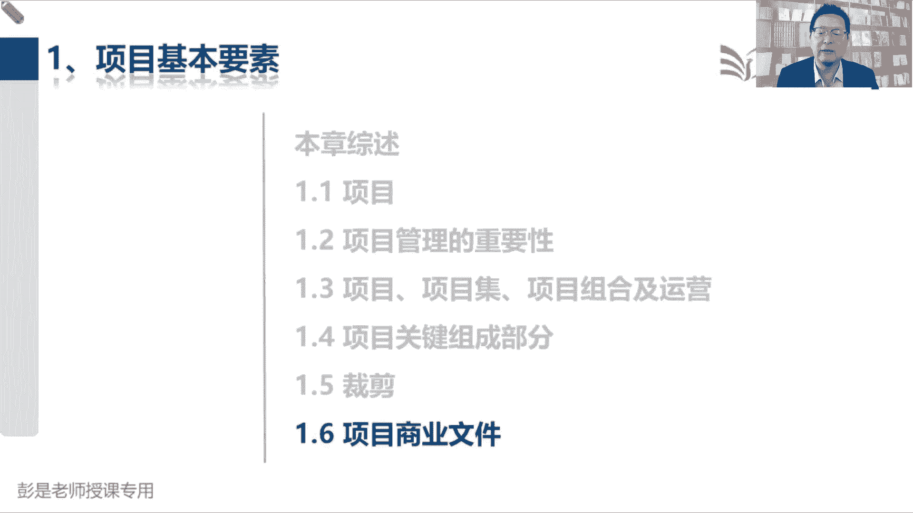

那看后面这段文字，说项目经理需要确保项目管理方法，紧扣商业文件的意图，说整个生命周期中，这俩文件第一个叫商业论证，叫文档化的经济可行性研究报告，可行性能不能做到经济赚钱不赚钱。

用来对缺乏尚未充分定义的缩写方案的收益，进行有效性论证，对不对，能有多大可能性，赚多少钱，能不能做到呢，是启动后续项目管理活动的依据，第二个呢效益管理计划，主打一个说清楚什么时间赚多少钱。

所以是对创造提高和保持项目效益过程，进行定义的书面文件好。

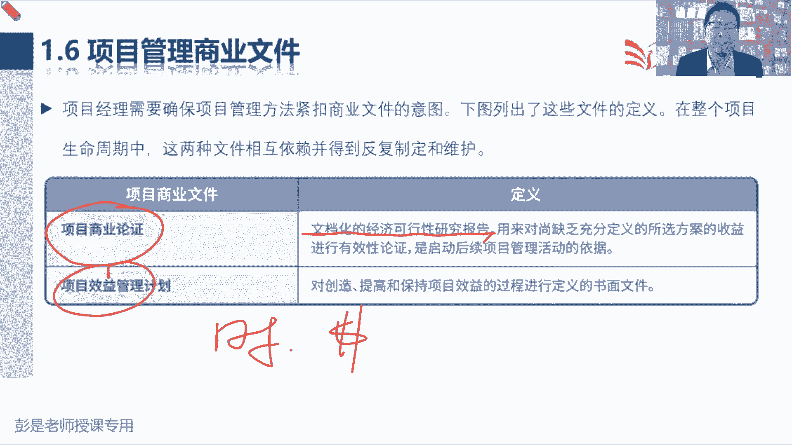

这两个术语搞定之后呢，再往下这个也一定要记住吧，这事儿归谁搞的，可能是各种各样的人，可能是各种各样的人，但是呢我们需要有这样一个角色，所以这个角色的名称就叫发起人，项目发起人。

通常负责商业论证文件的制定和维护，所以划清楚项目权利的边界，项目启动之前，需求评估，商业论证，效益管理计划的制定，这事和项目经理没关系，对不对，通常是发起人主导这个东西，那我们作为项目的一家之主。

我们作为项目上的皇帝啊，我们参与到这些工作之中，给发起人提出我们合理化的建议和见解，这是好事啊，确保确保我们调研的时候，论证的时候充分，对不对，不要想当然，不要拍脑袋，不要假大空。

要让他让他具备什么真实性，客观性，可靠性啊，以此类推了，所以项目经理通常只是负责，提出我们的建议和见解，建议和见解的不主要作用是什么呢，是项目的商业论证，项目计划，项目章程。

项目效益计划中的成功标准相一致，和组织的目标相一致，就是保持这种一致性，一致性就是啊别弄错了，就这意思吧，不要你干你的，我干我的，咱俩最后啊南辕北辙，这不就闹笑话了吗，好，所以项目经理应该适当的。

巴拉巴拉巴拉巴拉巴拉巴拉巴拉吧，后面的文字可以记不住啊，说我们要采取上项目文件，什么维护这玩意儿，然后我们还要和相应的项目及经理合作，还是保持一致性，这个看看就够了，最重要的就是第一第一小段好。

所以就带出来这张图，这张图里面这个这个不看这个不看，先看大结构，项目启动之前三件事情，需求评估，商业论证，效益计划的制定，这事儿跟咱没关系，发起人负责这个事情，我们只是参与其中。

提出我们合理化的建议和见解，中间这一段呢就是项目从开始到结束，可以分成N个阶段，现在给出来这四个阶段呢不是所有项目都有的，它是共性的，对它是基于这些阶段的性质总结出来的，这些共性的规律。

你实际工作中不叫这个名字，不叫这个名字，不叫这个名字，不叫这个名字，想一想上节课说的盖房子，软件开发研究药品，包括叫外卖，办婚礼，不叫这个名字，叫其他名字，对不对，把这个工作性质带上什么施工设计规划。

以此类推，这就是生命周期阶段的划分，然后每个阶段之间有一个菱形的小方块，就是刚才说过的阶段关口，做决策来决定是否进入下一个阶段，所以就到这阶段入口阶段，出口管理控制点，关键控制点是这个意思啊。

就这决策决策决策的依据是什么呢，就是还有没有可行性，还有没有价值呢，如果没有，可行性，咱后边这些阶段那就不玩了，对不对，做不到的事情啊，如果没有价值呢，我们可能也不玩了，止损对不对，及时的断舍离。

这就是街道关口最重要的作用，所以这张图啊，就现在画出来这几个东西要能给它梳理清楚好。

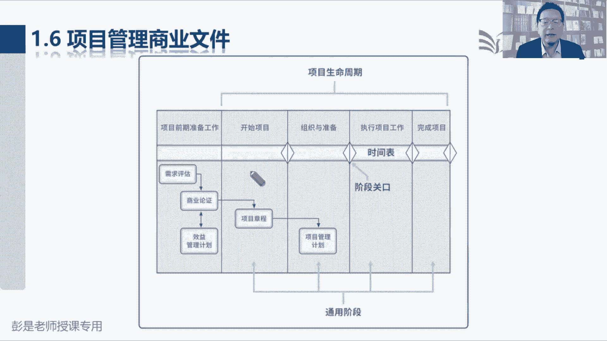

再往下，这是商业论证，具体的内容，商业论证具体的内容也不太需要去背啊，听明白道理就够了，商业论证的中心思想是什么呢，中心思想啊，第一先搞清楚客户要啥，然后再思考我们都能怎么做，还是这两个单词如影随形。

万事万物都是这个逻辑对吧，从战略到战术的转化呀，客户需要什么，我们都能怎么做，然后再去分析啊，这些方案能不能做到呢，这些方案能赚多少钱呢，嘿不要把鸡蛋放到一个篮子里，要想到更多解决问题的方法，对不对。

张三要一个鸡蛋炒西红柿，张三要一个鸡蛋炒西红柿，然后你想想怎么做，可我们可以自己做，可以叫外卖，对不对，可以去餐厅吃，再去分析这些方案的可行性和价值，对不对，哪个赚钱就提出哪个建议呗，就这个逻辑。

这就是商业论证它的核心内容，做什么怎么做，赚钱不赚钱，有没有可行性，能不能做到好，教材跟课件不同步吧，应该是一样的吧，跟通关宝典的内容一模一样啊，那继续了啊，所以商业论证是指文档化的经济可行性。

研究报告，用来对，用来对尚未缺乏充分定义的所选方案的收益，进行有效性验证，就是不要把鸡蛋放到一个篮子里，看看能不能有更多的解决方案，并且呢要去分析这些解决方案的可行性和价值，就是刚才解释过这个道理吧。

好那商业论证列出了项目启动的目标和理由，它有助于评价我们是否成功，所以呢它是一种商业文件，可以在整个项目生命周期中使用，我们要不断的去分析项目，项，用理想和现实做比较，看看还有没有可行性。

看看还有没有价值，这就是商业论证它的核心内容。

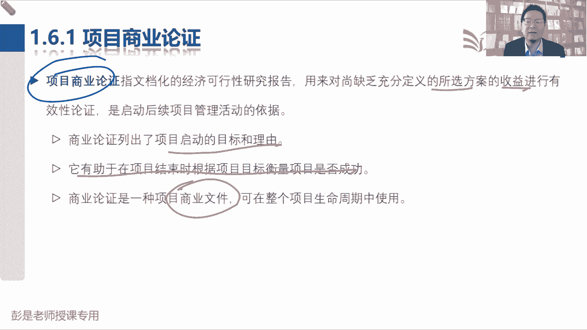

主要主要作用啊，那它具体的内容再往下翻说，在项目启动之前，通过商业论证可能会做出继续终止项目的决策，需求评估通常在商业论证之前进行，包括了解业务的目的，目标问题和机会，并提出处理的建议。

需求评估就是搞清楚我们这个项目到底要做啥，对不对，他的目的是啥好，那需求评估结果，可能会在商业论证文件中进行总结，所以就是传球啊，需求评估搞清楚我们要做啥，搞清楚之后啊，商业论证里面写什么呢。

第一先把人家要啥这个结论说清楚，客户需要盖一个住宅小区，自己住，客户要注意建一个住宅小区，然后去去售卖，客户要建一个住宅小区，然后找银行贷款，然后弄骗钱，嘿把人家要做什么搞清搞定。

接下来我们要去思考都能怎么做，然后呢这么这个做法，这个方案有没有可行性，能不能走到这个方案，它能带来的价值是多少，诶想出更多解决问题的方法，然后呢给公司啊提出我们合理化的建议，什么叫合理化的建议呢。

就是哪一个方案赚钱最多，就这样粗暴的理解吧，哪一个方案赚钱最多，哪一个方案最靠谱，所以他其实啊以小见大了啊，比如说明天公司要去，明天我要去公司上班，商业论证都能怎么做呢，我可以坐公交车，可以坐地铁。

可以打车，可以开飞机，找到更多解决问题的方法，找到这么多方法，我们要去分析可行性和价值，对不对啊，我这个有身份的人，不能坐公交，不能坐地铁，不能骑共享单车，丢人没有可行性，我我还没有那么土豪。

开开飞机也做不到，怎么办呢，那我自己开车去找一个相对来说又有可行性，又有价值的解决方案，这个就是商业论证吧，所以呢，最后给公司提出我们合理化的建议和见解，只要知道这个大概的意思。

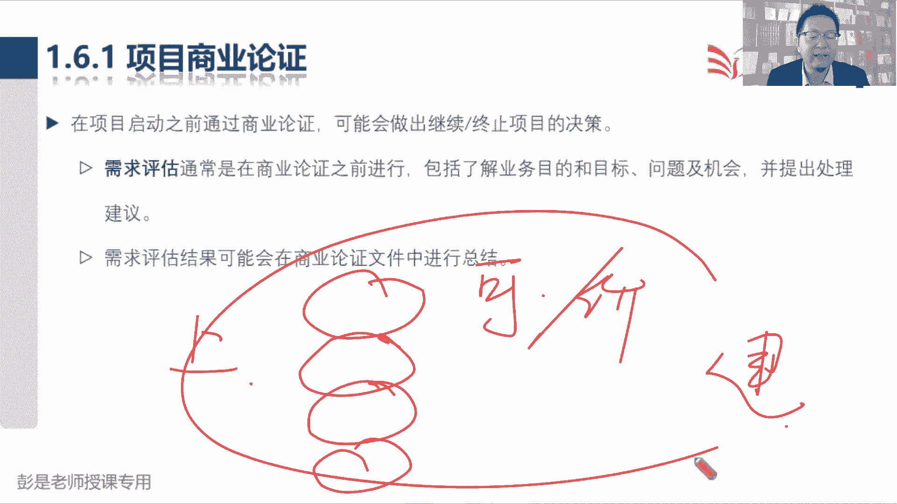

大概的结构再看文字简单多了好，所以161再往下说，我们在商业论证中定义业务需要分析形式，提出建议和定义评估标准的过程，对不适用于任何组织的项目，业务需要就是人家要啥分析形式就是看情况，看情况对不对。

找到更多解决问题的方法，可以坐公交，可以坐地铁，可以打车，然后给出我们合理化的建议和见解，找出一个性价比最高的，既有可行性又有价值的解决方案，给公司提，提出我们合理化的建议和见解，最后呢定义评估标准。

那得告诉公司这边这个项目结束的时候，能带来什么好处，不是为了名，就是为利，为了利啊，就把这个价值给他说清楚好，这是它的核心内容，所以大概对这四个单词有点印象就可以了，中思中心思想啊。

What how what how what how，把这事说清楚，然后呢，how much就这样粗暴去记啊，How much，赚多少钱，人家要啥都能怎么做，能赚多少钱，给出一个建议。

所以它具体的文字就不要求大家12345，记得非常清晰，对不对，只要知道它的框架结构就可以了，那后面具体的内容什么，基本上啊大家复习的时候看一遍就可以了，不太需要去像老师啊，这这四个东西都要记住吗。

不用记，对不对好，所以业务需要就是人家要啥。

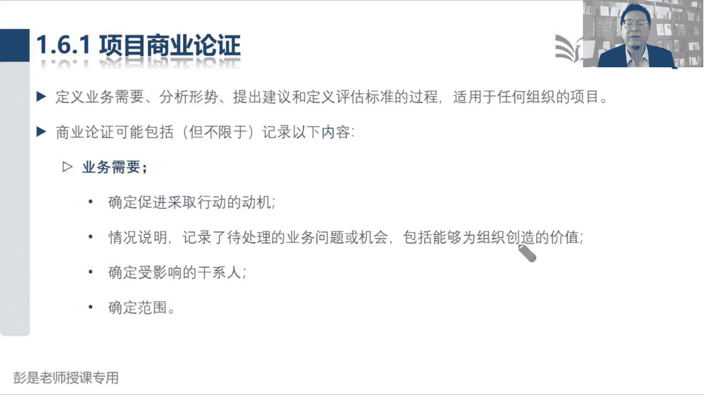

就是人家要啥，然后呢再往下翻了，分析形式就是我们都能怎么做对吧，分析企业的优势劣势，现在具备的条件，有钱没钱啦，时间充裕充裕啊，这明天上班你要考虑很多因素啊，对不对，明天早上早高峰堵不堵车呀。

嘿地地铁地铁会不会比较比较挤，比较闷呢，公交车会不会堵车呀，骑共享单车会不会很累呀，以此类推，你要考虑很多因素，这就是形式分析，然后呢，嗯再往下推荐给出我们合理化的建议和见解。

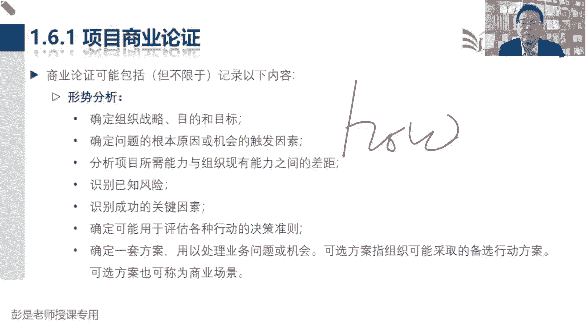

对一种给给出了针对项目的建议方案的说明书，一种实施方法，最后呢评估就是钱，不是为了名，就是为了利，描述了项目交付效益计划的说明，赚多少钱就让粗暴理解。

这是商业论证的主要内容，那再往下，效益管理计划这个关键词一标说了好几遍了，周大告诉老板什么时间会获得什么样的收益，甲方找我给他盖个盖个房子，我作为乙方啊，这个房子盖完之后呢，我收到的钱就已经盈利了。

这好看很简单啊，好甲方找我给他修一个高速公路，作为乙方啊，我自己要出钱修这个路啊，项目结束的时候没有任何的收入了，怎么办呢，我可能需要运营一段时间，对不对，你要把经营权转转给我承包30天。

30年以后我每天收过路费，再去分析能不能赚钱，以此类推了，所以我们要把什么时间能赚到多少钱，跟老板说清楚，所以项目效益管理计划，中心思想就是把这个效益怎么管说清楚呗，那它里面的核心内容啊，这是什么时间。

测算一下什么时间能赚到多少钱，记住这个中心思想。

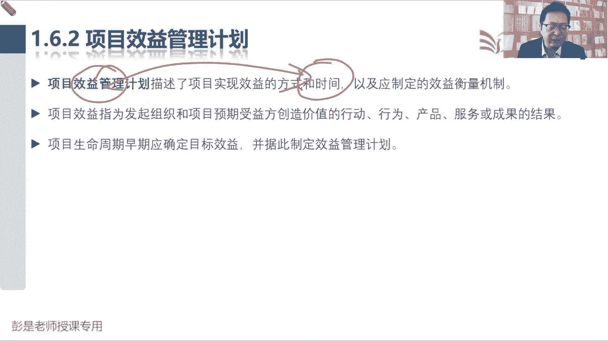

它具体的内容也不要求大家去背对吧，赚多少钱，什么时间能赚到多少钱，谁去负责这个事情采用什么样的测量指标，这个测量指标啊，一会会看到啊，有几个指标还是需要掌握的好，这就是效益计划的内容。

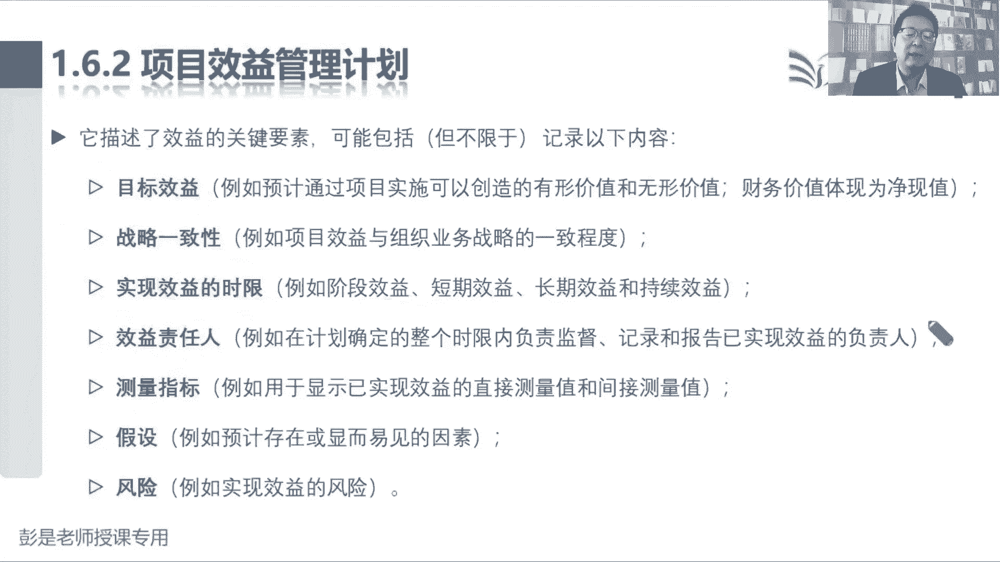

所以带场景啊，这是需求评估去发现一些商业机会，商业论证呢主打一个啊，去分析人家要啥都能怎么做，能赚多少钱，把它说清楚，效益管理计划主打一个什么时间能赚到多少钱，把它说清楚，这些事情都说清楚之后。

老板就可以做决策了，对对现在有个项目能赚多少钱，多长时间能赚到多少钱，老板去分析值不值得投入人财物，嘿好，那效益管理计划中心思想知道就可以了啊。

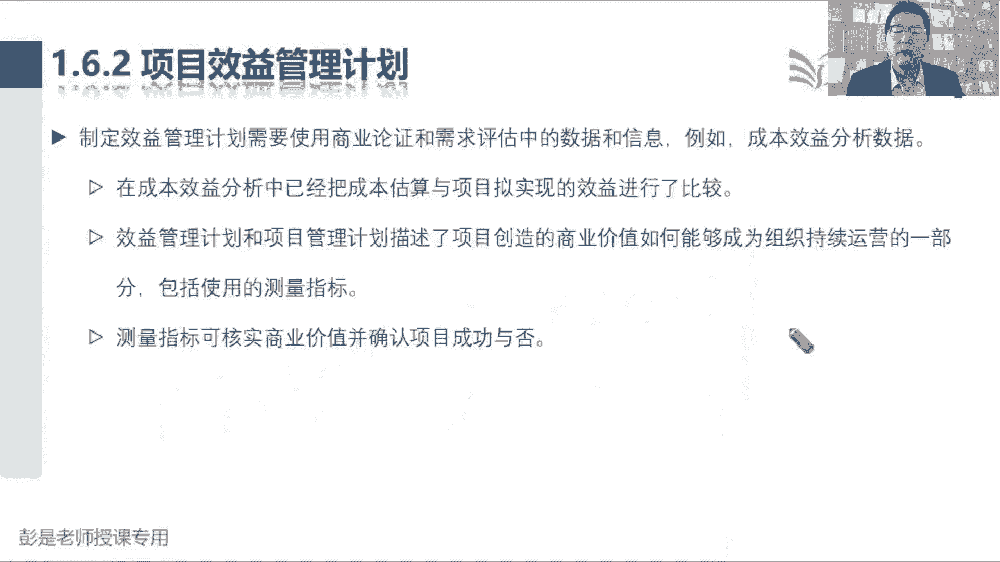

不念，后面说效益计划的制定和维护是迭代过程。

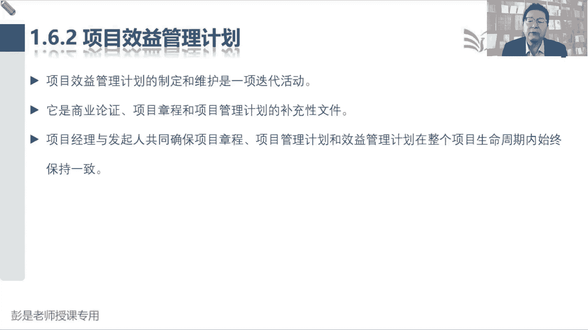

什么时候补充文件，我们要保持一致性，这都是套话，咱不说了，不讲了，看看就够了，好再往下163又说到项目章程和项目计划，这两段话，其实现在可以不看，因为下下一节课我们就开始，第不对，不是下一节课。

今天一会儿我们就会讲到项目整合管理，就会说告诉大家什么是项目章程，什么是项目计划，所以这段大家现在可以不看好。

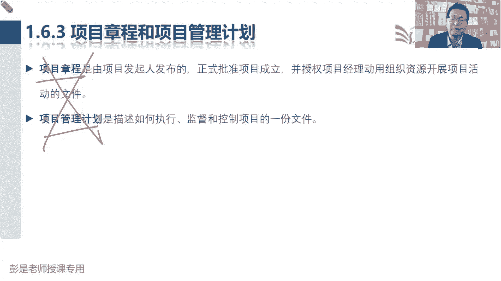

164，1164这段内容啊，看一看是不是上节课讲过呢，确定项目是否成功，是项目管理中最常见的挑战之一，通常时间成本范围，质量历来被视为项目是否成功的最重要因素，这是传说中的那四个字啊，多快好省。

花多长时间对干多少活儿，得到一个什么成果，成本是多少，达到什么样的质量标准和要求，都快好省，通常来判断来判断这个项目管理的成功不成功，然后莫妮卡同学替补充的非常到位啊，除了多快好省。

我们还要考虑一个什么因素呢，相关方干系人的满意程度，感谢那满一周吧，张三花十块钱来打车，说师傅啊，能不能30分钟把我送到火车站，30分钟送到火车站，诶这不是多快好省吗，对不对，多长时间，花多少钱。

干了干了，完成什么工作，达到什么样的质量标准和要求，诶，那你这把张三开车开对吧，开得非常快，把张三开吐了对吧，或者是开车遇到墨迹，或者以此雷达车里面很脏啊，在车里抽烟啊，哎虽然按时完成任务。

但是客户客户不满意，也认为这个事儿你管他不成功，所以通常还要考虑干系人的满意度，能听懂能理解就可以，那到底每个项目取用什么样的成功标准呢，三个字看情况，具体情况具体分析，对不对，这没法考啊。

每个项目情况不一样的，有的项目更关注的是范围，有的项目更关注的是质量，有的项目关注成本，有的项目呢关注进度，有的项目关注范围加进度，以此类推，有各种各样的可能性，一定是具体情况具体分析。

就像各位同学中午吃饭，中午吃饭时间时间关注吧，不要吃时间太长了，因为下午还要上课呀，那质量呢差不多就行，忽略它，凑合吃一口，对不对，成本呢控制一下，现在经济形势不好，不要超支，所以取决于项目的具体情况。

具体情况具体分析，只能一事一议。

知道这个意思啊，那再往下后面这五个单词超级重要，一定需要大家能够记住它，还要知道这玩意儿代表什么意思，所以呢各位同学讲这段知识点之前缓一缓，大脑休息一下，现在是9。59，咱休息8分钟，休息到10。07。

然后讲这五个单词好，咱继续了啊，那1。6。4再往下找到这一小段，说项目成功的标准，那可能涉及到需要大家掌握的一些财务指标，因为咱不是为了名，就是为了利，那无形价值的衡量标准呢。

不需要我们掌握对什么企业的品牌呀，口碑呀这种这种东西啊，企业的名声啊，声誉啊，不需要我们掌握的那钱对吧，通常大多数项目就是为了钱的，所以需要大家掌握这些财务指标，第一这些财务指标怎么计算呢。

不需要掌握它的算法，不需要不需要掌握说老师怎么计算经验值，投资回报率，以前之前早一两年还给大家讲一讲，现在呢也不考，不要求掌握，所以就不讲了，第二那这个财务指标代表着什么含义，这个是需要咱能看懂的吧。

否则人家发钱拿到一个可行性研究报告，给到项目经理，你说我这些指标什么意思啊，看不懂看不懂不行，我们要去能判断出它代表什么意思，那这五个指标叫净现值，投资回报率，内部报酬率，回收期和效益成本比，先搞定。

第四个，找有代表性的，有找独特的东西，单独单独单独供货的啊，投资回收期什么意思呢，投资回收期，投资回收期，张三找你合作开个牛肉面馆，说我出10万块钱，你出10万块钱，咱俩一起开牛肉面馆啊。

然后六个月咱就回本了，所以他就是多长时间收回成本，多长时间我们能把这20万块钱拿到手里呢，对不对，收回成本，那就叫投资回收期，那投资回收期是多长时间收回成本，这个周期是长比较好还是短比较好呢。

这个结论我们要能判断出来对吧，是人家说花10万块钱开个牛肉面馆，告诉你六个月收回成本，说呀我们花10万块钱，10万块钱开个什么瑞幸咖啡呀，开个蜜雪冰城啊，6年收回成本，那你哪个风险大呀，周期越长。

风险越大，就这个逻辑吧，所以投资回报期越短越好，意味着风险小对吧，尽快的把钱拿到手里，拿回来呀，只是这个指标代表的含义，那我们要能够判断两个项目，看看哪个项目投资回收期长，哪个项目投资回收期短越短。

意味着风险低，这个知识点搞定，然后剩下四个指标，剩下四个指标啊，还有叫什么效益成本比内部报酬率，咱们搞定第五个效益成本比啊，粗暴利息收多少钱，花多少钱就用收入除以支出，就用收入除以支出好不好，咳咳。

我花十块钱买了个蜜雪冰城，卖给张三，卖了15块钱，嘿15÷10，最后除下来等于1。5，大于一就意味着赚钱了，那反过来我花了15块钱买了个蜜雪冰城，张三啊，只给了只给了我十块钱，十块钱除以15小于一。

意味着赔了，这就是效益成本米，所以呢这个指标需要大于一才说明有钱赚，并且呢是越大越好，十块钱的蜜雪冰城卖给张三，卖了15，十块钱的蜜雪冰城卖给李四啊，卖了25，这个数字除下来越大越好，说明赚的多呀。

这是BCR效益成本比单独计好，剩下前三个指标它的特点是什么呢，前三个指标啊，管它是啥呢，就叫其他指标对，不太需要去背啊，像净现值投资回报率，内部报酬率，反正啊总之不是回收期。

不是效益成本比其他指标大于零，就说明赚钱了，并且呢还是越大越好，缩写缩写啊，有点印象就够了，考试的时候现在基本上比较善良啊，会把中文加缩写都给出来的，好这就是这三个东西，如果缩写记不住，怎么记呢。

记独特性的呀，对不对，投资回收期PVP，然后呢，效益成本比BCR这两个稍稍单独记一下，其他的记不住没关系，这叫其他指标，所以最后记结论就是投资回收期越短越短越好，但是通过这个指标。

我们没有办法判断项目是否盈利，是否赚钱，判断不出来的，它只意味着多长时间收回成本，然后效益成本比呢，这个指标需要大于一才说明有钱赚，并且是越大越好，前三个指标就叫其他指标，它大于零才说明有钱赚。

并且也是越大越好，就现在这张纸，这个结论没错，李健能源只有投资回收期是越小越好，其他的都是越大越好，但是效益成本比判断的依据是要大于一，剩下三个其他指标需要大于零。

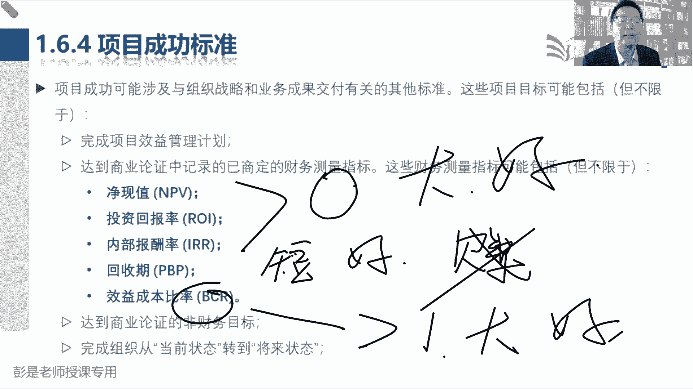

这是关于常见的一些财务指标，未来的考试的时候啊，就是就是啊，判断他让我们去选择哪个项目更赚钱，比如说A项目净现值是10万，B项目净现值是8万，C项目净现值是6万，那咱就选A就选A对，为什么呢。

因为赚钱赚的多，所以后面考试啊沾到钱就两个非常重要的逻辑，沾到钱的这种这种知识点啊，最重要的底层逻辑是啥呀，就是啊赚钱，如果想考赚钱，考到这堆财务指标，找什么样的选项呢，找什么样的项目呢，这是多对不对。

赚的越多越好，如果考成本，如果考花钱，那原则是什么呢，越少越好，越低越好，这是中心思想啊，所以大家沾到钱的这样的题目啊，沾到钱这样的题目让我们做选择，做判断，做分析的时候，中心思想啊就是钻钱眼儿。

怎么赚的多怎么选，怎么花钱少怎么选，这就是关于大大概大概钱的这方面的考点啊，好那再往下了，花的少，赚的多没错，一总结完事了，但是这些财务指标那个知识点要记住它。

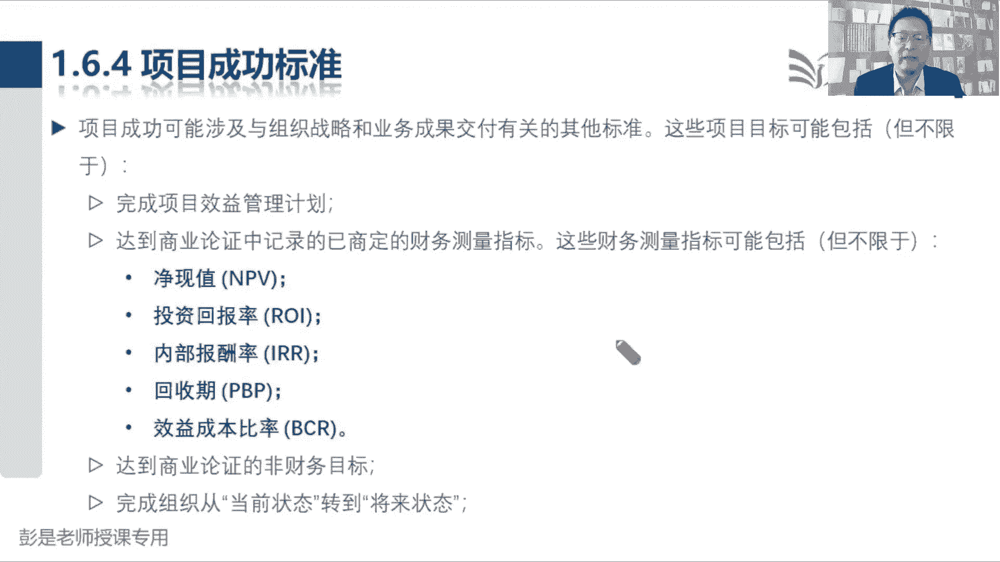

再往下这些指标通常也不大会考，并且呢通常如果考的话，如果考的话很容易判断谜底就在谜面上，所以呢看一看就可以了，什么达到目标，大家都满意，什么采纳度运营，这部电狼回周期越快越好吧，快就是短的周期越短越好。

你随便想场景，比如有人找你借钱，嘿张三说一个月还，李四说两个月还，那周期越短越好，意味着风险小，尽早还还到咱手里啊。

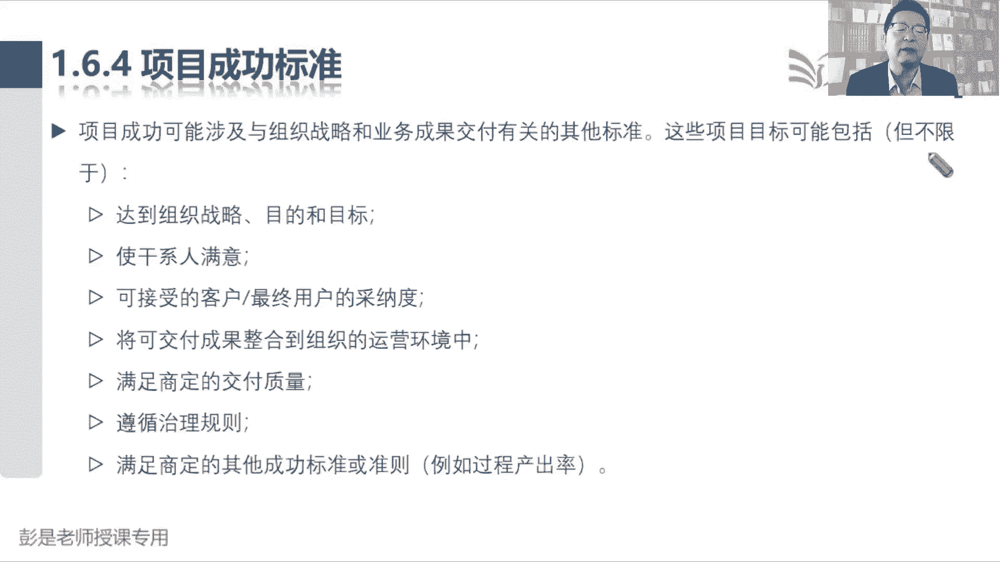

好后面那段说，为了取得项目成功，我们必须能够评估项目的状况，来平衡项目要求，然后保持沟通，保持互动，保持一致性，看看商业角度成功不成功，以此类推啊，总之最后形成的结论啊，就是项目启动之前。

徐州评估搞清楚我们要做什么商业论证，搞清楚咱都能怎么做，怎么做，最最赚钱，效益管理计划告诉老板什么时间赚到多少钱，但是呢计划没有变化快，所以为了稳妥起见，在项目生命周期之中。

项目从开始到结束这段时间里面，我们仍然需要定期的去分析，项目还有没有可行性，项目还赚钱，不赚钱就有了阶段关口，这个知识点就是刚才见过的这张图，大概这个结构。

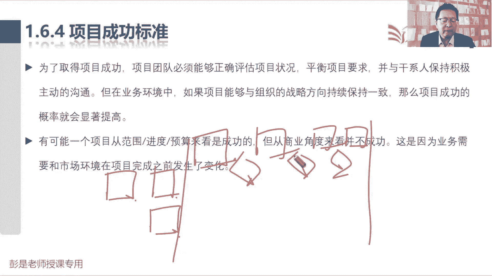

好做一做这段课程的知识点的题啊，看看这道题选啥，刚讲完应该不太容易错，描述了一个潜在项目的战略意义，以及对公司的好处，好处不就是不是名就是利吗，有形价值，无形价值，这就是商业论证它的核心内容。

回顾一下啊，商业论证是说我们都能做什么，然后分析形式看看都能怎么做，给老板提出我们合理化的建议和见解，最后告诉老板为我这么做，这么做会带来什么样的好处，好much是赚多少钱，对不对。

好像哪一个是项目发起人角色的最佳描述，有选B的，有选C的，有选B的，大家目前能至少能达成共识啊，哎这活谁干的，向项目团队分派工作安排，张三李四王五赵六干什么事，这一看，这应该是项目经理干哈。

B选项为项目提供所需要的资金，C选项说从组织内部行政上支持项目，D选项说定义组织的类型，矩阵型，职能型，哎这活谁干的，这道题正确答案是啥呢，先说答案了，答案答案是B，刚才说过。

我们找项目发现商业机会需求评估，然后呢去分析这个项目的可行性和价值，做商业论证，写好效益管理计划，然后向公司申请，我们完成项目所需要的人财物，对向公司去申请，我们完成项目所需要的人。

财务公司一看这个事儿啊，你写的还挺靠谱，于是呢就通过项目章程，把使用公司人财物的权利交给了项目经理，我们就得到了授权，授权开始项目或者是项目中的一个阶段吧，诶所以我们完成项目所需要的资源啊。

资金啊是发起人从公司申请出来的，答案是B那C是什么呢，从组织内部行政上支持项目，给项目提供行政支持，这是什么呢，各个部门干的事儿啊，各个职能部门干的事情吧，说项目啊，我们要记账，我们要付款。

我们要弄发票，找财务，对不对，我项目上要买东西，找采购诶，这叫提供行政支持，所以这会不是发起稿啊，D定义组织结构的类型，这个知识点没讲到啊，谁提谁能定义组织组织结构呢，高层，先稍稍有点印象。

马上会讲到的定义组织结构类型，这活这活需要有权利，有权利才能够定组织架构，就这样理解组织架构是什么呢，看看公司分成多少个部门，看看每个部门需要多少人定组织架构啊，这活儿发起人不一定搞。

这是通常通常更大权力的人才能干这个事儿吧，唉这是高级管理层，董事长，总经理，总裁CEO这些人做的事情好，所以记住这个知识点啊，未完成项目所需要的资源和资金，是发起人从公司申请出来的，带到场景。

就是客户那边发了一个招标公告，说我们要花一个亿盖个盖个房子，然后才能销售，就去分析了，这活能不能干啊，这活需要多少人呐，这需要多少人，不也是方案吗，对不对，完成这个项目，我们都有哪些方案，怎么干。

怎么搞，需要多少人财务去做这个事情，把这个人财物跟老板说清楚，再告诉老板，这么做会带来什么价值，一旦老板同意，我们就会项目经理走马上任，得到授权。

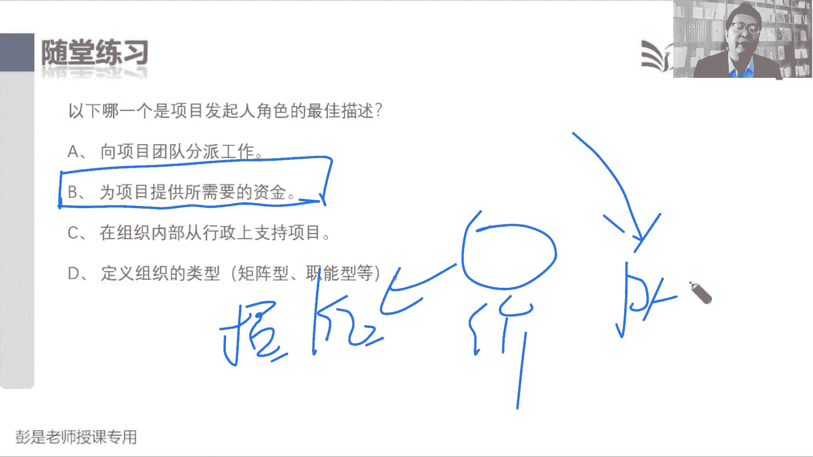

动用这些人财物去干这个活，好看看这道题的，好多单词不认识，但是有的单词刚讲完，那就选它差不多了吧，好，您可以在商业案例的财务效益部分，是用使用哪些指标来支持项目的投资决策呢。

就是刚才五个常见的财务指标吧，一个叫投资回收期，告诉我们多长时间收费成本，还有一个指标呢需要大于1BCR效益成本比，用收入除以支出，这玩意儿大于一就说明有钱赚，还有一大堆记得住的，记不住的对吧。

什么NPV啊，IRRROY啊，这些其他指标只需要大于零才说明有钱赚，稍稍有一丢丢印象啊。

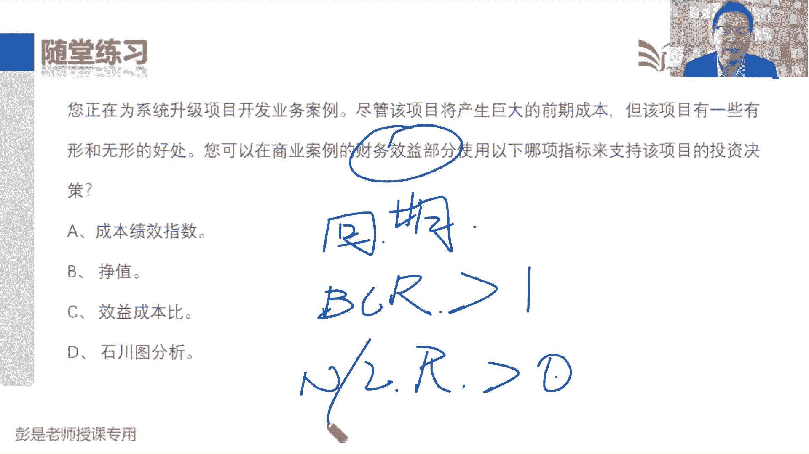

眼熟就可以，好再看这道题呢，所以刚才那道题答案是C，好恭喜各位同学答对了，说呀在项目启动之前进行全面的业务分析活动，那在复杂性和高价值的项目之中，通常在启动前干什么呢，这是确定问题，看看我们要做什么事。

对不对，确定人家的业务需求，确定可行的解决方案，这是商业论证的内容，要做什么事都能怎么做，然后再去分析这些方案的可行性价值。

找到赚最赚钱的方法，这道题也简单了吧，说您在帮助一个组织提升其项目管理实践，您建议啊，每个组织项目制定一个商业案例，然后呢制定一个效益计划，你会推荐谁作为商业案例的所有者，简单哈，超简单。

这就是权力的游戏啊，权力的边界，权利的边界，项目经理负责中间这一段，发起人负责前面那一段，项目结束后，可能需要把咱的成果移交给运营，所以发起人通常主导需求评估，商业论证，效益计划的制定。

我们呢可以参与其中，提出我们合理化的建议和见解，有些项目项目结束的时候不一定赚钱的，我们还可能会参与到项目结束后的，运营工作之中，去验证，去跟踪有没有实现目标效益。

所以这道题商业案例谁谁谁是他的责任人呢，就是发起人。

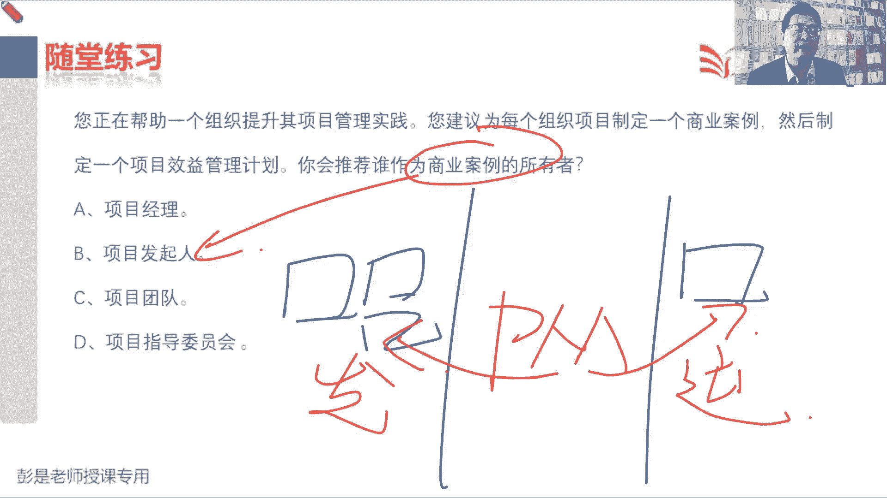

这就是大概第一章这么多重要的知识点嗯，好那各位同学，我们第一小关过关了，第二关和第三关相对来说呀，各位同学无论是听课呀，后面复习呀，嘿可以看得非常快，它里面重要的知识点啊不太多，快速看快速看。

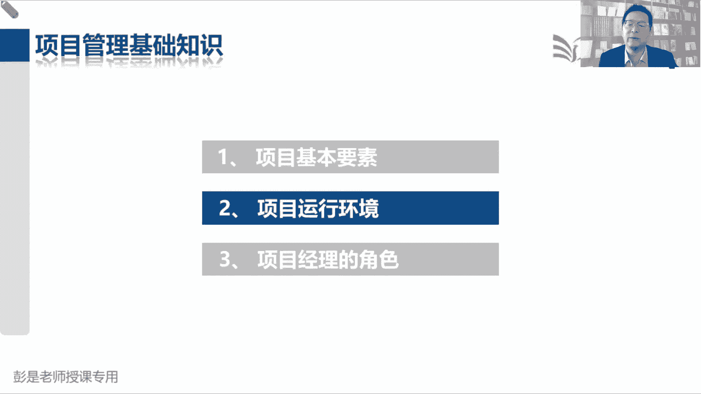