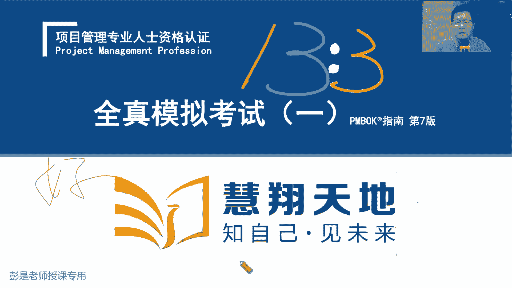
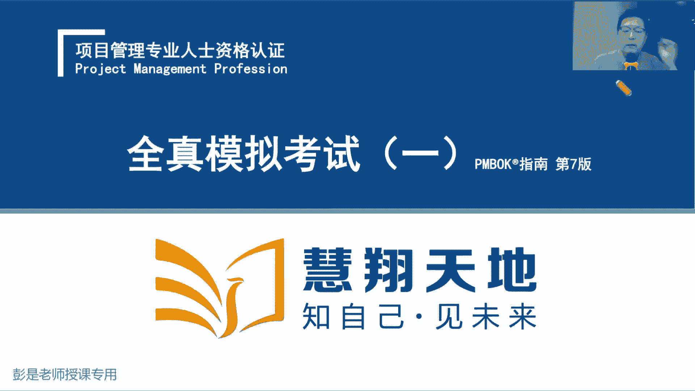
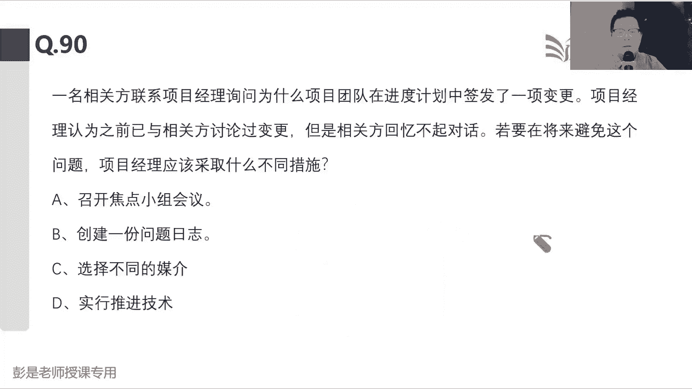

# 2024年最新版PMP考试第七版零基础一次通过项目管理认证 - P70：模拟考试（1-90） - 慧翔天地 - BV1qC411E7Mw

嗯。

说几句废话。心情好吗？Okay。模拟考试爽吗？诶咋。或现学现用啊。第一部分同第一部分接受大家共心的问题啊。呃，第一部分同学呢应该就是没做完。老师啊，题太多了，太长了，读题太慢了。

没做完主要问问题是什么呢？知识点不熟，你阅读的速度，阅读的效率，阅读的质量有问题啊，阅读能力有障碍。那阅读能力阅读能能力怎么提高呢？术语越熟悉，概念越熟悉，阅读的速度就会越快。概念越熟读起来就会越快。

咱现在第一阶段主要的工作是先把题读明白，很多人现在有这方面有困扰啊。所以呢没有好的办法呀，就是多看教材，多看教材，看那个不说人话的书。然后训练我们的阅读能力，不断的不断的看教材。哎。

这句话老师说的什么意思，当当时老师讲的啥意思？课上教材里面这些字儿什么意思？以此类推，去做这方面的训练。然后第二个呢，有的同学会纠结呀，说到底选这个选那个不知道选哪个呀，是要关注时间，关注进度。

活学活用啊，你不会画一个燃镜度吗？咱考试时间是230分钟，180道题，大部分同学可能需要20到30分钟去读卡。然后呢，真正有效的答题时间就是200分钟，180道题，平均下来一分钟一道题画一个然镜图。

每一个小时过去应该完成50道题左右。哎，或者45道题左右，画一个然进图啊，时时刻刻跟踪自己的实际实际的进度啊，如果发现实际进度在计划的右边就说明可能没有办法做完。

如果实际进度在计划的左边就说明可能能做完了，以此类推，这是第一个啊，要关注我们答题的进展，关注我们答题的速度，避免避免做不完，导致成绩最后不理想，这就不划算了。实在太纠结的，实在太纠结大。

考场会提供草稿纸啊，标语表不要不太难的题啊，太长的题啊，太复杂的题啊，是给的跳过去，对不对？抓大放小，不要求大家百分之百，把所有的题都做对。你80%已经非常非常非常优秀了，基本上就相当于满分了。

这是第一个问题啊。第二个问题啊，就是关于考试的时候到底怎么涂卡，咱学完了知识点都给它用起来呀。有的同学呢是习惯啊，老师啊，我把所有的题都给他做完，然后再去涂那个破答题卡。知道什么呢？这叫一次交付。

这种一次交付有啥呢？一次交付一次交付传统的预测型项目啊，一次交付有风险的对不对？好，那有的同学说老师啊，我每做一道题就涂一下卡，这叫什么呢？太烦了吧太频繁了吧，你大量的时间都在任务切换上去了。

这也是一种浪费啊。所以保持一个稳定的节奏，图卡就可以了。说二十道题什么三十道题，4十道题，自己喜欢怎么怎么喜欢怎么来啊，保持一个稳定的节奏，一定要注意啊，千万千万不要把时间浪费在涂卡上。

尤其是前两个小时，趁着咱精力旺盛，先去答题，尽快的尽快的趁着旺盛精力旺盛的时候，先拿那些简单的题啊。这两个方法可以帮助大家实习有效的提高一些速度。好，这种看书看书看书，然后读涂卡有技巧。

然后大家现在考完试啊，看到自己的分数啊，基本上就这么三档啊。Okay。基本上就是这么三打，小于100分的同学，这就。没什么好的技巧了，勤能捕拙，这说明知识点掌握的相当相当不太熟啊，这没好的办法啊。

再去回顾课程，该听课听课，该看书看书，回顾课程也不要求你把所有的东西都给他回顾啊，看看哪儿知识点学的比较薄弱，对吧？十大知识领域啊敏捷啊，缺哪补哪儿倍速听1。5倍速二倍速都可以啊。

回顾课程看书巩固巩固知基本的概念，然后像100到120分左右的同学呢？就说明啊有些题要去反思了。这些题为什么错呢？错的原因是什么呢？大概对这个原因做做统计啊，基础表，知方图怕里图用起来。

看看自己主要错误的原因在哪，是概念不熟啊，还是当时考试懵了，还是说还是说什么什么原因，找到自己导致问题的主要原因，对症下药，然后想办法把这个分数再往上提一提。大于100分的同学啊，也不要飘，不要飘啊。

也要去反思，要去复盘，对吧？圆认知啊，看看自己当时做题是不是蒙对的。蒙对了多少道题呢？对对？跟着老师的讲解看看啊，如果蒙对的题太多了，这也能说明问题啊。总之大家一定要一定要遇到问题，分析原因定制定方案。

选择方案、执行方案，跟踪效果，把这个学的东西都给它用起来。遇到问题，把做题慢的同学，你的知识点或者是略读能力可能遇到问题。哎，这通常是主要原因，那就看书训练阅读能力、看书、巩固知识点。然后呢。

这些错题也要去对原因归归类啊，是概念不熟悉，还是当时考试懵了还是什么原因，总之找主要原因。哎，这是给大家先说几句废话，交代交代后面三面怎么去复盘，怎么去反思这个事情，课欠太多了，才看到质量啊。

180108，后面能来得及啊，来得及啊，欠的债都还吧。

好，那不不废话了啊。咱就开始讲知识点了。然后考试的时候可不可以休息呢？可以啊，心慌出去洗把脸，溜达溜达，可以的啊，一个考场同一时间好像只能出去一个人。是允许允许出去放松放松的啊，最后考试考的就是心态。

大家看那什么奥运会啊、世界杯啊，不就比心态嘛，对不对？大家平常实力可能有的人发挥不出来，有的人能够超水平发挥。哎，咱求稳，咱求稳，不要求大家都超水平发挥，但至少呢把你正常的实力展现出来，对不对？

不要因为紧张啊、不安啊、焦虑啊、惶恐啊，因为这种的因素导致你做题的时候。就双眼被蒙蔽了。好，搞定了啊。那接下来咱开始讲题了，讲题的时候，大大家看PPT其实就可以了。看看解题的思路是什么。

一堂前一前阶段精讲课。还有什么那个每日练习呀，这种课程啊，都是帮助大家不断的不断的熟悉概念，打好基础。那接下来到了模拟考试综合练习这个阶段呢，主要是帮助大家去梳理这个解题的思路，这很重要了。

那大家在听课的过程中说老师啊，这个概念我不知道，哎，找个地方记一记，找个地方记一记课后呢缺啥补查。好，然后看第一道题啊。说您正在管理一个复杂的高度变化的项目。尽管该项目没有最完成的最后期验。

但人们呢普遍预计这个项目在9到12个月完成。团队目前正在努力合作，以加快全面解。以下哪一项行动可能有助于解决问题并促进合作？哎，说变化多的项目，然后说给了个工期，说现在我们玩了命的往前干活怎么办呢？

A限制正在进行的工作。B通过增加正在进行的工作来赶工。C增加团队规模，并缩短交代交付迭代。D采用传统的项目管理方法商来D就干了。复杂的多变的环境下，传统的项目管理方法不一定实用，对不对？

那一看就是敏捷啊，敏捷怎么办呢？说我们要全加快全面解决问题，什么可以帮助我们解决问题，促进合作。C后半句是对的，因为我们希望迭代周期短，迭代周期越短，在这种多变的环境下，我们试错的成本就越低。

但前半句没道理吧，为什么要增加团队的规模呢？还，莫名其妙，对不对？根据题目现有的线索，没有办法得出这个结论啊，题目又没说人少，对不对？题目说人少，咱得考虑增加资源的。那B选项说。

通过增加正在进行的工作来进行赶工。在这种多变的环境下干的活越多可能。错的也多，所以我们一定要考虑用最小的代涨去做是趋试错呀。所以迭代周期要短。并且呢我们从大需求时搬小小需求时，从产品代办到迭代代办。

搬需求也宁缺毋滥的。我们求速度也求的是稳定的速度啊，不追求快呀，不追求多呀，多不一定是好事，快不一定是好事。所以呢最后相对来说比较合适的就是A了。在这种多变的环境下，我们要限制正在进行的工作。

我们不求大而全，我们追求。小而美小而精。我们要打造出一个可以使用的产品服务或成果，然然后给客户进行演示，让客户来进行体验，从而获得客户的反馈，这样可以有效的避免在错误的道路上越走越远。好。

所以建议的答案就是A。建议的答案就是A。怎么解决问题啊？没有一个选项是解决问题的，对不对？他就告诉你思路怎么解决这个项目的问题，项目的状况。Okay。所以阅读把题读明白之后呢，大部分的题考试的时候啊。

大部分的题都是排除法。都是排除法。根据我们掌握的知识点去看看这些选项到底对不对。咱就是项目经理，咱就是这个项目的皇帝。现在呢你一大堆下面四个大臣给你提建议，你就想一想啊，总有刁民想害朕。总有刁民想害症。

这B选项这刁民呢为什么多变的环境下要增加工作呢？干的越多，做的越多呀。为什么多变的环境下要增加团队规模啊，师出无名，对不对？师出无名，古代打仗不得师出有名嘛。咱现在师出无名啊，题目里面没有这样的线索呀。

那D这个大臣更坏呀，告诉我们用传统的项目管理方法，哎，这不行啊不行啊，多变的环境下，传统的话像传统的方法，这个规划过程啊太重了太重了太重了，他就这是多变的环境下不适用啊。

所以呢最后只有A了WIP限制正在进行的工作。我们那个看板还有印象吗？这任务啊开发呀测试啊，每列都有WIP啊，我们从迭代代办，从产品代办事项，往迭代代办事项搬需求的时候，也有带制品限制啊，对不对？

是根据团队的交付能力，限制团队正在开展的工作，能干多少干多少不求多不求款但求稳但求精。所以各个角度看都是A。考试的时候大部分的都是这样的思路啊，都是这样的思路排除法。Yeah。Okay。好，再往下了。

第二题。第二题啊。嗯。C不是有助于解决问题吗？谁告诉你增加团队规模就有助于解决问题呢？这根本就不是题眼，所以有助于解决问题，促进合作。就是在这种项目环境下，你这项目到底怎么管？

它其实指的是生命周期、阶段划分开发方法，项目经理给出来的管理思路。刚才这段内容，如果题目有的同学，就说明敏捷课精讲课和敏捷的晚上那课你都没听啊。什么叫宁缺毋滥？什么叫。

什么叫根据团队的交付能力限制团队正在开展的工作。什么叫WIP。什么叫迭代周期要尽可能的短。什么叫打造出可以使用的产品服务或成果。你随便几个知识点一凑，怎么着都能选到A。嗯。

现实生态开展的工作不代表着说我们要砍范围，这是两回事吧，对不对？先做个鱼香肉丝，再做个宫爆鸡丁儿，不代表着说我这个菜就不做了。好，所以敏捷的课程，敏捷的知识点很简单，精讲课呢。

还有每晚上的冲刺课呢讲了好多遍了，这部分内容还是需要大家去听课的，听课的听课的。大家考试过程中啊，这是我们最大的天理了。人哪就是太。只能这么说了啊，自信。太自信了。对吧这交通规则在走闯红灯。

戴什么安全帽，逆行无所谓啊，无所谓啊，反正天天这么骑车，天天这么骑车也没撞，对不对？就是太自信了啊，不要自信不要自信。题目不灵活，这道题极其友好。这道题极其友好。好，再往下了。第二题说一个系统项目。

移动系一个系统开发项目已经接近尾声，这时候发现了之前没有识别到的一个风险，这可能会影响巴拉巴拉巴拉，下一步应该怎么做呢？这题超简单。A警告出资人潜在的成本范围或进度影响。B实施定性风险预析。

C通过开发风险应对计划来减轻风险。D建立全面措施。这题出问题吧。识别风险之后，下一步下一个管理过程就是定性风险分析，对找到的风险排排序分析到的什么概率啊、影响啊、数据质量啊，查询矩证，得到风险的优先级。

考虑其他风险特征，对优先级做调整，接下来采取规划风险应对。定性风险分析，我们要指定责任人，有风险责任人完成单一风险应对措施的规划。规划了完了之后呢，哎小智理宗之疫情坚定不移的想办法把它落实执行下去。

最后定期的监督，风险的应对措施好使不好使啊，风险状态有没有发生变化呀，就按照这个思路从前往后找。那如果增加一个E选项，记录到风险登记册敢不敢选？Yeah。加一个E选项，记录到风险登记册该不该选呢？

选益了吧。哎，题目在变，选项在变，答案就在变啊。喜欢刷题的朋友千万不要把题目的答案当做知识点当做真理去背啊，一定要去看教材对应的知识点到底是啥。那把它记录到风险登记册明显优先级比B高一下，对不对？

发现啥记录啥。好，那再加个F选项，这文字游戏啊，加一个F选项啊，我要查询一下风险登记册里有没有这个风险，敢不敢选呢？Yeah。说发现了个风险，看看风险登记册里有没有。可以选吗？Thank。可以吧。

可以吧，发现什么没识别，确认一下风险登记册里有没有可以吧，那底就是先选什么也是说没有，那就先确认一下有毛病吗？那就是写起来，没毛病吧。没毛病啊，确认一下有没有毛病。没有啊，核实确认了解情况。

了解情况没问没问题啊，可以选的。Oh。记住这个思路啊，确认确认确认。就是事前确认事后叫啥。审批这种东西大家实际工作中无处不在啊，了解就可以了吧。好，所以相对来说这道题目前来说。

最后的答案就是BA呢排除掉A通常什么情况下可以考虑A呢？Yeah。A通常什么情况下什么情况下可以找这样的选项呢？除非题目这么说了，超复杂了，说开展完定性风险分析，得到了这个风险的优先级。

说如果他是个高优先级风险，根据沟通管理计划的要求，说这个东西我们需要通知发起人。这种情况下才考虑去选的，对不对？所以通常啊说遇到问题，遇到风险，遇到变更，我们把把这个什么影响，通知谁，通知谁。

其实是不确定的。因为不知道这个东西的重要性紧急程度，不知道这个东西要不要通知其他人好，知道这个思路啊。所以牢牢记住啊风险风险风险。那以此类推了。如果我们现在项目中出现个问题，如果项目中出现个问题。

我可不可以查询一下，在风险登记策略。之前有没有把这个问题识别为风险？Yeah。Okay。我风险登记策略这么写，哎，明天的航班可能会被取消，这是个风险。结果现在收到航空公司的通知，彭老师，你的航班取消了。

出现问题了。哎，我看看风险登记策离有没有这个风险，之前规划的应对措施，之前的责任人都是这，有没有什么应急计划，谈会计划可以吧，不犯法啊。好，那如果风险登记策略没有考点右边。那应该怎么怎么思考这个问题呢？

怎么处理的呢？Yeah。发现问题记录问题。日这。就找问题解决那个思路了，发现问题先好进行不是烂笔条机的问题日致，然后分析导致问题的原因，然后制定。方案备选方案分析再于做选择，做决策。

备选方案分析、成本效益分析多标准决策分析，后面基本上不咋回口啊。通常遇到问题就高评考点，一个就是记录，一个就是分析原因。好，这是第二题。那再往下走了啊。第。三体。第三题很讨厌很讨厌。

我都不想看一个敏捷项目，总共有700个故事点，每个每个项目迭代都有三周的固定持续时间。在第四次迭代结束的时候，完成了76个，第四次迭代76个故事点。然后说第五次迭代的时候。

我们能够把速度提高到24个故事点。那假设团队将无法保持当前的速度，并恢复到第四次迭代结束的时候，并且没有新的故事点。那么问完成项目还需要多少周，就这么简单的写一写不就清楚了吗？第四次迭代完成了76个。

也就是说前四次的平均速度是19、第五次能够完成24个。所以呢第五次迭代以后，我们能够一共完成100个故事点，一共完成100个故事故事点还剩600个。还剩600个700减600，哎，不对。等我数学不好。

还剩600个故事点，那600除以19，我这题恶心。600除以19肯定是30多一点，30多一点，那就每次迭代乘以3周，所以最后算出来应该就是D了吧，约等于96周。嗯。啊，虽然知道咋算，但数学题太折磨了啊。

哎考试的时候能有足够的时间搞这个东西啊。考试的时候呢有草稿纸。会提供草稿纸的啊，考试的时候除了除了草稿纸，有没有计算器呢？有的。会提供计算器的。有的考场好像。Okay。好像都提供，现在都提供啊。

记不准的，有计算器。好，这道这就是这道题啊，基本上没事了啊嗯。那再说个答题小技巧啊，考试的时候啊，能不能在试卷上，现在像我一样这么写写画画，可以交。可以吗？可以在试卷上写写画画圈重点吗？可以的。

不犯法啊，不算作弊啊，不算作弊的，放心大胆的往上写写画画，但你肯定不能这么写啊。说，亲爱的潘长老师，如果你给我通过考试，我给你打打款111万美元，这肯定不行啊，正常的分析题目写写画画是OK的。好。

第四题。第四题是。现在还是笔试考试吗？是的，某公司被授予在一个危险地点开展项目。你就想啊什么中东地区员工面临着几项高等级风险，该公司需要获得帮助，以便就重大安全和健康因素对员工提供培训。

该项目目前正在进行，运用的是混合型方法，在多个地点进行几个开发迭代并行推进。过好多次啊，说有风险，然后要培训，还混合型，还分布式团队。然后什么迭代好，找选项，那怎么处理这个情况。

风险培训A为培训之目的分配并使用项目的部分应急储备。有道理吗？应急储备是用来应对。已知已知风险的吧，用来应对已知风险的那现在我们说面临风险，要要什么对重大安全和健康因素进行培训。

这培训这个事儿需不需要动用应急储备的？确定吗？Yeah。Yeah。不确定了吧。好，如果不确定画个小文号，那看B选项，仅雇佣认识到该地区存在危险的当地资源，仅面向当地社区提供雇佣机会，这肯定排除了吧。

这措施啊是各种可能性之一啊。C举行回顾会，并具有必要的培训预算更新风险登记册和资源管理计划。可以吗？可回顾会是干啥的？什么总结经验教训。然后呢，我们要培训培训，我该面对什么更新风险登记册。

培训又属于资源管理计划的内容吧。规划资源管理，我们要画那个什么组织架构，然后说那个分工。另外就是人员的培训呢配备呀、招聘啊、奖励呀、惩罚呀、辞退呀，到底把这些人怎么管写一写。所以C相对来说比A看起来。

更全面，咱就把A扔了。那再看D商定合同，并与当地主管机关建立合作关系，以便获得医疗和安全服务支持。这是不是可能应对风险的措施之一。所以相对来说比较合适的就是C了。H。回顾。不是后面才开的吗？

咱上课的时候说在迭代过程中可不可以回顾呢？在迭代过程中可不可以评审呢？可以吧，不犯法呀，只要有价值就可以啊，不浪费时间，对吧？不浪费人财物就可以啊。嗯。不要想各种细节啊，想太想细节，想想头疼想头疼。

越想越多，因为你想细节就会有成百上千上万种可能性。Okay。好，再往下了。D商定合同。D与当地机关为什么就直持定案做这个主呢？与当地主管机关当当地有什么主管机关吗？为什么要和当地主管机关建立合作关系呢？

万一当地主管机关都是坏人怎么办呢？太细了，这么具体的措施完全完全不知道条件的，不确定吧。Okay。嗯。好，再往下了。第五题。第五题说，项目质量保证部门最近对项目进行了质量检查，得到了一系列的发现和建议。

其中一套建议看起来非常关键，应该采纳。因为它能够包道。如果这条没有采纳的话，产品达不到要求，下一步应该怎么弄呢？做质检得到了发现和建议，这是什么呢？本质上来讲，它就是。变更。找选项了A召开一次团队会议。

看看应该有谁来负责这个问题。这选项很迷惑性啊。B重新制定这个问题的负责人C马上进行产品的返攻。D发布一项变更请求，及采取必要的纠正措施，就这个了吧。整体变更管理整体变更管理先有变更请求。

然后我们做正式的记录，记录到变更日志理。第三步才是综合的分析，综合的评估，对项目产生了影响。范围进度、成本质量资源、风险沟通采购干线到底都应该怎么改改一个方案也不行啊。

备选方案分析、成本消息分析、周办证局的分析都给他招呼上了。总之考虑周全。然后接下来就是审批。涉及到基准的CTB，不涉及到基准的，基本上也不考项目经理审批之后呢，拿到审批的结果，先更新相关的文档和资料。

最后呢通知干型落地执行。选A的同学啊，你自考啊。说我们这个变更啊，变更到底谁负责综合的分析变更对项目产生的影响，出方案是范围进度、成本、质量。资源。这时候才决定这个事儿归谁管。对吧谁做主啊。

RECI这个事谁负责，谁执行，咨询谁通知谁，以此类推了吧。所以现在还没到这一步呢，先有变更请求再说，所以相对来说比较合适的选项是D。Yeah。嗯。好。好，再往下第六题。第六题说你是项目经理。

你的部门经理来找你，要你帮他投标新的项目，你想保护你的公司免受金融风险，你的范围定义有限，最好选哪种合同呢？范围定义有限，范围不明确，用什么合同类型啊？嗯。成本补偿范围如果明确需求明确。

我们用固定总价理合同范围不明确，然后获取资源资源很清楚，我们就用供料合同找选项了。所以呢就是。D成本加固定费。能选的就是这个选项。好，子弹同学们啊，说成金融风险不是考虑通胀吗？哎，这个知识点你是对的啊。

你是对的，说采购周期长，物价可能不稳定，然后考虑到通胀这个因素或者是汇率这种因素啊，我们先经济价格调整。按照当时的价格去进行结算，成本补偿不就是按照当时的价格做结算吗？所以那是个迷惑选项啊。

昨天的成本是10块钱，就按10块钱报销，今天的成本是12块，就按12块报销。他已经包含了这个因素了。所以千万不要被那个什么金融风险给忽悠了啊。知道这个知识点是好的，但是考虑的还稍稍欠缺了一丢丢。好。

所以这道题各个角度看还是D。那接下来第。7体。第七题是说。某敏捷项目正处于第16个迭代中的8个迭带。上次迭代审查会议之后啊，团队成员收到安全部门的反馈，该反馈指出了项目必须遵守的法规。

那项目经理应该采取哪两种措施？这对项目来说，本质上讲的是啥呢？Okay。是点工对。在敏捷里面，我们获得的反馈，什么新的需求啊，对现有的功能做调整啊，缺陷补救啊、纠正措施啊，对吧？

预防措施啊、风险应对呀、问题解决呀，提出新的这些东西啊，要都是要完成的工作都是叫代办事项。都叫代办事项了，所有的代办事项就是就是变更。好，那找选下了。说A向安全部门询问相关法规的详细信息，可以吗？

了解情况吧，到底什么法呀，我们要遵循咨询，要遵循你们法规具体什么要求啊，了解情况。这个选项没毛病啊。B让产品负责人将需求纳入到纳入到产品未完效。发现这种东西放到产品代办事项有毛病吗？

没有C让团队成员分析纳入相关法规的影响。需要做吗？需要。D向相关方询问相关法规的优先级，哎，这肯定错了吧。现在最后把握答案，优先级谁定了，POPO定吧，哎，这让他去死了。

E让团队成员将需求纳入下一个迭代。Yeah。可以让他去死吗？可，这种下一个下一个通常不一定了吧，咱也不知道，不知道产品代办事项里都有什么东西啊。那下一次迭代肯定要干这个事儿吗？不确定哎，E排除掉。好。

ABC再来看看啊，A是说了解情况，B是说做记录。C是说分析评估排序。嗯。谈排去了，先闹啥呢？😊，不了解情况就评估，不记录就评估，好像A和B就在前面了吧。所以建议呢选A和B。Yeah。Yeah。

评估这个事儿评估这个事儿啊，着急嘛，其实。Yeah。不着急，为啥呢？我们那个细化会什么时候开呀？你是。精话会到底什么时候开呢？不确定对不对？他说持续开展持续开展，还记得那两个字吗？写写字写写的这么卡。

按需开展。按需开展按需开展，需要的时候再去细化它，再去精化他再去处理它。哎，所以现在不确定不确定吗？因为你不知道这个东西着急不着急，重要不重要，紧急重要紧急重要，还接那个埃森号尔决策举任了。重要的。

并且紧急的事情，我们需要马上处理重要的事情，但是不着急的事情，我们有计划的去处理，不重要，但是着急的事情我们可以委托授权，对不对？让别人干，最后呢又不重要，又不着急的事情，我们少做。哎。

所以现在我们没有办法判断这个东西的紧急情况，对不对？重要性，那就不确定马上就叫要开展精化会细化会这种东西吧。但最确定的是有了一个需求，有了一个玩意儿，有了一个变更，我们了解情况是可以的，发现啥机构啥。

这是可以的。所以相对来说比较合适的就是A和B。Okay。啊。好，这就是这道题，需要稍微理解一下这个解题的思路了啊。あ。有的同西还纠结这个字啊，说老师啊，我有权利要求产产品负责人嘛，那你选B。

C也C也不能这么说吧，选了B，那C这话也不能选。对不对？以此类推啊，所以这这这两个字这个字不是这道题带出来的对应的考点，它优先级比其他知识点要低。Yeah。好，接下来下一道题了啊。记住。

永远是找一个相对来说最合适的选项，仅此而已。永远是找一个相对来说最合适的选项。仅此而已，这个选项啊不代表着完美，不代表着1%万%的正确，不代表着真理，只是它就是比其他选项好。什么叫法规？

什么叫法规的详细信息？说我们这次采采购要符合政府采购法，你看看政府采购法这本书多厚呢，你不想了解详细信息吗？你需要遵循什么呀，对不对？根本就不弯弯绕啊，弯弯绕的题不太多，大部分题其实很简单。

觉得弯弯绕呢就是知识点掌握的不牢固，一定是这样的。哎呀，那个药品使用说明书，什么抗原那个药品使用说明书我根本看不懂啊，为什么呢？因为我无知，没有医学知识，所以看不懂，就这思路啊，概念越熟，判断起来越快。

就坚定坚定不移的去学去听去看就行了。坚持啊没有好的技巧了。现在。好，第八题。说你在准备一个综合项目计划，这题送分题吧。综合项目计划和一个什么时间表，项目进度表，把它提交给筹划指导委员会得到了批准。

有关各方接受的计划，现在是分发分发是什么意思呢？定位到哪个知识领域到沟通呗。发计划发计划发给谁呢？那就按沟通计划落实执行呗，沟通计划怎么写的，咱就发给谁。

所以沟通计划内容不熟悉的同学再去回去看看教材里边啊，里面都有你你好奇的东西都在里边了。周报怎么发，这会怎么开，时间、地点、人物事情、频率、节奏内容、格式、模板、语言、文字内容都在里边了。

严格的按照沟通计划去落实就行了。所以建议的答案是B是D是第四个在沟通计划中指明的人规划沟通、管理沟通、监督沟通管理沟通就是按照计划去落实执行。沟通计划怎么写的，咱就怎么发。如果还坚持选B的同学。

还坚持选B的同学啊，现在马上把你的银行卡账号和密码发出来。咱也是培训PMB这个项目的相关方，马上发马上发。不想发的同学就看看是不是沟通计划要写一写了，什么东西可以发，什么东西不能发发给谁。

以此类推去看去看去看啊，去看去看看沟通计划的内容。Okay。好，第九题。你正在管理一个敏捷团队，为组织开发一个高科技的小工具。此啊，该小工具将监督和报告业务的不同方面，并报告性能。

如果你想扮演仆人领导的角色，应该如何对团队冲突，这也是送分提拔。热情的服务员面对冲突怎么办呢？最好的就是合作没得问题，解决问题，对不对？然后其他情况，其他冲突看情况，该撤的撤，该缓的缓，该妥协妥协。

该拍板拍板，看情况，看情况，根据情况，选择合适的冲突解决方法。所以A成为一名公众的调节者。B将所有冲突上报给更高级别的管理层，一刀切这种选项通常有问题。一刀切这种选项通常有问题。

D制定结构化的冲突解决方法。冲突解决方法可以切构化吗？不可以，它只能是间机形式，只能是间机形式吧。因为回避缓和妥协强迫合作解决冲突，只用一种方法能搞定吗？不一定啊，想一想上课说的那个场景，对不对？

两个人吵架，该劝的劝，实在不行，折中，哎，总之想办法引导大家达成共识，弄出一个双方都开心都满意的解决方法，这不挺好嘛，实在不行啊，该拍板拍板啊，对不对？咱没权利管这个事呢，就就撤，他一定是非常灵活。

所以DC不对啊，D退出冲突，让团队解决冲突。团队的冲突，服务员就全部管吗？Okay。团队的成都服务员就全部管吗？一刀切了吧，该管要管那塔克曼娜亲。不成熟的时候，该管还要管呢，千万不要一刀切啊，对不对？

那种叫什么呢？鼓励对不对？允许这是可以选的。我们鼓励大家自己解决冲突，允许团队在自组织框架内解决冲突，对不对？对不对？能协助啊帮助啊你好歹得干点事做配合呀，对不对？不是真的让大家当甩手掌柜啊。

我们要关注团队的成长，关注团队的发展，打造一个成熟的自组织团队，那有的冲突一看就不成熟，怎么办呢？该管就管，所以比较合适的就是A了。甘肃人，我说啥了，甘肃人。我素人。好，所以这道题比较合适的就是A了啊。

如果说鼓励。股字不会写，哎，会写，鼓励允许团队成员自己解决冲突，可不可以选呢？可以高大上了吧。带出带出体现我们是什么呢？协助体现我们服务型领导的主要工作协助配合，那就可以选。但是D现在这话术明显不行。

如果D没有退出中都，那四个字，说让团队解决冲都可以选吗？这字好像也不热情。对不对？😊，让这个字也不热情吧，最好的永远是找一个相对来说最合适的选项啊，允许呀鼓励啊，这还可以选啊，说指导可不可以呢？

协助各位配合这都行啊。这显得我们还在积极主动，还有责任心，还在负责呀。Okay。好，国励和A的不会那么粗了，亲不会那么出了。再往下第十题。文字游戏非常讨厌啊，一定金定金。一字之差。

大家知不知道是一个这个这个东西啊，哪个东西可以退啊？定金和这个定金哪个能退哪个不能退，这不是文字游戏吗？如果不懂法，是活不懂法，如果不仔细看就容易中招了。因为项目经理在课上第一天上课就说了。

项目经理主要沟通主要沟通，天天就拿嘴说话吗？还是说你要读写。面对着复杂项目，你不需要阅读吗？各种资料，各种文件，各种文档、读写能力同等重要。这方面能力如果不行，复杂项目你根本带不起来。

只不是只只动嘴不行的啊。简单项目没文档可不可以呢？当然可以了，叫个外卖写什么文档，对不对？你要盖个鸟巢，盖个奥运会，开个奥运会，没有文档，文档看不懂。哎，这个项目也驾驭不了的。好，第十题。说。

民间团队也有不成熟的吗？有所有人一生起来就成熟吗？塔克曼蓝精灵同学想一想。好，第十题。在一个混合型项目之中，项目经理正作为正作为敏捷专家开展工作。对团队成员之间的冲突予以处理，我们应该采用什么样的策略。

这送分题吧。A将冲突列入共享的冲突列表，确保大家都能够看到这个列表。咱说呀问题呀、变更啊、风险啊都要做记录。有没有说过冲突做记录？没有吧，哎，这东西不一定啊，因为冲突太广泛了，优先级、资源稀缺。

观点的不同，意见的不同，这玩意儿你寄不过来的，对不对？记不过来的吧。第十题，大家目前给出的给出的答案就是冲突啊，观点不一致啊。记录吧，我记录到晚上7点都记录完的。哎，所以通常不一定通常不一定啊。

那B将冲突分为两类，积极的和消极的这是对的吧。还记得那个中心思想吗？焦集的冲突怎么管啊？负面的。我们想办法让他造成的后果影响。最小化对对？不要扩散出去啊，所以提倡的原则叫私下处理，对不对？

最好最好最好私下处理。那这种积极的冲突就可以开放的合作的。哎，面对问题解决问题。所以B选项是对的，C将冲突分为两类结构方面的回扯回扯。D在每日scrrumm期间，每日战会审查冲突吗？不审查AD排除掉。

没有这个分类的依据，咱就没讲过这个知识点冲突。刚才说啊分冲突都有什么呢？资源优先级、工作风格、文化，对不对？没有什么结构方面的人际关关系方面呢，这是纯纯粹胡说呀。C选项是纯粹胡说你翻遍所有的资料。

全世界所有的资料都没有这句话。什么叫结构方面的？如果选C的同学，什么叫结构的重度，你给我解释解释什么叫结构。不懂了吧，我也不懂啊。好，这种胡说的选项没有的没有的啊。第11。啊。Okay。は。

冲突在哪儿啊？忘记了工具技术。统计提术。前几个。好，第十一道题。这简单吧，这题不应该就这么问题。就张三认为这道题选A，李四认为这道题选选D。然后彭老师直接说这道题我选C。这叫什么呢？强迫对不对？

说其他成员没有参与其中，项目经理直接命令团队使用纠正措施，这就是强迫，用权力做决策。好，12。在一个迭代期间还纠结呢四个选项只有那个选项最合适了吧，只有那个选项最正确了吧。你考虑那么复杂干嘛。

什么叫策略呢？分类是不是策略呢？正面的负面的这是不是策略呀，对不对？马上要开国际大会了，分策略、敌人和朋友，这是不是策略呢？是。好，所以知识点不熟的同学，听过听闻讲解还不熟的同学，一定是做个标记。

回去再听课，再看书课上讲的非常非常非常非常细了。听课听课听课巩固知识点啊，如果还不理解，就说明这部分知识还没掌握。现在现在我的话术跟课上的话术基本上一样，如果还不懂，就还再去会例会例听课巩固了。

现在到了模考阶段，再讲再花大量的时间讲基本概念，这是无价值、低价值的事情。这种是浪费浪费啊。好，所以不再废话了，让大家先适应适应一下。第一个小时讲适应一下，讲的慢，后面会越讲越快。那第十二题。底上掉。

说在一个迭代期间，某团队一直努力应对各种问题，项目负责人推动讨论这些问题，团队达成新的共识。在下一个迭代期间，一些问题再次出现。接下来应该怎么做呢？A让团队自我组织并确定防止这些问题再次发生的最佳方式。

老师说了让字不不热情。先画个问号。B强烈建议确定强烈建议团队确定这些问题是否再次出现，因为共识没得到遵循。他俩没有必然的因果关系吧。问题再次出现，再次发生，原因不明。原因不明原因不明。

所以呢B不能选这话，这话说的太死了。C将这些共识发布在显眼的地方，以便所有团队成员都能够看到问题再次出现，不一定是因为大家不知道共识和B选项一个道理。所以排除掉了。Yeah。

B将这些问题通知高层管理人员，以便让他们审视和团队达成共识的重要性，这直接排了吧。第一问题要不要通知高层呢？不知道咱不知道这个问题的重要性优先级紧急程度。第二，为什么让高层什么什么审查这部分人重超期呢？

实出无名为道理啊，所以相对来说能选择选项就是A了。嗯。嗯。不。所以如果实际上这些问题呢，也这也神经病啊，对不对？把这些问题放到显眼的地方，让成员都能看到你这么做的目的是什么呢？还是不行啊，对不对？

所以相对来说能选的就是A。十三题。这题应该不应该错了啊，项目经理正在向管理层汇报，确定出一个负的进度偏差和正的成本偏差。以下哪一个结论是合理的？负的进度偏差就行了。我完成了多少工作。

减去应该完成多少工作。他如果小于零，说明该干的活没干完，比原计划完成的工作少。挣的成本偏差，看看我干了多少活，减去我花了多少钱。这俩玩意儿一减，如果大于零，说明少花钱多办事儿了。嘿，少花钱多办事。

成本不就是节约了吗？找选项。项目超前宜进度，这不能选，因为我比原计划完成的工作少，超出预算不能选，因为我成本节约，所以最合适的就是A。这道题简直就是艺术品。A后半句。是什么考点？

说可以通过增加资源赶上进度。哎啊赶工赶工赶工三个加加班加资源加急。有赶工赶工。赶工通常导致成本上升，对不对？可以帮助我们缩短工期。那正好现在项目成本节约进度落后。哎，没毛病啊。

相对来说就这个选项还说得通了。声音不对。现在是节约。不是抄。正的成本偏差大于零好事啊。好，第十四题。好这。第十四题又抽又长啊，所以一个项目很难管理，每个人都在规定时间内完成工作，不幸的是气氛紧张。

大家在团队会上争吵。每次会议都完不成什么工作。所以一个成员说以后不想开会了，很烦。然后同时呢发起人想参会，以便更好的了解项目罢吧，客户呢还在讨论什么增加项目的范围。这种情况下，项目经理最后怎么做。

其实就总结归纳就行了吧。这个项目目前最主要的问题是什么呢？开会没规矩，对不对？最主要的问题就是开会没规矩啊，什么争吵啊，会议没结果呀。好，A问出资人他所需要的信息，如果可以用报告邮寄给大家。

是否可以不参加会议，这肯定不能选啊。B和不想参加会议的成员讲这些会议的沟通价值。需不需要做呢？需要的C编制新的会议规章，让团队遵守需不需要做呢？需要D请团队成员参加团队建设工作。好，BCD排排序选那个。

没规矩就先定规矩吧，没规矩就先定规矩啊。你带场景都能理解吧。发现这个路口啊乱糟糟啊，哎呀，行人呐、自行车啊、电动车呀、摩托车呀、汽车呀都随便开呀，不带头盔呀，闯红灯啊，没规矩呀，横穿啊逆行啊，怎么办呢？

和这些人讲讲遵守交通规则的价值，和这些人搞团队建设。不不着急啊，先定规则。Yeah。所以去看去看一看，去看一看团队章程，对吧？团队章程啊，看看团队章程的内容啊。

他是告诉我们什么价值观、行为准则、工作协议、工作规范，然后什么行为可以接受，什么行为，不能接受，更好的了解团队章程的主要作用。无过不管是传统项目，敏捷项目都需要这个东西。好，15题。欧曼同学。

你现在其实可以不听现在这段内容了，建议你去听课了。团队章程和项目章程还傻傻分不清楚啊。15题，若某项目正处于执行阶段，该项目的生命周期被定义为预测型。但是一项主要可交付成果将渐进的移交给客户。

什么叫渐进移交呢？就是今天做一点，明天做一点，后天做一点滑板车、自行车、摩托车。然后所指卖的经资源经验丰富，非常可靠，并且呢乐于做出项目经理过去在其他项目每次的什么增长实交过后做的一些决定。

项目经理应该做什么？预测型项目，说渐定增加交付鉴定渐定移交给客户。然后呢，团队成熟。考虑什么呢？能选的就出来了吧。A高知团队虽然这是个混合型环境，但必须仍由PM做决定排除掉。

B就让资源做出决定仪式和产品负责人商量。PO不管这个事儿了。C对团队的决定予以支持，并将决策的职责转移给他们。对D安排举行指导委员会会议争取其批准此请求，这是要不要指导委员会批准呢？不确定。对不对？

我自己的自己的权利想交给谁交给谁呀？Yeah。啊。好，所以比较合适的选项就是C。Yeah。Yeah。成熟的自组织团队，咱就放任式的领导力风格，授权授权授权，无论是敏捷还是预测型。无论是敏捷还是预测型。

都是这个思路吧。Right。Okay。Okay。好，1六题。Yeah。你正在管理一个有5个承包商，5个转包商的项目，需要监督监控合同的实施。这题不应该错了吧。说有个承包商，然后提到了什么变更。

批准了这个合同变更，这都属于什么呢？规划采购，看看要要买啥东西，写一大堆招标用的上的东西，招标用的东西然后交给第二个同事，他去选买方签合同，招标投标评标中标签约签好了合同之后。

第三个同事拿着合同检查供应商的工作和成果，看看合同的履行情况，执行情况。所以是查供应商的工作。对审计采购过程。然后呢，双方有了争议纠纷诉求怎么办呢？索谓管理谈判ADR和打官司。这段话术要跟上啊。

所以比较合适的选项就是A了。控制采购、绩效和变更，绩效和变更监控过程组就这俩关键词啊。绩效和变更对外监控过程组就这两个关键词，看看工作做的怎么样。这叫绩效对位管理好各个知识领域的变更。嗯。

控制范围控制范围别着急啊，管供应商，哪个大臣管供应商，哪个大臣是签了合同，管供应商，这不就定位出来了吗？采购这一张负责管供应商监控过程组，负责签了合同之后。Okay。好，第十七题。Yeah。Yeah。

十七是说呀。项目需要买电脑，为了管理执行和部署编了一个计划。一名之前未被征求过意见的关键相关方判断项目不具备财务可行性，并建议终止该项目。为了避免这个情况，我们应该完成什么工作呢？

考试的时候一定要注意啊，就是事前事中事后一定要看清楚，避免就是说是。钱吧对说现在怎么办现在怎么办？这只是事后处理啊，一定要分清楚啊。好，怎么避免呢？到了项目后期。到了项目后期。

突然跳出来一个人提点新需求，变更的代价高了。嘿，那怎么办呢？你早点跳出来早点跳出来，对不对？早发现，早治疗，早康复，所以咱把识别干系人放到了启动过程组，并且呢教材里面写的清清楚楚啊，识别完干系人。

紧接着我们就去规划。感喜人参与，对不对？这俩过程都可以合并了。识别干系人干什么事儿呢？就要了解了吧。找到干系人了解他的基本情况，然后通过干系人分析打标签，分析他的权利作用、影响利益。分析完成之后呢。

再对相关方做分组，通过方格立方体影响影响方向，凸显模型，排序分组，这样人就分了369等，紧接着我们就去规划它对项目的参与度，不执行反对中立支持领导定策略，想办法引导干系人支持项目。这是这两个管理过程。

一定要记住这套话术，识别规划，然后才是沟通。所以找选项了A制定明确的范围说明书CD排除掉就生病。尽早的分析干干型的权利啊、作用啊、影响啊、利益啊，以此类推。Yeah。还记得那个政治意识吗？工具。

基本上对吧？政治意识政治意识不就这些东西嘛？他我知道这个人万一有了政治意识，不就是意味着什么？哎，知道这个人有这个决策权，那咱就尽早识别，尽早分析，尽早评估啊。对吧知道这个事儿做谁做主。

就提前让他参与到项目之中了，对不对？好，再往下了。十八题。D为什么不对？好。Yes。先B还是先帝。并且递这个什么告知所有，拿嘴说也没什么用啊。你要分析评估。就刚才说的这段话术。

如果不理解的同学建议呢听听课课上讲的比刚才语速会慢一丢丢啊，识就识别三件事儿，基本信息分析评估分组排序规划呢就是那个参与度。这如果没听懂，如果不能做到秒种，那需要再听课了。I见。开专题会。

你要开什么专题会啊？人家说干型管理不到位，你说我们制定风险战略。人家说你叫啥，你说我十八了。这明显。不是问什么答什么吧。好，第十八题。这道题不应该错了吧。说在基于迭代的敏捷之中，PO和团队合作。

然后我们准备故事。这个目会议的目的是梳理，这都谜底都给出来了。梳理足够的故是产品代办事项精化会、细化会、研讨会、梳理会它的会这个会的作用都一样啊，就是看看这些小卡片清楚不清楚，明确不明确。

准备好了没有DOR，然后估算一下它的规模呀、价值啊、复杂程度啊，风险呢，从而呢排排序定它的优先级，以便于我们做到价值交付，这需要要是一个持续开展的过程，所以就是代办事项列表细化会C。19。

说某敏捷项目的发起人告知项目负责人说，一个高管希望了解项目的进展情况，项目负责人应该做什么？Yeah。题目非常隐晦的，非常隐晦的。先定位啊，这是哪个知识领域。嗯。这是哪个知识领域？

范围进度成本、质量、资源、风险、采购干性沟通。沟沟沟通沟通吧，哎，这是他的沟通需求，对不对？先定位先定位知识领啊，这是沟通啊。好，找答案了。A邀请高管来到项目会议室，以确定项目的信息发射员是否满足需求。

规划沟通管理最重要的两个事儿，一个叫沟通需求分析，一个叫沟通风格评估。那我们来确认一下现有的沟通是不是满足他的需求，可以吧？非常高大上了。第一，敏捷环境之中，我们提倡的是啥呢？透明沟通对不对？

所以需要把我们的代办事项，然后看板燃进图燃气图停车场去都给他弄到一面墙上啊，定位呢可呢及时及时的大家随便一看，就可以了解整个项目的情况了。哎，就有了信息发射源透明沟通，并且是拉实沟通，对不对？

就放在这儿，谁想了解自己看所以A选项我们去确认是否满足他的沟通需求，这非常好的选项。那B主动联系PMO向其索取状态报告模板，并按照该模板格式提供项目最新情况。

你能确认这个PMO给出的这个破模板满足他的需求吗？不确定啊，那就排除掉了C让产品发起人或产品负责人，提供最新情况。产品什么负责人应该这肯定不对吧。PO的责任也不是排除障碍。

PO的责任也不是给人家出报告的对不对？CC没道理啊，D提供项目的共享驱动器的连接，一便该高管能够搜索及感兴趣的任务工件。这项目有没有什么共享机动器呀？这不知道吧。不确定。

因为信息发射源可以是物理的和电子的，物理的要叫什么来着？低科技高处感就是一面墙，对不对？电子的呢就是软件项目管理平台，什么TABD啊，万s啊飞这吧飞书啊这种东西软件。但D呀不确定了，对不对？

因为信息发射员有各种各样的形式啊。所以相对来说比较合适的就是A了。Okay。Yeah。太完美了吧，这道题艺术品一样啊。好，第20。这不应该错吧。说我们想了解新项目开展的目的和理由去哪个文件看呢。

只那几个单词啊，第一，我们要找商业机会。这叫需求评估吧。发现商业机会之后，我们要去分析啊这个玩意儿的可行性，这个东西的价值需要写商业论证，做可行性研究。可行性研究它的主要作用不就是告诉公司老板我们。

为什么要做这个事儿呢？对不对？这谁项目咱能搞这项目能给公司带来名或者是利呀哎。所以比较合适的选项就是A。商业文件包括了什么呢？商业论证和效益管理计划告诉老板告诉老板，我们这个项目有可行性。

这个项目能赚钱。能赚到有形价值、无形价值分别是什么？效益计划呢主打一个时间，对不对？什么时间会获得什么样的收益？Yeah。B呢项目章程里有项目开展的理由吗？嗯。项目章程里有项目开展的理由吗？

没有不确认的同学可以过教材。目的目标3二代3二代个九，还记得吧？目的目标、成功标准推出标准两个角色总体要求里边没有理由。里边没有理由，里边没有理由，你还选啊。嗯。好，所以比较合适的选项就是A。Yeah。

这就是前20道题。在讲解的过程中，知识点不熟的同学真的是这样的啊，还要去回去回顾课程，然后看看教材，巩固知识点，看教材，看教材，还要顺便练一下阅读能力，解决答题速度慢的这个问题，解决解决阅读慢。

解决解决理解慢的问题啊。好，那咱家休息一下，现在14点30，咱休息到14点。10。那接下来看21题。Yeah。And。21题。说啊项目发起人联系项目经理，给项目经理提供了一个新的项目信息，新项目。

项目经理要求发起人提供项目章程。然后呢，这兄弟很忙，说没有章，无法提供章程怎怎么怎么办？A以开始制定项目范围说明，忽是无项目章程这个问题。先知道第一个重要的思知识点啊，章程章程意味着啥呢？

什么章程的批准标志着项目的正式开始，代表着对项目经理的正式授权呢，没有章程，咱干活不合法不合规呀，对？所以B制定项目章程的初稿，并且不断修订，直到获得发起人的签署同意，这是对的吧。

C组建团队并开始项目工作，没章程，没章程，没有权利动用组织的资源。第起草详细的项目要求，这也排除掉了。Okay。好，就和这两天大家刷个综合一有一道题。我印象中啊有一个选项是说我们也是没章程吧。

说和发琴合作编章程，还有一个选项说。等。对，等知道有章程选哪个呢？好多人觉得哎，为什么不能等啊，为什么不能等啊，这等不行啊，对，被动合作积极主动。我们作为项目的管理者。

要积极积极主动解决项目中遇到的各种问题。项目经理不能祈祷章程吗？可。项目章程项目章程，项目经理不能编制吗？可以吧，教材上原话呀，谁爱写谁写，但是章程一定要获得发起人的签署，发起人的签发发起人发布。好。

2222是说一个曾在敏捷。工作中，一个曾在敏捷环境中工作的新团队成员，让其他人感到不开心。这个新成员每天都会接近项目的团队成员，试图参加每日战会。项目经理应该做什么呢？

A就项目团队正在使用的方法为该行成员提供辅导。B安排会议，让团队查阅沟通管理计划。C向成员发送电子邮件，概述沟通策略。D让其团队其他成员继续和新成员开展讨论。这道题阴险阴响到哪儿？

一个曾在敏捷环境中工作的新成员。让现在大家感到不开心。那我们现在项目用的什么开发方法？是敏捷还是混合，还是预测？对。不知道了吧，哎，所以不确定不确定不确定了。Yeah。把这个知识点这个知识点捋清楚。

找选项了。对，那就是说现在有人参加这个会，然后呢让其他人沮丧，那怎么办呢？这服务刑领导干啥呢？指导教育帮助企发辅助，所以能选的就是A了吧。对，治病救人呐，就像团队正在使用的方法，为这个新成员提供辅导。

不一定是沟通计划有问题，必排除掉，向团队成员发电子邮件，概述什么沟通策略，排除掉。像让其什么要去排除掉。每一站会不是敏捷项目才有吗？谁说的？谁说的？Yeah。不一定了吧。我们公司现在没项目，天天运营。

可不可以每天开战会呢？沟通一下工作情况，可以吧。我们是传统预测性项目，可不可以开展会沟通一下工作情况可以啊，对不对？好。好，23。接近项目成员是什么意思，我都不想了解他是什么意思啊。

总之他是他让别人工作产生了困扰，那咱就该帮的帮，该指导的指导，该辅导的辅导。23题。项目经理拥有一份在项目开始时，由不同相关方提供的成功标准清单。我们对于如何排列这些成功标准的优先顺序感到不确定。

并且明天必须在会上陈述项目章程。哎，接下来应该怎么做？章程谁批准，刚才说过了，那章程里边包括什么内容呢？目的目标、成功标准、退出标准、发起人、项目经理两个角色。另外呢写出总体要求。

所以这目标目标成功标准咱也做不了主。那能选的就是A了和发起人核对成功标准添加到章程之中。咱说了不算了，B在下一次会议上和相关方讨论成功标准，这个选项不能选啊，因为明天就要陈述项目章程了。

所以还来不来得及开会，能不能沟通讨论，这咱不不确定确定的是发起人有这个决策权。C列出所有这种找死的选项肯定不能选，随便选其中一个标准，这也不能选排除了。好，24题。2十4是说，你的项目进行到一半时。

产品所有者PO离开了公司，新产品负责人已经被分配到项目之中。但是他们来自不同的业务部门。当新产品所有者要求重新确定一些代办事项的优先级时，您正在和他们一起审查产品代办事项，应该怎么做呢？

A告诉产品负责人，当前排名是由团队和前PO商定的。B将冲突升级到敏捷教练或者是更高级别的管理层。C根据产品所有者的要求，重排项目就这个了吧。PO说了算了，咱也不操这个心吧。🤧嗯。🤢，嗯。😊。

PO说了算了，PO有这个决策权的，PO决定what呀。PO决定优先级啊，他的主要工作就是确定什么东西有价值，什么东西没价值，对产品代办事项。进行排序。Yeah。冲突为什么要避免呢？最好的不是合作吗？对。

😊，所以根据目前题目已知的给出的信息，我们没有办法判断。现在这个新PO脑子有病，神经病判断不出来吧。那人家说啥，咱就尊重他。他有这个权利。Okay。咱就尊重尊重他，尊重他他有这个权利啊。

他说啥咱就咱就咱就听就完事儿了呗。你也没有办法判断出PO现在新的要求不合理，他神经病，他脑残，对不对？Yeah。D选项还纠结的同学敢不敢完整的看完这句话，为什么要避免冲突？你就知道这一个冲突解决策略吗？

Okay。你就知道这一个程度解决策略吗？还有妥协呢，还有缓和呢，还有强迫呢，还有合作呢，对不对？所以排除。Yeah。A为什么要告诉他呢？告诉他的目的是啥呢？告诉产PO说当前排名是以前我们商商量好大。

动机都不知道啊，为什么要告诉他呢？是想说是想说他他这个观这个观点不合理吗？给不出来这个结结论啊，所以其实尊重尊重尊重，判断不出不出来这个人有神经病，那就说啥是啥就完事儿了。他有这个决策权。

现实情况也不是地呀，现实情况你所有的冲突都规避吗？都避免吗？那也太无能了吧，说白了就是这个意思吧，对不对？什么叫冲突？观点的不一致，优先级资源稀缺，所有的冲突都避免。这一刀切啊，不作为啊。好。

再去看看冲突管理那5个策略。回过这个知识点啊，冲突变更问题风险，这一定是高频考点。2。说到风险，他就来了。这题送分题吧，说提供足够的时间来降低潜在的负面影响。回避是什么呢？

说一个新部件和现有产品之间存在不兼容的风险。你打算买个手机数据线，这个手机数据线和现有的手机可能存在不兼容的风险。回避是什么呢？就是。不买了，接受是什么呢？买了不兼容再说，对不对？先买不兼容再说啊。

另外还可以分成主动接受，被动被动接受，主动接受再准备点钱，这不是应急储备嘛，万一不兼容再买再换，对不对？被动接受准躺平赢分享跟这道题没关系吧，所以呢就是D了，排除法也可以排除啊。

那减轻的目的是降概率或者是降影响，在风险之前采取相应的管理，主动管理措施。好，转移怎么干了？第三转移怎么干呢？把这玩意儿交给第三方吧，我就要一个兼容的结果，对对？买保险呢，让第三方干活啊，采购啊。

花点钱，花点钱让别人办这个事儿，我们只看结果。这就是风险威胁的应对策略，这一定要记住啊。好，26题。26应该不错吧，说一个项一个客户之电项目经理要求对项目做微小变更来激活报告功能。

项目经理通知开发团队实施该报告功能。那么在测试阶段发现有问题，我们本应该执行下列哪一项，就关于变更，牢牢记住那个非常非常粗糙的话术啊，不管大变还是小变，总之不能。随地大小便需要先有变更请求。

然后做正式的记。接下来综合的分析评估，然后走流程做决策。哎，就是C。Okay。Yeah。还在讨论呢product ownererowner什么意思呢？产品负责人、产品所有者、产品责任人都是一个意思啊。

看看教材这些单词都有都有都有，尽量的尽量的快去熟悉这些术语啊。项目经理是什么呢？团队领导者是什么意思呢？团队促进者是什么意思呢？敏捷教练是什么呢？敏捷主管是什么意思呢？团队主管是什么意思呢？

这些术语要去熟悉，要去熟悉。好，所以现在这道题就是C。说变更直接就执行就执行，那就这了走流程。什么情况下拒绝变更呢？没得选的情况下再考虑拒绝啊。这是个问题提出来的同学就刚才变更跟你。梳理过知识点了吧。

先有变更请求，做正式的记录，综合分析，再来做决策，更新通知干系人。Yeah。没有变更请求，要要什么通知开发团队和客户探讨功能详起，没有变更请求，不干这个事儿了。Yeah。好，27题。没有变更请求。

不开展实施整体变更控制，实施整体变更控制、输入变更请求。任何一个管理过程，输出的变更请求全都去了。实施整体变更控制。这三句话是一个道理，就要求先有变更请求。所以还不同熟悉的同学啊。

再去回顾一下实施整体变更控制第二课程。再看看这个管理过程，输入输出工具那一大堆文字。嘿，拐个小弯啊，大家后面复习看书看书，不要只看那张IDTO的图啊。要去看字儿啊，后面有大段的文字描述文字描述。

这才叫精读啊。这才叫精读啊，不然你就会产生质疑啊，对吧？这个过程到底干啥的？输入是为啥，不知道后边有文字描述，有解释的。好，27。27可以不讲了吧。说每日战会提出问题，接下来怎么办？Okay。

每日站会议每日站会议提出问题，找地儿记呗，寄到停车场，然后创建另一个会议来解决这个问题，就是B了，这已经没啥可解释的了。D肯定是不对的。站会上发现问题，站会上就要把工作遇到的问题提出来。

敏捷没有什么变更控制流程，然后站会上解决问题再放到停车场，这也不对。好，28题。Yeah。28题需要反算。说啊项目经理分析总结，该项目的成本绩巧指数是0。8，实际成本AC是10万块钱，预计将耗资12万。

这是BAC。那现在看看咱花了多少钱，干了多少活，花了多少钱干了多少活了。成本绩效吃融城CPI这玩意儿等于0。8，意味着我们每花出去10万块钱，只能完成8万块钱的工作。哎，8万块钱的工作已完成。

他就是EV。然后进度计算是多少呢？看看工作完成了百分之多百分之多少，那就用8万除以12万。都不用计算，就是这个。Yeah。一看。4分之。有。33分之23分之20。67。嗯。好，29题。

一个敏捷团队正正在开发一个库存控制系统，团队两名程序员正在争论并推荐不同的开发方法。一种观点认为后边我都不想看，另一种观点认为后面都不想看。哎，技础知识不要不是咱考试考点啊。想怎么干就怎么干，总之。

有冲突怎么办呢？A要求整个团队分析这两种方法，并选择一种能带来更高业务价值的方法。这话说的非常。高大上了吧。对。价值交付价值交付有价值，有价值，考虑什么成本效益啊，以此类推了。B从头开始开发产品。

C选择修补工作方法。D让产品所有者选择正确的方法。BC排除掉PO能做这个选择吗？他有这个技能吗？PO决定的是what团队现在讨论的是。好。并且A选项是不是把PO包进去了呢？对不对？

让整个团队分析这东西哪种方法有价值，哪种方法有价值就A了。Yeah。怎么看都是A呀，非常好了。好，30。一个新项目需要一名关键人员的支持，该人员是由多个项目共用的。项目经理联系人力主管。

希望获得该人员参与，但是收到了负面答复。项目经理下一步应该怎么做？先再说一下啊，什么叫风险？什么是问题。什么是风险？什么是问题呀？确认。区别在哪？Okay。区别在哪儿？张学友同学这句话就是说给你听的。

确定风险是不确定的事件或条件，一旦发生，会对项目产生影响，对不对？问题呢是确定的。现在收到了负面答复，这是问题还是风险？问题那D去死在项目风险登记册中记录该风险，并制定一份风险减轻计划。记住啊。

出题老师非常善良啊，如果真的是风险，就一定要减轻吗？还有回避啊，转移啊，接受啊，上报啊，怎么看D都不对呀。好，D排除。那再找C利用管理层的影响来获得这名项目人员的时间，可不可以选呢？嗯。包大腿。

执八大学招领导，显得咱没本事啊，慎重啊。B聘用一名拥有类似技能级的外部承包商来支持实施。可以选吗？说没人咱就采购，没人就采购，这也擅自做主了吧。你好歹做一做资质外构分析呀，对不对？排除掉，那就剩A了。

和其他项目经理协商，提前让出该项目成员A是什么意思呢？Okay。获取资源三个渠道是啥？职能经理。其他。其他团队的其他项目经理吧，找其他项目以及项目经理抢这种竞争性的齐缺资源呢。A不就在干干这个事儿吗？

谈判对？找真争经理谈，现在收到了负面答复，然后我们找其他项目把这个人抢回来。🤧嗯。Yeah。Okay。Okay。选B的同学，你随便想场情啊，你们公司明天要开会，会议室被别人定了，咱买一个。

明天我要出差去上海，没有飞机票了，再买一个。你们公司这么干活吗？这肯定不行啊，资制外构分析啊，对不对？好了，所以就是A了去看一看获取资源啊，找智能经理，找其他项工，找供应商，想办法获取资源。好，31。

Sure。好，且听风云同学，你明明天见你们老板啊，买没有买不到飞机票，就买个飞机，买不着飞机就买个飞航空公司，对不对？以此类推就可以买。替代资源是不是变更，说买就买啊。

并且题目里边哪儿哪儿看出来替代资源了，哪儿看出来提前规划好了替代资源了。好，获取资源还不熟悉的同学再最后一遍了啊，不废话了，太啰嗦了，再去回顾一下那段课程，再去看看教材。刚才关键考点已经说完了。

那31题。说发起人支持利用敏捷的方法，项目经理正在考虑如何推出敏捷方法，并争取项目产品成员和相关方的认可。我们首先应该做什么？A确定如何运用敏捷进行组织变革。变更模型基本上玩的差不多了吧。

变革模型变革模型说，运用敏捷方法，我们就要对企业进行改革吗？这话题好像有点太大了吧。对组织变革通常应该由谁来推动啊？高层啊对不对？高层啊。所以A不确定啊，B选择当前的一个预测型项目定义方法。

并提供敏捷培训，以便项目执行，以便执行项目的剩余部分。可以吗？人家一经是预测型项目，预测型项目如果用敏捷方法会带来什么问题呢？这个还有印象吗？整体成本反而会。增加。整体成本反而会增加呀。

因为敏捷的管理成本非常高啊，对不对？各种会各种确认各种确认的。所以D不合适。C先从一个复杂性适当的试试点，这可以吧并向受影响的人员提供敏捷，哎，相对来说还好了。

D确定需要哪些敏捷软件工具来支持组织中的敏捷交付。CD先挑一个。是先选项目还是先选工具项目吧，哎，先找项目啊，再定过程工具基础方式方法。所以先C吧。哎，工具啊、过程啊、输入啊、输出啊。

我们要根据项目的独特性，根据项目的实际情况做裁剪，才能敲定最终用什么工具。好，32题。🤧嗯。是吧在大在一个大型电信项目进行到一半。这时候你取代了之前的项目经理，这项目涉及到三个不同的卖方。这题过了啊。

你想看看项目的沟通要求去哪看呢？只有去这个东西了。沟通管理计划前面讲过了。嗯。所以大家后面考试的时候啊，一定要保持头脑的清醒和冷静啊。因为如果头脑清醒和冷静，这道题做完了之后，前面那道题。

他这还有印象吗？前面那道题答案就应该得马上想起来去修正它说我们定完了计划，这个计划应该发给谁呢？沟通要求沟通技术。嘿，看沟通计划呀。Okay。好，33。市场团队。市场团队正过渡到对项目应用混合型方法。

是市场主管对混合型方法所知甚少，我们需要获得这个主管的支持。因为他他是关键相关方，我们应该做什么来获得支持呢？这总分题吧。我们是热情的服务员，我们是服务型领导，该知的指导的指导，该辅导的辅导。

该教育的教育，该帮助的帮助，那就是A了。向市场主管提供混合性方方面的指导。Okay。D可以排了吧。这只是敏捷里的一个会，这个会呢也没有办法帮助他了解敏捷的方法。然后C让市场成员就肯定排除掉。

D培训市场团队。现在只是主管不知道为什么要培训团队呢？现在只是主管，不知道为什么要培训团队呢。嗯。Yeah。所以D排除掉。Okay。哎，没错，学友同学这回做对牢啊，就是团队太大了。不精准。

谁不知道咱就教谁谁不知道咱就教谁。は。好，34。哎。frank同学，你记错了，对领导做培训没毛病啊，对领导教育没毛病啊，这是好词啊。34、你在为你的公司实施一个项目管理方法。

该方法要求你的公司建立一个变更控制委员会。以下哪一项是对变更委员会的最大描述，这比较简单吧？可以建议在各种规模的项目中都采用不确定啊。D按照要求通过他来批准或拒绝变更请求，这是对的。C由项目经理管理。

不一定由主要小组成员组成不一定。所以比较合适的就是第二个。Yeah。Yeah。35题说，某团队已经准备开始与一个客户一起开展一个项目。该客户过去很难共事，因其无法准确描述自己的需求。

我们应该用什么方法来消除这个障碍因素呢？需求不清楚，我能想到的什么观察法，对吧？工作跟随圆型法、故事版找选项A，制定并监督一个到期日期明确的计划来减少完成产品的时间，这好像神经病吧，对不对？

叫驴唇不对马嘴呀。B与产品负责人共同定义最小可行性产品。需求不准，需求不明确。在这种复杂多变的环境下，哎，我们弄一个小儿滑板车先拖落着，这可以吧。来进行需求上的探索。C遵循预测型方法，以便就要排除掉了。

D通过培训团队，增强团队的谈判技巧和软技能。提高团队的谈判技巧软技能来解决什么没法准确描述需求。就好像。也不适用吧，所以比较合适的就是B了。Yeah。Yeah。想办法用最小的代价去探索需求啊。

最小的代价去试错呀。是只有基准的变更才是CCB，但钱没有合适的选项了，没有合适的选项了。找一个相对来说打字写字写不写不清楚啊。我你打字，各位同学等一分钟啊，这个时间还是值得浪费的。这么大字。

相对来说最合适的。选项仅此而已。好，这14个字认真读一遍，我们永远是找一个相对来说最合适的选项。仅此而已，这个选项不等于真理，这个选项不等于百非常完美，不等于10%万的正确，只是四个选项。

我们找一个好的，里面找最好坏的，里面找最坏。Okay。仅此而已啊仅此而已。仅此而已。Yeah。好，35题D哪儿看到观察法了呢？35题D哪儿看到观察法了？谈判等于观察法，软技能等于观察法。

是谈判技巧等于观察法。那书上为什么还要写谈判呢？不写了，就写一个观察法就完了呗。我。嗯。嗯。软技能等于观察法，如果等于书上就写软技能就完事儿了呗。好，所以比较合适的就是B了。36。

36就那几个那几个老师的理论知识还是需要有点印象的啊。马斯洛实说，生理安全、尊重社社交，尊重自我实现，得寸进尺。赫兹布格老师说，有一种东西如果没有，我们就会不满意，这叫保健因素。

有一种东西如果有了可以促使员工满意，这叫经历因素。然后什么叫XYZX人之初性本恶，外人之初性本善。C呢就是过一辈子，过一辈子。叫傲奇理论，对吧？好，按照赫兹博格理论，当没有成就、认同责任和晋升的时候。

员工会有怎么样呢？当没有成就、认同、责任和竞争的时候，我们。这叫啥？是激励因素还是保健因素呢。Okay。激励因素啊，当没有激励因素的时候，我们不一定不满意，但是可能没有动力。所以找选项了。对了吧。

缺少活力，但是对工作没有流度不满。这个知识点在哪部分呢？好听的同学告诉他吧。模型方法弓建模型方法弓建哇，440岁。好，37。Okay。三七是说呀公司的会计系统已经接近执行阶段接近尾声。

这时候财务总监发现一个重大需求被遗漏，这玩意儿一反应就是变更啊，对不对？说要求项目经理立即执行，说，如果按照目前的技术规范，生成项目的可交货成果将系统，该系统将不可用，这项变更十分重大。

如果立即开始工作的话，项目经理有可能在期限内完工。这样的话术啊，你见的多了就会反应过来。这样的话术叫什么呢？说不改这系统不可用，这玩意很重要，马上干活就可能按期完成。这叫什么呢？吓唬人。什么叫紧济？

这不叫紧急啊，这叫吓唬人。因为根据现在的描现在的描述，我们能不能判断出来说没时间走流程。判断不出来吧，嘿就是吓唬人了啊，找选项。A联系发起人，并询问财务总监是否有权下令变更项目的范围。A感选吗？不行。

为什么呢？不能选不能选，有一句话还有印象吗？任何人都有权提出变更。哎，A不能选，任何人都有权提出变更。B选项向财务经理解释变更，可能会导致项目延期嗯。那有变更就是那几个流程了。

变更请求记录综合分析分析完了，如果发现啊这个变更对整体项目来说不利于项目成功，就是没好处。我们再考虑去施加影响，对不对？所以D选项放一放C根据项目的变更管理计划开始处理请求非常高大上的选项。最后呢。

为了不在变更请求过程中，损失时间开始估算计划并执行题目判断不出来它是没时间走流程，题目判断不出来他是没时间走流程啊，对不对？好，所以D选项不能选。除非题目明确告诉你，现在需要当机立断，没时间走流程了。

你再考虑先斩后走。Okay。嗯。Okay。38题。Yeah。38题是说呀。在回顾会议上。Yeah。敏捷团队正在讨论未达到产品负责人期望的情况，我们本应该在项目支出采取什么措施呢？本应该就是事前呗说。

没达到PO的期望。好，A清晰的向团队传达项目的愿景和冲刺的目标。这好像和题目说的没没什么关系吧。说没达到PO的期望，还是说明愿景有问题。冲字目标不明确，没有办法推导出这个结论的。嗯。没达到期望。

能得出说愿景和目标不明确吗？啊。有这个因果关系吗？没有啊。除非题目明确的告诉你，不知道目标。今天考试有同学没有达到班主任的期望。是说考试合格线不清楚吗？So call啊。Yeah。Yeah。

这虐心的今天考试啊，有的同学70分、80分、90分没有达到我们这个期望啊，是说目标不明确吗？班主任发了吧。今天计格线多少啊？120了。哎，所以A排除掉。你怎么能判断出他没传达清楚呢？

哪一句话能判断出来得出这个结论是说PO没说清楚。哪句话能判断出来是说PO没清楚，今天考试的及格线120分。张三考了，我今天看到群里边啊，有人考了94分，有人考了78分，有人考了63分，哎。

没有达到我们的期望。这是能得出结论，目标不明确。不对了吧。排除掉。B定义敏捷团队在创建代办事项列表方面的预期贡献排除掉离纯部对马尾。C评估团队的能力，考试成绩这么低，那就要评估了。培训了，所以是C。

所以题目在说结果不符合预期。结果不符合预期，不是预期的过，是结果的过。是没做到位啊。好，所以这道题稍稍拐个小弯，答案是C，那基本规则排除掉，对不对？考试成绩低一，不代表的说没有遵守考场纪律。Okay。

愿景和目标是PO定的吧，是PO定的呀，项目愿景是是PO定的吗？不一定从此目标是PO定的吧，是是啊。但没达到期望，不代表着说目标不明确。这不是一回事啊。还不理理解的同学，就看一看班主任今天在群里发的公告。

今天考试成绩合格线120分，然后看一看自己的成绩是不是没达到这个期望。如果是是说班主任没说清楚目标吗？如果你能够推导出这样的结论，服了你了。没达到考试合格线，是不是能力问题呢？这非要说出这么虐心的话。

考试成绩不合格，是不是能力的问题，对不对？记忆能力也是能力啊，阅读能力也是能力啊，对？决策分析能力、批判性思维，哎，这都是能力啊，是对吧？这虐心啊，虐心啊，我都心寒了，确实挺伤人。

那但是这是客观事实这是客观事实啊。好。39翻篇儿翻篇啊，天气还挺暖和的。39项目经理向团队发起人通知了一项重大项目超支。这道题也有坑。这道题我题六课说，发起人想知道为什么没较早通知该情况。

发起人反馈之前，我们本应该采取何种措施解决这个问题。现在定位知识点，我们要解决成本超支的问题还是什么？通知较早通知较早通知，哎，这是沟通知识领域了吧。这是发起人说他的沟通需求没有得到满足。对不对？好。

找选项了。那本应该那提前就是还是那个知识点吧，规划沟通管理根据分析沟通需求，分析沟通风格定沟通管理计划，找选项，那就A了。制定沟通计划，处理相关方的需求。Yeah。不。这个钱到底怎么搞？

这个钱到底怎么搞？不是这道题的考点了。那邀请发前参加团队会议，定期更新，这是开开会开会开会，这是事后，咱按需沟通，对不对？他只是想知道会不会重大超支这个信息。这备而不是说想参会了解整个项目的情况。

按需沟通，按需沟通，减少文山汇海。Okay。好，40指导委员会已要求在运用敏捷方法方面，经验丰富的项目经理提供某中型项目剩余时间的说明，我又抽又长。那我们可以给他干什么？这今天一开课就说了这个知识点。

Yeah。看这个玩意呗。还剩要多长时间？根据现在的情况做趋势分析，对不？所以就是B了，其他选项不合适啊。然定图然定图可以看工作进展，可以做趋势分析。然后A肯定是不行的。C剩余用户布置的故事点。

选C的同学啊，你的意思是这样的吗？告诉他故事点，您自己算去。我们这还有600个故事点，把刚才那道题啊发给他，你自己算去吧，对不对告诉你故事点，告诉你迭单速度，自己自己自自己算。这也不合适吧。

人家想了解还剩多少时间，这不对啊。替代指标没有这东西，那只能选B。只能选B了。只能选B了，没有更合适的选项。Okay。好，41题。说项目经理为一名客户准备一份建议书。

项目经理将风险和承担和风险减轻活动成本和建议结合给出项目预算。但是呢客户经理指出报价太高，在确定最终报价之前，写下哪一个相关方应该解决定如何解决这个冲突。这道题弯弯绕了。这道题弯弯找思考啊。

制定项目章程需要输入上。商业文件包括了商业论证和效益计划。除此之外，外部项目还需要有合同。那根据咱学习的知识啊，合同合同有一个管理过程说选卖方签合同，这叫招标。投标投标的时候，供应商给我们出方案。

出报价，这叫卖方建议书。卖方建议书收到卖方建议书，人家来评标选中标人，然后谈判签合同。好，所以现在我们。是项目启动之前的事情。现在我们再给对方报价，对不对？是在出卖方建议说啊。好，还没签合同，没签合同。

项目就没启动，所以找人找人就找C了。项目发起人，他负责需求评估、商业论证效益管理计划。现在不是咱采购，现在是人家找咱买东西，人家找咱买东西，我只不过是通过实施采购这个管理过程告诉你招标到签约这个顺序。

Oh。甲方发招标公告，咱们去投标出方案，出报价。甲方来对咱们评标评完标选中中标人，然后谈判签合同，签了合同，再加上我们的商业文件，再写章程。Yeah。好，所以答案是C。Yeah。42题。42题说。

在项目的第三个迭代期间，两个成员被取而代之。随着项目进入下一个迭代，选团队速度下降，绩效开始下滑，我们应该怎么做？就培训。培训。塔克曼维A将该问题上报给发起人，排除掉。B举情团建。

以解决关键绩效指标的问题，不敢选C引导团队回到形成和震荡阶段。这一定要牢牢记住那个大对勾啊，卡个慢的形成震荡。对不对？你还。你还要引导团队回到行成和震荡。这也真是胆儿大了，佩服了，形成震荡阶段。

团队士气是不好，绩效低。为什么要引导人家回到形成震荡阶段呢？不。唯恐天下不乱。这肯定不能选啊，就是这个用用词啊。好，D和人力资源部门，人家也不管啊，咱带团队啊，能选的就是B了吧。团建可以提高绩效。

对不对？让大家相互信任，相互理解，同理心，以此类对啊。Okay。By。好。之前做过一题是让引导回去啊，那是你题记的不清楚啊，解析记的不清楚啊，对应的知识点记得不清楚啊，千万不要靠自己那个不太好的记性。

据说啊老师啊，当时有一道题就这么选的这等于知识点吗？它等于真理吗？不等于不等于2。每道题，刚才那14个字忘了，只是相对来说最合适的选项，仅此而已，对吧？我说我老板说彭老师啊，你现在讲课讲的这么烂。

我现在有4个选择，A砍死的B找杀手砍死的C让我媳妇砍死的D骂他。能选的就是第了吧，就这道理吧，其他选项弄死他弄死他弄死他不行了，只能骂他。但不代表着说未来说老板说彭老师讲的不好，就一定要骂他，对不对？

还有更好的选项吧。所以每道题的答案只是相对来说最合适的一个选项，仅此而已，矬子李拔将军对不对？千万不要再去记，说当时一个场景选了A，那我们我们就把它当做知识点去记。不是的啊，不是的。

有的题那个答案说的非常完美，它就是知识点，对不对？有的题只是错子李拔将军四个里边好的里面找最好坏的里面找最坏，所以千万不要去记这个题目的答案是什么，要去记对应的知识点，看看解析，看看教材。Yeah。

Yeah。好，今今天同学问的这个问题，引导团队到成熟阶段可以选吗？可以了吧可以了啊，但也不会这么出了吧。那再往下43题。43啊说一个新组建的团队已经习惯于敏捷，项目负责人注意到。尽管他们绩效符合期望。

但是呢很多成员对日常团队实践感到很烦。这种情况下，项目负责人应该怎么做呢？A，允许团队自我组织，这就刚才哥刚才那道题说过了吧。什么允许呀、鼓励呀，这还好啊，允许团队自我组织，让他们在团队会议上分析情况。

并自行纠正问题。不该选往后看。B强烈建议团队探索提高绩效的新方法，实情况发生改观。Right。绩效符合希望，还要想办法提高绩效吗？不一定了吧，为什么奖烈人建议人家提高绩效呢？绩效绩效符合期望稳定就够啊。

C和成员进行个别谈话，确定他们希望做什么，来使团队内的情况发生改观。A和C比较一下，是不是可以把C往后放一放了？D让团队向高级管理排除掉就成以了。嗯。Okay。嗯。好，44。

说A公司的一个项目在最后一个迭代前，迭待结束前，既定的范围进度和预算内成功交付。在项目的庆祝仪式上，其中一个业务相关方却表示，他们认为项目非常失败，因为他为增加商业价值。

项目经理本应该采取什么措施来避免这种认知了？Okay。这道题坑在哪儿？首先，根据目前题目的描述，能不能判断出来这个项目失败了。嗯。讲想课上说那个例子啊。是人家人家发火箭，马老师发火箭猎鹰，对吧？所。

人家就认为是成功了。但是呢有些媒体报道，哎，人家火箭爆了，失败了不行吧，因为成功标准，咱不知道，对不对？人家就是为了探索，就是为了迭代啊。所以题目明确的告诉我们说，范围进度预算内成功交付。

人家还开了庆祝仪式上，就不要认为这个项目项目经理神经病了，对别明明失败了，却认为自己成功了，只不过是说有人觉得这个项目失败了。那么我们应本应该采取什么措施呢？嗯。A确定项目是否已经制定沟通计划。

是相关方认识到项目的成功之处。就这个了吧。把成功标准传递给关键改写呢。这让大家知道我们项目的成功标准，这样你就可以判断了，对不对？我这个火箭爆了就爆了，对不对？爆炸不是火箭的成功标准之一。

我们是为了探索我们这个发动机好使不好使，以此类推。Okay。所以就是A了啊，让业务相关方参加冲刺回顾会，人家的人家冲刺回顾是咱团队做反思。C和发起人和关键相关方一起决定产品代办事项列表中的优先要务。

产品代办事项列表，谁决定优先级啊。PO呀排除掉D为关键相关方开展收尾调研，排除掉就是A。嗯。就剩A了啊。所以其实一总结啊，这是咱项目成功，有人觉得失败，信息不对称。就定位到。沟通了。信息不对称，对。

就定位到沟通。Yeah。Yeah。收委调研，你要调研啥？你自己想收尾到延迟证研啥的。Yeah。如何找一个让干系人尽早参与到项目中的选项，找一个让干系人尽早参与到项目中的选项。尽早什么叫尽早？嗯。

什么叫尽早，那就A了。好，45。充满竞争的复杂的项目环境，加大了为项目工作时间的压力。进度的控制是避免时间延期的一个重要方法。时间管理的纠正措施通常是。啊，这道题前面都是废话。Yeah。

纠正措施能不能得出结论，这说明什么？Yeah。Yeah。嗯。纠正措施、预防措施、缺陷补救、更新、变更请求常贴的四种形式。纠正措施说明工作已经出了问题吧啊找选项了。纠正措施说做大家都不喜欢的决策。

喜欢不喜欢这种主观偏好，主观倾向，我们没有办法推出这个结论，纠正措施就一定要及时的调整基准线吗？不确定对不对？纠正措施说出了问题要不要分析原因呢？这肯定的遇到问题分析原因，遇到问题，分析原因。

根本原因分析鱼果图5I分析法全都招呼上啊。那纠正措施一定要资源平衡吗？不一定，所以相对来说比较合适的选项就是C道。纠正措施一定要资源平衡吗？不知道吧，你这你都不知道他要纠正啥呀，对不对？

但确定的是纠正说明有问题，遇到问题就要分析原因。对。Oh。纠正措施就一定资源平衡吗？我的资源安排如果没问题，就还需要资源平衡吗？还在这降了，把正重新填记录表都调填，不一定改基准呢。我文档写写错一个字。

改一个字会改基准吗？纠正措施还有大有小吧，你要考虑它的影响大小啊。嗯。我文件写错了，老板让我纠正。把名字改一下，一秒钟搞定会调整基限吗？不一定。好，所以最确定的就是有问题就要分析原因，这10%万呢。

但是他是不是考虑这个为了重新定编辑对呀，他是在考虑方法嗯思种方法子也很好这样吗？要资源平衡吗？现在资源使用有问题吗？你也不知道吧。不确定不确定不确定不确定的选项为什么要选呢？

就要分析找一个最有把握的选项，仅此而已啊，对不对？纠正就说明现在的实际情况和计划不符。那就要想一想为什么根本原因分析那一大堆分析技术啊。Okay。不靠。新的进度表会导致资源需求有变化吗？

不知道这个项目你你你把你你把这个项目目前的资源干测图进的干测图发给我看看。如果你没有，那你有没有没有办法得出这个结论呢？就这个道理吧，这个项目几个人呢，工期多久啊，什么时间干什么事啊？WBS是什么呀？

都没有，你怎么得出这个结论呢？Yeah。所以根据已知的信息去判断纠正就说明实际情况和计划不符，那就要分析为什么去看看根本原因分析，还不理解，就看看这个呃根本原因分析技术啊。好。

46说如果项目敏捷项目的SBI大于项目的CPI。而CPI小于一，这纯数学游戏题啊。等我想一想啊，我手学不好啊，CPI小于1SPI。大于1。好，SBI大于CPI。那可能是什么情况呢？SBI可能是0。5。

也可能是0。9，还是可能是一，还是可能是1。1各种可能性吧。嗯找选项了。哎，所以这是C了，这不能用给定的数据来确定。嗯。因为你不知道CPI的数值数值到底是多少，对不对？它可能是0。1，也可能是0。9。

对。嗯，所以进度啊进度啊得不出这个结论，D肯定得不出这个结论。好，47题。47题。也是纯的排除法呀，就问你啊。WBS工作分解结构可以用来干啥呢？WBS快速想一想课上见过的那个什么飞机呀。

就那个那个结构啊，和客户沟通不敢选WBS上有每个工作包的历史吗？没有吧，什么东西可以看到工作包的。工作描述啊、进度啊、资源呐、质量要求啊、验收标准呐，责任人呢去哪看词典啊。词点里边有还说的通啊。

WBS上可没有啊。所以B不对。WB可以为每个成员展示其职能经理吗？这也不对啊，这公司的组织架构啊。排除掉WBS能看到项目的商业需求吗？看不出来啊。所以能选的就是A。纯排处法。能选的就是A呀，和客户沟通。

对不对？沟通一下这个东西的正确性、完整性、充分且必要百分之百原则。这还说得通。那48题。说某食品公司正在运用预测型方法开发一种新产品。该产品目前处于测试阶段，鉴于测试反馈的特点，我们决定采用迭代方法。

在一个迭代结束的时候，政府颁布了一个和这个产品相关的法规，接下来应该怎么走？可以重新进行啊。就是。能选的就是D了吧，重新测试是实验符合新法规，重新评估。

以确认在下一个迭代中遵守新法规审举行迭代审查会议来应对新法规。就范围提出变更请由确保就就这个了吧。嗯。好。嗯。迭代审查会迭代审查会这个会干啥吗？来讨论新法规吗？好的，下一步干啥，对吧？是对当前的整结果。

让客户来体验进行展示。进行展示啊，这个会的这个会不管变更吧，这个会不管变更不管变更。B为什么要在下一个迭代中就遵守新法规呢？为什么要下一个地代遵守新法规呢？下两个不行吗？下三个不行吗？下8个不行吗？

不确定了吧，产品代办事项里都有什么东西啊，还有没有优先级更高的东西呢？不知道。那A为什么要重新测试呢？为什么要重新测试呢？下个迭代不行吗？再下一个迭代不行吗？1个迭代以后不行吗？新法规是不是变更啊？

是不是变更？是不是需求？是不是需求？没毛病啊，需求是那个知识领域啊，范围啊。所以就是定了。但是是早回复定有影响。嗯，这下新法规也后我对是没有影响，所以先有变更请求啊。扔到产品那外事项了。

细化精化的时候再说呀。他如果评估细化会没有影响，有点细化的时候再说呀，对不对？好。Yeah。法规的优先级不高吗？不知道啊，这个项目的产品单半是上你不知道。

这个产品的大半是上你不知道不不确定是不是还有优先级更高的事情了。不确定是不是还有优先级更高的事情了，也不确定遵守新法规都要做什么具体的工作，不知道要对产品要不要改，对不对？Yeah。所以粗暴举例子啊。

我们现在在做滑板车。第二版坐带平衡杆的滑板车。第三版，我们打算坐摩托车。现在发布了一个和摩托车相关的新法规，你说我现在要处理他吗？不用，到时候再说。到时候再说，但确定的是什么呢？哎。

先有变更请求弄到产品代办事效里。嗯。这个案例听完了，是不是CBA就可以排了，不确定是否需要马上采取措施，但确定的是什么呢？这是个变更。这是个品购。好，49。说加快项目进度的一个方法。这道题不讲了吧。

讲的那个收益地点收益地点啊。说这种做法会使在团队规模上增加一倍，这种方法将会怎么弄啊？增加资源，增加资源，就会导致每个人的工作时间、生产时间变短，生产时间变短，生产率就会下降。所以就是A降低生产率。

刚才那那么粗暴的例子还没听懂啊，全全全轩同学这课不知道咋讲了，我现在在做滑板车，国国家发了一个关于摩托车的新法规，我一年以后再打算把产品改成摩托车，你说我现在需要马上去执行吗？Yeah。就这个道理吧。

好，所以49题A不解释了收益地点，增加资源，增加资源就会占用我们的工作时间，就会导致生产率下降。就会导致生产率下降，其他选项得不出这个结论。Yeah。什么增加不对不对不对，没有这个知识点。好，50。

古实是说啊，再一次回顾是会回顾会中。团队发现一个特定项目的周期时间是10天，交付时间是30天，以下哪一项正确的解陈述了这两个数字的区别。他等了多长时间呢？周期时间是说这活从开始干到干完需要多久。

摊一个煎饼需要10天。这个煎饼我30天才交付，那说明什么呢？等了20天。他从准备好他从准备好，所以是C了吧。从他准备好，一直到他完成，他等了20天。没懂就听听刚才这个场景啊。

这个场景你没吃过煎饼的同学再做核酸，做个核酸吧。做一个核酸需要10天。张三这个人做核酸，一共花了30天。那你说张三等了多少天呢？对不对？就这道理啊，他有20天在等待。其他选项都不对。

他从排队开始一直到做完核酸，一共花了30分30天。嗯。こ。这段知识点不熟的同学，我只能这么说了，去回顾一下精讲课程了。说为啥要等，我也不知道啊，我也不知道啊。好，咱课前休息一下，现在15点36。

咱休息7分钟，15点40，即将开始下一小段课程。嗯。还有100。3十道题。发个蓝镜图。一个小时涨了20，第二个小时涨了30，按照有这个趋势。讲不完了，所以会越讲越快。讲过的知识知识点就不再重复了啊。好。

还有10秒钟，9876543210有WIP这个状态吗？没有。WIP是什么东西呢？飞豆同学。精讲课敏捷课，你听一个就能知道他是啥。Yeah。At。在制品限制在这品限制。对他不是状态。Okay。死。啊。

减少对高水平，这没没有办法得出这个结论了。为什么说团队规模增加一倍，会减少高水平团队的需要呢？但是一堆人都不看书，不听课，会减少高水平成员吗？但是没有这个必然因果关系啊，但是为个加和项目进度的话。

他是增加的团队规模大人要多了的，然是效率不高。生产率指的是个人的生产率啊，个人的工作效率啊就是那个过程效率。这样答疑学员多就答的慢，我的生产力就在下降，就这个道理啊。学员多。

我答疑的生产率就会在下降就会在下降。我给一个人答疑会答的非常快呀，给100个人答疑就是因为大家的水平不不齐，所以我需要花很多时间对吧？去和大家沟通，讨论交流，就会降低我的生产率，就是过程的交流。

Okay。好。哎，大家有没有做过核酸呢？有没有排队买过煎饼哎，麦当劳买肯德基，你排过队就就能理解吧。说张三在这排队呢。在这排队呢，他准备好了，他在这等着呢，做一个煎饼需要110分钟。张三说。

花了30分钟才吃到这个煎饼，30分钟就到交付时间，做一个煎饼，10分钟，就到周期时间。现在问张三等了多长时间？排队等了多长时间，没排过队的同学去亲自排一排队呀，就这么一个简单的知识点啊。所以从他准备好。

一直到他开始给他做煎饼，他等了等了等了等待时间是20。好，51、知识点还不理解的同学去看一看敏捷那部分那部分教材啊，什么叫周期时间呢，交付时间呢，奖金时间呢去看一看吧，去看一看吧。

刚才这个例子讲的讲的非常非常粗暴了。Okay。好，5一题项目经理制作项目的收尾文件，并将其提交给发起人批准。在这个过程中纳入发起人，这可以不解释了吧。三个点三个点需要发起人接入的啊，一个是。章程。

第二个是。49管理过程有3个需要他老人家出马。第二个是确认化围做验收。第三个就是结束项目或阶段。那目的是什么呢？章程需要得到得到他老人家的批准，确认范围需要确保确保我们能够验收顺利啊。验收顺利。

结束项目或阶段，他参与他参与是为了确保能够顺利的移交，所以是C。为了确保能够顺利的移交，因为不是要把咱创造的产品服务成果移交运营移交客户吗？这种外部接触面都需要发起人介入的。好，52题。52题我。

CPI。真讨厌了。哎，简单吧，送分题啊。说干了这么多钱的活，花了这么多钱，问CPI是多少？好。出来了。干了45万块钱的活，完成了45万块钱的工作，然后花出去花出去60万，每花出去6块钱，只能完成4。

5块的价值。所以CPI是。0。756七425632C啊B。53。Okay。所阿冇。团队最近完成了什么什么一个项目的首个冲刺，项目经理已经安排和PO和团队人员举行冲刺规划会。冲刺规划冲刺就叫迭代。

迭代就是冲刺一个意思。那么来讨论接下来该开展哪些方面的工作，为了使会议富有成效。好8，我们需要什么东西？这个还行吧。冲刺要定冲刺的目标。根据冲刺的目标，然后定这次到底干啥活？定到底干啥活。

那就需要考虑我们的迭代速度，一个迭代周期内能完成多少工作，把能完成的工作从大需求值搬到迭代代办事项。所以我们需要D和A产品代办事项列表和冲刺的目标。没有冲刺章程这个术语。

公司的使命和愿景跟咱也不一定有关系。燃定图是兼控用的，排除法就剩A和D了。好，54说项目经理保留包含项目活动项目问题和风险等项目信息的项目日志。项目开始时，所有相关风险都被归类，并记录到项目日志之中。

等项目结束的时候，原先清除的风险再次出现，导致推迟一个月，这种情况重新发生，是因为项目经理没怎么了？风险风险死灰复燃。考的是什么？监督风险这个管理过程就俩事儿啊，一个叫记。

一个叫查风险审计是审计风险管理过程的有效性。查是做什么呢？风险审查会审查会查一，第一，查应对措施有没有效果。第二，看风险状态。有没有发生变化。有没有死灰复燃，有没有风险已经过时，应该把它关掉。

有没有一些新的风险，这是叫状态有没有变化，叫风险再评估，所以这是定。这道题就是D选项，就是答案，就是知识点。Yeah。其他选项没有办法推导出这个结论啊。有。55。某公司正在实施一个新系统。

项目经理已经确定，最好使用scrb加看板的方法组合完成这个东西PO对于如何开始交付所要求的功能感到非常困惑，那咱应该怎么帮他呢？Okay。就只能选B了吧，该帮助的帮助，该指导的指导为，他不知道怎么弄。

咱就告诉他怎么弄呗。所以选B。🤧A选项排除掉，BC选项排除掉，对吧？先有代办事项列表再去细化呀，然后讨论PO在团队内的职责也没什么可讨论的，他的职责很清楚啊。一个。好，56。5十六是说呀。

项目完成了可团队完成了成果，并根据质量计划测试，成本绩效进度绩效未获得用户批准，已经把这玩意提交给客户了。客户发现其中一个业务需求未实现，不过已经非正式的要求这项需求。那最好怎么做，应该怎么做。

A要求客户创建变更请求，没有变更请求，不开展实施整体变更控制，只能选这个了吧。B不接受，直接拒绝排除掉，直接实施排除掉，审查相关方管理策略，这前半句你还说得通啊，对不对？

看看是否是不是参管理策略有问题了。那后半句没实出无名，要求内部管理层为项目提供额外的资金，直接去要钱不合适啊。Yeah。开展完实时整体变更控制。

去分析我们范围进度、成本、质量、资源、沟通、采购干系都受的都需要做出什么样的调整。啊。不。刚才讲过这句这个知识点了，任何人都有权提出变更请求，任何人都有权提出变更请求，并且讲课的时候说最好是用什么形式？

正式书面，对不对？避免扯皮啊。好，57。在一次迭代之中，在第一次迭迭代之中，我们意识到这个项目啊没有那么容易。目前迫切需要对项目管理方法进行审查，这怎么做？想送分题吧。下了。做。反思的。反思回顾。嗯。

去过了吧。嗯。嗯。Goodby。Okay。C试探。先反思先反思，大家在第一次模拟考试的过程中，意识到啊，这个考试啊不像你们想象中的这么容易，你们要干啥呢？再试试。再做做二模。再试试再做个三模。

你们的信心会备受打击的，要反思要回顾了，反思什么呢？学习的过程了，对不对？看看自己之前是不是欠下了一些学习的债。课都听了吗？教材都看了吗？习题都做了吗？正确率是多少呢？反思总结经验教学。Yeah。好。

58。5八说某公司啊在竞争激烈的市场上提高提高其中某一项产品的商业价值。为此，该公司委托项目团队开展一个项目来创建一个原型。该团队增量是构建了该原型，项目经理应该哪项行动作为优先要务？

做一个项目还弄原型，什么增量价值。那只能选的就是。闭了吧。尽快交付商业价值。Okay。对吧这公司希望提高一个产品的价值，然后说你们还要增量增量增量。增量增量到底先做哪个后做哪个呢？先做有价值的呗。

就这三句话吧。有项目增量。那怎么办？价值交付优先交付有价值的产品服务或成果。其他没用啊，看板不是来不是来实现价值交付的。PDC是反思我们的过程。对吧只有A再说结果。啊，只有B再说结果。

PDCA是为了改进过程，改进过程改进过程。59。产品团队正在运用原型法开展工作，已交付一个为期多年的业务计划，发现几个用户故事需要更长时间才能够交付。我们应该怎么做呢？在回顾会议上确定风险和解决方法。

不敢选D确定跨职能部门依赖关系，并规划在下一个迭代中应用一个探针，这直接让他去死。嗯，前半句也不知道什么莫名其妙的鬼。后半句不一定下一次吧，不确定啊，为什么要下一次呢？

这种下一次的迭代说我们要下一次迭代干什么事，通常不确定，通常不确定。因为产品在办身上咱也不知道优先级咱不知道。C在提供项目在提供项目更新期间，将该延误情况告知该险在被动。D发现沟通计划中的不足。

不确定是沟通的问题啊，所以能选的就是A了。发现几个用户故事需要更长的时间才能够交互。这不是发现个问题吗？回顾会我们要回顾一下我们工作中遇到的问题呀、障碍呀、阻碍呀，看看定改进的目标，改进的措施。

以此类推，能选的就是A呀。C太被动了。说需要更长时间，那就通知感写。被动被动。好，60。6师和前面那道题好像一样啊，说新软件补定有可能不稳定。准备了额外的测试，什么类型的风险应对正在进行呢？

接受减轻回避转移排除法宝。接受对吗？不对，回避接受就是不稳定，就这么着，对不对？回避呢是说不稳定，我们就不升级了。转移呢是说不稳定，我们找第三方给我一个稳定的结果，能选的就是B。Yeah。好，6一题。

嗯。额外测试不等于应急储备，应急储备是什么呢？去看一看吧时间和钱。你正在领导一个复杂知识工作项目，您需要选一个工具来记录什么东西，给出了两个看起来不错的选项怎么办呢？这才是试一试呢。哎。

请PO做最后的决定。B组织一次计划扑克。使用鱼骨图就地了。磁饭。探索探索两个看起来不错，试一试呗。Yeah。Yeah。好，62题。普票活动去看一看模型方法，弓箭那段文字啊，宽带德尔菲。亲和估算相对估算。

嗯。就是出牌估算估事点，不要再问什么叫估事点了。62题啊说团队正在讨论幸运呢是项目经理已经建立的奖励机制和团队建设，有助于鼓励团队进一步合作。我们在这送分题可以过了吧。在讨论到底自己完成。

还是外包给其他人规划采购管理，通过资质外购分析形成资质外购决策。所以答案是第二个。好，63。说为开展一个敏捷项目，将一个客户设计成矩阵型组织。

项目经理正在现场和来自该组织不同部门的关键相关方一同开展工作。我们应该如何应对不同的相关方呢？不知道啊。但咱知道的是啥？识别分析对吧？分组规划参与。A项目经理正在客户的营业营业场所开展工作，因此。

他他遵循所有相关方的观点观点相关方的指示。这么如果选A这活没法干啊。B这是个敏捷项目，因此仅听从项目经理的主管和该组织职能部门经理的指示，这也排除掉了吧。C由于观点刻异，因此要进行相关方分析。

并根据结果形式，这是对的。识别干型开展相关方分析，分析后呢，再根据分析的结果排序分组，再规划参与再去定策略。D由于相关方很重要，因此我们应该遵循管理层和关键相关方的指示，不对，不一定。

所以比较合适的就是C统。嗯。不同。64。您目前正在管理一个需要大量知识工作的复杂项目，您需要某种可视化管理系统，他可以帮助这送问题过了吧。可视化什么工作流程及时发现障碍再置评。就只要是听过课。

印象中知道什么叫看板的同学，这道题应该问题不大。好，所以答案是D。过程可视化，便于及时的发现障碍，发现阻碍。65。说你干活汇报进展。有一个人呢。没有管理好项目问到百分比的时候，他反问你反杀你啊。

说什么的百分比。你烦了，于是找到老板说，这哥们儿不合作，你下哪一项才是问题所在。A，项目经理没又从职能经理排除掉了吧。项目经理没有从职能经理那里得到项目所续的资源，这个人已已经在项目上。工作了B。

我们没有给成员创造一个有效的反馈机制来加强他们的团觉活动，就这个吧。这个人不开心不满意，那早早沟通呗，早发现，早治疗，早康复呗。C。在团队成员刚开始引起麻烦时，我们就和团队成员老板开会讨论。

这显得咱没本事吧。排除掉。D项目经理没有工作包。题目写了工作报了吧。Okay。第一句话就行了。所以没有办法得出这个结论啊。Okay。那能选的就是B了。对不对？我们热情的服务员，你们对我不满意啊。

早说早说早说，这不是有效的反馈机制吗？所以目前在答疑，你们对我不满，早说早说早说啊。啊。Okay。啊。能选的是不是就是这个了？能选的是不是就是这个了？这个人跟你关系不好，关系不好，你早说呀。好，66。

哇复复杂项目什么20%。您与产品所有者POproductowner，owner，产品责任人、产品拥有者，产品所有者，这有时候翻译就翻译成所有者了。OWNER。

一起使用用户故事地图和影响地图技术开发的产品路线等。现在您需要为每个用户过程分配业务价值。这会儿谁做主啊行。那就。可以了吧。Yeah。就一个哈。A，好歹强调PO啊，确定业务价值。Okay。Thank。

67。对。说您盖了个养猪场。C。Yeah。这有什么问题啊？嗰边嘅。让皮U给你发邮件。好。就不能不能不能当面吗？对对？为什么要发邮件呢？那PO定价值的时候，其他人不参与吗？都排除了。好。

67、您看了个养猪场，说生产有毒气体，当地居民有危害，他们威胁要上法院告你，你花了大量时间平息他们的担忧，然后呢说服管理层搬家了，这是什么呢？现在风险是人家打算告咱，咱就。嗯。搬家了，这就是对风险的。

回边。Yeah。打不过就跑，哎，这是回避哈，被动接受这活儿你怎么干？嗯。就是被动接受你怎么办呢？告告去呗，对不爱去哪儿告告哪儿告，主动接受你怎么干？想班找了解律师对吧？找联系好律师，联系好准备好钱。

对吧？告去呗，收到法院传票再说有所准备啊，对不对？这是应急计划应急储备。然后被动接受主动接受回避咱说了啊，减轻怎么干？Okay。是这样减轻如何降低人家告你的告你的概率，告你的影响。降概率降概率值不是咱。

国内应该比较在请人家吃猪肉啊，扰民费可以吧，对吧？请出民吃民请请人家吃猪肉可以啊，还有阻止人家上访，是不是有这个实际实际措施啊，实际行动吧，降低被告的概率啊，对吧？以此类推啊，这是减轻。

然后转移不解释了吧，第三方弄个什么皮包公司你告去吧，反正你都找不着啊，以此类推了。好，风险应对策略威胁应对策略一定要能灵活运用啊。嗯。68。Yeah。68就考这个纯概念的TCPI是什么呢？

CPI是过去花了多少钱干了多少活，TCPI是未来需要花多少钱干多少活，未来的成本绩效，所以是B，它和进度没关系。Okay。好，69。项目经理将运用混合型方法开始一个项目。

但注意到某些成员仅了解预测型方法，我们需要首先做什么才能获得出色的项目绩效。哎，评估每名每名成员所需的培训，就这个了吧。Yeah。B向所有成员提供混合型方法，先评估呗，评估完再看看缺啥补啥，对不对？

C缺指导缺乏混合型方法，在工作中学习C可以选吗？好像讲过了。没有驾照，让你在高速上学习怎么开车，这好像不行啊，对？预防措施想CQ也不能选C啊。D对团队做改造，将核核心方法方面的专家包含进来。

先A北先评估先评估，三思而后行。三思而后行，不一定。不一定需要给所有人培训。あ。不一定需要给所有人培训，因为某些成员。Yeah。确。Yeah。好，其实。其实是说呀。滚这么长。这种题就恶心了。

说我们利用什么承包商为世界上最大的热气球开发一个什么破东西。这个项目快要结束了。过去的4年，你把室内不同可同授予承包商，有些承包商表现良好，有个承包商有许多困难，还另一个承包商什么文档。

还有一个承包商有什么发票？当你了解这些合同时，你应该做什么？一、总结这道题需要总结归纳。一总结就是啊每个采购，每次采购啊有不同的情况，所以我们需要干啥呢？O。事后总结经验教训。

总结经验教训和总结经验教训沾边的就是这个吧。审计看看我们采购过程中什么地方做的好，什么地方做的不好，有没有什么区合都和和我们的政策标准程序有没有什么缺陷差距不足，哪些地方做的好，有没有哪些最佳实践。

总结经验教训，以便于未来改进过程。所以就是D。嗯。系。评差分析啊为什么偏差分析呢？不分给咋总嗯，不分给咋总分析审计审计的是过程。对不对？C是干啥的？是看绩效啊。B是干啥的？B是归档啊。

准么一套什么加索引什么什么供将来采访这归档啊。所以这道题需要大家总结总结归纳题目再说什么东西，对不对？每个采购有每个采购的情况。那要不要做偏差分析呢？不确定啊，每个采购有每个采购的情况啊。

但确定的是什么呢？我们要总结经验教训，审计就是为了总结经验教训，看看什么地方做的好，什么地方做的不好。这如果还不听听不懂，我只能说了啊，记住这个知识点。

审计是看看我们实际过程是不是符合我们的标准政策流程程序，看看有没有缺陷差距和不足。这是看看什么地方做的不好。另外呢分析我们过程中哪些地方做的比较好，找到一些最佳实践。那什么好什么不好。

这不是吃一堑长一智吗？总结经验教训。便于以后我们更好的改进我们的过程。这是最标准的话说了，记住它。Okay。好，71题。说你最近被组织聘为一个关键项目的数据库专家。

该组织目前正在使用引捷方法管理其所有项目。你无意中听到一个项目经理说，他重视员工利用率，而不是向而不是向客户快速交互功能。这个观点有什么错误呢？这个简单吧。咱更关注的是价值交付。所以答案就是。

C了重点应该放在向客户快速交付功能上，而不是员工利用率。Okay。72。说一家全球性经营公司在各个不同地区拥有这么多个客户，数千家客户，我们打算获得相关方关念相关方的反馈，我们应该用什么技术呢？

就是人多，不在同一个地方，还想获取人家的反馈，比较有效的方法，就是问您调查。B选项叫群体创新技术，创造性技术，有时候翻译成创造性啊，翻译的不好。创新技术是头脑公报。群体决策技术那就是民主独裁，没关系啊。

访谈人多不在同一个地方，不一定适用，所以比较合适的就是A。困。Okay。人多不在同一个地方，比较合适的就是A了。我刚不是。就是你没有办法判断出关键相关方的量级。如果是一个访谈完全没问题。

如果是10个访谈也说得过去，数千家里面可能有数千家都是关键相关方，那访谈就不一定了。好，所以相对来说相对来说比较合适的就是黑龙。Yeah。🤧嗯。特征非常鲜明，就千万不要想那么多。好。

73就考这么一个知识点吧。说甲团队106个故事点，乙团队125个故事点，哪个绩效高呢？不确定啊。因为在估算估算规模的时候，他们又要先找典型。典型故事，然后不同团队能力也不一样，找的典型故事不同。

估算结果不同，能力不同，估算结果也不同。所以故事点没有办法在团队之间做比较。对不对？所以AB排除掉。那C说完成从完成从从子蛋白实项列表中选择故事最多的团队，这也不一定。最确定的是什么呢？

可用的东西对不对？是我们衡量进展的唯一标准，所以就是D了。要可以用啊。要问题少话。好，74。Yeah。其四是说你负责一个两年期的项目，该项目进行到一半，然后刮刮风停电。数据丢了，就是你上在家干活的时候。

电脑电断电了，结果PPT没保存，数据丢了怎么办？怎么做减轻呢？排除法大D是。第是回避。A是转移，B是接受就剩C。Yeah。不。好，75。说某组织正在正在正在向采用敏捷方法过渡，已经将把一个项目作为试点。

指派的项目经理仅具有使用预测型方法的经验。但项目经理现在需要在敏捷教练的帮助下，运用敏捷方法。第五个冲刺回顾会议上，团队抱怨称，组织中很多障碍正在导致项目延误和管控。那我们应该怎么做？A。

创建一个专门的冲刺可以排了吧，不一定啊，为什么要一个迭代一个迭代专门去解决障碍呢？不一定啊。PO来定冲刺的目标啊。接。B在每日战会期间将障碍因素的解决方案包含进来，排除掉战会不去讨论问题的解决方法。

C推动团队通力协作，帮助他们就这个了高大上了。战会期间也不要分析原因。好，76题。说在产品规划会上，营销团队告知项目经理，由于竞争对手在市场上的活动，某些产品的发布日期必须提前3个月。

我们应该把这玩意儿寄到哪儿？发布日期必须提前3个月，这对咱来说是一个。什么呢？这约因素。所以写到假设日志里。限制条件限制条件。所有的假设条件是月因素，一定是写到假设日志里。C排除掉。

变计划里肯定没有这东西啊，风险登记册现必须提前三个月，这是限制条件，它是确定的，它不是不确定的风险啊，排除掉章程章程咱有权利去改这个东西吗？好像不一定啊，所以找一个最确定的选项。

变更也不是记录到变更管理计划里面呢。变更你把变更请求记录到变更管理计划里面吗？Okay。去看一看实施整体变更控制之后做那个东西。嗯。Okay。好，即变更日志。还可。是不是最确定是限制条件即假设日志？

你能把这东西写到章城里，章城里要不要写这个东西呢？不确定那为什么还选呢？好，77。其是谁说我们干活。超期限指导委员会不开心，不清楚，发现哪一个成员存在能力错背的情错背的情况，我们应该干什么呢？没对吧？

天天直到天天直到发现我需要一个会开会开车的司机，结果这个人只有摩托车驾照能力错配，找选项。A接受被动吧。一看就不选，提供适当的培训。哎，这是那个最高原则叫什么治病。救人能力不行，水平不行，该培训培训。

该指导指导，这是可以的。C更新项目进度计划已反应该延误，这太被动了。D向目团队强答，强调达到商定最后期限的重要性。这说话假打空不解决问题。所以就是病了。好，78。这题还行啊。

说成员吵架缺席工作不工作表现不佳，然后你们吃喝玩乐。组织这些活动的主要目的是啥？这道题最后一种呀，建设团队这个管理过程主要目的是什么呢？哎，一切为了绩效，一切为了绩效。

士气啊、质量啊、个人绩效啊、满意度啊、相互信任啊、同理心呐，互相帮助啊，还有这些东西最终的目的都是为了绩效。这些东西最终的目的都是为了绩效。都是为了绩效，让大家少吵架，对吧？让大家互相理解，同理心。

让大家互相信任，都是为了绩效，这是这个管理过程的作用。其实就是这道题的考点。好，79。所以啊我们最近去一家建筑公司上班，帮助这个公司从传统项目转到敏捷项目。你已经安排了每天的战例会。

这样可以开大家开始可以开始接触敏捷方法。那战会之中我们会报告问题，并试图解决这些问题，这有什么问题？系早想象。会上发现问题，找地方记下来，会后开解决解决的专项会就是A了。Okay。嗯。Okay。

停车场注意这个C选项啊。这词不能选了吧，提出的问题要记录，对，不是记录已解决的问题啊，这个一定要看清看清这个更好。我差点都想选他呀，对吧？记录是对的啊，说记录问题。提出问题做记录，这是没错的。

比A选项好，是不是？对，A选项其实说的不好啊，说我们在战会上报告问题，我们做正式的季度季录停车场，这是非常好的选项。但是说已解决，这就不对了。差点我就一说弄全这个了。那其他选项。这B不对D不对。

就剩A个。好，80。能选的就是A了啊。80，在项目中途，项目经理必须决定计划预算是否足以完成这个东西，我们应该计算什么东西呢？就考的那个逻辑啊。我们已经花的钱叫AC。就牢牢记住这个字啊。

剩下工作需要的钱就叫ETCAC加上ETC就得出现在新的估算就叫EAC用EAC和BAC做比较，就知道完工偏差了。已经花的钱，加上剩下需要的钱等于当前给出的估算，用估算和预算做比较。所以答案是B。

选A的同学，你还差一股劲儿差一股脚啊。好，所以答案是完工估算EAC。Okay。81题。嗯。做梦梦到老黄的心里有阴影了。8TF风母引经团队正在寻求为某项目制定制定制质量标准。我们应该如何指导它？

A坚持要求在进行自动测试的同时，实施测试驱动开发。这种太具体的措施通常怎么着？不确定。好，B确保当当PTO同意针对用户故事的所有验收标准都已达到完成时，会提供DOD这可以吧。验收标准的已完成的定义啊。

C告知团队为确保扒乱，需要需要进行用户接收度测试，这个不确定啊。说确定合适于该项目的工具和基础，并确保尽早以一贯的方式完成测试，这也不一定啊。测试主打一个灵活，所以才有了那么多术语啊。🤧嗯。

没大家看懂啊，但是看到了DOD哎，看到这个其实就可以了这。这。这都不确定。这些单词不需要大家理解哈不需要大家理解。对吧他只不过说有的时候测血压对吧？测身高，然后永远就是一套一套一套测试方法。

这也不一定啊。体检你小孩、老年人、中年人、年轻人测试方法也不一样吧，就这个道理，所以太具体太具体，这种又一刀切，能选的就是病。Yeah。好，测试系统开发知识点在哪里？看一看这个。我也不知道在哪了，看了。

叫关通关宝典第三部分。好，82题。Yeah。82题，这种题基本上现在也不考啊，就考纯那个预期货币价值的概念。预期货币价值是说我们发现这个事儿啊有一些概率和影响，然后呢，威胁是负的，机会是正的，那咱就用。

咱怎么计算这个事情的预期货币价值呢？就是概率乘以影响，概率乘以影响，然后全都加到一起。所以这道题就是20%乘以14，10%乘以21%，50%乘以14，最后算出来就等于。2。8。2。1。

7所以加到一起等于11。9A。Okay。83。83是说某团队完成任务时发生延误，而结果证明这个东西啊比预估的更加复杂。那该任务非常重要，可能巴不拉影响目已造成影响。

以下哪两个方案将有助于团队最初克服该障碍的努力？嗯。这翻译不说人话呀，其实大白话就是。咋办对不对？就是发现一个事儿比想象的更复杂，问你咋整。遇到问题要不要分析原因呢？需要。审查并更新依赖关系。

这好像没道理吧，什么是依赖关系啊？嗯。强制的选择选择的内部的外部的这现在看不出来是说说明说任务之间存在着各种各样的关联关系，没有办法得出这个结论啊。所以B呀打个问号，C创建风险管理计划。这神经病一样。

规划风险管理输出风险管理计划，想一想风险怎么管出风险评级的依据。A。这不对，你要说可能会对当前的迭待目标造成影响，我们把它记录到风险登记册，这还说得通啊。但是C不对啊，不能创建风险管理计划。

D将这个问题上报给发起人，确定吗？不确定对不对？这个问题重要不重要啊，紧急不紧急呀，不知道那回顾会回顾问题，反思对不对？啊，所以能选的就是A和E。Oh。那84题。84说。

某预测型组织最近决定向敏捷交付方法，正在进行的项目仍然由项目经理领导。由于项目A预算意外超支，高层对敏捷团队是否已经做好对项目预算进行自我管理准备，没信心。那项目一的项目经理应该采取哪两种措施呢？

Yeah。领导不放心，找两个选项，想办法让领导放心。好吧。Okay。领导不放心领导不放心。大家你把这种题啊换一个场景啊，就你考试的时候老师不放心，你们怕你们作弊怎么办呢？不放心不放心，怕你们作弊。

那您就在教室站着看呗。对吧每分钟都不要出去啊，在这看着看着，对不对？所以A。再找。Right。嗯。Yeah。透明。好了，搞定。为。Okay。回不会时效性没有站会好。对吧。

说我们每个小时你们老师进来看看每个小时老师进来看看，他不是持续呀。Yeah。所以这道题啊这道题最后的考点是什么呢？持续持续持续的透明沟通。你再换个场景，我今天晚上和朋友去吃饭，我媳妇不放心。

说你是不是干坏事去了，怎么办呢？想办法持续的透明的沟通。想办法让他随时看到我在干啥。找这样的选项，而不是事后复盘，而不是事后写报告，而不是说对吧什么开支问题，这吧确定上报层级能选的就是A和A和E了。

Yeah。能选的就是A和E了。你们不要带场景啊，高层能参加美日战会吗？我们公司就参加呀。Okay。对不对？周报是持续吗？什么叫周报？现实中不是C和E吗？我们公司就是A和E。在告。回顾会没有战会持续平繁。

是这个道理吧，这个题确实很坏啊。Yeah。嗯。对吧所以你带各种场景带各种场景，你能理解的，不相信不相信这个场景，他不信任你怎么办？对吧我媳妇不信任我说你是不是出去干坏事了，那我就透明沟通。

开着长期那个长期视频会议连接，就这东西吧，让你随时看到我在干啥。好，再换场景你仍然能够理解啊。还想想上课说有些餐厅为什么厨房是透明的明厨。为什么呢？是不是让你相信他呀？

让让你相信他厨师做菜的时候没有什么抠鼻屎，没有抠脚，哎，让你看到他干净放心啊，对吧？持续的持续的持续的，而不是人家定期给你出周报。您看看啊，我们那个厨师做饭的时候，而不是让你事后开什么回顾会，对吧？哎。

这道题其实需要稍稍深入深入去思考一下。这种题考试的时候不太多呀，大部分题都跟前面的提示的啊，比较简单，比较直接。这道题相对来说有难度，有挑战，但是呢也不要担心考试的时候，咱学习法则855啊。

这大大部分题都差不多啊，都简单。少部分的题啊太复杂的，太难的让他去死。好，再往下了。战会有状态报告吗？没有更合适的选项了。亲。对不对？Yeah。85副总裁给你打来这题应该简单吧。嗯。

说给你30秒钟让你出成本，那你就一拍脑袋用类比没答案怎么办？对吧？没答案怎么办？粗力量级估算是估算方法吗？是工具技术吗？不是啊，那只能选了。对。好，类比估算的特点是快，但是呢缺点是不准。

负的25%到正的75%。好，86。这也可以过了吧，我们在招标过程中发现两个潜在公司符合招标书的工作。A公司什么什么什么B公司什么什么，然后。人家都给咱报价了，那咱们再实时采购选卖方签合同。

所以这是C收入卖方建议书。87。说外，一个新品发布项目处于初期阶段，需求还在不断发展变化。你怎么判断出来召开投票人会议，投标人会议看数据吧，不解释了。投票会议主要是做澄清题目看判断判断不出来。

他得澄清啊。好，说。需求在不断变，新产品需求变，市场竞争激烈。我们发布产品时希望保持范围的灵活性，就把这句话变成知识点。他在说什么呢？需。灵活灵活灵活，想要滑板车，要滑板车，想要摩托车，要摩托车。

这不是灵活吗？对不对？那怎么办？哎，就是B将之作为敏捷项目执行。范围的灵活性就是让干啥就干啥，让干啥就干啥，需求不确定，就是敏捷项目。好，88题。这个采购策略啊上课的时候也大概说了啊。

这东西现在考试基本上不考，但是呢作为项目管理者，他不一定考考核的概率比较低。但是呢作为项目管理者，我们还要知道还要能够猜出来啊，比较好猜吧。说这东西多少钱，100块钱我不买了，走了，这就叫撤退。

说我没有打8折的权利，这叫啥？我没有打8折的权限，这叫关键人物不在场，或者叫有先授权，老板不在，对不对？什么叫公平合理呢？没钱什么叫公平合理？就是摆事实讲道理呗。对你看看我过去的交易记录，哎。

都卖这么多钱，这么多钱，这么多钱。现在这个价格呀，对你来说很公平很合理的。最后截止期是什么呢？过了明天恢复原价。对不要用时间因素去刺定你。哎，了解就可以啊。这题。了解之后应该比较好猜。89。

89说我们收集了特定项目迭代的所有需求，这些要求被转化为设计规范，随后进行开发工作，结果发现做了无用功。这叫什么呢？考的就是那个单词吧。迷你瀑布。Yeah。瀑布型生命周期，我们收集所有需求。

根据收集到的需求定义范围，然后拆弄WBS设计产品工作成果，然后得到活动清单，然后去干活产出我们的可交付成果。这就是瀑布型生命周期的做法。当他现在说所有需求，然后转化为设计规范，然后又开始开发工作。哎。

这就是迷你瀑布。就是考的教材上那个专业术语。Yeah。锅主要就在这两个字了，收集到特定项目迭代的所有需求，然后这些要求就干活设计，然后就开发，结果发现无用功。Yeah。呢为什么咧。原因你能判断出来吗？

是收集需求过程有缺陷吗？可能有没有可能是沟通出了问题，有没有可能是肝型出了问题，有没有可能是PO神经病。有没有可能是开发的问题，有没有可能是测试的问题，有没有可能是项目经理的问题？各种可能性了吧。

说可能有缺陷，他也不是说有一些收集过来嗯，他只是说可能有缺陷，对所以它是各种可能性之一啊，但是最确定的是。这个概念。他现在这么干，就是叫迷你瀑布，去书教材上看看迷你瀑布的术语吧，不解释了。

就是我们收集所有需求，根据需求又设完成了设计，又去干活，这就是在说书上那个概念，这是最确定的一个选项。原因是什么呢？不知道各种可能性之一了，之一就不改能不选就不选之一能不选就不选啊。今天晚上吃啥呀？

鱼香肉丝、宫保鸡丁、米饭、馒头、面条，这都是之一啊，各种可能性啊，那就不选能选的是什么呢？今天晚上要吃饭，就这道理啊。好，90。去看看教材明理复布的知识点。大兴同学已经告诉你们页码了，298页。

不想看就把刚才那道题，我的话术当做知识点去记，也没有问题啊。不想看不想记，那我就不知道咋说了啊，就是快速过了。90有小坑啊说我们签发离项变更请求。项目经理认为之前和这个人讨论过变更。

但是对方回忆不起对话。若要在将来避免这个问题，我们应该采取什么样的不同措施？这考点考的是啥呀？不通。那找选项。啊。选哪个啦？应该有人选B吧。Yeah。他们讨论的是变更，你为什么要记问题日志呢？

实出无名啊，但是确定的是啥呢？口说无凭。好，剧情不如半笔头书面。所以选 c。要知道沟通模型中间什么东西叫媒介媒接啊口头书面这种东西。好，这是90。咱现在是16点34，咱再休息到16点。41这210。

接下来咱看91。

