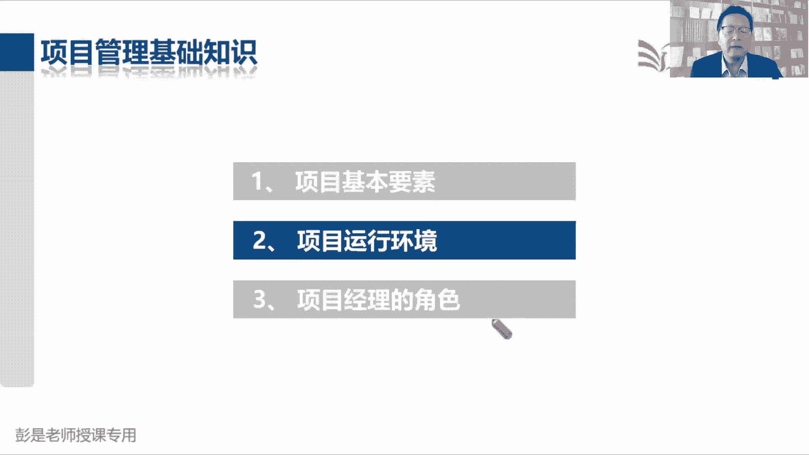
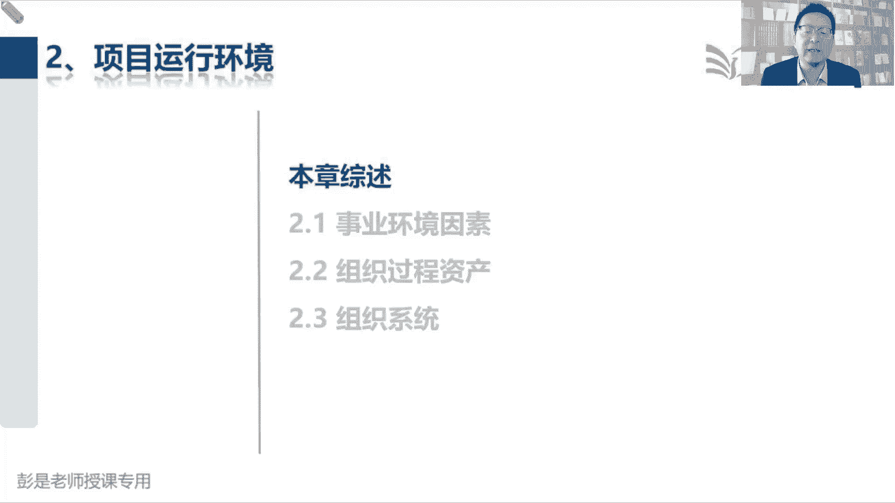
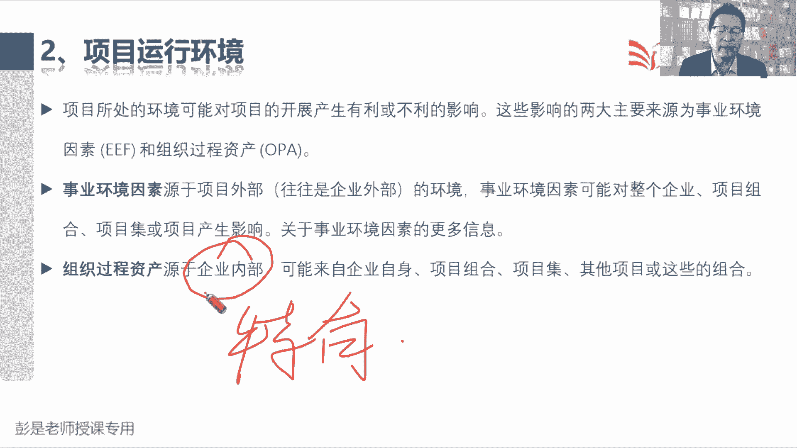
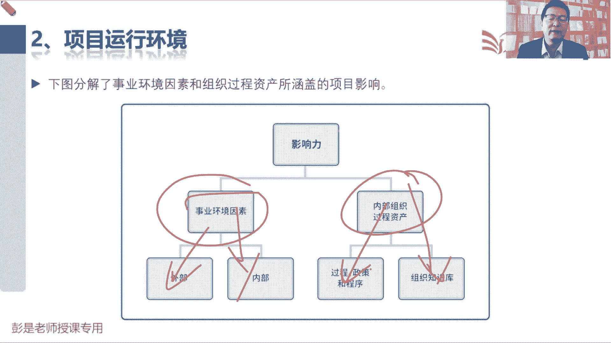
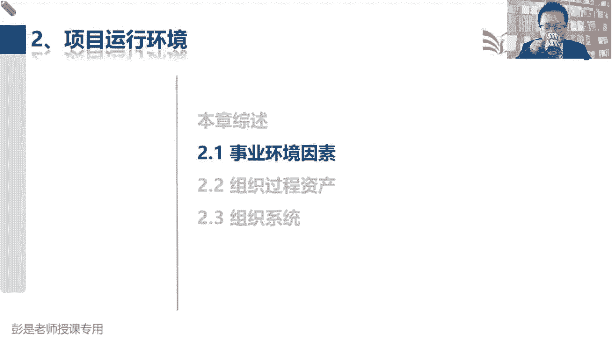
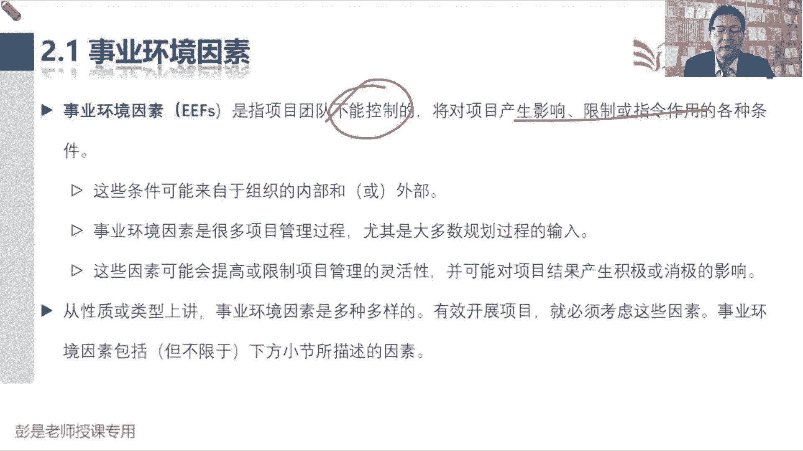
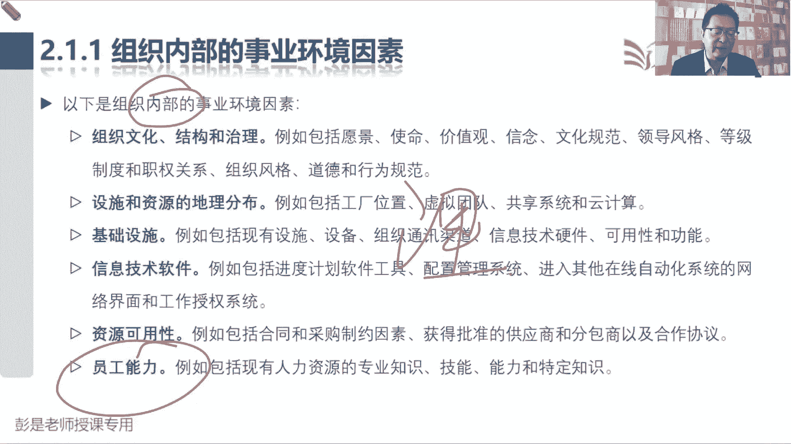
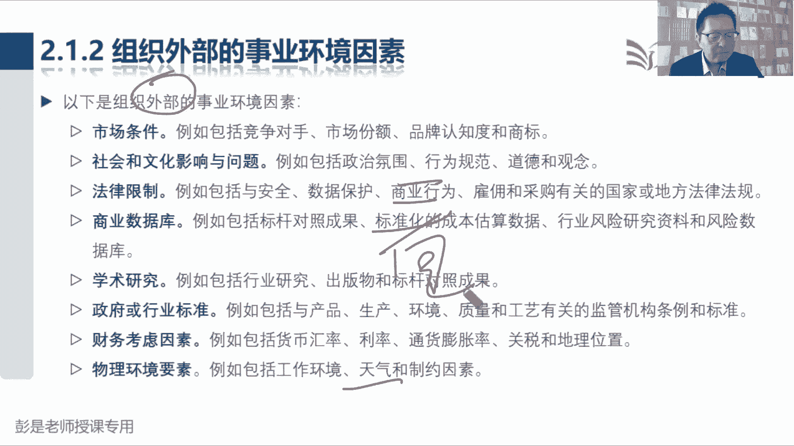

# 2024年最新版PMP考试第七版零基础一次通过项目管理认证 - P8：1.2.1 事业环境因素 - 慧翔天地 - BV1qC411E7Mw

那第二章项目运行环境就这么两块。

2。1事业环境因素，2。2，组织过程资产，2。3，组织系统，事业环境因素，组织过程资产超简单，组织系统呢就是刚才说到的一个东西。

架构对定权利好，接下来看啊，说项目所处的环境，可能会对项目产生开展产生有利或不利的影响，这些影响的两大主要来源，分成事业环境因素和组织过程资产，那事业环境因素源自于外部环境。

事业环境因素可能会对企业项目，项目组合，项目集和项目产生影响，组织过程资产源自于企业内部，可能来自于企业自身到了八，以此类推，这俩玩意的本质区别，先给大家说一说啊，事业环境因素源自于项目的外部。

所以它通常分为两大类，叫企业内的和企业外的，记住这个用语啊，不一样的，那它的主要特点是什么呢，关键词就这两个字会对我们的事情，会对我们的工作是对，会对我们的项目形成限制，形成制约，形成约束。

那么我们就认为它属于一个事业环境因素，最好理解的事业环境因素就是这个东西了啊，法律法规最好理解的就是这玩意儿了，对不对，我们要遵纪守法，我们不管做什么东西，国家可能会有一些强制性的标准要求。

会有相关的法律法规条款，会对我们的这些工作形成约束，形成限制，那组织过程资产是什么东西呢，是咱企业自己的东西，就是大家工作中，你看看你企业里面的啊，什么政策呀，流程啊，制度啊，程序啊，标准啊。

规范啊都不一样吧，每个企业有每个企业的流程对吧，你去什么点咖啡，去什么瑞幸咖啡要去麦当劳，肯德基去唉，这些企业它的流程，它的制度，它的规章，它的政策程序都不一样，所以它的关键词啊。

就是每个企业特有的这一大套东西，包括政策流程制度标准程序规范都不一样啊，对嗯有的餐厅是先交钱后吃饭，有的餐厅是先吃饭后交钱，像自助餐的需要自己去取看的，对不对，正常点菜的餐厅啊。

服务员是给你端到端到手里面去的，端到桌子上的诶，它的流程制度政策程序规范都不一样，它是结合到企业自身的情况定出来的这些东西，所以呢他就叫源自于企业内部，是我们企业特有的东西。

特产，先记住这两个单关键词啊，那再往下说，给了一张示意图，说这些影响啊来自于两个大块，一个叫失业环境因素，一个叫组织过程，资产事业环境因素是从企业，从组织这个视角上看。

企业之外的东西就叫外部事业环境因素，比如说法律法规，这跟咱企业没关系，国家定的对不对，那企业内部的一些事业环境因素，会对工作形成限制，约束的是什么呢，很多比如说你企业的什么设备呀，设施啊，你就想啊。

你公司有没有车呀，公司有没有自己的办公室啊，公司有没有自己的仓库啊，这个办公室多大呀，有没有水，有没有电呢，办公室有没有WIFI呀，有没有网络呀，这些都叫企业内部的事业环境因素吧，我们公司穷啊。

没有网络呀，只能蹭别人公司的WIFI呀，就导致我们这个工作工作起来不顺利，就会对我们的工作产生影响，产生约束，产生限制，以此类推了吧，好都叫事业环境因素啊，那组织过程资产分成两大块，一大块叫企业的过程。

政策程序标准规范规章制度，这套东西啊，就像就粗暴理解啊，不同餐厅流程不一样，不同企业你请假的流程，报销的流程，签合同的流程，业务流程都不一样，它是结合到每个企业的独特性，对每个企业有每个企业的情况。

所以给出的流程不一样，有的有的有的餐厅为什么先交钱后吃饭呢，怕你跑单了，有的餐厅可以为什么可以先吃饭后交钱呢，情况不一样，第二呢就是企业的知识库，这也很好理解吧，麦当劳最知道怎么做麦辣鸡腿堡。

肯德基最知道怎么做肯德，肯德基的汉堡给企业的一些经验，这些知识嗯，好1461446同学这个问题挺好啊，大家不要着急问，因为后面马上讲细节了，先知道它大概的结构，知道这个大概的框架脉络，再去看详细啊。

好知道这个这个意思啊，总之这些东西会对工作形成限制和约束，可能来自于企业的外部，企业的内部，这些东西呢是每个企业特有的东西，每个企业特有的流程政策程序标准规范不一样，每个企业特有的知识不一样。

我开了个煎饼摊，我就会摊煎饼，攒了一大堆关于摊煎饼的知识，张三在隔壁开了麻辣烫，他攒了一大堆关于怎么做麻辣烫的知识，诶，每个企业有每个企业的沉淀积累的东西，好知道这个大思路之后。

再看后面的文字，并且大部分文字不要求大家去背。

知道一次就够了好，所以看看啊，2。1说事业环境因素是指项目团队不能控制，不能控制，我们就会受到它的限制，对对法律法规咱也改不了，咱说了也不算公司啊，公司就这么大面积，咱也改不了，咱说了也不算。

他会对我们的工作形成限制，所以不能控制产生影响，限制或指令作用，知道的意思啊。

再往下翻翻翻翻翻，具体都有什么东西呢，看看以下组织内部的事业环境因素，包括企业文化结构和治理，这超抽象的包括什么愿景，使命，价值观，信仰文化，什么领导风格等级，什么组织风格，道德行为规范，这都不用背。

都不用背，就粗暴理解啊，就粗暴理解就可以了，什么叫企业文化呢，人都有个性，企业有企业的个性，都看过狂飙吧，都看过狂飙吧，高盛集团，高盛集团的道德行为规范和华为，京东淘宝可能不太一样，对不对，就这东西。

那这玩意儿就会对我们的工作产生影响，对不对，好不太需要去背啊，千万不要不要去背这些东西没意思，然后向企业的设施资源的分布，什么工厂位置啊，虚拟团队啊，虚拟团队看不懂，让他去死都不用管了。

工厂位置这能理解吧，我们公司在北京工厂啊，工厂在南极哇，这会限制我们对我们的工作形成很多限制，进行很多约束哈，然后基础设施，你公司有没有WIFI，有没有上下水，有没有暖气，有没有天然气，没有天然气。

公司就没有办法，中午做饭，对不对，只能叫外卖，以此类推了，所以就是让这些东西信息系统软件，你公司要求用钉钉，用QQ，用企业微信，就这种东西吧，高包括公司资源的可用性，包括公司员工的能力。

这都是字面意思啊，这些东西都会对我们的工作产生影响，你公司有一间会议室，公司有一间会议室啊，我们每天都要开展会的，每天都要开例会啊，结果啊这个会议室，公司行政部门通知你这个会议室啊。

我们要装修装修一个月，未来一个月这个会议室就不可用，它就会对我们的工作形成限制，形成约束，包括员工能力，我开了个煎饼摊，我只会摊煎饼，有客人来啊，能不能给我烤个羊肉串啊，抱歉不会这个技能。

那会对我的工作形成限制，形成约束，理解就可以，不需要12345把它背下来啊，总之企业里面这些东西会对，会对我们的工作形成限制的东西。

那以下是组织外部的事业环境因素都有什么呢，都有什么呢，人力资源能力嘛，对不对，有的小医院医生能力啊，可能真的没有这么强啊，有些正经对吧，有些疑难杂症就看不了，就会对工作形成限制，形成约束，以此类推了。

那外部的事业环境因素啊，这也不需要去背，背下来也没有意思啊，就想看一看看一看就可以了，什么法律法规啊，国家标准啊，就这种东西，包括什么工作环境，天气这类天气，这玩意儿咱企业跟这跟咱企业也没关系。

然后他会对我们的工作产生影响，看看看看就可以了啊。

