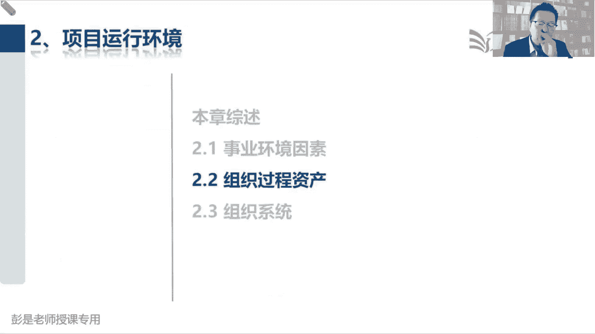
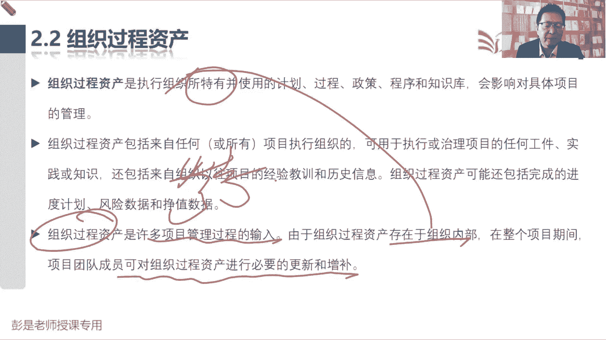
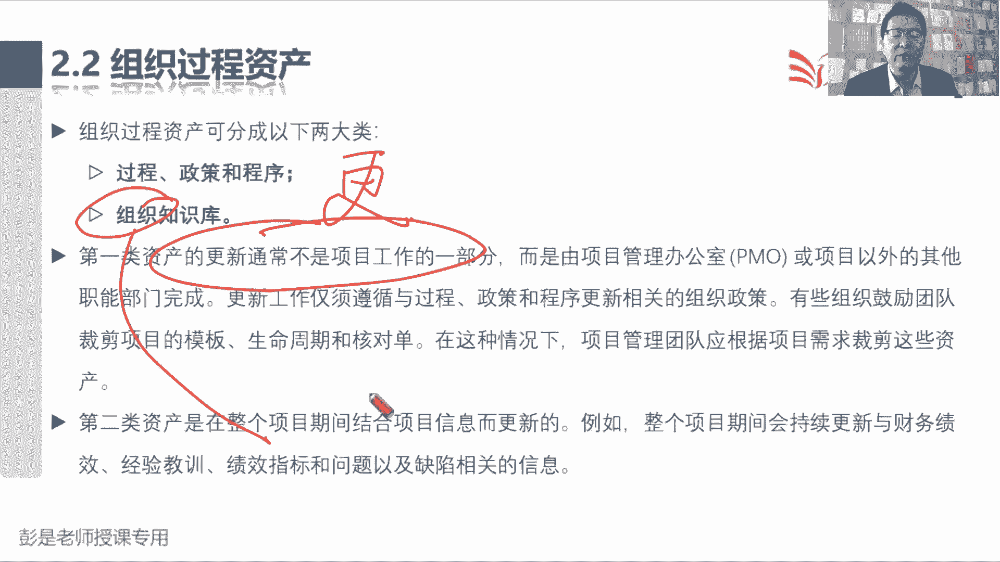
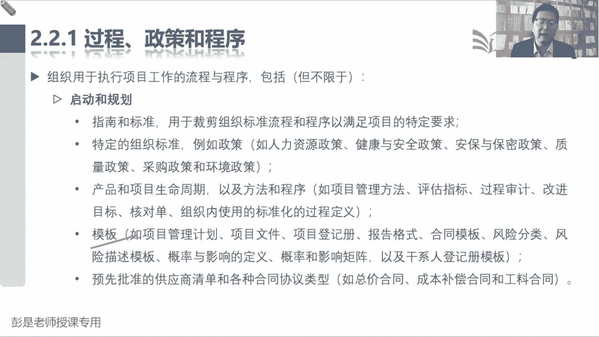
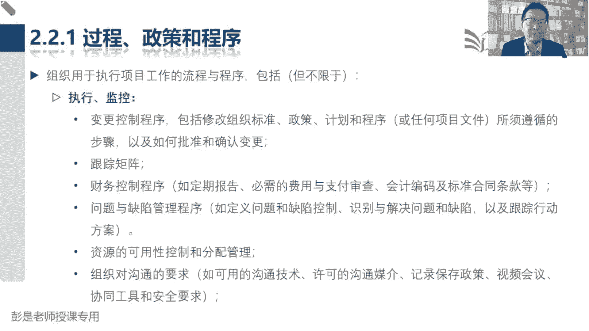
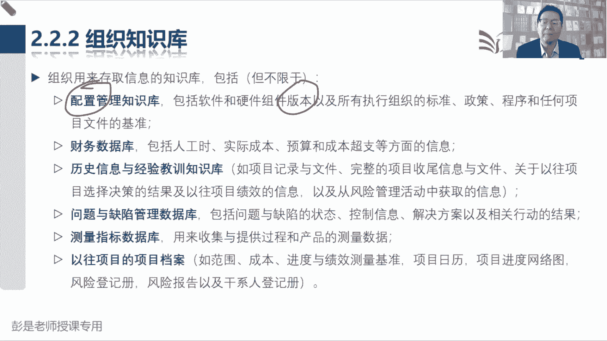
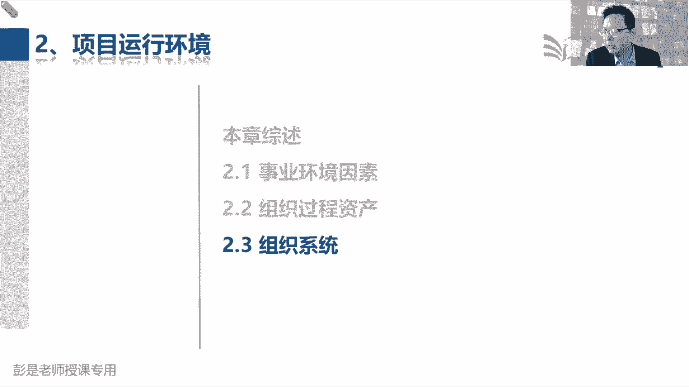

# 2024年最新版PMP考试第七版零基础一次通过项目管理认证 - P9：1.2.2 组织过程资产 - 慧翔天地 - BV1qC411E7Mw

那2。2组织过程资产，这里面字超多，帮助大家化繁为简，第一组织过程资产是执行组织特有的，并使用计划过程，政策程序和支持库，会影响对项目具体的管理，企业特有的东西，包括你企业的各种规章制度。

政策程序流程标准规范，然后第二大块呢就叫知识库，企业沉淀总结积累下来下来的这些东西，好那既然是企业特有的，它不一定记住这个术语，它不一定会对我们的工作形成限制和约束，但是呢有没有可能呢，组织过程资产。

有没有可能会对工作形成限制和约束呢，注意这个小逻辑了啊，就想想你企业内部定的这些这些这些这些东西，会不会有没有可能对工作形成限制和约束呢，有吧，对吧，我们餐厅就规定了，你不交钱，你不交钱，不能吃饭的。

给它是我们根据我们企业情况定的这个规矩，对不对，就是政策流程程序啊，这个流程这个流程你不按照这个流程走啊，你就吃不到饭了，他也会对咱的工作形成限制和约束，所以记住啊，组织过程资产和事业环境因素。

他俩不是非黑即白的逻辑关系，因为企业的组织过程，资产也有可能有可能变成事业环境因素，会对工作形成限制和约束，我们公司规定对吧，请假不批准的话，不能休假的，需要发电子邮件进行层层审批。

审批通过之后就可以休息了诶，这会对工作形成限制，有的公司可能会规定啊，用OA系统啊，以此类推了各种可能性，对不对，包括只支持微信，以此类推了啊，所以记住咱学到最后啊，不是非黑即白，管理学。

管理学没有绝对的黑与白，对不对，所以组织过程资产也有可能对工作形成约束，变成事业环境因素，他俩存在着这种交际关系，但是呢既然他是咱公司特有的东西，我们有没有可能去改变它呢，有可能吧通常来说更容易改。

大家商量没改这个流程，政策程序标准规范比较容易改它，对不对，好知道这个意思啊，好所以后面那段话听一听就完事了，既然这个东西，这个东西是我们许多管理过程的输入，就是咱干活啊，要把它作为参考啊。

干什么活都要考虑一下咱企业的这些规矩是啥，流程政策制度程序标准规范，所以由于这个玩意儿存在于企业的内部，既然是咱特有的，那在整个项目期间，我们可以对组织过程资产，进行必要的更新和增补。

好既然是咱企业特有的一些东西，企业特产有可能会调整它。

好，那再往下组织过程，资产分成两大类过程政策程序，第二呢叫知识库，这一定要记住啊，第一类资产的更新，这个小知识点啊，体力金就可以了，文字游戏第一类更新啊，通常不是项目工作的一部分，向项目管理边界。

徐州评估商业论证效益计划的制定，中间是我们项目项目结束以后，把我们的成果移交运营，那第一类资产，如果我们在项目开展工作的过程中，在项目开展工作的过程中，需要发现啊，需要对企业的什么流程。

政策程序标准做出相应的调整，干这个活，这个活的执行不在项目范围内，就是咱不干这个活儿，我们只是发起申请，只是发起申请，发现这个流程可能走不下去了，哎我们这个项目啊遇到了阻碍。

申请申请向公司申请去调整这个流程，改变这个政策，改变这个程序，发起申请，那对这个政策流程程序啊去进行更新，进行调整，不是我们份内的事情，对不对，好，所以就变成这样一个文字游戏啊。

第一类资产的更新不是我们项目工作的一部分，不包含在项目范围之内，我们只是发起申请这个更新，做执行是其他部门去完成，那第二类资产是在整个项目期间，结合项目信息而更新的，这咱就可以直接做操作了。

因为陈知识的沉淀，积累经验教训的总结，我们是随着项目经验的项目开展的过程中，随时可能会更新的，这小小跳文字游戏，知道这个意思啊，总之最后的结论，这个玩意儿是咱自己特有的，可能会调整它。

然后我们实时发起申请，去调整我们公司的这些过程，政策程序，第二呢知识后，我们在工作过程中想改就可以改。

好再往下说，组织用于执行项目工作的流程和程序，包括但不限于，接下来这一大堆东西要不要背呢，不要不用背了，需不需要看呢，想看就看不想看啊，其实也可以不看了，建议各位同学你看一遍。

后面复习的时候看一遍就可以了，大概有印象一丢丢印象，能够更好地理解什么是组织构成资产就够了，比如说政策这种东西，人力资源政策，健康安全政策，安保保密政策，以此类推啊，这些东西啊。

这些东西通常只能这么说啊，通常会不会对工作形成限制和约束呢，想一想企业的什么安保保密政策，我们公司要求啊，来客要签，要登记啊，要扫身份证啊，对不对，扫了身份证啊，给你个访客卡，然后很多地方你都进不去的。

需要需要我们有员工给你刷卡才能进的，他会不会对工作形成限制呢，人力资源政策，人力资源政策这个话题说出来，大家可能会提神的，我们公司今年规定啊对吧，普通高校的毕业生啊，不招，只招北大清华，其他学校都不看。

只招北大清华硕士生，本科生都不要啊，硕士以上诶，这个人力资源政策，会不会对我们的工作形成限制，会啊，所以通常来说这些政策，这些政策会对我们的工作形成限制和约束，它就同时既是组织过程资产。

又是事业环境因素，诶，稍稍有一丢丢印象就完事了，通常来说公司的政策咱得遵从啊，咱得服从啊，对不对，不能违背啊，好那换句话说，既然这个东西是咱企业特有的，有没有可能改变它呢，想一想再想场景。

公司规定今年只招北大，清华硕士以上学历的毕业生，结果呀我在面试的时候发现有个人呐，哇这个能力超强的跟超人一样啊，钢铁侠蜘蛛侠这样的人啊，对对超人的，那你说有没有可能我们去申请改变公司的政策，对吧。

破例破例把他招进来的，可以的，对不对，既然是咱公司特有的东西，我们就可以发起申请了吧，去改去改这个政策，对主打一个灵活好，记住这个结论啊，这个就是弯弯绕的小逻辑过程，政策程序是我们的组织过程资产。

但是呢，通常这些玩意儿，会对咱们的工作形成限制和约束，它同时又构成了事业事业环境因素，那有没有可能我们去改变它呢，有可能因为是咱特产好，知道这个道理，后边这些东西啊基本上都想看就看，不想看。

可以不看了对吧，公司规定的这些什么方法呀，包括这些模板呢，就是大家你想你写日报，写周报不都有模板吗，往里一填内容就完事了，这些东西哎都是企业特有的好。

后面这些什么规划执行，这都看看就够了啊，看一遍记住看一遍就可以，如果说遇到一个单词啊，没讲到的，看不懂没关系，跳过跳过哈，重要的内容一定会为单独讲。

所以这些内容都不要求去背的对吧，好三个二三个二是组织知识库，组织知识库是咱企业特有的积累，沉淀下来的这些东西啊，想改随时可能改，包括从下往上看，看完了之后也不要求背了以往项目的档案诶，就记住一个成语啊。

以史为鉴的，对不对，我们干活儿翻一翻，之前之前干干过相似事情的资料，这样可以防止防止跳到一些不必要的坑，然后像什么测量指标的数据库，问题缺陷管理数据库，纯粹的字面意思啊，历史信息和经验教训知识库。

包括财务数据库对吧，成功成功成本只有第一个单词，稍稍解释一下什么叫配置管理呢，什么叫配置管理啊，说包括软件，硬件组件版本以及所执行组织的标准程序的，任何项目文件的基准，这。

未来咱所有的教材里看到配置管理，就想到版本管理就可以了，就对这个单词稍稍有这个认知就够了，配置管理就是版本管理，版本管理最重要的作用是什么呢，什么是版本的，最重要的作用是什么呢，所以需要带场景。

帮助大家理解一下版本管理最重要的作用啊，各位同学呀，不不不管你在工作中，在上学的时候，不管你不管你什么时候啊，都有过写作的经历吧，写作文，写毕业论文，嘿老板让我写一个文档，老板让我写一个资料啊。

这个玩意儿我写完了之后啊，老板说给出了一些修改意见，然后呢我又写了第二稿，老板又给了一些修改意见，我又写了第三稿，老板又给了一些修改的意见，这时候老板说呀，我觉得第一版更好，咱就用第一版，这种情况下。

如果第一版你没有存档，就就就坏事了吧，诶版本管理最重要的作用就是这个东西，我们要把它各个版本各个版本都给他存下，存下来存下来存档啊，这样比较稳妥，便于追溯，便于追溯啊，这有道理。

这就是版本管理最重要的作用了，对对修改不就是变更吗，一旦有了更新，一旦有了更新，我们就存一档存一版，这样呢万一老板说第一稿最好，我们还可以及时的把它调取出来，对不对，所以其实大家工作中看看工作习惯。

包括你建文件夹啊，然后关于你写这些文件啊，唉每次改动每次改动如果都有记录的话，如果都有历史记录的话，这不是最踏实吗，这就是版本管理最重要的作用啊，工作中经常的一个一个文件，什么一个演讲稿。

一个资料设计图，花了好多次，花了好多次，不断的改，不断的改，最后呢就换回第一个了，很正常，那所以我们要把每个版本都给它存档，都给它保存起来，所以配置管理看到他就反应过来，是版本管理就够了。

这就是企业知识库，好，这是2。12。2。

