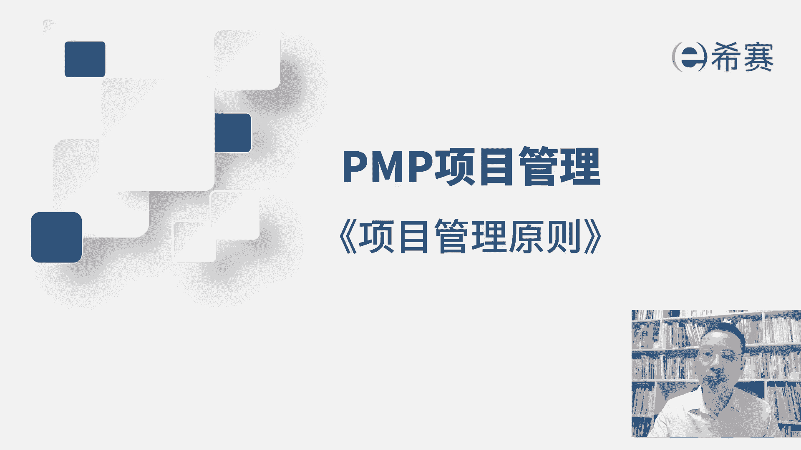
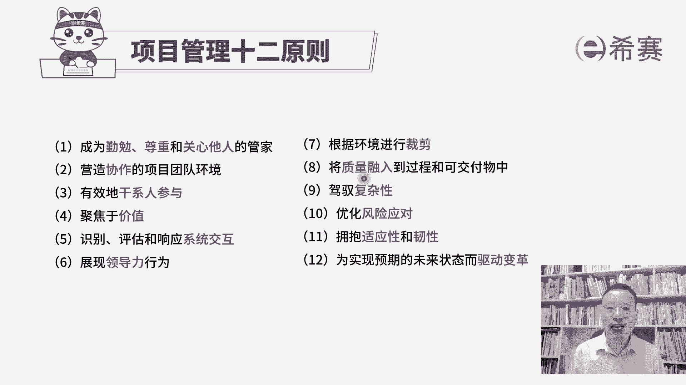

# 2024年项目管理PMP认证考试第六版／第七版／敏捷全套完整通关精讲合集 - P44：【第七版十二原则】00概述 - PMP课堂 - BV1UNbsemECS

在偏僻的第七版教材中，他特别强调了，关于有12条原则和八大绩效与，那我们今天一起来看一下，项目管理的12条原则。

它12条原则是这样的，首先第一个呢说要成为一个勤勉的，尊重和关心他人的管家，也就是说你需要具备管家精神呃，什么是管家，你可以想象一下，大概在18世纪，19世纪那些英国的贵族。

他们家里面那种管家权力相对比较大，同时呢能够为整个家庭去服务，安排很多事情，我们晚点会展开来讲，第一条是要有管家精神，你要成为一个勤勉的尊重和关心他人的管家，第二条呢要营造协作的项目团队环境。

也就是说你作为一个管理者，你要有效的能够去让大家一起好好工作，你要能够去带领这个团队啊，协作一起去完成事情，第三条要有效的干系人参与，其实也就是说我们已经学过前面内容，知道啊。

你要去引导这些干系人来有效参与项目，让他们对于项目的支持会更多一些，而对于项目的抵制呢更少一些，这就是有效的干系人参与，第四条原则叫聚焦于价值呃，我们在后面会学到敏捷。

项目管理敏捷中会有一个非常重要的信息，是价值导向，也就是说我们所做的事情，其实他们的这样一个价值是不完全对的，通常情况下有一个叫二八法则，可能你做那些事情中20%的内容，它的价值对于整个这个系统来讲。

对于客户来讲，它的价值可能是达到80%以上，那么聚焦于价值，就是我们优先做了一种对客户来讲，价值比较大的，然后再是其次再次再次会有这样一个优先顺序，我们做的事情还有一个很重要的点是什么呢。

就整个这个项目它应该是有价值的，一定是值得做的，能够为我们带来这样一些，不管是无形的价值也好，有形的价值也好，一定是能够产生价值，创造收益，第五条原则叫识别评估和响应系统交互，这个系统交互呢。

其实对于呃之前学偏僻的同学可能会很陌生，但是你看过这些内容以后，你大概能够理解它基本上就接近于整合管理，就是我们整个项目它是一个大的系统，那我们在做这样一个事情的过程中。

你是需要去有效的跟这个系统有有交付，你要去识别干系人，你要去安排各种计划，并且呢在对应的节点要去落实，要去执行好，第六条是展现领导力行为，那关于领导力呢，我们在前面的课程其实有讲过两句话。

一个是兄弟们给我上，还有一个呢是兄弟们跟我上，那不管你是让别人给你上还是跟你上，你只要能够有效的调动大家的积极性，能够让大家好好的去做这个事情，那么这都是一种领导力的展现。

而第六条就是那作为一个项目经理呢，你需要有这样一个领导力，你能够想办法去激发大家的活力，让大家去做事情，这是第六条，领导力，第七条根据环境进行裁剪，那关于裁剪呢，其实我们前面有讲过一个词叫取舍取舍。

也就是说其实我们有那么多的工具，那么多的方法，那么多那些个工件文件，你并不是说这个项目上所有的东西，你都需要用到，你可以根据需要来进行取舍，并且呢也有一些东西是我们在这个项目管理的。

整体框架中没有包含的，你也可以加东西进来，所以你既可以捡东西，也可以加东西，根据环境来去取舍裁剪，那裁剪的目的是，能够更好的去服务这样一个项目啊，这是第七条，进行有效的裁剪。

第八条将质量融入到过程和可交付成果呃，在整个项目管理中，其实质量是一个非常重要的内容，怎么讲呢，如果我们做的东西它质量不过关，那几乎是没有验收的可能性的，客户也没有办法很好的去使用起来。

所以我们整个在做项目的过程中，在前期你需要去考虑质量，在过程中需要去实施质量的保证，在最后呢我们还要去做质量的控制，所以质量它其实是项目的一个生命力，如果没有质量的话，整个项目它就非常无价值，无意义。

包括我们在后面会讲到敏捷项目管理，那敏捷中它会持续讲到的是，我们要交付一个可以工作的软件，你什么叫可工作，首先是质量没毛病，质量没问题，然后呢是对方能够接受的，所以即便是不讲质量。

但是质量它是基本的前提条件，这是第八条，将质量融入到过程和可交付成果中，第九条驾驭复杂性，大家知道现在是一个无卡的时代，就是他乌卡其实是四个不同的单词来组成啊，他讲的是说我们这个时代呢有太多的易变性。

不确定性，复杂性和模糊性，就是我们在做项目的时候，并不是每一个项目你都能够看到12345步，你能够明明确确知道，有很多东西是有太多的不确定的，尤其是现在这个时代，需求变化特别频繁的情况下。

那项目经理呢你要有一定的能力，能够去驾驭复杂性，关于这个驾驭复杂性可能其实不是很好去理解，但是你要想到这样一个点，什么样的人，他才能够应对这种比较复杂，比较变化的这样一种环境，一定是个高手。

就是他在不复杂的情况下你能够搞定，那么在复杂的情况下，你在一定程度上能够搞定，当你能能够累积更多经验的时候，那么面对大量这样一个异变性，不确定性，模糊性，复杂性，你也有方法，有套路能够去驾驭它。

这是第九条，关于驾驭复杂性，第十条呢叫优化风险应对，其实它就是你在前面看过的关于风险管理，我们在做项目的过程中呢，风险几乎是无处不在，风险本身它指的是说一个不确定的事件或条件，它一旦发生以后。

会对整个项目造成一些影响，可以是正面的影响，我们叫机会，但更多的时候呢我们给它取名叫负面的影响，叫威胁，那么对于风险，如果说它可能会发生，我们不能坐以待毙，所以一定是要去准备一些应对的措施。

那么关于第十条优化风险应对，也就是我们需要去做好这样一个风险管理，能够去识别风险进行定性的分析，定量的分析，能够去规划风险应对，并且能够去有效的应对风险，好第11条叫拥抱适应性和韧性。

我们先来解释一下所谓的叫适应性，我们可能会说某一个人他的适应能力很强，就是面对那种新的不确定的，陌生的这样一个环境，他依然能够把事情有效的往前推进，这是说适应能力很强，而韧性指的是什么呢。

韧性指的是打个比方，如果一个玻璃球你往下面掉的话，可能就会碎掉，但如果说是一个铁球，你往下面掉，它不只是不会碎，它甚至能够把地上砸一个坑，而如果说是一个乒乓球，你往下面掉的同时。

它可能不会把地上砸一个坑，同时它也不会碎掉，但是它可能还会再弹起来，而这边的韧性呢讲的是说，我们在做项目的过程中，有可能会有陷入谷底的这种状态，那么你还能够再回弹，就是面对失败困难挫折的情况下。

你能够恢复到原有的状态，这是所谓的任性，而第11条强调是拥抱适应性和韧性，也就是能够面对未知的情况，并且如果说有出错的情形，也不要害怕，不要去恐惧，我们能够去恢复到原有的这样一个状态，好第12条呢。

为了适应预期的未来状态而驱动变革，这一条讲的是什么个信息，其实理论上来讲，他不应该是你作为一个项目经理，需要去特别在意和关心的事情，但是呢它又会是作为一个管理项目，所需要去考虑的，首先我们为什么要变革。

它一定是因为原来的这套方式和方法，它不再适用，或者说是他原来那套方式和方法，用起来会有些困难和挑战，在这种情况下，所以才需要去发生一些变革，N我们作为一个项目经理，尤其是当你要去驾驭复杂性的时候。

你需要去拥抱适应性，拥抱任性的时候，面对太多不确定性的时候，我们可能需要去调整一些新的方式，因为旧有的方式它未必适用，如果说需要调整的话呢，你首先要有这样一个心态，你能够知道说啊原有那一套已经是不适应。

所以呢能够去为了实现未来状态，我们需要去做一些相对应的这个调整，但虽然说变革这个词，其实不应该是项目经理去主导，但是它应该是由一个顶层架构，由顶层领导他来去从上往下推，但是你至少要有这样一个意识和状态。

我们经常会讲到说一念之转，你要有这个念头，你要说哦，原来这样一个变革可能是正常的，当你觉得变革可能是正常的，那你就可能会更加有意识的来，去采取一定的措施，包括他不能够有效实现的时候，你也不会那么害怕。

这是整个项目管理12条原则的一个简述，那接下来呢我们会每一条单独展开。

