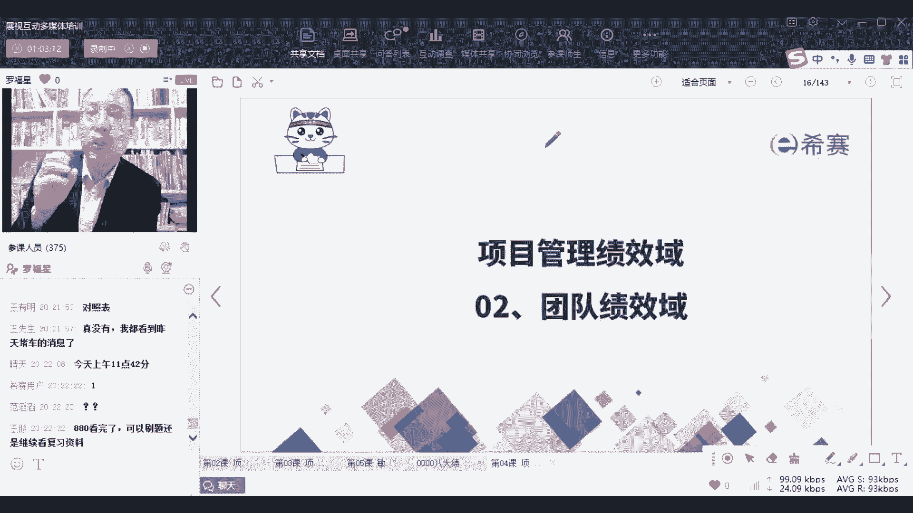

# 2024年项目管理PMP认证考试第六版／第七版／敏捷全套完整通关精讲合集 - P59：【第七版8大绩效域】01干系人绩效域-下 - PMP课堂 - BV1UNbsemECS

我们说项目经理要做一个好人。

你要做一个好人，做一个什么样的好人，你要能够比较好的能够让大家去支持你，变得信任你，去相信你，这个支持你，信任你，相信你跟很多东西都有关系，跟你本身的实力有关，还跟你的本身展现的气质。

以及你这个人自己为人有关系，就每一个人自己的这样一个自身，与生俱来的气质也好，或者后天修炼的气质也好，他真的会给你带来一些不一样的东西，呃我始终会坚信的，就说你如果为人比较正。

然后比较有那种正向的一些气质的话，能够吸引一些好的东西，如果说自己比较痞里痞气，有理由气的话呢，有可能别人对你的信任度会稍微有一点点减少，呃这个呢吹个牛逼啊，说个真实的情况。

就是我我太太之前租过一个发一个一个画室，我帮他去做画室的时候，就我帮他去找了，找了咳，找到一个找到一个房东，然后呢他那房子还是一个没有装修的房子，然后就聊聊了，聊了以后，那刚刚好他要出差。

他就把那个钥匙就给我了，他要去宁夏还是什么地方，反正很远的地方去出差，然后当时我太太就很惊讶，她说诶那个人为什么为什么会那么相信，你会把钥匙给你，那其实有的时候就是，这是你自己自身会展现的一种一种气质。

你有你的这一种，就你的谈吐啊，你的形象啊，你的这种气质，他会去给到别人一种初印象，那这个初印象是什么，那其实就取决于你自己自身，我们在我们在分析别人，同时别人也在分析我们，我们在相互分析，对不对。

其实我们在大量在相互的去分析，所以你要搞搞清楚情况，有的时候我觉得做人其实不必要，一个是不要太过于那个叫什么执念，执念太深，当然你也不要太过于油，就是特别油那种，就是很滑很滑头那种，我个人觉得。

反正我觉得也不是什么特别好的事情，但是需要有一定的灵活性，就是你需要有灵活，同时呢你也需要有你的你的底线，你要守住你的底线来做某些事情，那证明会对于干性的这样一个分析。

有一个简单的一个模型叫权利利益方格，权利利益方格中，他会讲的是说这个人的权力大不大对吧，而你的权利在这个项目上的权利对吧，我说这个项目要停，他就得停，那就是有那个翻手为云，覆手为雨的权利了。

那还有就是说无能为力那种对吧，就完全没有权利，所以权利有高和低，同时呢他这个项目对他来讲利益大不大，也就说是对他来讲是会有很重大的影响，还是没有什么影响，如果说对他影响非常大，就是他可能就会很关注。

很关心这个项目，那如果对他来讲无所谓，那他就可能不太关心，不太关注，那这个权利利益方格我们会把人分到四，就是基于这两个维度来拆分到四个象限，猜到这个象限中这个群体他的权力比较高。

同时呢他又很看重这个项目，他很希望这个项目能成功，因为这个项目成功了以后啊，对他来讲有好处，有可能是能够让他赚到更多的钱，或试图会往上提升，那么这个群体这一群人，你的管理的策略是什么呢。

重点管理他说什么东西，你一定要琢磨琢磨再琢磨，仔仔细细再想一想，一想要过脑子过两遍，应该是这个逻辑啊，那也有一些人呢他的权力非常大，但是呢他不是这个项目上的那个领导，他是另外别的事情的领导。

别的部门的领导，他跟这个项目没有太多的关系，没有太多利益纠葛，他也不太关心这个项目能省事，那么在这种情况下，这个群体呢给了一个词叫令其满意，或者你换一个词叫让他不反感，他只要不反感就没毛病。

OK他要是反感了以后，他可能顺手就把这个事项给关了对吧，那就麻烦了，OK他不反感就可以了，还有一个群体是他自己没有什么太多的权利，但是但是他很关心这个项目，因为你做的这个项目。

比方比方说你做了一个什么什么软件系统，那个软件系统它一天到晚都要用，一天到晚都要用，烦死了，是不是，就如果你做的东，如果你做的这个功能很菜的话，他会非常烦，所以在这种情况下呢。

哎你一定要去想办法及时跟他同步一些信息，也能够让他心里面放心，因为他如果一旦不放心，你知道我们很多人我们刚说过，有人的地方就有江湖，就有是非对吧，就有矛盾，但如果他心里面对这个事情不踏实，不放心。

他势必就会怎么样，就要么就盯着盯着盯着，然后可能会道听途说，可能会怎么怎么样，所以你你不如索性比较透明的方式，来去让他知席，让他知晓，你让他知晓了以后呢，他可能反而还会心里踏实一点。

还不会给你整一些什么幺蛾子，你要是搞一些那种悄悄摸摸的这种方式，他可能会反而做一些不太确定的事情，让这个项目可能会不太能够顺利的往前推进，所以呢这个群体你要跟他同步信息，想随时告知有明天有课啊。

课表没有改，只有昨天的改到今天，明天还有课，然后还有最后一个群体，他就是他既没有什么权利和利益，但同时呢他也不关心这个项目上市啊，他是隔壁部门的，隔壁的科员，只是碰巧你们之间点头之交熟悉而已。

那这个群体呢，你就稍微去花一点点时间和精力去跟进，就可以了，不要去花很多的心思，而这个逻辑呢其实就已经是一个叫嗯，干系人管理的策略，干系人管理的策略，也就是说我会用什么样的方式来去对待，什么群体。

用什么样的方式去对待什么什么群体对吧，哎就这个意思其实也就是看人下菜碟，我们经常会说啊，有一些人像是职场的新人，你为什么觉得他是一个职场新人呢，就特别的满状，特别的粗俗或者特别的粗鲁，那种职场的。

职场的这种还没有被职场给修理过那种感觉，那他如果说是被自然修理过以后，他一般来讲会有一点点眼力，见他会有点他能够看眼色，他能够知道什么时候该说什么话，该做什么事情，对不对。

那这不就是在培养自己的这样一个，干线管理的能力吗，所以你们在我们每一个人在成长的过程中，就是不断的在去提升自己，让自己能够更好的去知道在什么样的场景下，面对什么样的群体。

我们该用什么样一种方式来去面对和对待，对不对，这种方式不能算是事故，我觉得更多的是能够知道这个社会的运行规则，能够去适应这个规则，能够去参与到这个规则中来，好啊说的有点远，我们再回到这个主题。

干系人参与中，关于这个群体，他的这些个影响啊，权利啊，这些东西我们可以会通过这种方式来去了解，你了解了以后有什么好处呢，能够更好地去把这个项目往前推进，这才是你的目的，我们去了解了以后。

是能够把这个事情往前推进，这才是你的目的，OK你会不断的去因为那个人的这种权利啊，利益啊，这方面他可能会有变化，可能会起起落落来来回回，所以呢有可能会不断的去调整，可能会去调整它的优先级。

可能曾经某一个人在这个地方诶，他是突然后面突然之间被调用到这个项目上来，负责分管这个项目，他是这个分管这个项目的主管，那你说他重要，他关不关注这个项目，很关注他一下变到这个地方来了对吧，这是有可能的。

OK所以呢我们了解一下干性人的参与，那当然了，干系人参与中呢，你看他需要完成什么事情呢，首先第一个你需要跟他们去啊协作，你跟他去协作来去，让他知道知道这个项目上的事儿，介绍这个项目上的事。

能够去获取他们的需求，因为我们说做项目的话，其实需求一致一定是来自哪里呢，大部分是来自于客户，你要想办法去获取到客户的需求，你好歹你得要搞搞清楚谁才是你的客户，谁提的需求是你重点需要去考虑的对吧。

那么这个里面的话，他这个群体提的需求你也是要考虑的，而这个群体提的需求你需要着重考虑，所以不同人提的需求，你的考虑的方式是不一样的，你的时间和精力有限，你只能去优先考虑谁的需求。

一定是优先去考虑谁的需求，对不对啊，同时呢你能够去了解他的需求啊，期望呢他们在做项目的过程中，可能会遇到各种各样的困难问题挑战，你要想办法去解决，至少你要有态度去解决，去解决。

产品经理是去现场获取需求吗，你当然可以去现场获取需求，你也可以不用现场的，你也可以通过发邮件的方式呀，你也可以通过打电话的方式呀，你也可以安排人去的方式呀，不一定非得你自己亲自去。

你只要想办法去获取到都可以啊，获取需求的方式有很多，在第五章项目范围管理中，会讲到很多的需求和获取的工具，在880视频教程里面也有都是可以的啊，好，然后呢，还有就是能够让干贤人去适当的，做出一点点决策。

比方说去支持这个事情往前去推进对吧，那我们给了一个词叫争取争取干性参与，什么叫争取，他本来站在这个地方，你把拉拉拉拉过来哎，这还要争取，对不对，那比方说呃杨幂在那个地方诶，你把她你把她拉过来。

成为你的女朋友，诶，这还是争取，对不对，什么叫争取干系人参与，就是这个人他可能没有你这个项目，他依然在工作，他依然在做事，有了你这个项目以后，他要额外花一些时间和精力去做事情，那么这时候你要去争取它。

你要怎么样去争取，OK你可以用一种软技能来争取哪些软件呢，比方说你要积极倾听倾听这个话，我们在后面会展开讲啊，这些东西还有各种冲突，管理也会是在风险管理中去展开讲，这在资源管理中会展开讲，这些会展开讲。

而这个不管是积极倾听也好，还是冲突管理也好，他们都是属于人际关系技能好，这里还有一个呢创造创造愿景的这种能力，然后批判性思维的能力和这些领导能力，什么意思，这个词你换一个词。

换一个你很熟悉的叫什么叫画饼，有没有兄弟姐妹，是不是你要能够给他画一个饼，你要能够能够让他信，你要能够让他信，是不是，嗯并且还有就是他提的那些不合适的东西，你要能够去驳斥他，你要去驳斥他。

你要去也不是驳斥他，你要去游说他，你要去说服他，说啊这个东西不好，其实是这样子更好，对不对，呃就像今天有有一些，比方说你看你看那种网络上面放放图片，有一些人长得很胖很胖，比方说像像罗老师最近就有点胖。

很胖的时候去试衣服，明明那件衣服勒得勒的，身上都已经有点那个痕迹了，然后那个营业员都说哎呀很漂亮很漂亮，太好了，太好看了，你怎么长得这么合身对吧，那他其实在用一种不一样的方式来去来去，想要去游说你。

那你需要具备一些批判性的思维，能够去正确的看待，正常的去看待一些不合理的一些建议，一些不合理的需求对吧，哎你要有这样一些好的方式和方法来去engage，来去争取到你的干系人，但其实这是一个很大的课题啊。

是很大的课题咳，OK并且呢你还要想办法去很好去跟他沟通，你怎么样去争取他，你得要跟他聊啊，你一定要跟他沟通呢，那沟通是干什么，沟通其实就是去交换信息来达成某种共识，哈哈刘云机，你说的很对啊。

老板经常用这种方式来去画饼，对啊，经常通过这种方式让大家舍不得走嗯，那么沟通就是要去有意无意的交换信息，来达成某种共识，那沟通的方式有很多，我们会在沟通管理这一章再展开来讲啊，我们后面再展开讲。

在这里不去展开讲，你只要知道，我们一定要通过大量的沟通去讲清楚一些事情，你不要产生那么多的误会，像我们现在有很多的误会，所以我会给大家提前去讲一讲，我们这个课程是什么样子的呀。

我我讲课可能是什么样子的呀，我可能会这样去说对吧，那包括说我在第一面的时候来跟您去讲，我说这个课程是这一节课是以介绍为主，可能只能讲六个，这也是我在提前跟您去打招呼，我提前跟你打过招呼以后。

你心里面大概会有个底，对不对，当然事实上根据现在的情况呢，今天能够讲两个绩效率就已经很了不起了啊，大概率能够讲两个就很了不起了，可能讲不了那么多，我们还是先先慢慢的开始，先慢慢开始，沟通差怎么办。

慢慢来啊，到时候你看一下沟通管理那一章，里面也会有很多的方式和方法，那除此以外呢，我们还有就是要去监督他，就是你原来会希望他可以怎么怎么样去做事情，那他如果没有按照这种方式去做事情，你得要去看到呀。

你得要去了解呀，还你得要想办法去调整一些方式和策略呀，对不对，那你怎么样去调整呢，哎这也是你要需要去考虑的事情，具体的内容我们会在就很多，具体内容都是在后面会展开讲，你如果看过啊，我先问一个问题啊。

就是没有看，今天我在群里发的那个excel表格的同学来敲个一，没有看的同学敲个一没有看，我今天在群里面发的excel表格的同学，敲个一看的同学敲个六，那些没有看的同学。

麻烦你等会认真的去下载一下那个表格，认真的看一看好不好，有那么多同学没看，你看你要认真看过以后，你可能对于这个上课你就会心里面更有谱一点，知道吗，至少是大概率能够知道，说我们的重点都是放在哪里。

因为前面这个内容真的是一个偏介绍性质的，就现在这东西是偏介绍性质，我今天讲的其实比较详细了，其实是偏介绍性质的，OK所以他有个侧重呵，有个侧重，你现在要大概知道有个逻辑啊。

有个逻辑说咱们有一些策略来去管理这个人群，我们还要去看有没有管好他，如果没有按照我的意愿度，或者没有按照我的方式来进行，那我该怎么办对吧，那该怎么办呢，那一定有一些好的方式来去处理它。

所以你要经常去做一些审查呀，然后去了解呀，然后来去处理呃，没有在群的话，你就加一下那个班主任，加一下班主任的企业微信，你加起班主任企业微信跟他发信息嗯，所以你会发现在做项目的时候啊。

大家可能会有各种调整，各种各样调整，那么这些调整，其实你就是不断的去需要去监督大家的情况，对不对，你要不断的去监督大家的情况，然后如果说他的这些做法，跟米线的做法是不一样的。

你就可能需要去换一种新的策略来去做事情，对肖书文，你说的很对啊，不从书上面抠，还从哪里抠，还从哪里抠，你往群你你把群里面往上面翻，大概在今天下午，今天下午大概是三点钟左右吧，应该是两三点钟左右的时候。

我发的信息，你看一下，大概三点钟左右的时候发的信息，哦我不记得是几点钟啊，11。21。40发的信息是吗，我都不记得几点钟发的信息了，好那么整个项目干系人管理中，我们的这些介绍性的东西呢就到此为止了。

那么最后有一个检查检产品给了什么，检查给的是说你看在整个做项目的时候呢，我们要建立一个好的工作关系，建立一个富有成效的工作关系，那这个富有成效的工作关系是什么意思，就是能够让大家更好的去支持。

而不是去抵制，OK能够更好的去支持，而不是抵制，你艾特一下我，你艾特一下，我，等会下课的时候，我再发一遍好不好，你艾特一下罗老师，然后等会我再重新发一遍啊，嗯有可能是刚好那个群没有漏掉了。

有这种可能性好，第二个呢是说你要看一下他们是不是同意，什么叫同意呢，就是中间可能会有一些东西做了调整，那么如果做了调整的话，我们又该怎么办，对啊如果说有些东西做调整，你是否能够去接受。

然后关于变更你是否能够去接受，关于这种东西能否去能否去处理，还有就是他说受益的人该怎么对待，反对人又该怎么对待，那你就看一下他们是支持咯还是反对咯，他支持人是不是更好的去支持，反对人是不是更多的反对。

所以你要通过这样一个甘心管理，能够达到这样一个目的，而具体内容呢我们会在干心管那一章会展开讲，就是人的那个板块中，在人的那个板块中会展开来讲，好额，然后回来一下王鹏同学，问题啊，说880已经看完了。

那么是刷题还是继续看复习资料，已经可以开始刷题了，只要你的880看过一遍以后，你就可以开始做题，虽然可能会错很多，可能会错50%或错40%。

但是没关系。