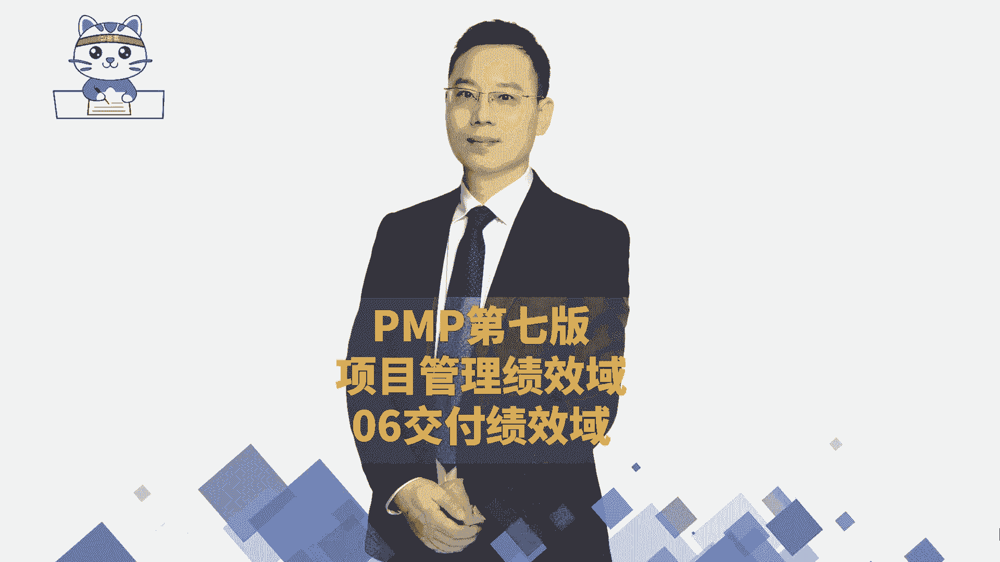

# 2024年项目管理PMP认证考试第六版／第七版／敏捷全套完整通关精讲合集 - P73：【第七版8大绩效域】06交付绩效域-中 - PMP课堂 - BV1UNbsemECS

那我们在做这些事情的时候呢，我们这里会讲到一个叫收集需求的工具，其实收集需求工具会有很多，包括什么反弹啊，焦点小组啊等等这些工具，那这些东西呢我们会放到范围管理中再展开讲，咱们不会在这里特别特别展开讲。

你只要知道有这个点啊，我特意给你列了一下，并且我们在做需求的时候有这样一个要求，就类似于叫smart，叫smart，什么意思，就是说你首先你做的这些东西，应该是需求是很清晰的。

就是很明确的知道你的需求是什么，打个比方，我说我现在有点太胖了，那我的需求是什么，我要让我变得更健康，那我怎么样去变得更健康呢，那我可能就是通过跳绳呐，然然后跑步啊。

然后以及少吃一点东西呀的这种方式来去做，OK可能会通过这种这种方式来去做事情，让让它变得更清晰，然后还有一个呢就是简洁简洁，就是你尽量用比较小的文字来去描述这个概念，能够把它给描述清楚就好。

还有就是可核实，这个可核实什么呢，可测试你也可以把它理解为叫做可测试，OK可测试可测试，也就是说咱们做的这个东西，你可以通过测试的方式来去发现，它到底是做到了还是没有做到，这是叫可核实。

然后还有一条叫一致性，什么叫一致性，你提的需求不要有那种矛盾，比方说你不能让这东西看上去显得很呃，显得很丝滑，但同时又显得很稳重，它又很丝滑，又很稳重，那这两个需求其实就有一点点问题对吧，又很丝滑。

又很稳重，它就会有一点点问题，所以我们需要达到某种一致性，就算这些需求他们之间不要有相互矛盾和冲突，而是能够去有有关联，对谢谢朱文斌对朱文斌在帮我解释啊，就是那种陌生的词汇。

你们稍微可以看一下文字也是可以的，好这边还有个人呢是完整性，就咱们整个做的这些需求，能够基本上大方向去满足，满足到大家，OK满足到大家，至于后面的这个可公正可可跟踪，这可跟踪是什么意思呢。

可跟踪讲的就是说，咱们需要给每一个需求列一个唯一的标识，标识码，唯一的编号，然后基于这个编号，咱们就能够发现哎，这个需求有没有去做干扰的设计呀，我们在做详细设计的时候有没有考虑进来呀。

做数据库设计的时候有没有考虑到它呀，然后去开发的时候有没有考虑进来呀，然后在测试的时候有没有测试通过呀，然后集成有没有考虑太阳，然后部署的时候有没有太阳，那这样方式来去跟踪他，这是可跟踪性。

总体来讲需求就是要相对比较清晰清楚的好，然后再就是他说要教要管理这些管理这些需求，管理需求中会讲到一个叫有效的需求，一个是无效的需求，那关于有效的需求和无效的需求，你先看无效的需求，什么叫无效的需求。

就是你提到需求又改来改去，又又要不断的去反攻，那么这就是一种属于叫无效的需求，你提到需求后来就是大量的范围蔓延，这也是无效的需求，还有就是什么预算又是超支了呀，进度又是落后了呀。

那么这都是表表示咱们前期的需求没做好，有问题对吧，而做的东西最后做完了以后，项目却失败了呀，客户满意，这都是表示在做一些无效的需求管理，那什么样是一种有效的需求管理呢，有效的需求管理。

其实你就是能够去把客户的这些需求，能够比较好的能够去获取到，比较清晰的去获取到，那那个获取到的话，其实有很多的角色需要去帮助你，比方说会有什么商业分析师，有PO有价值工程师啊。

这些人你不用去管他到底是什么，你只要能够理解，就是，我们大概率会有很多角色来帮我们做些事情，以及它会用各种工具来帮我们，比方说他会用这种什么呃头脑风暴呀，啊思维导图呀。

然后引导啊各种方法来去帮我们去弄需求，以及用这些个什么索引卡呀，或者说是需求跟踪矩阵啊，等这些方式来去帮我们去跟踪需求，哎，那都是一种有效的方式，总之呢需求有可能是前期就定下来。

也有可能是后期会发生改变，也有可能是某一些项目的需求，他就是从头到尾就在发生变化的，我们需要去进行有效的管理，而有效管理最终的目的，就是能够让这个项目顺利的去交付，顺利去交付这个产品。

那么关于这个需求这个点上面，这里来认识一下客户最开始提出他想要的东西，我们会把他想要的东西，把它转变成一个他真实所需要的东西，那么这个就列出一个叫需求文件，而客户的需求文件中要的东西。

我们怎么做才能做到呢，我们还要把这些需求文件再一次翻译，翻译了以后得到一个叫范围说明书，这是我们去做哪些事，我们去做了一些具体事情来产生这个需求文件，我们要做的事情可能颗粒度很大。

但这个颗粒度很大的时候怎么办，当刻力度很大的时候，我们去做一个分解，做一个分解，做一个细分，得到一个叫工作分解结构，做一个细分得到一个工作分解结构，那么这一种方式你就会发现哦，原来对于需求，对于范围。

其实它有一套完整的流程来做事情，而这套完整流程呢，我们会在范围管理那一章展开讲，对这工作分解结构也叫WBS啊，是的是的，看来也有很多同学提前预习过，要给你们点个赞。

然后这里还给了一个词叫可交付成果的漂移，或叫偏移，你们原来拿的东西上面写的是漂移对吧，漂移偏移其实就是有调整，什么意思呢，就某一些项目，它的目标可能是在不断的去移动的。

也是最开始他要做的是R通过1234567，那做到这个地方就可以得到一个结果，但是真的在做的时候，到了这个点居然还没有结束，继续做，做到这个点才结束，那也有某些项目你做到这个点的时候，又来了一些新的东西。

来了一些新的东西，我继续去调整新的东西，然后来又发现又加了新的东西呢，我又把新的玩意儿又给加进来，所以他不断在发生偏移，其实对其实就是蔓延啊，他会告诉你，我们做的东西有可能会有这样的一些调整。

有这种可能性咳，然后咱们做项目的时候呢，除了要关注他这一些个范围呀，需求的东西以外，还要去关注质量，质量是什么呢，质量是这东西它满足要求的程度，满足要求的程度，这个程度这个东西有点不好说，打个比方。

我会希望这个网站它是响应我的时间，是一秒钟就能够响应它，如果超出一秒钟才能才响应过来的话，我觉得它的反应速度有点慢，我希望他可以同时100万人在线，他如果能够达到100万人同时在线也不卡啊。

我觉得这东西就很酷，他如果说是200个人，就在300个人在线，就有点有点卡，我觉得这个平台就不酷对吧，现在我们现在这个平台就一点都不酷，很类似这样的一种方式，当然我这边网络本身也有问题。

那还有就是刚有同学说，用手机端好像会更更流畅，然后用电脑端更卡对吧，那就是那说明在他的平台就不酷，就不够酷，那质量要求就是你能够达到一个质量的标准，当然了，这个质量标准呢提前就要约定好。

提前就约定好这个质量的标准是什么，然后再一步一步去做到，这个呢，我们会在项目质量管理那一章会展开来讲，而在这里重点要去说一个点，就是关于变更的代价，其实啊做项目呢变更机本身是不太可避免的。

就几乎说是不可避免的，但是越早提前发现问题，提前去修改它的代价可能会比较小，越晚去做，你越到后面的话，我们说木已成舟，生米已经煮成熟粉，这时候你再去想要改什么东西，这就费了老劲了，可以理解吗。

所以这这是一个时间轴啊，这横坐标是一个时间轴，这个时间轴上面你越往后面走，你都都已经达到构建了呀，都已经到了测试，你这时候你再要改什么东西，那这个代价就会非常的昂贵，但如果你在还没有开始之前。

你在前期你就提一些改变，这是没毛病的，所以发现缺陷的时间越晚，那么你去改它的成本代价就越高，你提的一些需求变更越晚，他他后面那个代价也是越高，这是关于质量，你需要有这样一个知识和认识O好。

最后呢我们来对于整个关于交付这个这个过程，我们来看一下它的这样一个检查结果啊，首先第一个就是说他要去项目做的事，有助于实现这一个商业目标，OK商业目标的这个推进，那不就是要去做一件一件的事情。

一件一件的去做，才能够有效的去推进对吧，然后做的时候呢要去实现它这一可交付成果，那不就是通过做事情，你怎么样去到实现的可交付成果范围的，管理要足够好，并且呢在质量这个维度也是需要达到的。

就是做的东西是质量达标的嗯，那还有就是能够做到达标的话，才能够产生收益，怎么样看它产生收益，你就是看最后的这个结果，它能否运行起来，能够运营运营起来好，然后对于需求有没有认知，对于这种质量有没有要求。

所以是关于需求的认知是清晰一致的，而对于质量也是一致的，那么这就是我们整个呃，又是花了一个半小时的时间讲了三个绩效域，那还剩两个就是我们整个绩效域呢，一共是一共是有八个绩效语，我们一共是有八个绩效语。

今天花了一些时间讲到了计划的这个绩效率，加上工作的绩效率和交付的绩效率，其实呢这个绩效计划的绩效率啊，就其实它就是相当于是做规划，OK做规划，规划过程组，然后呢他的这个工作绩效率和交付绩效率。

其实都是在做执行，只是说执行中，他把那个范围和质量，都放到这个交付这个板块来，然后把一些什么啊建一个时间呢，成本呐，资源呐，采购呀，呃这些东西都放到这个项目工作这块来，是这样来去安排的。

然后我们整个对于绩效运呢，更多的是偏概括性的介绍，而没有那么特别的去展开展开的内容，我们到后面的章节才会开始去展开，那今天的这个课程的内容呢就到这里了。

