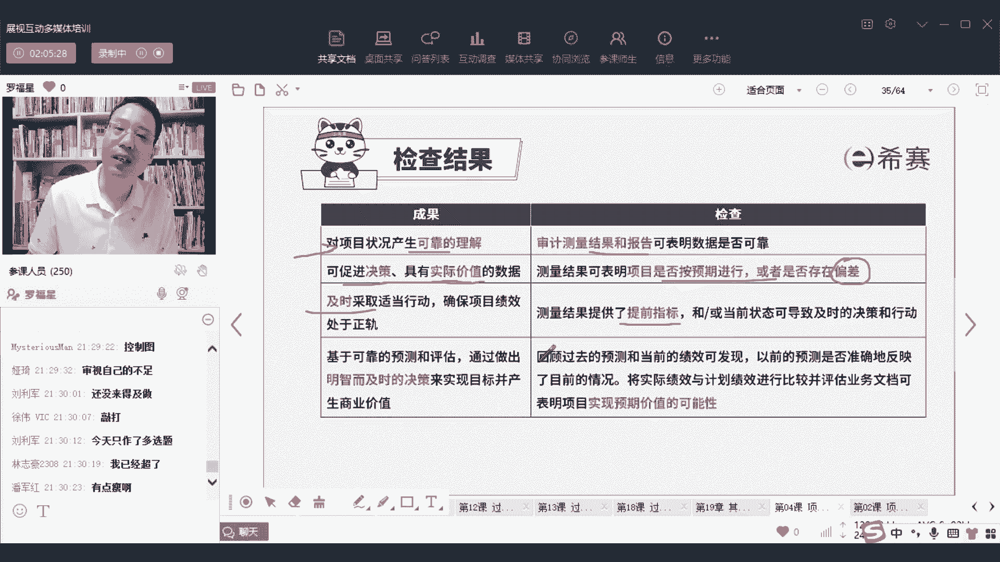

# 2024年项目管理PMP认证考试第六版／第七版／敏捷全套完整通关精讲合集 - P77：【第七版8大绩效域】07测量绩效域-下 - PMP课堂 - BV1UNbsemECS

除了有测量这些东西以外呢，接下来我们还有一个叫展现，展现呢会讲一个词叫仪表盘，我们前面其实已经学过一个词，叫信息发射源对吧，有一个信息发射源就是用看板的方式，有一看板能够让你去看到这东西。

那接下来会看到这应该叫仪表盘，那仪表盘它是个什么状态呢，这是一个参考啊，这是一个仪表盘参考，就是你在开车的时候的那些那些仪表盘，也就是你在看地铁上面的那些呃仪表盘哎，这是你在看什么什么东西的这些个东西。

OK他能够去展现这个项目的一些基本，各种各样的信息，就根据你的需要来去展现，其实把你们的周报呀，双周报呀，月报呀那些东西里面如果不要写那么细，不要写那么详细和具体，而把它写到稍微就是用一个表格的方式。

填写的方式，它就是一个仪表盘的方式能够去展现，至于说这个仪表盘该怎么样去设计，这是我们在教材上面的一个参考，你可以根据需要他说用颜色来去表示，但是你可以根据你的需要来，比方说A是情目前是什么状态啊。

是一个有顾虑的状态啊，B1事情目前是一个什么样的状态啊，在OK的状态，C事情目前是什么状态，这样的话就能够让他一目了然，并且呢关于仪表盘有的时候会用什么信号灯呐，就是用红灯红灯。

绿灯黄灯来去表示目前这个健康的情况呃，用就是类似这种都可以啊，那他其实仪表盘的焦点，就是描述状态的这样一个图表，OK就是一个描述状态图表，至于说到底信号灯是什么样子什么呃，横道图，饼干图，控制图。

你不用去太仔细的去关关注它，你要用的时候你自然就会学的，就你要用的时候，你自然就会这里只是给到你一个思路，就是这些东西都算到仪表盘，就是说包括我们的这个用用project来去画的，这个甘特图。

它也是属于仪表盘，是这个意思啊，然后呢再就是有个叫信息发射源，信息发射源他说是一个大型的可见的图表，就是大的可见的图表，其实就是信息发射源，那它它有什么好处呢，用可见的方式让大家都能够知道这个信息。

就避免了，有一些人对这东西是不太清晰和了解的，并且呢他最好是能够用，他可以用那种低科和低科技高触感的方式，也就是你可以用一个白板，用一个看板啊，用一个白用，用一个黑板，你直接用一个黑板啊。

你直接可以用一个黑板的这种方式，也是可以的啊，啊这里一个错别字，然极图还真的是一个错别字好，然后呢，呃他可以直接是用一个黑板的这种方式，来去做这些事情，并且是容易更新时间去更新，天天去更新。

然后再还一个呃，这就是这就是燃尽图，这就是燃起图对吧，这个我们前面讲过了，不再去花时间赘述了啊，不再去赘述啊，燃烧图其实就是燃气图和燃尽图，那燃烧图它能够去展现我们的这个情况。

不管你是燃烧殆尽还是燃烧起来哎都可以啊，那还有一个图呢是说是呃叫什么叫叫风险日志，其实这种风险日志就是给你描述，我们不是有一个叫风险的登记册吗，在风险登记册里面会写上这些风险啊，日期啊，什么可能性啊。

什么应对措施啊，负责人呐，应对结果怎么样啊等等，哎这就是一个也是一个发射源，你如果能够把这个风险表格，也拉一张大大的黑板，把它挂起来，那么就是大家都可以看见就更好，OK好，还有一个词叫目视管理。

目视管理其实也就是信息发射源，OK在精益环境中，他说信息发射源也被称为目视管理，所以其实就是一个词啊，只是因为这些人比较骚，比较闷骚，所以他才会想到一些新鲜的词汇来去表示，其实就是燃尽图。

OK他用目视管理的方式，能够看到跟实际的情况来对比，我们是我们做的怎么样啊，就跟计划情况来对比对比，看做的怎么样，不管是用任务版也好，燃燃尽图，燃起图也好，或者其他一些什么图也好。

都都是OK的啊啊这是所谓的目视管理，我们刚已经是稍微看过了，他这里给了一个词叫蜂拥模式，什么意思呢，他说如果看满中的某一些任务，接近在制品的极限的时候限制他，如果团队什么什么样的话。

我们可以用蜂拥的模式，什么意思呢，就是如果这东西太累党，我们就一拥而上，一起来去把它快速解决，就是你可以把它理解为，说是我们集中力量办大事，一起去集中力量办大事，快速去搞定一个事情。

因为这个逻辑就可以了啊，因为前面讲过了，不再去花大量时间好，这里有几个测量的陷阱来给大家稍微提一嘴，考试基本上应我相信也不会考的，你稍微提一嘴，首先有个叫或三效应，或三效应是什么意思呢，或三效应其实是。

其实是即使在一个地方做了一些，一些科学家和心理学家一起，共同去给在一些工厂做一些测试，他测试的时候会发现这样一个情况，就是如果说你会发现你要盯着那个呃翠花啊，小五啊，铁蛋呐。

呃狗剩啊等等这些人去测量的时候呢，他们的表现就会跟平常有点不相同，就是当人们发现自己是被观察对象的时候，他会改变他的一些行为，他会可能会变得更加积极，更加乐观，更加具体，更加那个因为他不想要丢脸。

不想要觉得自己是团队那个拉后腿的，什么什么之类的，所以有的时候某一些测量的方式或者东西，他会能够去改变人的行为，会改变人的行为啊，这是这样一个啊，这是货散效应，稍微认识一下，还有一种叫虚荣指标。

什么叫虚荣指标，就某一些指标，它看上去虽然酷，但其实没其实并不是代表真实情况，比方说有人就经常会喜欢说啊，我们的网站今天的那个，比方说假如说你今天开了一个抖，我假如说我今天看了一个抖音直播。

所以今天有多少人过来听呢，呀啊有500人来听，有500人吗，其实很多人涌进来以后，只停留了三秒钟，马上就走掉了，对不对，掉头就走，那么其实那些指标就无价值无意义，那你不如说大家停留时间。

你在我这个直播间停留了多长时间，这才是有价值有意义的指标，你搞那种虚荣指标没有什么卵用，就这个意思，所以他说某一些网站的访问量，其实这个东西并没有什么用，有的时候也有可能是因为某一些什么。

什么东西导致的，唉，但是你说如果有新增的访问量，或大家停留时间诶，这是有用的好，还有一个指标他说是士气低落，他说呃，设定拓展性的目标和激励人心的，这样一些测量指标是可以去接受的。

但是如果说你做的东西是无法实现的一些指标，他可能反而会导致士气低落，什么叫反而会导致士气低落，就是说，如果你明明知道老板给你画的这个饼，是实现不了的饼，你还会去拼命努力吗，你就不会了，对不对。

甚至有有可能会有可能就是如果说一个工作室，你发现你怎么努力，你也干不上的，你可能就会越来越down，所以在这里，我再来跟你分享一个很有价值的内容，帮那个听懂的同学帮我敲四个字叫持续小赢。

持续小赢就是你今天你有一点点事情做成了哇，哦明天有一点点事情做成了哇，哦后天有一点点事情做成了哇哦，每一天有一点事情做成了wow，持续小赢，这样的话你会变得越来越自信，越来越自信，越来越自信，明白吗。

所以你不要给自己定一个那么大的目标，有些人说啊，老师那个880视频太多了，没人让你一天看完呢，你一天看完你也记不住呀，也也学不会呀，你一天看一点，一天看一遍，一天看一段，一天看一段嘛，你去持续小赢啊。

OK对不对，你每一天能够做成一件事情，这样的话你士气，整个你自己的状态会越来越好，你同事的状态也会越来越好，OK好这里还有个说误用测量指标，就是某一些测量指标本来不是干这个用的，你却看了干了这个用。

那这个就是就是就是完全是搞错了，还有一个说是某一些偏见，他说倾向于找一些自己呃，这样倾向于寻找，并且去看到一些支持我们原有观点的信息，这是什么意思呢，就是如果说你买了一件新衣服。

你觉得哇我这件衣服真的是很好诶，你买了辆新车，你说哇我这车真的是很不错诶，然后如果说你搞了一个什么什么新的东西，你就说哇哦这个东西真的很好，就会觉得自己做的决策是很英明的。

你会倾向于去论证自己觉得很英明的，包括说你再去，你你你你你开车的时候选了一条车道，你说哇幸好我选了这条道路，你看我选的多多么英明，类似这样的一种方式，人有时候有这种习惯，他说这是一种偏见。

OK这是一种偏见，还有一个说相关性和因果的关系，有些东西它是有相关性，有些东西它是有因果，你不要把相关性和因果给搞上搞上搞混淆，你不要说是因为进度落后，所以成本超支或因为成本超支。

所以进度落后什么什么之类的，唉这就是无价主义，但考试应该不会考它啊，你只要知道还有一个测量陷阱是什么，测量还有一个测量线，你就说测量并不会让你得到结果，测量它只会让你看到这个目前的状态。

就说嗯有人说我报了一个什么段那个健身班，怎么还没有瘦下来，为什么没瘦下来，你从来没来过呀，我还要来的吗，哈你不来怎么瘦下来，对不对，好这里还有说对绩效测量的这个诊断啊，就是你哎这里面认识一个词叫什么。

让我看一下啊，呼容许偏差来帮我敲一个词，叫容许偏差，容许偏差，听懂的同学帮我敲，容许容许包容的容，容许偏差就是我们对于一个东西，我们其实会设定一个容许偏差，你在这个东西之内，我都是觉得可以接受的。

你超出这个东西，那么对不起，要去报告给领导，所以他会有个临界值，你如果说是在这个临界值以内的话，其实都没关系，OKOK没必要紧，不要紧不要紧，但你超出来的话，那你就要弄就要做一些例外。

OK就是在某些类之类的话都是OK的，但是超出的话呢，就可能需要有一些例外的方式来去应对，你需要去报告给领导们来去应对，哎，这就是关于诊断的故障，就是你会有一点点偏差范围内，对不对，允许多一点点少一点。

如果说太多的话，那对不起，那就需要去找领导们来来如何如何，那就有这个思路啊，你只要记得这个思路就够了，呃，我们整个测量的目标是什么呢，所有测量的目标都是为了学习，都是为了成长，都是为了进步。

所以我们上一次在那做了一个做一个期中测试，其中其中，其实期中测试不是为了去打击你的自信，期中测试也是能够让你去看到发现哦，原来我还可以加油，我还有那么多进步的空间哇，简直太棒了呢，就这个意思啊。

所以通过测量其实是能够让我们去知道，我们还有一些学习和进步的空间啊，我们所有要去做测量都是为了去优化效率，提升效率，我们去降本增效，OK他只应该去测量和报告一些信息，来方便我们干嘛。

方便我们说诶还可以让我们更好的学习，能够去推动我们去决策，然后去让我们在某些方面，如何如何避免一些问题，然后防止什么什么绩效下降，所以时不时的去测一测自己，让自己知道自己现在的状态，像我现在的话。

我就经常测一下自己体重不能够超过150，再超过150就太就穿衣服就显得不好看了，就类似这个意思啊，那么整个测量这个东西讲完以后呢，最后我们来看一下整个测量结果，那测量结果中。

首先第一个就是对于项目的健康状况的测量，一定是测量这个结果，看他目前是不是OK来发现是OK还是不OK，还有一个呢就是呃他说什么关于决策呀，实际价值的数据呀，其实我们是会看他目前的状态。

是不是按照记下来进行有偏差分析，趋势分析，看他是不是按照状态来进行，还有就是说采取措施，其实一定是做一些什么提前指标来去指导，接下来我们应该怎么弄呃，提前弄啊，该该该怎么弄，然后还有就是做明智决策。

是对未来进行测量，基于未来测量。