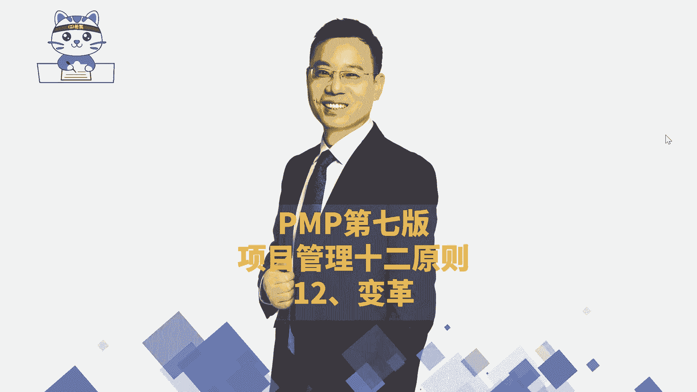
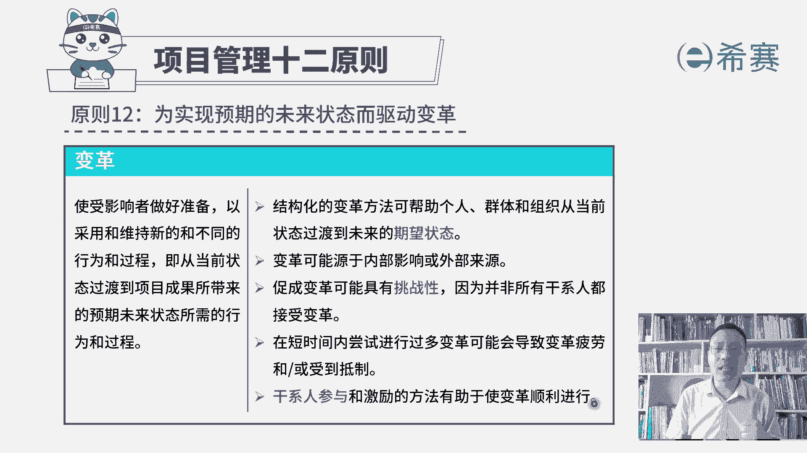
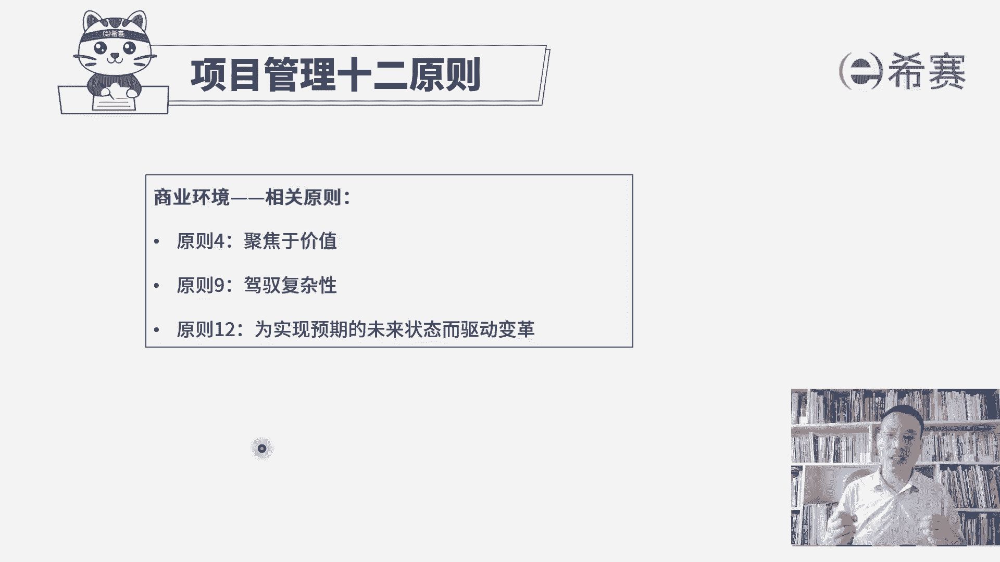

# 2024年项目管理PMP认证考试第六版／第七版／敏捷全套完整通关精讲合集 - P56：【第七版十二原则】12变革 - PMP课堂 - BV1UNbsemECS

大家好，接下来我们继续分享的是，项目管理12原则中的最后一条，叫为实现预期未来状态而驱动变革，首先我们得要知道为什么需要去变革，一定是因为原有的这样一种方式，它不太能够去解决好现有的这样一个问题。

所以我们才需要去发生一种改变，发生一些变革来去应对新的情况，如果说原有的这样一种方式和方法，他完全能够去应对所有的情形，那么其实就犯不着需要去变革，对不对，而变革本身一定是很痛苦的，变革一定是痛苦的啊。

因为把你从原来熟悉的这种操作模式，转到一种全新的陌生的操作模式的时候，你会有很多的不确定性，会有很多的不安全感，但是依然为了实现公司的这个预期，未来状态还是要去驱动变革，我们来看一下。

首先关于变革是使受影响者要做好准备，以采用和维持新的和不同的，这样一些行为和过程，也就是从当前状态过渡到项目成果所带来的，这样一个未来预期状态，我们所需要的这样一些行为和过程，其实他在讲什么叫变革。

变革呢，我们首先要去做好一些准备性的措施，让大家能够知道啊，我们要去变革了，并且呢愿意去接受这种新的变革的这种方，式和方法，那么这里有这样几条，我们一一来去解读一下啊，结构化的变革方法，可以帮助个人。

群体和组织，从当前的状态过渡到未来的期望状态，首先得要知道一下什么叫结构化变革的方法，也就是说不是那种东一榔头，西一棒子的方式来去改革，而是有方法，有步骤的，第一步，第二步，第三步。

第四步的这种方式来去做革新，那么这种方式的话呢，大家虽然在做的事情也是一些全新的事情，也会有很多的不确定性不安全感，但是他知道这个事情，只要按照这种结构化步骤方式123。

那么未来就可以变到一个更好的一个状态，大家接受程度就会更多一些，所以这是结构化的方法，第一步，第二步，第三步的方式，它能够让我们的变革变得更加的顺遂，第二个呢变革可能是源于内部的影响。

也可能是源于外部的影响，就有可能是外部环境发生一些调整和改变以后，迫使我们去变革，我们现在这样一个方法论变革，我们现有这样一个工作情况和状态，但是也有可能是自己未雨绸缪，提前识别到有什么样一些危机。

或者说应对未来可能的情况，我们知道鸡蛋从外部打开，它是一道菜，那么如果说是鸡蛋从内部打开呢，唉它是一个新生，所以有的时候我们的变革是为了能够活得更好，活得更久，要么变，要么死，那你就宁愿要发生变革。

好再一句，促成变革可能具有挑战性，因为并非所有的干系人都愿意去接受变革，这个其实很好理解啊，在心理学这个领域中呢，有这样一个话，我今天也想要分享给在座各位，你回头可以去思考一下。

我们是宁愿受苦也不愿改变，绝大部分人啊宁愿受苦也不愿改变，因为那种受苦他是一种已经习惯了，已经是习以为常，但是这种改变呢是面对太多的不确定性，一种新的东西的时候，他心里面会更加的惶恐。

所以变革本身其实就有挑战性，但是有一些人他更勇敢，他更高瞻远瞩，他能够看到未来的方向，所以他才会愿意去提倡变革，倡导变革，但是一定会有人去阻止，为什么，因为他一方面是对未来这种方式有不确定。

还有一方面是他的利益可能受到一些影响，所以他不太能够接受这种变革，所以你会发现，如果说真的要做好变革，基本上是从上往下的这种方式变，而不太可能说是自下而上的这种方式去变，自下而上的这种方式。

就是在企业中啊，自下而上的这种方式去变个几乎不太行，别人不太会去支持和接受，好在还有一条，在短时间内尝试进行过多的变革，可能会导致变革疲劳，并且是受到抵制，你想一想嘛，本身变革就已经很辛苦了。

你还三天两头变，三天两头变，没个长性，那当然谁受得了，对不对，谁受得了啊，最后还有一句，干系人参与和激励的方法，都有助于使变革顺利的进行，其实既然是需要变革，肯定是大家都需要去接受一种新的方式。

不管是公司内部的高层，中层管理岗底下的工作人员，还包括说某的某一些客户，他可能都会需要去，对我们原有的这种工作状态呀，成果的交付啊，都要去有一些调整和改变，那如果大家更好的去支持的话呢。

肯定这个事情会变得更加的顺遂。

所以第12条原则是，为了实现预期的未来状态而去驱动变革，他会希望是达到一种期望的未来状态，但是因为种种原因导致原有的这些方法论，原有的这样一些个措施，他得不到，所以才是被动的需要去发生一些变革。

但是在这里我要特别提醒一下啊，不是说每一个公司都非得要去发生变革，如果你现在正好是做的好好的，那你就是继续就可以了，只有当发生一些影响的时候，或者说是现在有影响，或是未来有影响的时候，我们才去发生变革。

OK那整个变革管理呢，它是一个综合性的周期性的和解结构化的方法，而不是一个过程，就它不是随随便便做的东西，它其实是要预谋已久，能够这一步一步的去往前推进，才是一个比较好的一个状态，并且所谓的叫周期性。

你会发现其实我们小的时候学那种计算机，有一个叫摩尔定律对吧，每18个月，然后这个芯片它的这种大小呢就会减一半，他的这种算力呢就会增加一倍啊，那么实际上是这个变革次一直在持续发生的，就很多行业。

很多领域它也许没有芯片这么的这样一个规律，但是呢基本上都是在不断调整和变化的过程中，那我们需要去迎合或是适应，甚至去引领这样一个变革，内部的影响可能会导致变革，那外部影响也可能会去导致变革，促成变革。

它是有挑战性的，不是每个人都接受变革，尤其是当你的利益受到影响的时候，以及当你是一种那种心性，觉得说我就希望说是按部就班的去做事情，不要改来改去的时候，你都会去拒绝这个变革，尤其是经常发生变革的话。

它也会导致很多人去有反感，还有说变革速度，它需要适应干系人和环境，接受变革的意愿，成本和能力，也就是说如果你变得太快，大家跟不上，那么这个变革估计啊也就是死翘翘就是失败的。

所以干系人参与和激励的这些方法，它是有助于变革并且顺利的进行，也就是关于变革，那我们关于项目管理的12条原则呢，就已经是给大家简单的去讲，到这里，我们最后来做一个简单的回顾啊，呃一共这12条原则。

我们稍微做了一个划分，首先是跟人相关的这些个原则，第一条原则，成为一个勤勉的尊重和关心他人的管家，你具有管家精神，这是涉及到人这个维度的，这一个项目管理原则好，第二个呢营造协作的项目团队环境。

这是关于团队要去协作的这样一个原则，也是人，第三个呢是有效的干系人参与，能够去让干系人更好的去支持，减少他的抵制，这也是关于人的这样一个原则，然后第六条展现领导力的行为，让兄弟们给我胜，让兄弟们跟我上。

那领导力呢不仅仅是项目经理才具备的，其实每一个工作人员都应该具有一定的领导力，能够去影响他人，一起把事情往前有效的推进，这是项目管理12原则中的，这个关于人的这个板块。

然后接下来呢是关于过程的这些相关原则，第五条原则中要去识别评估和影响系统交互，我们说整个项目是一个大的系统，它里面涉及到那么多的过程，那么多的这些个知识域，那我们在做项目的过程中。

我们要去识别各种我们和这个系统之间呢，系统内部和内部之间呢，他们这种勾连交互其实就是一个整合管理，需要去通盘全局的考虑这个事情好，第七条原则，根据环境来进行裁剪，我们也用了一个词叫取舍。

就是每一个项目都有它自身的独特性，那我们需要去根据自身的独特性，来对于所用的这些工具呀，这些个知识欲呀，所用的这些个方法呀，来进行适当的裁剪和取舍好，第八条原则，是将质量融入到过程和可交付成果中。

我们做的东西最后是需要去交付给别人，给别人去使用的，如果质量都不过关，那对方肯定是不会验收，并且呢也没有办法去好好的使用，所以质量一定是极其重要的，我们需要去规划质量管理，需要去管理质量。

需要去控制质量，第十条原则，优化风险应对，在做项目的过程中，风险是无处不在，风险是一个不确定的事件或条件，它发生以后可能对项目有负面的影响，或者有正面的影响，我们的风险管理。

就是要想办法让这个正向的影响变得更大，让负面影响变得更深更低，这样的话能够让项目是可控的状态，去优化风险应对，第11条原则，拥抱适应性和任性，我们在做项目的过程中，如果说是一种很多不确定的嗯。

尤其是敏捷这种环境，那我们需要去拥抱变化，拥抱适应性，并且在做项目的过程中呢，其实各种各样的情形都有可能会发生，我们也可能会发现那种什么进度有落后呀，成本有超支啊，项目的那个整个氛围是士气很低落呀。

我们需要有韧性，能够弹回来，能够回到原有的一个好的状态，继续往前进，这是关于过程的这些相关原则，那在接下来呢，我们看到是关于商业环境的一些原则，首先一条最重要的是原则四，聚焦于价值。

我们在整个项目管理中，我们做的这个项目本身它一定是有价值的，他要么是有这样一个无形价值，要么是有有形价值，它的有形价值加上无形价值，是能够让我们觉得值得，如果说一旦发现这个项目是不值得，理论上来讲。

应该是要及时叫停，及时止损，这是一方面，还一方面呢，我们在后面会学敏捷的时候，他会把这些要做的事情按照价值来排序，优先做最高的价值的，然后再其次，然后再再一次，那我们要去聚焦于价值。

是关注整体的这个商业环境，关注整个项目的一个价值好，第九个原则叫有驾驭复杂性，我们说这是一个无卡的时代，有太多的这样一个不确定性，复杂性，易变性和模糊性，那么在这种情况下做项目呢，其实没有那么的容易。

但是我们需要去知道复杂性是从何而来，当你作为一个老手的时候，作为老司机的时候，你才能够更好的去驾驭这样一个复杂性，驾驭这些个乌卡，最后一条原则，为实现预期的未来状态而驱动变革。

它讲的是我们要去发生一些变革，为什么要变革，是因为原有的方式，原有的方法论，它可能不能够有效地去解决现在的这些问题，所以我们才需要去用变革的方式来，去用新的方法解决新的问题，如果说不发生变化。

有可能是持续走下坡路而发生变化呢，还会有一线生机，所以你才会说，为实现预期的未来状态而驱动变革，并且我们也讲变革一般是自上而下的这种方式，变革会更容易成功，而如果一个公司。

你是自下而上的这种方式去做变革，这是在干什么，这是在造反，你就不太好了好，那我们对于项目管理的12条原则呢，就做了一个简单的分享，事实上这些原则，他是去指导我们去如何有效的管理项目。

它几乎能够适用于绝大部分的这样一个，场景的项目，我们具体的真正做项目呢，它其实还是要用到我们前面学的这些个，五大过程组啊，十大知识领域啊，49个过程呢包括后面的这些个呃，敏捷项目管理中的这一段的实践呢。

呃那个敏捷阶段框架的实践呢，一些其他的实践呢等等，但是这些大方向的原则性的东西，它会是对我们做一个大的一个指导好，那么关于项目管理原则呢就简单分享到这里。

