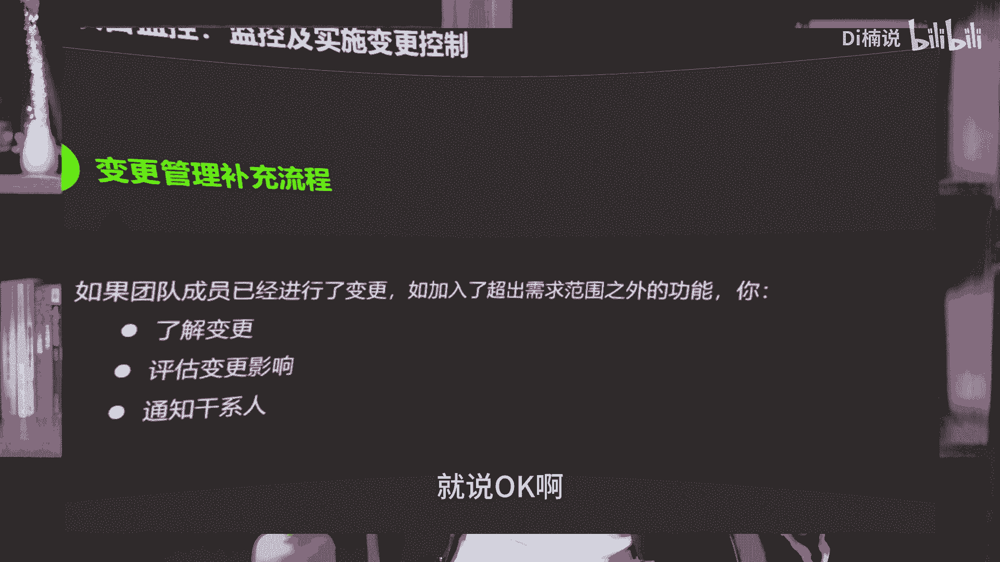

# 2024最新系列课-第2讲-项目整合管理02：快速入手30分钟 - P1 - Di楠说 - BV1ox421y7Ex

大家好，欢迎来到丁当说，然后我们今天继续讲，我们这个项目管理专栏模块，然后我们上一次讲到说我们用美式的项目管理，叫PMP，然后它有十大过程组诶，呃十大知识领域，五大过程组。

然后怎么在我们日常生活中能够把它用起来，当然这些工作体系啊，知识体系比较庞杂，然后我如果把每一件事情都按照，这种庞大的体系去做，太复杂了，所以我本人把十大知识领域，跟五大公主糅合了几个几个内容。

然后作为我们的工作分享，然后我也把他的工作在我的职场中，利用项目管理这个理论，然后从员工端正式跨越到了这个管理端，所以我还是觉得说呃既然我自己有一些收获，我还是把我自己学到一些东西，本地化一些。

然后的话说人话一些，然后能不能对大家有些帮助，所以我们继续在讲我们这个系列讲第二讲，整合管理的第二次，然后我们申请的整合管理，他其实大概讲了一些基本的知识面，比如说我们其实有美式管理呀。

英式项目管理啊等等一系列，我们也讲了一下什么矩阵式呀，纯职能职能式呀这些东西，所以我们今天就开启了，我们这个PPT的这个第二个目录叫消防整合管理，项目整合管理，我们本身大概我自己毕竟官网。

人家官方这块儿有一套架构，所以我尽可能还是别特别打乱人家这个节奏，要不然大家觉得说我自己再造一套体系，所以我尽可能还是按照官方的这个知识结构，然后再加上我自己的理解把它讲明白，整合管理其实分。

因为整合管理我们上次在第一讲的时候讲过，他的这个大点里面会只有整合管理，是跨度五大过程组的，所以说我们在PPT的内容也展示了，说整个话题它是从通过项目启动，规划执行监控收尾，它都有内容去在在输出。

然后我的内容里面会第一块讲项目启动，叫项目论证，我们首先看看项目论证里面到底讲了什么内容，然后相关论证的话，因为我自己，当然我这是我们公司内部其实做了一些，做了一些相关的规划啊。

然后的话我自己内部里面会说，你想落地项目管理的相关体系，你的文档体系势必在前期导入的时候，它需要很大的帮助，为啥呢，因为只有文档，才能把事情能够形象化的展示出来，要不然的话，你怎么能够让呃不懂相关的人。

来把相关人做好的，所以我项目启动里面的话，在整合里面我增加造了一个百利呃，十大呃表单，然后第一个叫项目论证书，当然项目论证书说实话呃更多的你说哎呀，我做一个小项目还得写个论证方案吗。

那倒不至于他其实更多的还是你从你脑子里面，或者通过项目组里面这件事情值不值得干，你要过一小事情，大家大家知道，你说你假期去哪玩啊，你肯定是小孩哪去过哪没去过，要不要去啊，怎么着。

其实过一半脑子更多也就是先不论正，当然大型项目在企业立项之前，确实是有必要论证一下，到不一定非得说论证就得论证他做或不做，一般项目在立项的支出一般都确定做了更多的，还是这么说唉这些事情做是的范围啊。

边界啊，他有时候在这里面就需要需要去这个思考，所以说我们当年在公司内部里面说，OK项目论证书随着项目的大小，要求程度也不一样，但它确实是我十大表单之首，叫项目证证书，当然官方大概会举这个定义。

比如说啊正式批准的，并授权项目经理在活动中使用的什么组织文件，哎呀这个一听就是不说人话，当然咱也不能说下官方不说人话，因为官方这种成体系的，他都会以这种比较规范的语言去描述。

当然我们内部其实大概就会把官方的说一下，之后，更多的还是还是有一句话在提醒自己，就是仓促立性的，你是否能够接受随之而来的各种变化，如果说你觉得做项目总来变现，变现很烦。

那你就要重视在立项之初要有项目招生书，当然我们这个叫智能项目征征程，我自己会感觉这个随你的项目大小，随你本人做项目的节奏，你自己有意识的做就行，并不一定非得科班的做做做的东西。

当然我后期也会把这些文件给大家分享，比如说表单里面那些内容，我不会把表单直接发给大家，直接下载，我更多是把表单样式给大家看，如果大家觉得感兴趣，大家自己最好还是做一遍，大家大家说一下，我就不想做。

后期我逐渐的把这些文件发给大家，我还是期望我说，如果你想学到东西，你还愿意付出一些时间成本，有了成本之后，你可能有些自己的收获，所以这一块我们大概就是项目征程这块内容，当然我还写了什么沉没成本啊。

机会成本啊，这些都是一些时间概念啊，一些一些专专门专用的术语，这个大家理解一下，因为这个有时候在先锋中，日常生活中或者工作中会进行对话，什么成本成本，机会成本呀，我又解释了一下。

然后的话这个是我们心目论证这一块，大家来说就这么简单吗，官方确实比较多，我自己把这件事情弱化了一下，我认为项目启动论证就过个脑子，然后有个表单就行了，至于讲的那么深，我觉得大家也不愿意听。

我在工作中确实给很多人培训这个项目管理，很多人都听听着比较嗯，比较容易容易睡着，就不愿意学那么科班的，所以我这一版的培训文件，在我内部当年做员工跨越管理，成立项目管理办公室的时候。

我的文件迭代大概迭代了两到3年，然后的话也做了好多版本，我现在用的这个版本是最简化一个版本，所以我们项目启动大概讲这么多，然后第二块叫项目规划，叫制定项目管理计划，说实话大多数都是在这块内容。

这块内容说实话相对比较多一些，所以我的利润大概会写了一下，说其实你刚刚说了，如果仓促立项的，你你肯定是不愿意接受各种变化的，那你就不要仓促立项，所以说你在规划阶段里面的话，你就大概要做一些核心文件的。

比如说时间大概给多长时间能做完里程碑，这个都要做，大家这里面也有一些文件，我后期也给大家大家去分享，我在课程中也给大家展示一下啊，然后这块里面的话，我们大概当然这个就是官方。

所以说相关管理计划什么产生一份相关联计划，该计划变更需要有什么实施变更主体啊，这个这个都太细碎了，我就不读文字了，大家有兴趣，我在视频里面也会展示一些官方的这个内容，大家大概看一下，然后我在计划里面。

后期会有一系列的计划文件给大家分享，所以说制定新闻管理计划，更多的我自己感觉还是想说，如果在项目论证阶段，你大概过了脑子，这个项目值得干，也有些收获，没啥问题，基本的范围边界大概脑子过一遍都有。

O那你在制定项目计划的时候，按照项目计划的一些呃官方的文件，或者是你项目组内部，本地化了一些项目管理的一些文件，然后你把它计划制定出来，我们内部有时间计划，有里程碑计划，也有什么范围计划，有很多计划。

这个里面我在一会展示的给大家展示，然后在整合管理里面，他捡到的这个制定管理计划，更多的是你在项目立项的支出吧，大概有个参考物，两个项目整合管理经，第三个叫指导与管理项目工作，他的内容说实话。

官方也给了叫执领导，执行协同管理计划确定的工作，为啥呢，因为你进入执行阶段了，怎么执行呢，按计划执行是吧，这个大家都知道为啥要做计划呢，就是因为你对于很多未知的东西，你多几个节奏感。

所以说你遵守了很多计划，那你直接干嘛，直接给你按照计划执行来说，计划赶不上变化呀，计划赶不上变化，就要在监控阶段进行变更计划，但是你说不能说天天变更计划，那就说明你计划做的不对，所以说在执行阶段里面。

更多官方也是先叫领导并执行项目管理计划，执行批准的变更，要求达到项目目标是最快，也有一个叫变更的概念，所以说他的指导与项目管理工作，大概是这一块的内容，然后这块里面说大家说执行的东西大概有什么。

刚刚说了要经过批准的变更，为啥，因为计划可能改变化，变更有几种方式，我这块举了三种，第一种叫纠正措施，第二个就是预防，第三个缺陷纠正更多的是啥意思，就是你实际马上执行，发现灯珠显得有点理所当然了。

所以说你的绩效重复一些计划，重新有目的，这个重新稍微纠正一下偏差，平台稍微纠正下去呀，问题不太大，还有一些是预防性措施，就是为了保证项目在未来能够符合你的工作，然而你又变更了一些，为啥。

因为你随着执行之前的开展，确实有些东西，你你的这个项目计划的一些认知，可能会更多一些，所以有些预防措施，当然缺陷就是纠正下不符合标准的，这个官方官方官方也有一个解释啊，所以变更有纠正，预防缺陷各有差异。

这个如果在字面上去解释的话，很多人汉字都认识，但具体工作中里面到底怎么举个例子算是纠正，虽然预防算是缺陷，我自己大家我觉得大家去呃掰扯一些概念，大家也可以去聊一些，当然我自己反而因为你在日常生活中。

这些项目中，我觉得先把概念弱化掉，你自己会认为他对对就OK，然后既然我们学美学管理，他只给我们一种参考，所以我自己会认为纠正更多的是你的计划里面，大体上都对，在局部细节上确有一些问题。

所以我会你再稍微变更一下，预防更多的是啥呢，就是你自己的计划都没啥问题，但计划都有点粗，再补充一些计划，再添加一些，就并不是纠正他是一个天降的意见，缺陷上计划是错的，直接否定，重重新把计划制定一遍。

所以我自己大概是这个对应的方式啊，然后我们后期在每一个知识领域解完之后，我们会有一个案例解析，当然案例解析有时候可能我举一些例子，可能大家不一定听得懂，我尽可能举一些生活中的例子，到时候我们再看。

然后我们先把理论课件铺完，然后的话现在的指导与管理工作。

说实话确实有一个叫交付物，当然这个交付我自己会认为其实就是因为啥，因为大家都知道项目有这种工人资产，他说诶过程资产啥意思，就是它其实是项目管理里面提出一个概念，就是你在项目过程中。

产生了一些各种各类型的文件，各种各型的阶段性成果，都会归到项目过程资产，然而这些对于你们后期项目复盘呀，甚至把这个项目分享给另一个人呀，都有一些帮助，我们内部其实有一个项目管理的系统。

然后每个项目从立项到项目计划的文件，到项目过程的一些产出文件，到接口文件，都有一些文件去管理，所以说项目管理在美食节的时候，他会这样说，项目执行阶段里面会产生很多项目成果，把这些成果要有序的组织起来。

然后做成项目的一部分，所以这个大概也有一个项目内容，然后变更里面有集中措施啊，这个里面是变更请求，他会说项目大了，你不能项目经理随便变，甚至是一个干些人也不能随便变，你需要有发起请求再审核请求。

在这个过程我觉得这个因人而异，一大项目的大小而异，这个大家就不用嗯升高上线，所以我这个小项目也要搞这种审核流程，大家都知道审核很繁琐的，大家说你啥都别审核，你想变就变，变更成本太低，也不利于项目执行。

所以这个这个度，需要每个项目项目经理自己拿捏，所有变更请求啊，然后第四块的话，他捡到了说项目监控就是监控与实施变更控制，前面讲了指导与项目管理工作，第四个叫监控与实施项目管理，项目变更控制。

当然这个里面的话我自己写了个关键收益啊，前面人家官方定义，就是让干先生理解当前的项目状态，为啥因为你相当遇到问题，你肯定会跟人沟通嘛，诶这是这个干系人，另一个干系人，大家说干线是什么意思呢。

哎这就是为什么我把项目整合里面，把相同整合加盖先生一起去讲的，就是因为我觉得它里面有些东西是是是相通的，当然我们说项目整合是项目经理，唯一跨越五大工程组的，所以说干先生这块里面的话。

它本身是一个核心的一个知识领域，所以我一会再讲，干先生，大家就就先先先先简单知道一下这个事儿，当然我们的视频可以反复去听，然后第一版讲完学完概念再回来去听听，这节课可能会更更舒服一些啊。

所以说监控与实施项目变更，管理是干型理解增加状态，然后已经采取的低预算进度，预算都有个大概的一个认知进行其内啥，我们叫相互对齐或者季度对齐，大型的互联网公司，它有一些什么叫项目对接会，大概就这个意思。

我想因为有些事情是跨部门，跨端口的，很多事情，如果你项目不开阶段性里程碑，会不做项目对齐，会有时候谁做快了，谁做慢了，为什么项目有卡壳了，这个确实需要你监控的，所以说监控与实施项目管理控制。

更多的是把一些干些人的一些项目状态，大家对齐，这个大家有没有内容，当然这里面还有实习电工工作，从什么整体的角度考虑，再按照项目进展，大概都有一些官方论点，然后我们具体的官网的这些官方，这些这些这些字眼。

这些这些概念，结合你们公司的具体的工作，然后的话再结合你们的一些文件叫计划书，然后才能把这些东西更好落地，所以这个我也不读了，大家就大概理解一下，然后这里面有个变更的步骤，这个步骤我在内部里面。

说实话我觉得我还是比较重视他，为啥呢，因为任何一次变更说实话不是轻而易举的，你说太容易变更，我觉得那你就没必要做计划，你就呃车到山前必有路，干到啥啥就做啥呗，一旦你要严格的做监控，最好还是按照这个步骤。

第一评估影响为什么要变，变完之后时间增加了，会不会时间变慢了，钱的投入更多了，范围不可控了，还是谁是谁又怎么着了，所以说评估影响肯定是第一个，评估完变更影响之后，要制定对应的变更方案的制作方案。

毕竟方案完了，内部认可啥意思，就是肯定有个关键的策划小组，比如说项目经理亲自做，你自己先过了自己这一关，如果项目经理带几个核心干线人一起做，大家内部一些大众共识，小范围公司完了之后再得到你们有些边缘。

干些人，干线管理里边还有它有一些层级，就是有些是核心，有些是边缘，然后的话外国也要用口腔，因为跟他有关系，人家不配合你怎么办，所以说在变更里面一定要有这个步骤，评估影响制作方案，内部认可，外部认可。

这俩肯定都要做的，所以我们在整个管理里面，在监控这块里面，这个是给大家简单讲一下，然后这里面大家有一个补充步骤就OK呃，机器变更之后。

如果超出了需求范围之外呢，你怎么办呢，那你还意思吗，了解变更，评估变更运行，同时感觉其实思路是一样的，所以这也是美式里面他写的比较细的点，其实前面那一部有了之后，我们后面那一步其实也就没啥问题。

我觉得评估影响制作方案，另外不认可这个问题没问题，所以我后面讲的这个叫序变更，这俩其实是一样的，然后最后一个叫项目收尾阶段，由于项目收尾阶段，说实话就是很多时候很多项目很仓促，法正项目都结束了啊。

这个没啥问题，散吧怎么着，但是我上次在讲项目管理的开篇，然后再讲这个整合管理的一部分，也讲到了，这个，我内部还是对项目收益阶段不至于太过重视，当然我也有一个基本的项目验收会，为啥呢。

因为你总得一帮人一起干一件事，总得阶段性复盘一下吧，当然咱们现在有时候周工作，咱们也有写周报啊，当然很多人至少也比较繁琐，都很烦，这个我们现在内部还有日总结呢，每天也要写大家对你的一天的付款。

然后在项目管理里面，他对项目的方法也很重要，为啥呢，因为不管小项目，大项目当年之所以成立，他肯定是有初衷的，要不然不至于这个项目临时任务把任务做完了，不是个项目呀，基于既然是项目，就有明确的起给使嘛。

什么时候开始，什么时候结束，然后通过哪些人做，所以说你在收尾阶段还是要重视一下，因为项目整合管理对项目经理的要求比较高，所以项目经理本人要重视项目收尾，当然我那个时候因为既做项目经理。

也做项目管理办公室，也做项目监管，所以项目管理办公室是做公司，项目管理体系搭建的，所以我们公司内部所有的行为，就必须强制要求你项目经理要做结相会，哪怕很十几分钟，20分钟把大家叫到一块去。

简单的做一个复盘都可以，都要做，所以项目收尾阶段叫结束项目释放资源，大家说这个废话嘛，肯定要结束校门诶，他这个里面不是特别废话，就是它大概有一个意思，就是说项目必须有正式的流程，结项了。

所有感染人知道这个项目结束了，我就直接解散了，他说那个人肯定知道啊，不一定知道，因为有些概念认识的，他在项目中间阶段里面，他的工作完成，他已经结束了，但是你并不知道项目后期发挥有没有变更，有没有重调。

他不会二次跟你去对接，所以有些人心里面知道我给你配合一个事儿，但是我只是一个刺激感情人做一点事儿，项目想完成是所有人把活干完一起完成的，所以他也在期待说最后你有个正式结婚会哦，知道这个项目终于结束了。

我之前参与过这个项目，所以说项目在这个阶段里面有个关键的交付，大家在里面词叫关键收益总结，项目经验正式结束，项目释放组织资源，而组织资源啥意思呢，组资源包含用的设备，包含人的时间包含等等方方面面的。

凡是这些资源需要可以二次复用的，基本上都叫呃资源，比如说我今天正在录课，我今天占用了这个公司的会议室，占用了这个相机，那你这刻录完了，你得把相机还原归位，这个也叫失衡组织资源，所以大概大概有这么定义。

所以它的标题叫结束项目施工资源，当然这里面也有写这个重要项目逐步实施，怎么着审核审判，所以经验教训存档文件，这个就不多废话了，这里面更多的还是如果项目真的执行完了，项目经理有义务组织核心干型。

把项目文件进行归档，当然大家说公司没有要求啊，没有求作为你支持的里程碑，你也有意识的收集收集吗，为啥因为未来你的职场的技能提升呀，给别人分享呀，包括我今天的这些PPT，也是我好多年前做的。

如果今天给大家分享，我要重新写，那也不现实，是不是大家写PPT也挺烦的，所以你要把很多资源能够快速找到，有规范的把资源归档，所以这个大概也有这么一个步骤，大家简单说一下。

OK所以我们这节课核心讲了说整合管理，我人为的把它做了三个目录，一基本知识讲一下项目管理为什么重要呀，需要什么特种兵人才啊，然后项目管理有美式的呀，有英式的等等啊，然后项目管理还有一些什么矩阵式的呀。

职能式的这种组织结构呀，也讲了，第二块跟这个名字完全贴合的，整合管理就是整合管理，因为你原来这个知识点就只讲了第二部分，但是我又把干型融融进来了，所以我今天讲整合管理，就是把原本整合管理该讲的内容。

给大家讲了一下，然后我们大概回顾了整个里面有启动规划，执行监控收尾，因为只有整合管理跨度了五大工程组，当然我剪的很粗啊，官方那本书里面他讲的，如果说跟别人别的知识领域不跟对比，那个厚厚度的话。

整合管理的厚度也是别的职业领域的，大概三分之一四分之一，它的内容也偏简单，所以说如果我再讲讲，我再讲复杂，那就太太多了，所以这个更多的还是在基于后期的，每个知林展开之后可能会讲一下。

所以我今天把整合管理简单就给大家讲这么多，我自己认为整合管理确实能够让你的知识框架，让你快速的过一遍诶，做一个项目经理，最起码要关注启动规划，执行监控收尾，为啥，因为他是唯一跨越五大过程组的嘛。

这样的话让你心里有一杆秤，当然五大过程组不代表你的精力都是很多的，自己可以分配时间，比如说启动小项目，启动一把就很很很简单，执行很呃，很多规划也很简单，大项目启动在一点时间规划占很多时间。

执行占一部分时间，为啥这两个肯定是很重要的，所以说这个取决于你自己的拿捏，所以整合管理我们大概就这么多，OK谢谢大家。

