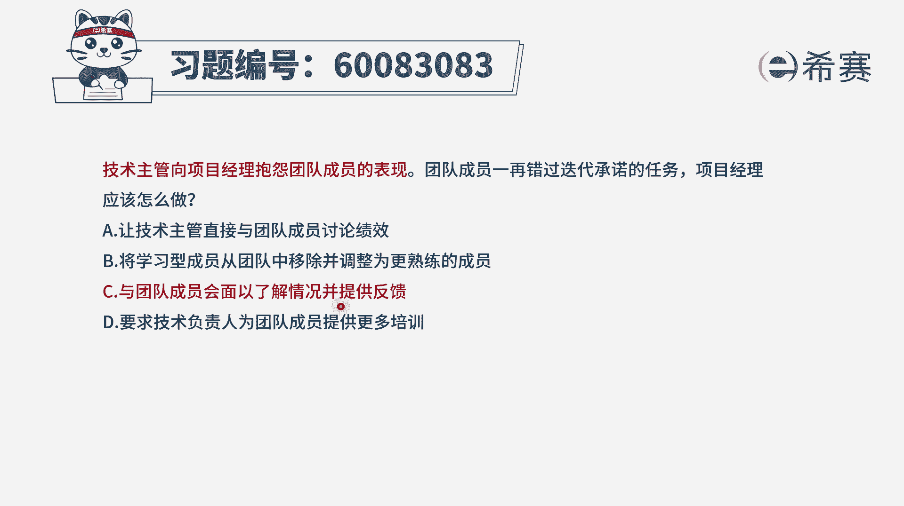
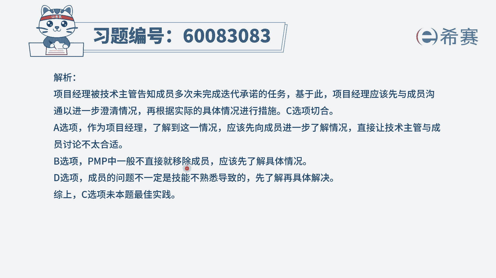

# 24年PMP-pmp项目管理零基础模拟题精讲视频，免费观看（含解析） - P15：15 - 冬x溪 - BV1Qs4y1M7qP

技术主管向项目经理报研团队成员的表现，团队成员一再错过迭代承诺的任务，项目经理应该怎么做，那通常情况下，我们一定是要先去了解情况，分析原因，然后再找寻解决方案，一般是这个逻辑对吧。

那我们就来看一下这个题目的四个选项，选项a让技术主管直接与团队成员来讨论绩效，那这种方式呢可能啊，有可能会伤害到这个团的成员，你应该是自己先去了解情况，然后再去跟他们去沟通啊，会更好一点。

好b选项将学习型的成员从团队中移除，并调整为更熟练的成员，那对于不符合pmi的这一套体系，pm中，我们一般不会轻易的放弃团的成员，如果说团成员有些地方表现的不好呢，我们是需要去帮助他成长。

给他提供培训的，所以这个不合适，c选项与团队成员会面，以了解情况并提供反馈，那也就是说我们现在要了解事情的情况，了解事情以后，然后再可能想到一些可能的解决方案，来去帮助到他好，最后一个选项。

要求技术负责人为团队成员提供更多的培训，这个事情其实通常情况下，是你作为项目经理要干的事情，因为这个时候这些人都已经放到你的团队中，你要去为他们去找寻更多的这些培训资源，你要来去为这个培训负责。

但你可以去邀请别人来帮你完成这个培训，但是整个培训的事情还是由你来负责，所以这样看下来，只有c选项是比较合适的，也就是团队成员表现不好，我们去了解情况，然后呢再去想解决方案，去帮助到他，那文字版解析。

