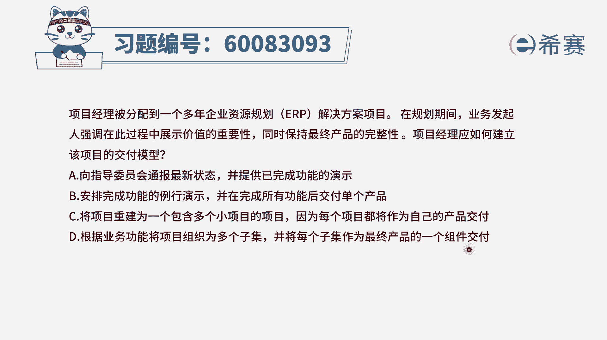
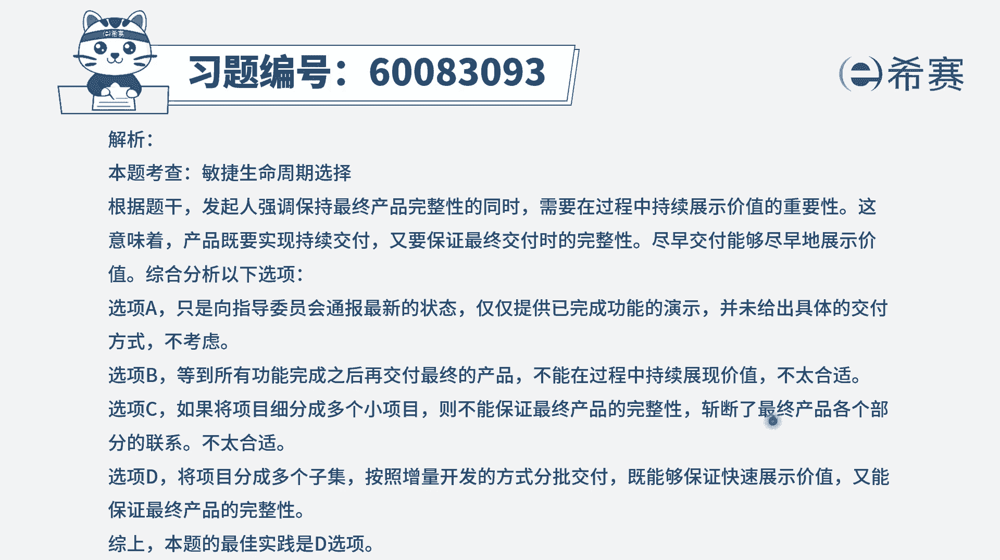

# 24年PMP-pmp项目管理零基础模拟题精讲视频，免费观看（含解析） - P18：18 - 冬x溪 - BV1Qs4y1M7qP

项目经理被分配到一个多年的企业资源规划，解决方案的相声，在规划期间，业务发起人强调，在此过程中要展示价值的重要性，同时呢要保持最终产品的完整性，所以这里有两个词，一个是价值的重要性。

一个是最终产品的完整性，项目经理应该如何建立该项目的交付模型，这个题目就算你没有学过项目管理知识，你就奔着关于价值的重要性和产品的完整性，你也可以通过排除的方式选出正确答案，我相信我们来看一下啊。

首先选项e向指导委员会来去通报最新的状态，诶这个没有问题，然后并提供已经完成功能的演示，这个也没有问题，但是你怎么样去达到一个完整性呢，他没有去强调，没有给出这样一个解决方案，所以不合适好。

第二个选项安排完成功能的这样一个例行演示，来来去展示他的这样一个价值好，那并且呢在完成所有功能后，交付单个产品，啥叫交付单个产品，你肯定是交付一个集合起来的，集成起来的完整的这样一个东西，对不对。

所以这个交付单个产品，它就没有符合你这个完整性的这个说法好，第三个选项，将项目重建为一个包含多个小项目的项目，因为每一个项目呢都将作为自己的产品交付，这很显然就去了这样一种完整性。

就把这个完整性给割得支离破碎不合适，最后一个选项，根据业务功能将项目组织分为多个子集，并且呢将每一个子集作为最终产品的一个组件，来进行交付，那这种方式呢它其实就是说我们这个事情很淡，我把它分成很多块。

每一块一块的去做，那这种方式就能够更快的去展现所谓的价值，也能够很快的去交付价值，同时呢每一个子线的这一个产品，作为最终产生一个组件，组件就是组成部分，其实又是最后给了一个完整的东西，又回到了完整性。

所以只有d选项，它既讲到了关于这些东西，我可以把它拆分成一块一块的东西，那么这一块一块的东西呢，他现在没有直接去展这一块一块的东西，能够展示价值，但是我们如果学过了项目管理的知识。

我们知道把它拆成很多小的内容以后，就可以分布到交付，就可以正面交付的方式，就能够更好的去过程中来展现价值，同时最后的一句话又是讲到了这个完整性，所以答案是选第一选项。

那文字版解析在这里。

