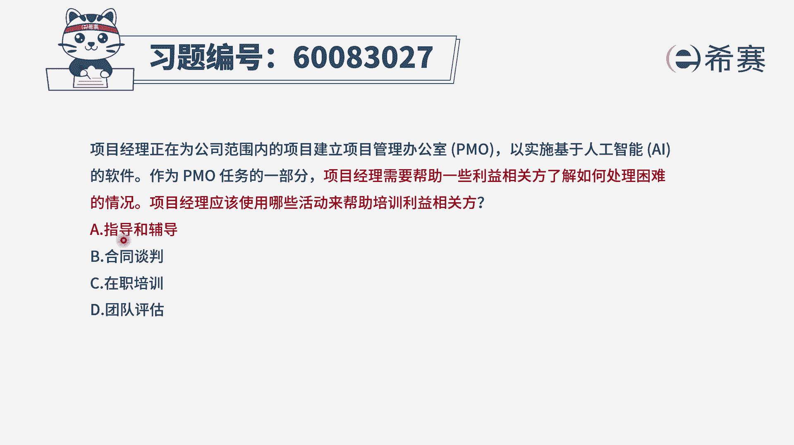
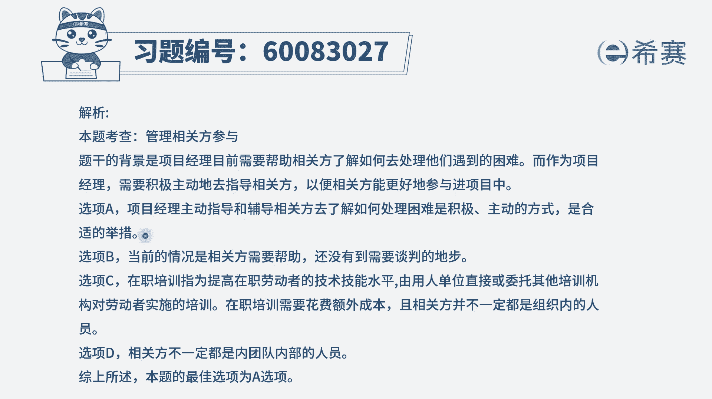

# 24年PMP-pmp项目管理零基础模拟题精讲视频，免费观看（含解析） - P2：2 - 冬x溪 - BV1Qs4y1M7qP

项目经理正在为公司范围内的项目，建立一个项目管理办公室，pmo已实施基于人工智能ai的软件，作为pmo任务的一部分，项目经理需要帮助一些利益相关方，了解如何处理困难的情况，项目经理应该使用哪些活动。

来帮助培训利益相关方吗，呃这个的话你看完四个选项，你大概能够知道a选项，通过指导和辅导的方式来去帮助利益相关方，那肯定就是合适的对吧，因为本身你就是要去帮助这些利益相关方，来了解如何面对困难，解决困难。

所以你去知道它，你去辅导他，这肯定是合适的呀，并且呢它就是正确答案好，其他几个选项也看一下啊，b选项，合同谈判到了这个程度吗，如果说他是你公司内部的人员，你也不用谈合同谈判，他如果不是你公司内部的人员。

我们一般在什么情况下才有合同谈判，一个是在签订合同的时候需要去做这个事情，还有一个就是当有某一些特别大的这种违约啊，索赔啊，在这样一些时候才会考虑到，而现在是我们去提供帮助和辅导，完全到不了这一段好。

c选项，在职培训，首先在职培训呢他一般是基于公司内部的员工，你去花比较多的钱来去给他做培训，或者是委托别的机构来给他做培训，而现在呢只是说你去告诉他们，某一些方式来去处理困难，您做一个简单的指导和辅导。

或者做一个简单的内部培训就够了，他达不到这种，非得要去出更多的钱来做在职培训的这个程度，并且在职培训一般是时间跨度也会比较长啊，最后一个选项团队评估，团队评估，你也只能够去评估他做得好还是做的不好。

并没有直接去教他技能啊，教他如何去处理，所以呢只有a选项去给他提供指导辅导。

这是合适的答案选a，那文字版解析在这里。

