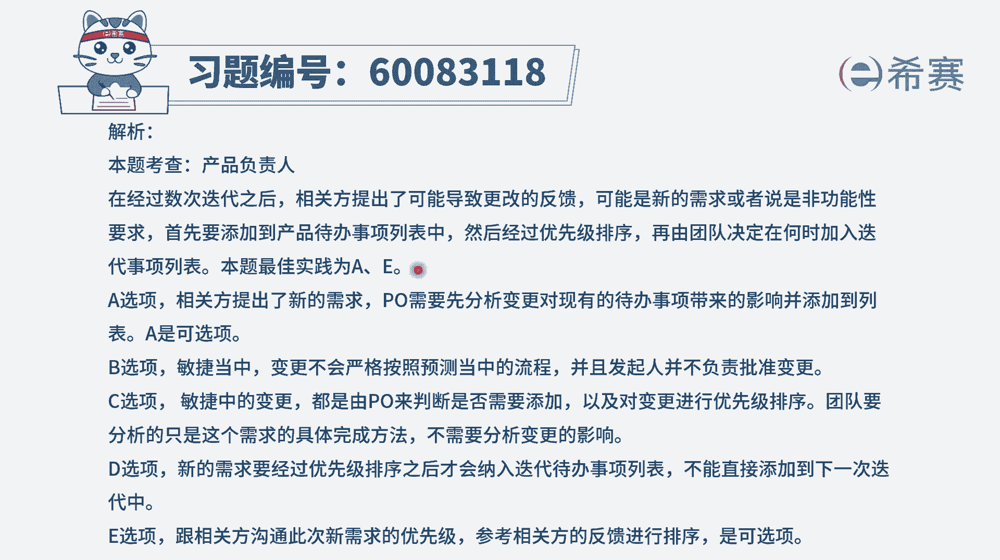

# 24年PMP-pmp项目管理零基础模拟题精讲视频，免费观看（含解析） - P24：24 - 冬x溪 - BV1Qs4y1M7qP

敏捷项目处于第11次迭代中的，第七次迭代审查之后，团队从利益相关方那里说到，可能导致产品更改的反馈，项目经理应该采取哪两项行动选择两个，那我们在项目管理的考试中呢，目前会有少量的定向多选题。

他会明确告诉你有几个正确答案，像这个题目是两个正确答案，你就选两个，那既然有一些新的产品更改，那我们得要了解一下要更改的东西，对不对，我们先来看一下这五个选项，然后再确定到底怎么做啊。

a选项要求产品负责人审查产品待办事项列表，也就是说我们现在要做的东西都有哪一些诶，这肯定是要了啊解的，然后再要加什么东西进来，也是需要了解，然后还要调整什么顺序，这也是需要去了解，然后再去分配任务。

应该是这么一个逻辑对吧，所以这个呢是可选的好，b选项请求发起人批准变更请求，首先第一个并不是由发起人来批准变更请求，是由c c b变更控制委员会来批准变更，其次呢，在整个敏捷中。

已经不再按照预测的方式来进行严格的变更，管理流程，在敏捷中是拥抱变化，所以它有变更都可以提过来，我们会做，那种他觉得重要性更强的，优先级更高的事情，所以这个b选项它完全不符合敏捷，是错误的。

c选项要求团队成员分析此更改的影响，那通常情况下呢，如果说涉及到变更，也是由c c b来去分析，影响团队可以做一些参考，团队更多的是负责具体的去做事情，去执行，去落实，所以这个选项其实不合适。

还有就是在敏捷中，已经是不按照严格的方式来去走，这个变更流程了，他提的变更我们都是需要去响应的，所以更加说不合适啊，第四个选项，要求团的成员在下一次迭代中包含更改，到底是不是应该放到下一轮迭代。

还是放到下下一轮迭代，这个其实还有待商榷，因为他只是说到我们可能要去对产品进行更改，但并没有说到这个东西，它的这样一个紧急程度，如果说下一轮有更重要的事情呢，所以一般情况下只会把这些要更改的东西。

放到整个产品待办事项列表中，然后在下一轮迭代的规划会议上，或者说是计划会议上来，去确定下一轮迭代要干什么东西，包含了那就包含进来，如果不包含，那就不包含进来，是这个逻辑。

所以不能够直接说把它放到下一轮的这个呃，迭代里面，而是放到整个产品代办事项列表，也就是放到整个这个文件中好，最后一个选项，向利益相关方询问此变更的优先级，其实也就是说他要加了一些新的功能对吧。

那么加的性能功能它应该是优先级在什么程度，这刚好是符合的，所以答案是选a和e，第一个要做的事情，就是要把东西放到这个产品待办事项列表中来，我们先审查原有的待办列表，然后把新的东西放进来。

其次呢就是去了解这个东西的重要程度，它的优先级别，然后进行这样一个优先级排序，然后再然后再就是按按照一轮迭代，一轮迭代来去进行，可能在某一轮迭代中，其实就把这个事情给落实了，再去完成了，是这么个逻辑。

那文字版解析在这里。

