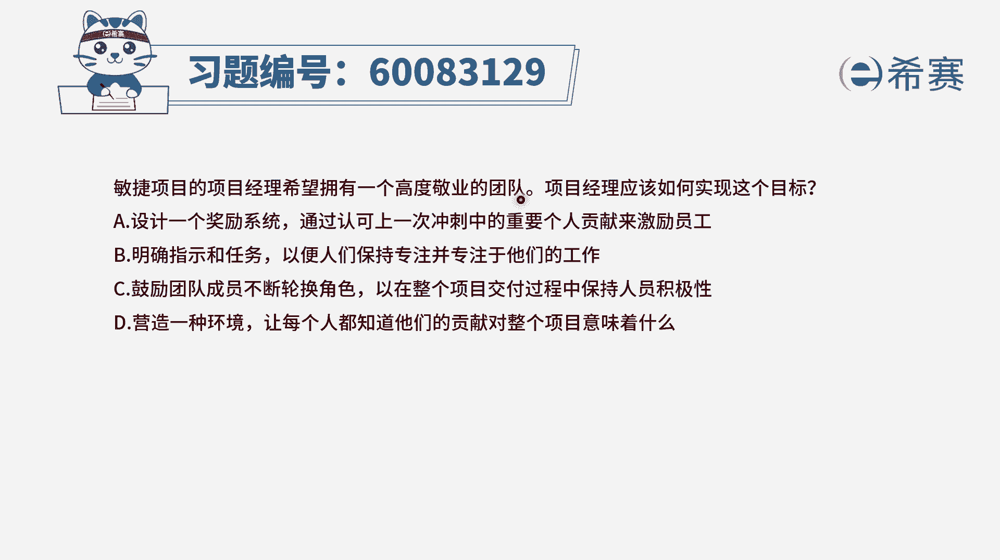
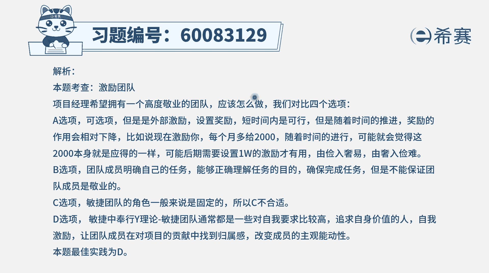

# 24年PMP-pmp项目管理零基础模拟题精讲视频，免费观看（含解析） - P27：27 - 冬x溪 - BV1Qs4y1M7qP

敏捷项目的项目经理，希望拥有一个高度敬业的团队，项目经理应该如何实现这样一个目标，那怎么样才能够让团队是一个，高度敬业的团队呢，其实这四个选项肯定对我们都有一定的启示，我们看完以后再来去讨论啊。

a选项设计一个奖励系统，通过认可在上一次迭代中做的好的，这些重要个人贡献来激励员工，就像打球的时候有mvp对吧，最有价值球员，那通常情况下奖励呢它是一种来自外部的，他肯定是能够去刺激我们更加的奋发向上。

但是他在这种竞争性比较激烈的地方是更好的，而事实上我们如果说是有外部激励，它能够在我们在短时间内有一种很大的冲击力，但他从长远来看，他的帮助其实不一定很大，因为你想一想，那今天给你奖励，明天给你奖励。

奖励到一定时候以后，你会觉得这个奖励是你理所应当的，其实也就成为了你的一部分，下一次没有奖励或少奖励，你反而还会更加的不高兴，一定是这样子，所以奖励他在短时间内快速刺激是有帮助。

但是你要真正的是能够拥有一个很敬业的团队，除非你能够源源不断的去给奖励，并且是一直会提高提高，那经常有一句话就是它的胃口越来越大了，好第二个选项，明确指示和任务，以便人们保持专注并专注于他们的工作。

那如果说我们能够去指明你的工作任务，你的职责，那么相对来讲呢，大概就是更好的去完成事情，但是这种方式不是很多人都在做的吗，他能够确保你更加经验吗，很多时候，大家只是会把这样一个东西。

当做一份工作任务去完成而已，c选项鼓励团队成员不断的去轮换角色，以在整个项目交付的过程中，保持人员的积极性，首先轮换角色这样一个事情呢，它在一定程度上让你去熟悉更多不同的业务，肯定是有帮助。

但是轮换结束的同时，你在某一个领域中的这一个专精的程度，其实会下降，而敏捷呢它其实是利用大家的各自的长处，同时又是大多是t型人才，一专多能的t型人才，所以它在某种程度上来讲。

肯定是对大家啊去掌握更多的新的东西有帮助，但他对于能够去交付一个更有价值产品不一定，所以它只能是说我们可以去适当的去学习，别的岗位所需要去学的知识，但是呢我们还是要有自己专业的东西。

也就是所谓的是一专多能的方式，会更合适好最后一个选项，营造一种环境，让每一个人都知道他们的贡献，对于整个项目意味着什么，其实这样的话呢，就是能够让大家看到他自己，在这个项目中的价值和贡献。

而我之前讲课有讲过，说在心理学这个领域中，有研究说，人生来世追求归属感和价值感的也是每一个人，我们存活在这个世界，我们都想要去追求一份归属感和价值感，那归属感呢，它很多时候是来源于。

我们能够参与到某一些事情，而价值感是我们可以去做成某一些事情，或是我们能够对这个世界，对这个团体，对某些人群有贡献，而d选项刚好是能够让大家看到这个贡献度，能够让你找到自己的这样一个价值感。

但你觉得你自己是很有需要的，很被需要的，你就会更有动力的去完成一些事情，还有就是当你的贡献，你会发现诶自己是棒棒的，呃，很很重要，你就会更有动力，所以相对来讲的话，通过这种方式来去做事情。

营造一个好的氛围和环境，让每一个人都能够看到自己的贡献，他是更有利于我们去创造这样一个，高度敬业的团队，那文字版解析在这里。

