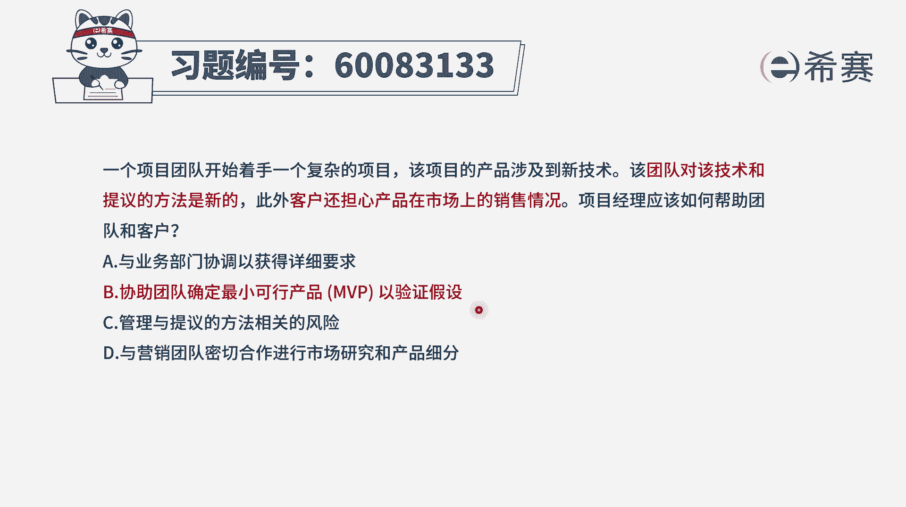
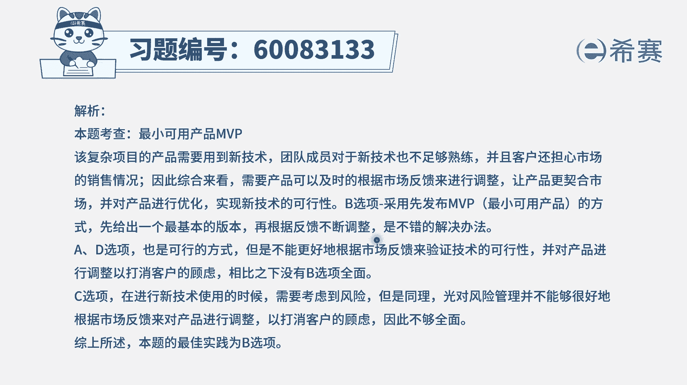

# 24年PMP-pmp项目管理零基础模拟题精讲视频，免费观看（含解析） - P28：28 - 冬x溪 - BV1Qs4y1M7qP

一个项目团队开始着手一个复杂的项目，该项目的产品涉及到新技术，该团队对该技术和提议的方法是新的，此外客户还担心产品在市场上的销售情况，项目经理应该如何帮助团队和客户，那这种情况呢。

其实首先第一个在技术方面，我们用的是新技术，所以它能不能成，这是一个问题，第二个呢是客户也担心这个产品，它在市场上会不会诶卖的比较好，这也是一个问题，所以我们其实两方面都要去解决。

那如果这两方面都要解决的话，有一个很好的东西是什么呢，就是mvp叫最小可行产品呃，我在讲课的时候其实有提过最小可行产品，你可以从两个维度来考验，一个是最小可行产品。

你可以把它理解为说是我们去做最少的功能，来去验证这个东西到底值不值得去做，来去试探一下市场的反馈，第二个呢就是它是能够去试探市场的反馈的，基于市场反馈，觉得这东西值得做还是不值得做，如果布置得做。

那么我们也是一种快速试错的方式，那么前面的这个沉没成本是不太多的，如果说值得做，我们再去加大投入，所以它既能够在一定程度上来验证，我们的技术方法能不能行，另外呢它也能够去验证市场。

并且有一本书叫精益创业，在精益创业中，它其实会更强调的是这一个mvp的思想，就是去验证市场的需求，就看我做的这个商业模式，市场上是不是接受的，是不是同意的，所以协助团队去确定最小可行产品。

mvp的这一个东西，并且来去验证这个市场的假设，这是刚好能够解决题干中的问题，知道这么回事以后，我们再来看其他的三个选项，为什么不合适，a选项与业务部门协调已获得详细的要求。

请注意题干中介的试炼的时候是这些新技术，那么新技术有可能是能成，也可能是不能成，它跟需求不直接关联，第三个管理与提议的方法相关的风险，请注意，这个呢也许在一定程度上能够去解决，关于这个提议方法的问题。

但是关于技术能不能成是一个挑战，还有就是市场是不是认可接受也是一个挑战，所以他其实没有很好的去解决问题，最后一个选项与营销团队密切合作，来进行市场研究和产品细分，它在一定程度上能够去更多的了解市场情况。

也许会有助于我们生产的产品是满足市场的，但是他不急，我们来去做一个mvp以后，丢到市场上来来去，接受市场的洗礼，接受市场的考验，来得更加有价值，所以它没有达到mvp来去验证市场的作用。

并且呢mp它一方面验证市场，还有一方面是我们先做一点的东西来去验证，看我们技术方面可行不可行，所以这里想要帮你巩固一个知识点，就是如果说某一个事情很复杂的时候，我们可以考虑先做一个mvp某一个东西。

它的这个技术是很新的东西，我们也可以考虑用这样一个迭代的方式，先做一个小的东西，还有就是市场上到底会接受还是不接受，我不太确定的时候，我也可以去用这个mvp来去做，它是一种低成本创业。

低成本快速试错的方式，那文字版解析在这里。

