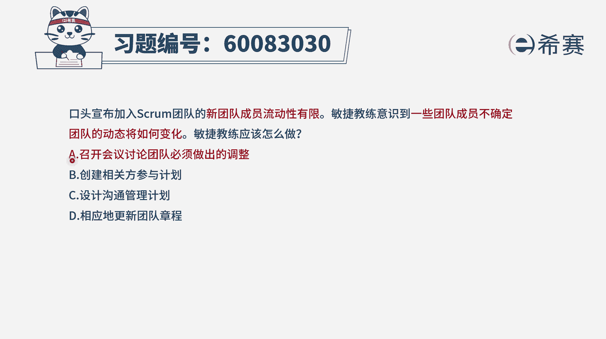
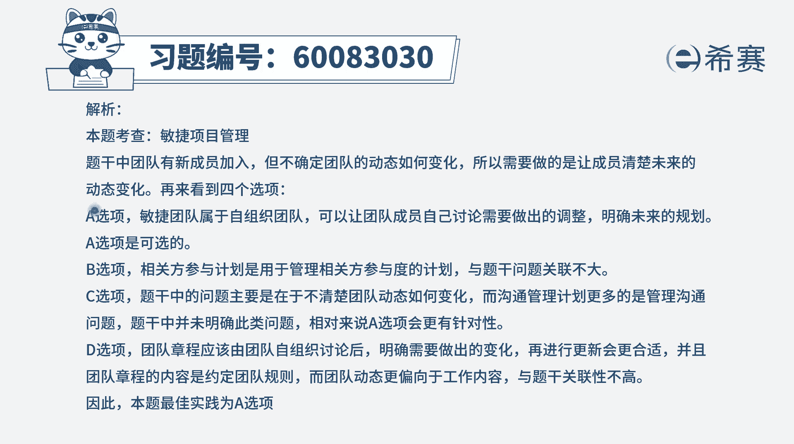

# 24年PMP-pmp项目管理零基础模拟题精讲视频，免费观看（含解析） - P3：3 - 冬x溪 - BV1Qs4y1M7qP

口头宣布加入世冠团队的新团队，成员流动性有限，敏捷教练意识到，一些团队成员不确定团队的动态将如何变化，敏捷教练应该怎么做，这个题目其实很奇怪啊，就是什么叫团队成员流动性有限，什么叫团队的这些个呃动态性。

但是即便不知道这两个词到底是什么意思，也同样能够解出这道题目是不是很神奇，你会发现敏捷就是这么神奇，我们一起来看一下，虽然罗老师也不知道这个什么，团队成员的流动性和动态是什么意思，但并不影响我们解题。

一起来看呃，首先呢就是既然团队意识到这样一个事情，那么肯定是要去解决这个问题对吧，出现问题去分析情况，去解决问题，一定是这个逻辑，那就看四个选项，哪一个会是去分析，然后去解决a选项，召开会议来讨论。

团队必须要做出的调整，就是你怎么样去做，你才能够去适应这种团队的这些行为啊，或者说是啊团队所共同需要去遵守那些东西啊，那这是合适的，刚好也能够去在一定程度上去解决，因为题干中所列的这样一些情况。

好像就是说他跟我们现在的团队成员，没有完全好的去融合进来，它的步调跟我们没有完全好的去匹配，那他需要去做出一些调整来跟我们相匹配，所以它是合适的，a选项是一个可选项啊，可以圈一下。

而b选项呢创建相关方参与计划，然后c选项是设计沟通管理计划这些内容，你看他会是那种预测型项目管理中，我们先去做计划，然后再怎么怎么样对吧，在敏捷里面呢，虽然不是说不做计划，但它更强调的是能够去上手。

能够去动手去解决问题，所以像这样的计划性的选项呢，它基本上应该不会是作为一个正确选项，并且相关方参与计划，其实会列出来是哪些人要参与进来，然后他要如何去参与，而这个敏捷他更强的是具体去做事情。

就说我有什么样的一个方式来去做呢，比方说让他们来做出某一些相应的调整，而沟通管理计划，列的是说这个信息在什么时候能够去传递给谁，用什么方式传递，从而能够让它去获取他所需要的这样一个信息。

而这个跟题干完全不匹配，d选项相应的更新团队章程，那团队章程是团队共同去做事情的，这些行为准则，但是这些个社会契约性质的东西，那通常情况下团的章程是团队共同参与讨论的，一起去做的这个事情。

而题干中的问题，它并不是说的是团队的这样一些个共同行为，处事的规则，而是团队他可能在某一些事情上，比方说团队的动态性的变化啊，什么流动性的这些事情，那就可能啊选a选项，召开会议。

让团队一起来讨论我们要做出什么调整。

可能会更合适一点，那文字版解析在这里，需要的同学可以自行查看一下，有一点你特别需要去注意，就是某一些东西它到底讲的是什么，比方说像这样一个流动啊，动态啊，即便不知道，在一定程度上。

他真的也不影响你直接去做出这道题目。

