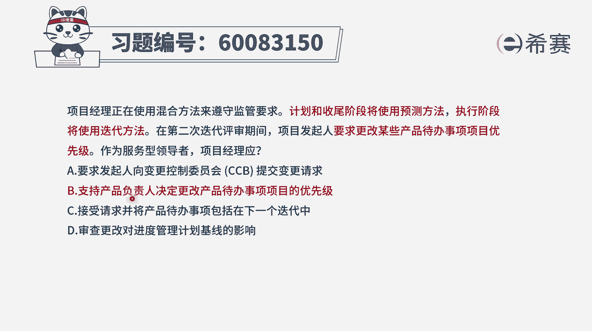
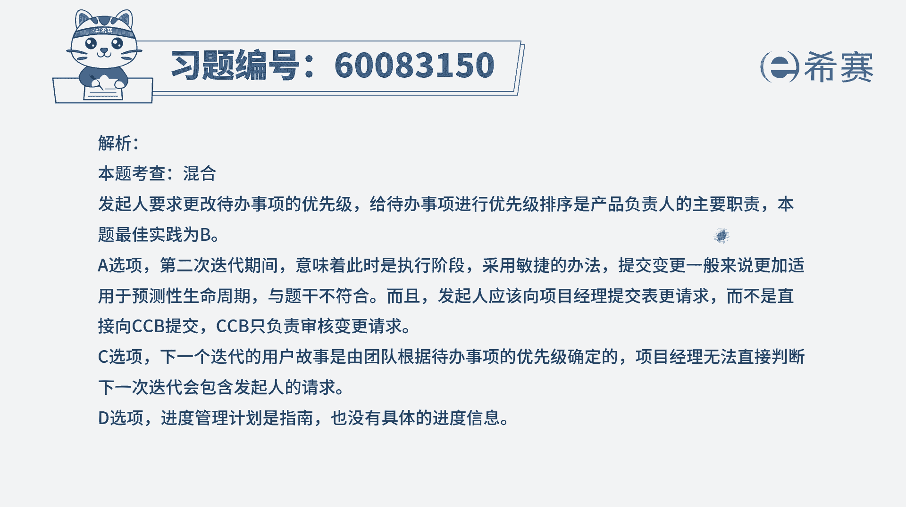

# 24年PMP-pmp项目管理零基础模拟题精讲视频，免费观看（含解析） - P33：33 - 冬x溪 - BV1Qs4y1M7qP

项目经理正在使用混合方法来遵守监管要求，计划和收尾阶段将使用预测方法，执行阶段将使用迭代方法，在第二次迭代评审期间，项目发起人要求更改某些产品待办事项，项目的优先级，作为服务型领导者。

项目经理应该怎么做，那肯定是让po来去改呀，对不对，来去改建一些个代办事项的优先级呀，那我们就来看一下这四个选项，选项a，要求发起人，向变更控制委员会ccb来提交变更请求，这是预测的这一套搞法。

而现在呢而在项目执行阶段将使用迭代的方法，也就是用敏捷的方法，它就不再去按照严格的遵循，这样一个变更控制流程的方式，而是有变更都拥抱我们去拥抱变化，所以这个a选项是错误的好，第二个选项。

支持产品负责人决定更改产品待办事项，项目的优先级，那当然啦当然要支持啊，这就是标准答案是正确答案啊，但是这里面可能有一个词，你可能会觉得有点冠以什么叫代办事项项目。

这里面也说到是更改某些产品待办事项项目，那他这个项目呢可能你用的是一个item，其实是事项的意思啊，可能是代办事项的这个具体条目，他瑕不掩瑜，你反正也能够理解，其实就是这样一代办事项条目。

需要去做一个优先级的排序，那既然发起人都提了要求，我们肯定是要去满足的呀，而对于这些个代办事项的优先级的排序，谁来负责呢，应该是由产品负责人，因为产品负责人我们给了一个词叫掌舵者，他是一个客户的代言人。

他是掌舵者，他来定这东西的优先顺序好，第三个选项，接受请求，并将产品待办事项包含在下一个迭代中，那这个肯定不太合适，首先第一个你作为一个服务型领导，我们说服务型领导也就是仆人式领导，也就是敏捷教练对吧。

那敏捷教练一般情况下他不直接去参与，把这个事情给改了，不直接去改建个迭代办列表，产品待办列表呃，一般是p o为主，除非说p o没空哈哈，然后或者没有选项是选p o，你才去替他做，就是不对的，第一个地方。

第二个地方呢，是他说把这个东西就包含到下一轮迭代，可是题干中并没有说这个东西变得格外的紧急，格外的急迫，必须马上做，没有提这样一个需求，所以你直接把它放到下一个点了也不合适。

只能是说在整个产品待办事项列表中，我们去更改它的一个优先级顺序，我们再来看最后一个选项，审查更改对进度管理计划基线的影响，呃，这就是回到了a选项，这种方式就是有变更走流程，那么这样一个变更流程。

会对于我们整个项目的基准有什么影响呢，但是我们说在这样一个迭代方法中，在敏捷中我们不再去按照有变更走流程的方式，而是按照一种拥抱变化的方式，所以既然对方提了要改，那咱们就改，所以答案是选b选项啊。

是支持p o来。

去完成这样一个优先级排序的事情，那文字版解析在这里。

