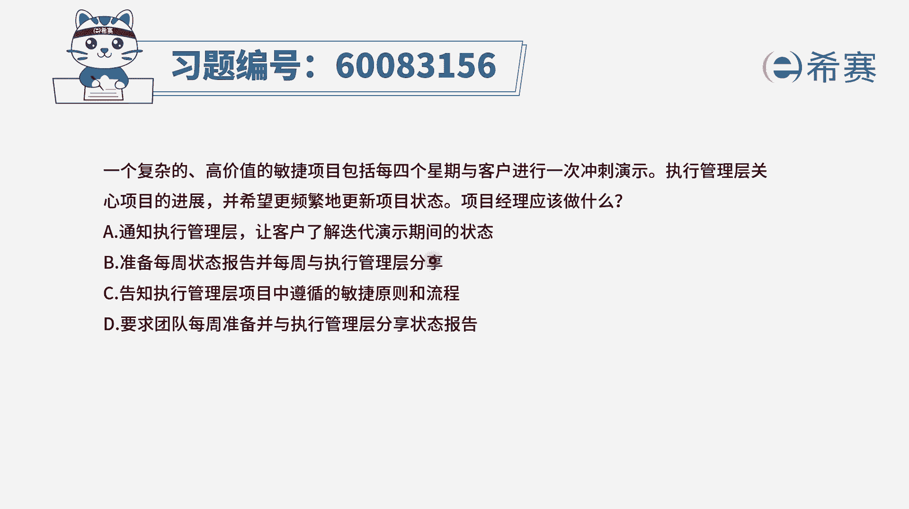
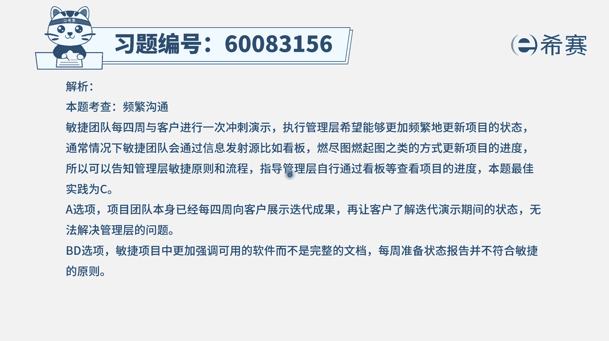

# 24年PMP-pmp项目管理零基础模拟题精讲视频，免费观看（含解析） - P35：35 - 冬x溪 - BV1Qs4y1M7qP

一个复杂的高价值的敏捷项目，包括每四个星期与客户进行一次充实演示，执行管理层，他关心项目的进展，并希望更频繁的更新项目状态，那项目经理应该做什么，通常情况下，我们在做事情的时候都是去满足领导的需求。

既然领导想要什么，我们就要去做什么对吧，一般是这个逻辑，但是敏捷呢它有它自己的规则，并且敏捷很会有很多方式来去强调，这种透明沟通，通过这些信息发现言呢看板呢的这些方式，包括所领导实在是愿意的话呢。

你也可以经常的去参与我们的会议，去旁听我们的会议的方式，这都是可以的，但是不会专门为了去迎合他而改变敏捷的节奏，会刻意的去给你多做一些一些什么汇报啊，演示啊，这个就不太合适了啊，所以有了这个认知以后。

我们再来看这四个选项，选项a通知执行管理层，让客户了解迭代演示期间的状态，你会发现这个选项它并没有满足说执行管理层，他去关心项目进展，希望更频繁的去了解项目状态，所以他肯定不对啊。

好第二个选项准备每周的状态报告，并且呢每一周与执行管理成员分享敏捷，就完全为了去迎合它，你就不再是用敏捷的方式，而是用预测的方式来做事情了，好c选项告知执行管理层，项目中遵循的敏捷原则和流程。

这个表达其实有一点点问题，但它其实是去相当于教育领导教育客户呃，这个教育呢我们换一个词叫教练，教练领导教练客户，让领导们知道说啊，原来敏捷原则是这样的，敏捷流程是这样的，如果我想要知道什么信息。

我可以在哪里就可以看到它，这里有一个固定的这样一些个看板信息发射源，所以这个方式其实在一定程度上是可以的啊，最后一个选项要求团队每一周准备，并与执行管理层来分享专栏报告，这其实就是跟b选项一致。

也就是去迎合他，要不再适用敏捷的方式，而是用那种预测的方式来去做报告呀之类的，打乱了你本来应该应该有的节奏，所以这道题目的答案应该是选c选项，也就是你要去让领导们知道哦，原来敏捷他是这样的去干事情的。

然后你想要去知道的东西，都可以通过这种手段和方式来去得到，因为本身敏捷也是很透明的。

那文字版解析呢。

