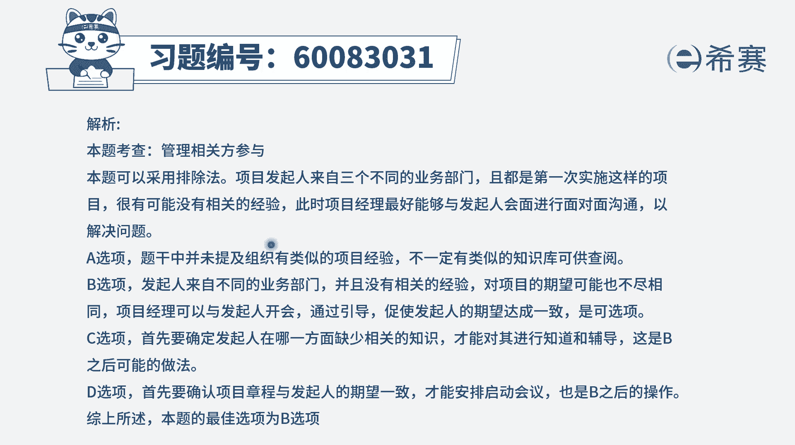

# 24年PMP-pmp项目管理零基础模拟题精讲视频，免费观看（含解析） - P4：4 - 冬x溪 - BV1Qs4y1M7qP

项目经理被分配到一个已推迟多年的薪水，处理厂，项目项目章程中透露，该项目的发起人是来自三个不同的业务部门，这是发起人第一次实施这样的项目，那项目经理应该怎么做，你就知道它不是一个好搞的项目啊。

已经推迟了很多年，并且呢这个项目的发行有好多个，所以大家可能是因为种种原因利益不一致啊，认知不相同啊，要求有差别啊等等，导致可能在扯皮啊，就没有办法很好的去开展这样一个项目，现在你接手了以后。

你该怎么做呢，首先肯定是统一目标，对不对，一定是要去统一目标，肯定是要通过开会的方式来统一目标，然后我们就看一下四个选项，选项查看类似项目的知识库，题目已经告诉你公司第一次实施这样的项目。

所以估计没有什么知识库可以去直接参考，第二个与项目的发起人会面，以调整期望，那也就是通过开会的方式，跟三个不同部门的这样一个发起人一起来开会，然后来去了解这样一些信息。

并且去统一一下大家的这样一个需求和期望，是不是一致的啊，来去把这个期望达到一致，这样的话呢项目才能够去开涨，我们在讲smart原则的时候，有讲过这样一个点，叫相关方一致同意的。

也就是如果一个事情有多个人来去做决定的话，那如果多个人的决定是不相同，底下的人就没有办法去实施，那如果说要去实施的话，一定是领导们他们意见是相一致，才能够去实施，而这里面的话呢不是两个领导。

这是三个领导，这是三个大佬，所以呢更加需要去完成这样一个事情，跟他们去沟通协商，然后让他们自己内部达成某种共识，这样的话作为项目经理才能够去推进项目，开展项目，如果他们没有达成共识的话。

那你不管做的怎么样，一定是没有满足某一些人的需求的，对不对，所以呢这个题目的b选项，是一个非常好的选项啊，看有没有比它更好的c选项，建立指导和辅导的课程，那我们去做指导。

做辅导一定是基于别人的薄弱项去做，而现在题干中没有告诉你有薄弱项，他只告诉你有困难，但是你不知道具体的薄弱项在哪里，你现在要去了解了解清楚情况，所以这个不合适，最后一个选项立即安排项目的启动会议。

kick off meeting，启动会议，这是一个很容易的事情，但是你得要先搞，搞清楚大家的各自的角色和职责呀，然后基本在一些需求啊，各方面的信息要达成统一，理财区开始干活，你都没有达成共识的话。

你去干活这个事后面是很难的，我刚才有讲过，对不对，所以这样看下来，只有第二个选项是合适的，也就是因为这个项目比较难搞，又来自三个不同业务部门的人做发起人，那你要跟他们去达成共识。

让他们自己把期望来调到一致，这样呢项目才可以去开展，其他学校的都不合适。

也解释过了，那文字版解析在这里。

