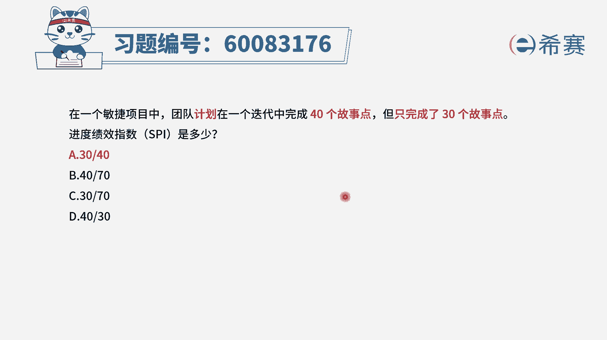

# 24年PMP-pmp项目管理零基础模拟题精讲视频，免费观看（含解析） - P41：41 - 冬x溪 - BV1Qs4y1M7qP

在一个敏捷项目中，团队计划在一个迭代中完成40个故事点，但只完成了30个故事点，进度计要指数spi是多少，那在敏捷的这样一种题目中，关于进度绩效指数，它其实跟我们在预测中所讲的。

这个进度绩效指数是一样的，只是说他的这个时间段呢选的是本轮迭代，那这轮迭代中计划完成的，也就是说是呃计划价值40，然后呢已经完成了30个，也就是我们正值是30，而进度绩效指数它就等于正值去除以计划价值。

也就是30÷40=40分之三十，所以答案是选a。

这只是一个很简单的计算，现在的考试中，它会有少量的这种计算题目啊，用进度计算指数。

