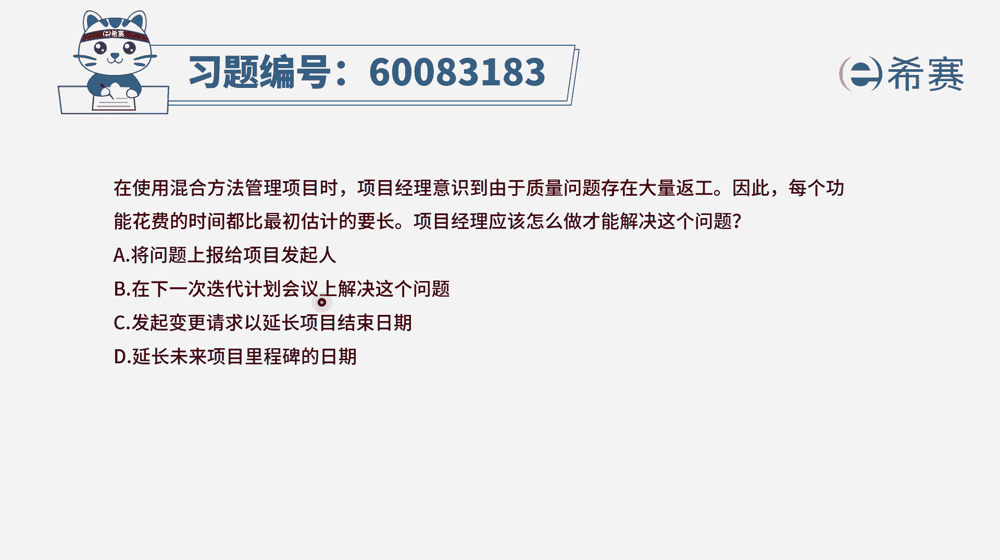
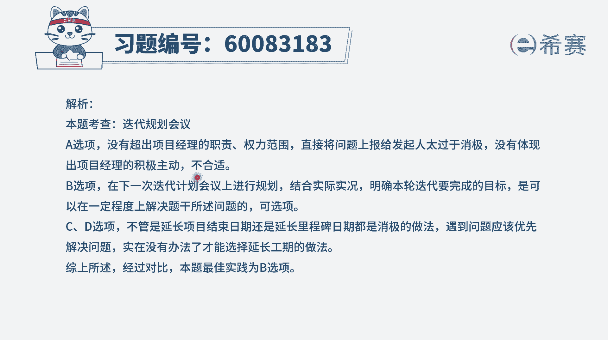

# 24年PMP-pmp项目管理零基础模拟题精讲视频，免费观看（含解析） - P45：45 - 冬x溪 - BV1Qs4y1M7qP

在使用混合方法管理项目时，项目经理意识到，由于质量问题存在大量反攻，因此每一个功能花费的时间，都比最初估计的要长，项目经理应该怎么做才能够解决这样一个问题，那通常情况下，如果说我们发现我们所做的项目。

因为质量问题导致有大量的反攻，然后要做的时间都比最开始估算的时间要更长，我们可能要去找寻问题的原因，然后找寻解决的方案，然后再下一次做一些优化和改进，是这么一个逻辑对吧。

并且在用敏捷的项目来去做事情的时候呢，应该是有一个叫迭代的回顾会议，我们在回顾会议上来去回顾到底哪些做得不好，到底是什么原因导致的好，我们来看一下这四个选项，你看完以后发现没有这样一个迭代回顾会议。

只有一个叫迭代计划会议或叫迭代规划会议，那也就只能选它，我们来看一下啊，首先是a选项，这样问题上报给项目的发起人，那这么一点小事情你就上报给发起人，就不要你干什么了对吧，不合适啊，好第二个选项。

在下一次迭代计划会议上来解决这一问题，也就是说我们在下一轮迭代开始的时候，我们去做计划的时候，就想想明白到底应该怎么做，以及包括说大家去估算这些工作量的时候呢，由于更加清晰的估算。

这个在一定程度上是可以处理的，当然我刚刚也有讲过，如果说是有这样一个迭代回顾会议，我们在迭代回顾会议上来去回顾这样一些问题，以及找寻到一些改进的措施或改进的计划，好像会更合适一点，可是剩下两个选项中。

都没有这样一个迭代回顾会议，所以呢只有他可以选，只有b选项，可以选第三个选项发起变更请求，以延长项目结束的时间，那这个就太过于被动了，你在开始的时候，有可能因为一种不太熟悉的原因，导致进度有点落后。

但是我们知道在敏捷中，它的速度刚开始是有些震荡的，会慢慢的去往上升，升到一定程度以后，最后到一个稳定的状态，所以你不能说一开始的时候，觉得他那个速度比较慢啊，就以后就一直都这么慢。

就直接用一种破罐子破摔的这种方式来去对待，来延长时间，这肯定是不合适好，最后一个选项也是说去延长时间，这个也不合适，所以只有b选项，在这个下一轮迭代计划会议上来解决，那我也有讲。

其实可能更好的一个方式呢，就是在本轮迭代的回顾会议上来做，但是选项都没有，那你只能是退而求其次，刚好在下一轮计划会议上，呼叫下轮的迭代，规划会议上是可以干这样一个事情的，我们在每一轮迭代开始的时候。

都要去认领任务，以及可以去讨论一些解决方案之类的。

刚好去解决问题是可以文字版解析。

