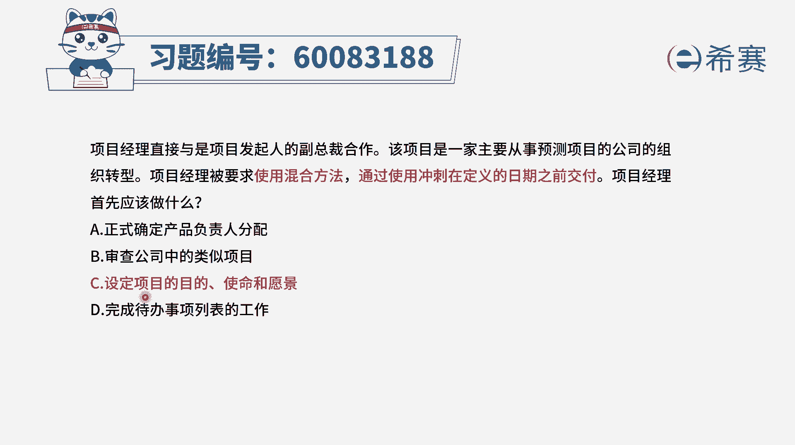
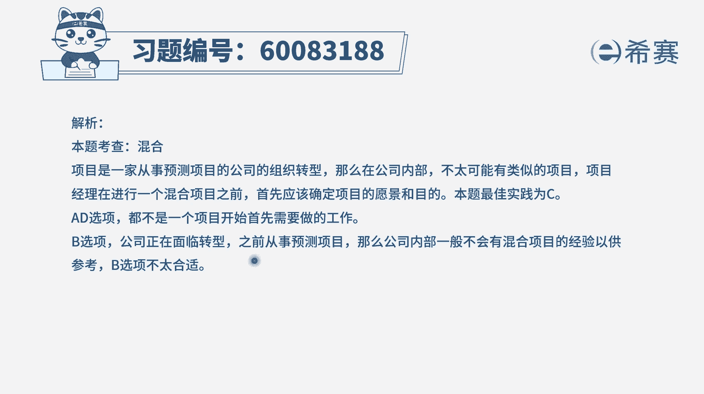

# 24年PMP-pmp项目管理零基础模拟题精讲视频，免费观看（含解析） - P49：49 - 冬x溪 - BV1Qs4y1M7qP

项目经理直接与市项目发起人的副总裁合作，该项目是一家主要从事预测项目的公司，的这样一个组织转型，项目经理被要求使用混合方法，通过使用冲刺，在定义的日期之前交付，项目经理首先应该做什么。

那他首先应该做什么呢，既然有这样一个项目定下来让你去做，那你现在要了解项目的情况，然后才去开展这些事情更合适对吧，我们来看一下四个选项啊，选项a首先是正式确定产品负责人的分配呃。

就是安排好谁作为这个项目的产品负责人，这个呢重要不重要，肯定也是重要的，但是我们首先你要去分配这个产品负责人的时，候，你是不是要给他介绍一下这个项目的一些事情，介绍一下项目相关的一些信息。

所以你先得要去了解项目相关的一些信息，会更好一点，好b选项审查公司中的这样一些类似的项目，那题干已经明确告诉你，公司是从事预测项目的这样一个公司，而现在呢在做一个组织转型的项目，在使用混合的方法。

所以呢可参考性估计不大，第三个设定项目的目的使命愿景，其实也就是把这个项目的一些介绍性的信息，背景性的信息，还有他要完成的目标有一个清晰明确的界定，而这个呢是你刚开始这个项目，首先得要干的事情。

答案是选c，最后一个完成待办事项列表中的工作，这是后话了，通常是你先得把这些团队给配齐，把这些个角色给配齐了以后，然后再开始去梳理一些需求啊，然后再来去得到这个待办列表呀，然后再去完成它。

所以这是后面距离去落实要干的事情，那刚开始的时候首先要做的事情呢，就是去了解清楚这个项目它的一个目的愿景。

所以答案是选c，那文字版解析在这里。

