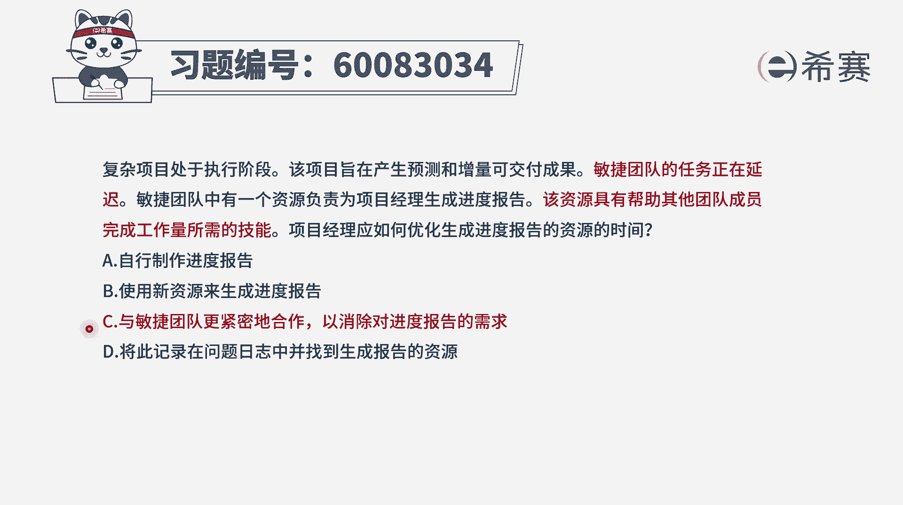
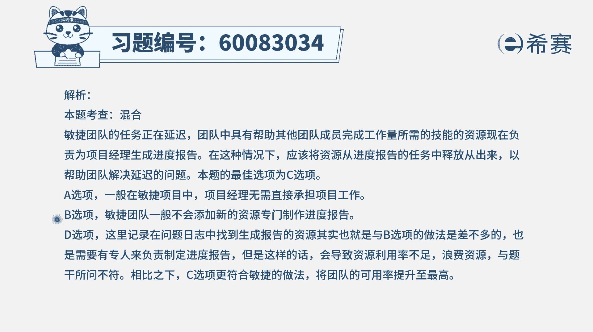

# 24年PMP-pmp项目管理零基础模拟题精讲视频，免费观看（含解析） - P5：5 - 冬x溪 - BV1Qs4y1M7qP

复杂项目处于执行阶段，该项目旨在产生预测和增量，可交付成果，敏捷团队的任务正在延迟，敏捷团队中有一个资源，负责为项目经理生成进度报告，该资源具有帮助其他团的成员，完成工作量所需的技能。

项目经理应该如何优化，生成进度报告的资源的时间，这个题目呢有点点拗口，尤其是最后这一个词是什么意思呢，呃也就是说有一个人，他会专门负责去帮团队，来去做这样一个进度报告，但他同时又具备能力。

可以帮助其他团的成员去完成某一些工作量，那项目经理怎么样去优化这个人的时间，就是优化这个能够去做京东报告的，这个人的时间是这么一回事儿，我们来看一下a选项自行制作进度报告。

也就是说是项目经理我自己来去做进度报告，你不用去做了，这种方式通常情况下呢，项目经理一般会把一些工作安排给大家，他不太亲自去上手做这些很细节具体的事情啊，尤其是说的是敏捷项目中。

所以呢这种方式其实是有一点点问题，好b选项使用新资源来生成进度报告，那通常情况下让这个人去做，他能够帮别人的事情，要让别人来做进度报告的事情，他给的是这么一个逻辑，这个其实在一定程度上是可选的啊。

其实是一定程度上是可选的，但是题干他没有给更多信息的情况下，我们也不太知道说这个进度报告啊，到底复杂程度怎么样，而第三个选项与敏捷团队更紧密的合作，以消除对进度报告的需求。

呃这个呢他的意图其实是释放掉这样一个资源，让这个资源可以去完成这个，当其他团队去完成工作量的事情，那怎么样去释放掉这个资源呢，就是它对于进度报告，不但不再需要这些进度报告，我知道这些完整的信息。

我能够跟团队紧密合作的时候，我就知道整个团队的进度状态是这个逻辑，这个是可选的好，最后一个选项将此记录在问题日志中，并找到生成报告的资源，其实也就是用新的资源来去做进度报告，如果b可以选。

那d呢在一定程度上也是可以选的，当然我们也讲过说呃，整个在敏捷里面呢是能上手去做事情，能动手就不会去b b b，可是d选项它可不是b哦，他是真的也去做这一个动手的事情，他就是把这东西记录下来以后呢。

而去找到这个生成报告的资源，所以它和这个b其实是有一致性在里面，但是因为我们其实没有办法去了解更多的信息，就不太知道说这个敏捷团队的这个人，就这个资源，他的建议工作难度啊，工作情况怎么样，而c选项呢。

他刚好就是项目经理自己，对于项目的进度有更多的认识和了解，能够去把这样一个资源给释放出来，让他更好的去帮助团队做这些要做的事情，所以他在一定程度上是会更加合适的一个选项，所以我们在这里呢会推荐选c。

请注意啊，是推荐选c啊，但是并没有说别的选项就是错的。

那文字版解析在这里。

