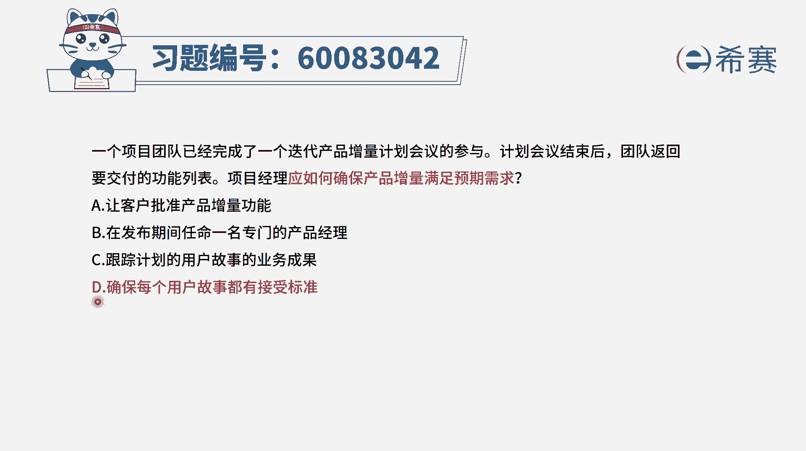

# 24年PMP-pmp项目管理零基础模拟题精讲视频，免费观看（含解析） - P6：6 - 冬x溪 - BV1Qs4y1M7qP

一个项目团队已经完成了一个迭代产品，增量计划，会议的参与计划，会议结束后，团队返回要交付的功能列表，项目经理应该如何确保产品增量，满足预期的需求，那怎么样去保证产品的增量满足预期的需求。

也就是说我们所交付的结果，是能够满足客户需求的，你怎么样去做才能够满足呢，呃这个因素有很多，包括说我们在最开始获取需求的时候，应该是他真实的需求，我们能够去定义好它的这样一个完成的定义。

有这样一些d d完成定义接受的标准，以及对这些结果我们批量来进行评审，来进行验收啊，这都是有帮助的，那我们来看一下选项a，让客户批准产品的增量功能，这个批准你一定是做到了才能够批准，对不对。

就是这个批准的话，一定是你做好了才能批准，他没有办法直接去满足，但是在一定程度上，我们通过这样一个评审会议，它是能够有效的去加强这个产品，满足其需求的这样一种方式的。

而事实上a选项它又不是讲的这个评审会议，他讲的直接说是批准，所以这个表达方式其实有一定的问题，好第二个选项，在发布期间任命一名专门的产品经理，那专门的产品经理就能够搞定这个事情吗，当然他可能会有帮助。

但它不是绝对的，它不是一定可以有有好处啊，并且呢它的这个关联性没那么强，不是一个强关联，因为本身我们在做项目的时候，过程中就有那个项目经理，或者说是有这个啊。

siri master就是敏捷教练这样一个角色选项，c跟踪计划的用户故事的业务成果，那我们如果说是对于这些用户故事，有一个完整的跟踪呢，从总体来讲，肯定是我们对于这些用户故事完成情况。

有更深的认知和了解，但是它的这样一个关联度其实没有那么直接，它更多的是会保证不遗漏东西，而最后一个选项，确保每一个用户故事它都有接受标准，这个接受标准其实也就是验收的标准。

也就是我们经常所谓的叫完成定义，d o d definition of done，那如果说我们提前定好了这些验收标准，我们在做的时候呢，在开发的时候呢，就奔着这个验收标准来进行，这样的话呢。

有可能会更能够让做成的东西是满足需求的，所以这个题目的答案是选最后一个选项，而其他选项呢它都离这个偏的有点远，呃比方说这样一个跟踪的方式，那跟踪的方式呢它在一定程度上有帮助，但他只是在做记录。

然后象征于客户批准，通常是你做好了我才能批准，所以只有这个是在源头上面去做一些努力，我们提前去定好验收标准以后。

那么你做的事情就是有方向的去做文字版解析。

