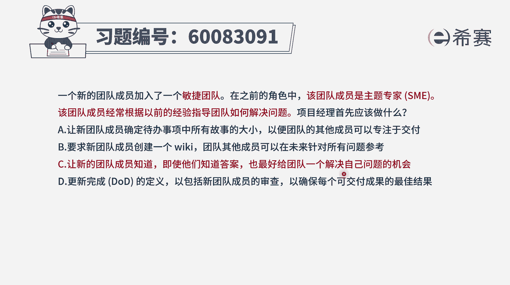
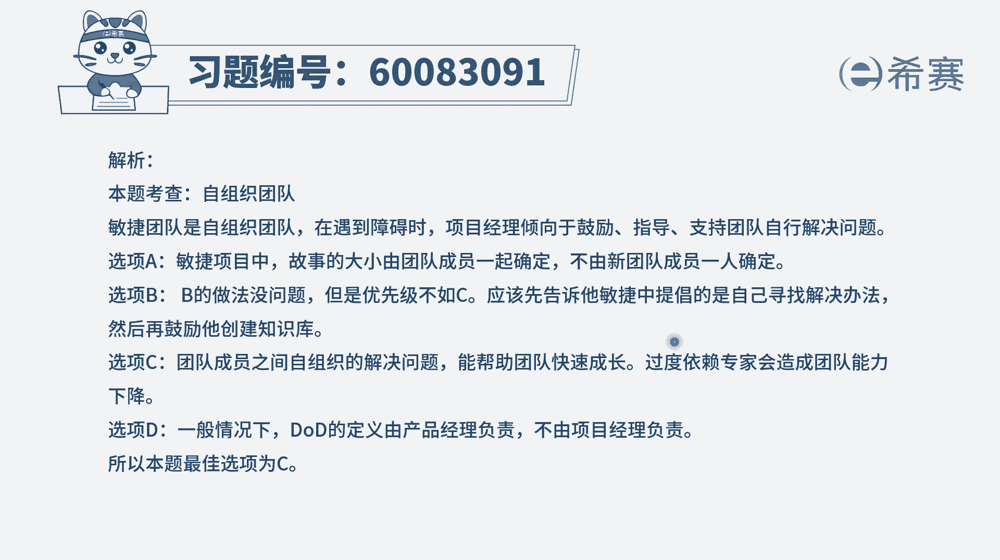

# 24年PMP-pmp项目管理零基础模拟题精讲视频，免费观看（含解析） - P17：17 - 冬x溪 - BV1Qs4y1M7qP

一个新的团队成员加入了一个敏捷团队，在之前的角色中，该团的成员是主题专家，该团队成员经常根据以前的经验来指导团队，如何解决问题，项目经理首先应该做什么，其实这个题目啊他怎么讲呢，如果说你的团队中。

能够有这么一个主题专家进来，还能够经常有好的这些经验和方式，来帮团队去呃，做一些解决方案的指导，那就是求之不得的事情，所以他其实本身没什么毛病，不是什么坏事，但是他又作为一个题目来去考察。

那我们就要稍微思考一下，那在敏捷团队中，他们是一个自组织团队，应该是呃自我组织，自我管理，并且呢在敏捷会鼓励团队成员是有所成长，所以呃这个选项它其实本身，这个题目本身没有什么毛病的情况下。

非得要去找出点事情出来，那我们就只能从这个角度来考虑，就是敏捷团队大家都要去成长好，我们来看一下四个选项，选项a，让新团队成员确定代办事项中的，所有的这些故事的大小，以便团队的其他成员可以专注于交付。

这肯定不对，我们说敏捷中那些事情最好呢，不是你直接去安排，而且大家来认领，并且每一个人都要有所成长，所以不会直接是让它来去估算所有的故事大小，并且还有就是我们说估算故事大小的时候。

一般是负责做这个事情的，来去估算是更为确切，更为恰当的好，b选项要求新的团队成员来去创建一个wiki，然后团队的其他成员呢，可以在未来针对所有的问题做参考，这个v k呢。

你可以把它理解为是一个知识共享库，那共享知识的这一个知识库呃，如果有的话，肯定是有帮助，所以这个事情它不是坏事情，它是一个可以做的事情，同时要知道b选项中所说的这样一个事情，不管他做或者是不做。

对题干中所描述的这个场景，这个情况没有什么特别的影响，他只会说是能够让他更好来指导团的成员，让团队成员可以更快的去获得帮助，好c选项，让新的团队成员去知道，即使他们知道答案。

也最好是给团队一个解解决自己问题的机会，这个给的是什么呢，就是给他一些成长的机会，让他自己去摸索一下，去成长，而不是所有东西都有人告诉他答案，这就是能够让团队作为一个自组织，团队去自我成长。

给他一个更好锻炼的机会，而这个呢刚好在一定程度上是对于你总是教他，而在敏捷中呢，我们不直接教，而是去指导去引导的这种方式，通过教练的这种方式，而不是直接去把答案告诉他的这种方式，所以呢它在一定程度上是。

对于这已经很好的情形再做一步优化，所以这个是比较合适的好，最后一个选项更新完成的定义，dod来包括什么什么什么信息，首先dod不是由这样一个团队成员来去定义的，它一般是由p o。

就是产品负责人来带领团队一起来共同完成，并是p o来作为一个主角，所以这个角色搞错了，那么这个题目中，首先我们得要知道一下c选项，它刚好能够去把题干中所描述的这个情形，再拔高一层，再提升一层。

而b选项的本身你不能说他错，但是他没有说是把这个呃题干，作为一个问题来对待，所以这个题目的答案呢只有c是合适的，也就是虽然这个主题专家很牛，他经常可以去指导团队来解决问题，但是如果他能够给团队一些机会。

让团队可以去自行去思考，而是给他一些提供启发的这种方式，那就更好了，好文字版解析。

