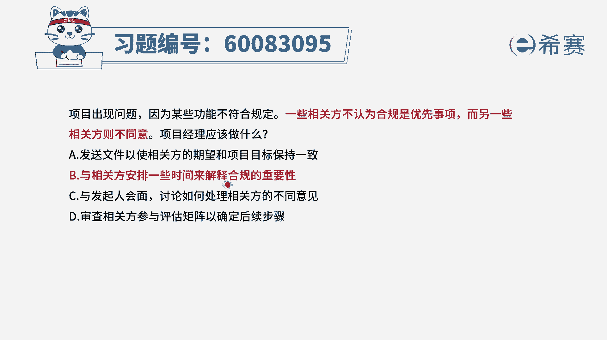

# 24年PMP-pmp项目管理零基础模拟题精讲视频，免费观看（含解析） - P19：19 - 冬x溪 - BV1Qs4y1M7qP

项目出现问题，因为某些功能不符合规定，一些相关方不认为合规是优先事项，而另一些相关方则不同意，项目经理应该做什么，首先我们得要了解一下关于合规，合规这两个词，其实前面已经做了一个解释，叫符合规定。

那首先我们要去做一个事情的话呢，他一定是有这样一个质量要求，你除了要去完成，你还要能够去达到它的这个质量目标，达到质量要求，也就是我们所谓的叫符合规定，符合规范，符合规则，符合法律。

所以呢合规他一定是要去达成的这样一个事情，而题干中告诉我们，有一些相关方他不认为合规是优先事项，而另外一些人觉得合规是很重要的，而你作为项目经理应该怎么办呢，首先你肯定是要去游说或是说服这些呃。

这些人让他知道合规是一件很重要的事情，至于说是不是最优先级不一定，但是一定是非常非常重要的事情，而这种解释呢肯定是用开会的方式，用面对面的方式会更好一些啊，有了这个认知以后，我们再来看四个选项。

选项a发送文件，以使相关方的期望和项目的目标来保持一致，这种方式能不能达到效果，通常如果你做过项目，你知道其实微乎其微，因为大家看文字，看这些东西，首先第一个它不一定会有很大很强的说服能力。

其次呢对于文字的认知和理解，可以有很多种不同的方式，我们正所谓的叫，1000个人眼中有1000个哈姆雷特，可是莎士比亚他只写了这一个哈姆雷特，为什么会有那么多差别，就是因为对于一个文字的解读。

每一个人可能都会有一些些差异，那如果说我们能够通过开会的方式来去讲清楚，并澄清呢，效果会比单纯的看文字要好一些，所以呢不是说这里已经不行，但是呢它可能效果不太好，第二个选项与相关方安排一些时间。

来解释合规的重要性，也就是来开会的方式来沟通这个事情，边跟他解释清楚，告诉他合规是非常重要的，他不一定是最优先，但它一定是一个比较优先的一个事情，我们既要去完成，也要去合规，要达到这个质量要求标准。

所以呢这肯定是一个可选项，第三个与发起人会面，讨论如何处理相关方的不同意见，这两拨人他们有不同的意见，你作为项目经理，你要是想办法去处理这个事情，而不是直接就甩锅给发起人，他也没那个时间。

他请你来做项目经理，就是来干这个事情的好，最后一个选项审查相关方的参与评估举证，以确定后续的步骤，可是现在可不是说他有没有参与，而是说他们都在参与进来，他们却有很大的一个冲突矛盾，那你要去解决这一矛盾。

所以综合看下来呢，a是一个小小的可选项，b呢它的这一可选性会更大一些，而c和d都不可选，所以答案就是选b，既然有一些人不认为合规重要，有一些人觉得合规很重要，我们就开会的方式啊。

安排一些时间来专门解释关于合规的重要性，想办法让大家达成共识，达成一致。

文字版解析。

