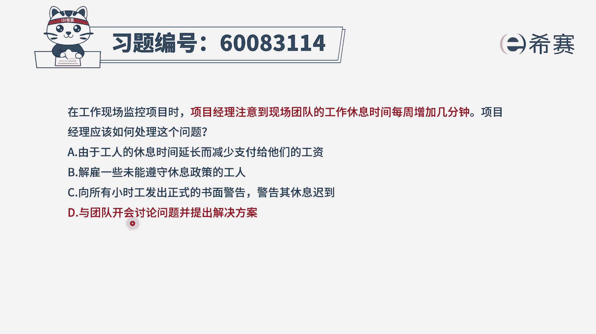

# 24年PMP-pmp项目管理零基础模拟题精讲视频，免费观看（含解析） - P23：23 - 冬x溪 - BV1Qs4y1M7qP

在工作现场监控项目时，项目经理注意到现场团队的工作休息时间，每周增加几分钟，项目经理应该如何处理这个问题呃，首先这是一个现场里所发现的问题，然后这个问题呢你说它很严重吗，不算严重，但是呢要不要处理呢。

也要处理好，有这个认知以后，我们再来看这四个选项，选项a由于工人的休息时间延长，那么我就要减少支付给他们的工资啊，你这也太上纲上线了吧，不合适啊，太过分了，这样的话呢下次就没有人，没有人做朋友了。

没有人给你干活了，选项b解雇一些未能遵守休息政策的工人，那这个就更不合适了啊，你这个太严厉了，以后没人给你干活了啊，没人跟你合作了，选项c向所有小时工发出正式的书面警告，警告其修行之道啊。

这个也是太过于严苛了一点，是不是这么点小事，我们一般来讲啊，这样一些小的错误呢是私底下口头来沟通，如果说人比较多呢，我们当然也可以是开会的方式来沟通，但他还达不到，这种靠发书面正式文件的方式来沟通。

所以这个不合适啊，最后一个选项与团队开会讨论问题，并提出解决方案，那么也就是告诉他们这个事情呢不太妥，我们还是需要重视，需要修改，需要按照正常的标准规则来进行，而不是太过于散漫。

那这种方式相对这三个格外严格的方式，那么肯定就是选它了，我相信这道题目你即便是没有学过pp，你也能做对好了。

