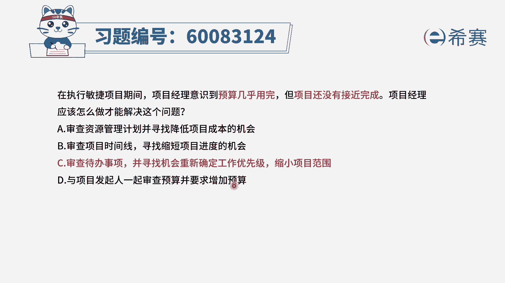
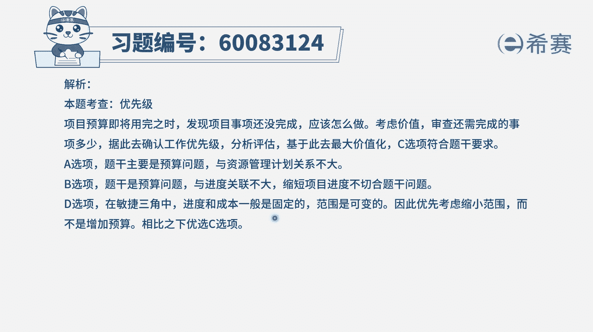

# 24年PMP-pmp项目管理零基础模拟题精讲视频，免费观看（含解析） - P25：25 - 冬x溪 - BV1Qs4y1M7qP

在执行敏捷项目期间，项目经理意识到预算几乎用完，但项目还没有接近完成，项目经理应该怎么做，才能解决这样一个问题，首先我们要了解它的场景或者背景，是敏捷项目，然后在敏捷项目中预算快要用完的时候。

然后工作还差的比较多，那这个时候怎么办呢，理论上来讲，我们应该是要去优先做更高优先级的项目，在这种很紧急的情况下，我们去把剩下要做的事情中，他的优先级再来捋一捋，优先做更重要的事情去交付价值。

这个是比较合适的，我们来看四个选项啊，选项a说的是审查资源管理计划，去寻找这个降低项目成本的机会，目前通过这样一个资源管理计划来降低成本，其实概率并不大，并且通常情况下，我们真正在做项目的时候。

大家如果说是能力不行，导致进度有延后，导致花了更多的钱，通常可能会是反而换一个那种能力更强的人，就是那种薪资待遇更高的人，可能会是反映一种更快加快速度的方式，性价比更高的这种方式。

所以这个a选项它并不合适，第二个选项去审查项目的时间线，寻找缩短项目进度的这样一个机会，目前预算快用完，那么也就是说剩下预算不太多的情况下，你增加进度单在一定程度上是好上。

但是这种方式它能否就去完成这个项目呢，其实也并不能够，所以他的这种表达方式里面，就是并不能够，真正去把所有该完成的东西都完成，而第三个选项审查待办事项，并寻找机会来重新确定工作的优先级，缩小项目范围。

也就是说只做那种价值最大的最重要的东西，而这种方式呢它确实有可能可以达到的目标，这是可以去解决这个问题，因为本身在敏捷中其实就是第一成本快速试错，以及去持续交付价值。

那我们把那种最重要的东西提前去拎出来，去完成，在一定程度上，他其实也已经是达到了目标，并且我们在讲课的时候，也有提过一个叫二八法则，其实80%的功能我们并不会真的去使用，我们大部分时候去使用的功能。

都是那20%的功能，所以如果按照一定的优先级排序，排好了以后，那些做出来的功能，也许就是我们大部分时候会用的，所以呢c选项这种方式，它是能够去解决提高用的问题，它是一种解决方式。

最后一个选项与项目的发起人一起去审查预算，并要求增加预算，一般在敏捷中呢，他的时间是呃，其实也是固定的，就是它的时间固定，预算也是固定，所以不会轻易的去加预算，这种方式不合适啊。

所以这个题目的答案就是选c，但费用不多了，但是还有很多工作没完成的时候，我们井的那种优先级比较高的事情去完成，我们重新去对优先级进行排序，去完成那些高优先级的。

把项目缩小一点，那文字版解析在这里。

