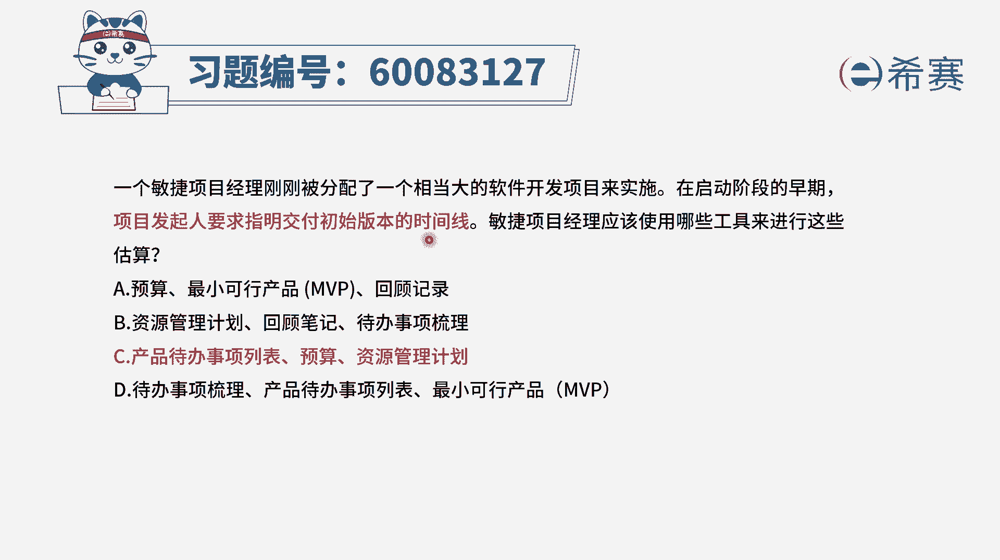
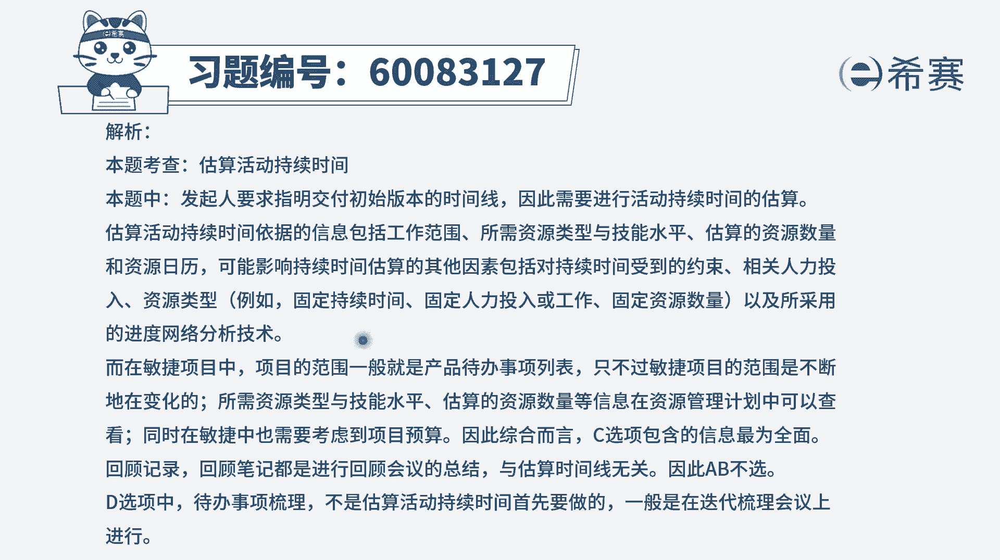

# 24年PMP-pmp项目管理零基础模拟题精讲视频，免费观看（含解析） - P26：26 - 冬x溪 - BV1Qs4y1M7qP

一个敏捷项目经理，刚刚被分配到一个相当大的软件开发项目，来实施，在启动阶段的早期项目，发起人要求指明交付初始版本的时间线，敏捷项目经理应该使用哪些工具来进行，这些估算。

这个题目呢可能用排除的方式来做会更好一点，在刚开始的时候，你能够通过一些方式来去指明，初始版本的这个时间线，那我们首先得要去算一算有多少工作要去做，他有多大的工作量，然后可能会安排多少资源来去完成。

应该是有这样一些信息，对不对，我们来看一下a选项，预算最小可行产品以及回顾记录，就回顾记录，一般是我们在迭代回顾会议上来考虑的事情，就是都已经进行了一轮迭代以后，才有这一回顾会议。

所以这个肯定是不合适好，b选项呢刚好也有这个回顾笔记，那这个呢也不那么合适，而c选项产品待办事项列表，这就是我们要做的事情，然后预算就是我们可能会为整个这个项目，花多少预算。

但这个预算不仅仅只是说整个项目的，也可能会包括说我在每一个迭代周期，我能够花多少预算，这样能够去确定我会安排多少人进来，还有呢就是资源管理计划中，就列出我们可能会安排多少资源，安排哪些资源。

然后安排了这样一些资源的能力和水平，这样的话有助于我们去了解我们要做的事情，大概花多长时间可以完成，能够给出一个初始版本的大致时间，最后一个选项，待办事项梳理，待办事项列表以及最小可行产品。

那最小可行产品和待办事项列表，这肯定是有帮助的，但是我们还缺一些资源，而代办事项梳理呢，是通过梳理以后来得到这个待办事项列表的，所以它其实是重复了，所以相比较而言，c选项中既有这个待办事项就要做的事情。

也有这些资源计划啊，同时还给了预算，他正好是能够更好地方便帮助我们来，去算出这些时间。

所以用排除的方式来选会更好一点啊，答案是选c文字版解析。

