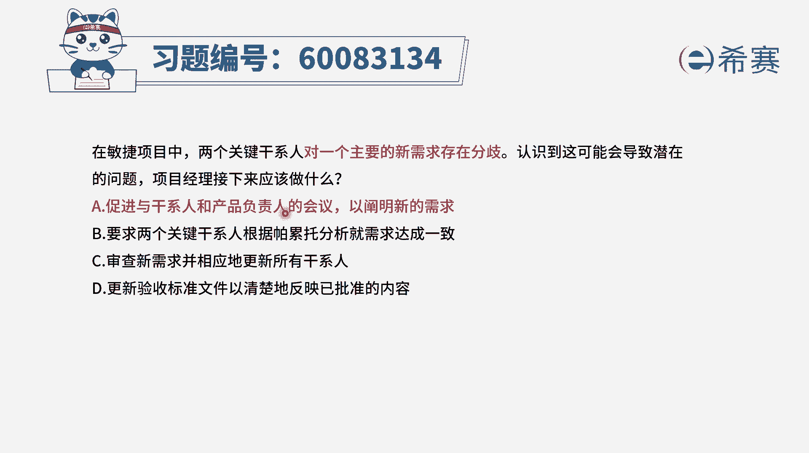
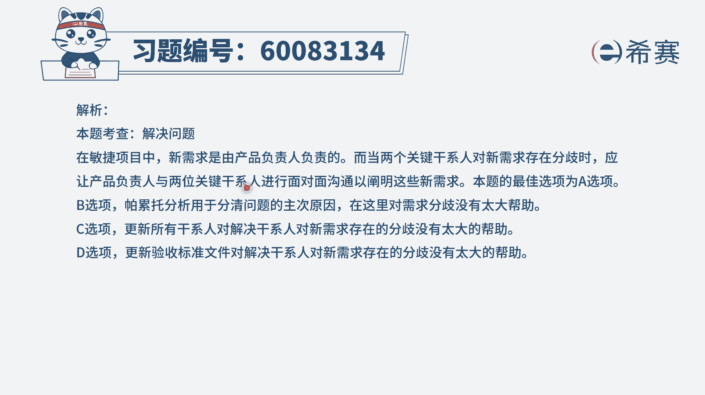

# 24年PMP-pmp项目管理零基础模拟题精讲视频，免费观看（含解析） - P29：29 - 冬x溪 - BV1Qs4y1M7qP

在敏捷项目中，两个关键干系人对一个主要的新需求存在分歧，认识到这可能会导致潜在的问题，项目经理接下来应该做什么，首先我们要知道这是一个敏捷项目，然后呢，两个关键它对于某一个需求的认知是不一样的。

存在分歧，那一般来讲在敏捷中关于需求是谁来确定呢，有一个重要的角色叫产品负责人po，有了这个认知以后，我们再来看一下四个选项，选项a促进与干系人和产品负责人的会议，来阐明新的需求，这个没有问题。

并且事实上呢，我们是需要跟产品复制来去确认清楚，因为其实关于需求，我们会在敏捷中用用户故事的方式来展现，而用户故事呢，我们会有一个叫d o d完成的定义，那如果说大家对于完全定义不太清晰的话。

在敏捷中关于用户故事，它是可以有一个3c原则中的conversation，是可以交谈的，是可以去做修改的，所以呢我们把它聊清楚，让产品复制人，把这样一些正确的信息给写下来就可以了。

所以这个选项是一个正确的选项，好其他的也来看一下，第二个选项要求两个关键干系人，根据帕累托分析，就需求来达成一致，请注意帕累托分析，他讲的是说抓主要矛盾，少数的原因会导致大量的问题。

我们去把这个少数的原因给找到他，这是从一大堆的信息里面，去挑出主要矛盾的一种方式，跟这个完全不符合，好c选项审查新需求，并且是相应的更新所有干系人，可是关键是目前还存在这一分歧。

那我们得要把这些分级给捋清楚以后，再去跟大家同步，现在还没有捋清楚的话，你同步是没有价值和意义的，这个就不合适了，好最后一个选项更新验收标准文件，以清晰的反应已经批准的内容。

这也是完全回避了题干中所说的，他们两个人对于某一个新需求有分歧的，这个事情，如果说分级确定了以后，我们把这个验收标准定下来，然后再去跟大家同步，这是没有问题的，所以这样看起来这四个选项中三个都不可选。

只有a选项可以选，那么以后你知道，如果遇到关于需求不确定的事情，关于需求有分歧的事情，我们应该是要去跟产品负责人，po这个角色来一起沟通，因为是他来去。

最终负责做拍板做决定的那文字版解析。

