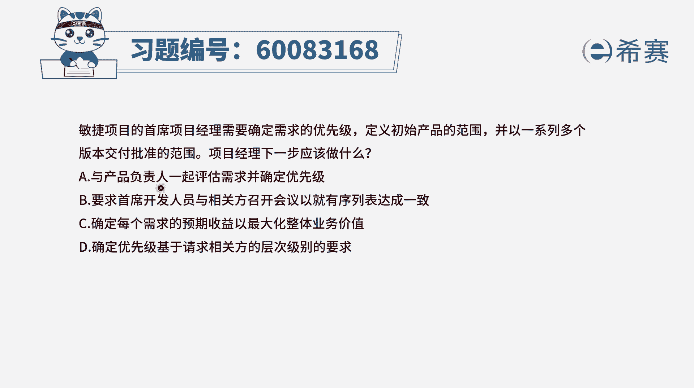
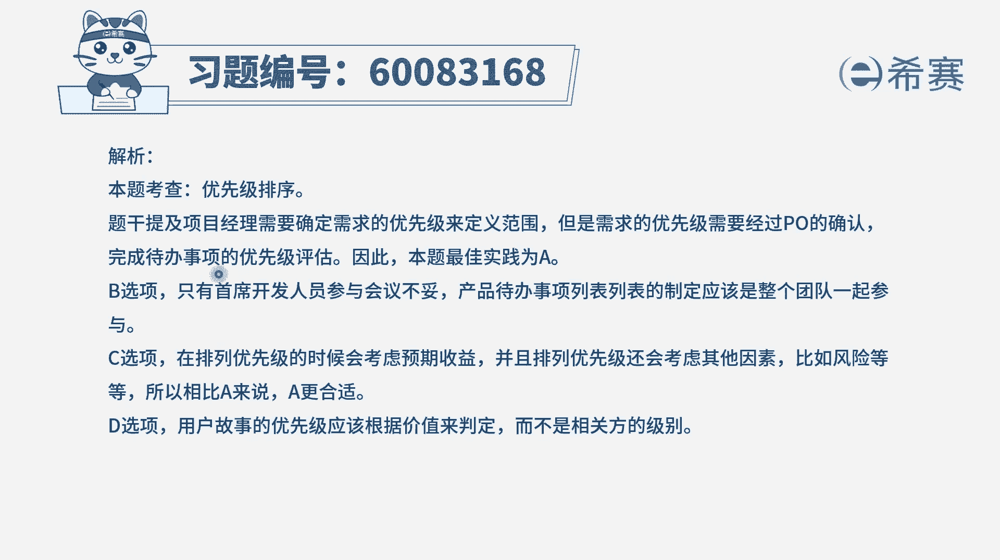

# 24年PMP-pmp项目管理零基础模拟题精讲视频，免费观看（含解析） - P38：38 - 冬x溪 - BV1Qs4y1M7qP

敏捷项目的首席项目经理，需要确定需求的优先级，定义初始产品的范围，并一系列多个版本来交付批准的范围，项目经理下一步应该做什么，那首先我们得知道这是一个敏捷项目，因为他说的是敏捷项目经理。

然后题干要做的事情是确定需求的优先级，谁来确定需求的优先级，一般是p o产品负责人，那产品负责人他是这样一个代言人，他也是掌舵者，他是来去确定哪些事情先做哪些事情后做的，这个掌舵者，有了这个认知以后。

我们再来看这四个选项，选项a项目经理，下一步呢应该是与产品负责人一起来评估需求，并确定优先级，这刚好就是匹配，符合就是产品富人这个角色，他来去参与确定需求的优先级，而事实上呢他也就是正确答案的好。

其他几个选项我们也认真看一看，选项b要求首席开发人员与相关方来召开会议，就有序列表达成一致，请注意，开发人员是负责去把这些需求去落实，去执行，去做出代码，编写出代码的人。

而这些需求理论上来讲应该是由客户提，但是呢产品负责，他是这位客户的代言人，客户有些时候他不一定会去亲自参与的时候呢，我们去找p o，所以整体来讲敏捷中的项目，它的优先级就是p o来确定，所以这个不合适。

第三个确定每一个需求的预期收益，以最大化整体的业务价值，那通常情况下确定预期收益，了解整个项目价值，这都是在最前期，项目还没有确定之前所干的事情，当然在a选项中所做的事情就是产品负责人。

他来去定这些需求的优先级，他会考虑到价值的这样一个最大化，他会考虑到以价值排序，但是不仅仅只是价值排序，还包括说风险呢，然后这些个资源呢等多个因素来综合下来，对这些需求进行排序，所以c选项不合适。

最后一个选项确定优先级，低于请求相关方的这样一个层次级别的要求，呃，这个其实首先你应该说后半句说的不清楚啊，然后呢，它的大概意思就是说，基于相关办的这个级别越高，那么它的这个需求呢。

就是放的优先级更高的位置，他的那个相关范的需求，那个城市更低，或者他的那个嗯未接职级更低的话呢，那么他的需求就变得不重要，这种方式肯定是不合理的，因为通常情况下是一线业务员。

他对于间歇需求会有更深入的认知和把控，而领导们，尤其是某一些大领导，他其实对这一些具体业务并不一定很清楚很懂，所以这个表达方式本身，在任何项目中都不一定那么合适，所以这样看起来只有a选项。

也就是当我们要去定某个敏捷项目，它的优先级的时候，是应该由产品负责人来去确定，所以项目经理和产品负责人一起来评估需求。

并确定优先级是合适的，文字版解析。

