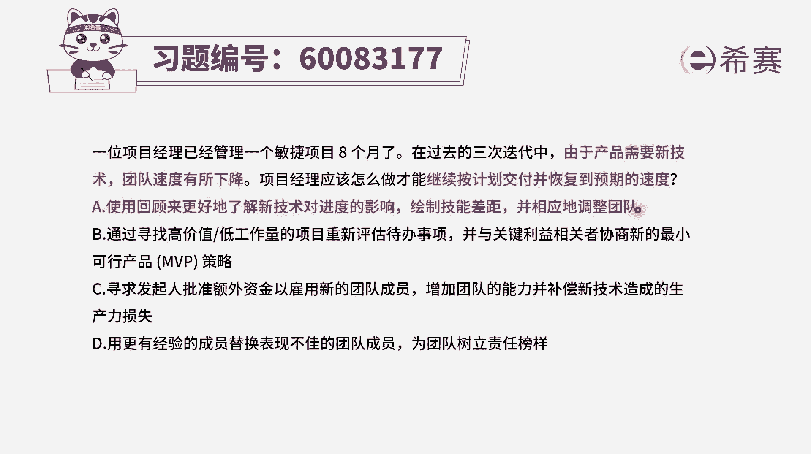
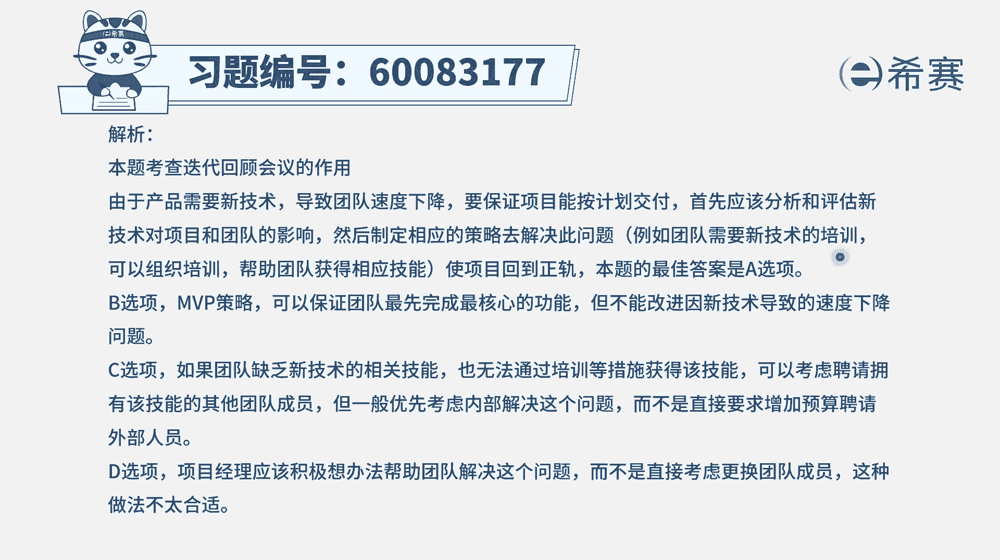

# 24年PMP-pmp项目管理零基础模拟题精讲视频，免费观看（含解析） - P42：42 - 冬x溪 - BV1Qs4y1M7qP

一位项目经理已经管理一个敏捷项目八个月了，在过去的三次迭代中，由于产品需要新技术，团队速度有所下降，项目经理应该怎样做，才能够继续按计划交付并恢复到预期的速度，那这个其实是一个很好的一个话题。

我相信大家在做项目的过程中，也可能会遇到过，就是如果使用某些新的技术，它有可能会在临时导致有一些震荡，有一些不适应，反而速度还降得更低，但是如果不用的话呢，用原来的方式来去做。

他可能就是会错失到一些这种新技术的使用啊，导致团队不能够很好的去培养，能够让团队变得更强大，所以这里面的话我们要从长远来看待，你从长远看的话，可能用新技术是一种更合适的一个决策。

虽然临时一小段时间之内可能速度有下降，但是总体可能会变得更强好，我们再回到这样一个题目，那应该怎么做呢，那肯定是先哦要去找寻为什么会下降，以及可以怎么样去弥补这一个板块，怎么样把它的能力给提升上来。

让他能更好的去掌握这些新技术，应该是这个逻辑，有了这个思路，我们来看这四个选项，选项a，使用回顾来更好的了解新技术对于进度的影响，绘制技能差距，并相应的调整团队哇，这一看就是一个完美的一个答案啊。

什么意思呢，回顾那些个什么东西的影响，其实也就是说我们去啊重新来复盘一下，看到底是怎么回事，为什么大家用了新的技术以后，导致我们的进度有这么多的影响，到底影响有多大，然后绘制技能差距。

也就是看一下我们还差哪些技能，或者说我们对于新技术的掌握程度，还缺哪些东西，我们该怎么样去补足，那么第三步就是去补足，做相应的调整，其实就是补充这样一个技能，让团队能够去掌握技能以后呢。

就可以比较熟练的去做事情，这刚好就是一个非常好的答案，答案就是选a，其他几个选项为什么不对，我们来看一下选项b，通过寻找高价值除以b工作量的这些项目，来重新评估代办事项，并且呢与关键利益相关者协商。

新的最小可行产品，可是你即便这样去做，你在零食看上去好像一下子交付东西哎，价值很不错呀之类的，可是他并不能够去解决，所谓的说整体速度有下降的这个问题，你如果不去培养团队，那团队水平它是不会提升的。

第三个选项，寻求发起人批准额外的资金，以雇佣新的项目团队成员，这肯定就不合适，对吧啊，增加团队的能力，并且去补偿新技术所造成的这些生产力的缺失，首先通常情况下，我们一般不会随便的去加新人进来。

在整个敏捷中，团队他是保持一定的稳定性，一般是从头到尾，他既不会加新人，他也不提倡换人，如果换人呢，也都是在某一轮比赛结束的时候去更换人，但是最好是不要去换人好，第四个选项。

用更有经验的成员来替代表现不佳的团队成员，为团队树立责任的榜样，而这种方式其实在整个敏捷中是不提倡的，这种方式它的最大坏处是什么呢，首先第一个你没有那么多牛逼的成员，可以使用一个公司，那些高级工程师。

他只有那么一些，所以并不是每一次，每一个项目上有表现不好的地方，你都可以换到人，其实他对于那种被换掉的团队成员，会是一个很大的伤害，还有第三个就是，它会影响那些没有被换掉的成员。

他会担心自己问哪一天会被换掉，那这样的话呢，与其被羞辱，我不如滚蛋，我换一个工作不行了，所以通常在整个敏捷中，甚至包括整个偏僻中呢，其实都不提倡这直接换人的行为，但有一种情况可以换什么情况呢。

就是这个人他不守规矩，屡教不改，这个时候呢你可以换，所以再回到这个题目啊，如果说团队因为使用新技术，团队的速度有所下降的时候呢，我们去了解啊，速度下降的原因是这样的影响。

然后看到这个技能的差距以及相对应的调整，其实也就是给他进行培训。

这是一个非常好的一个选项了，那文字版解析在这里。

