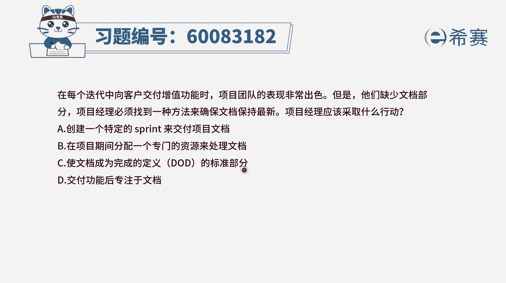
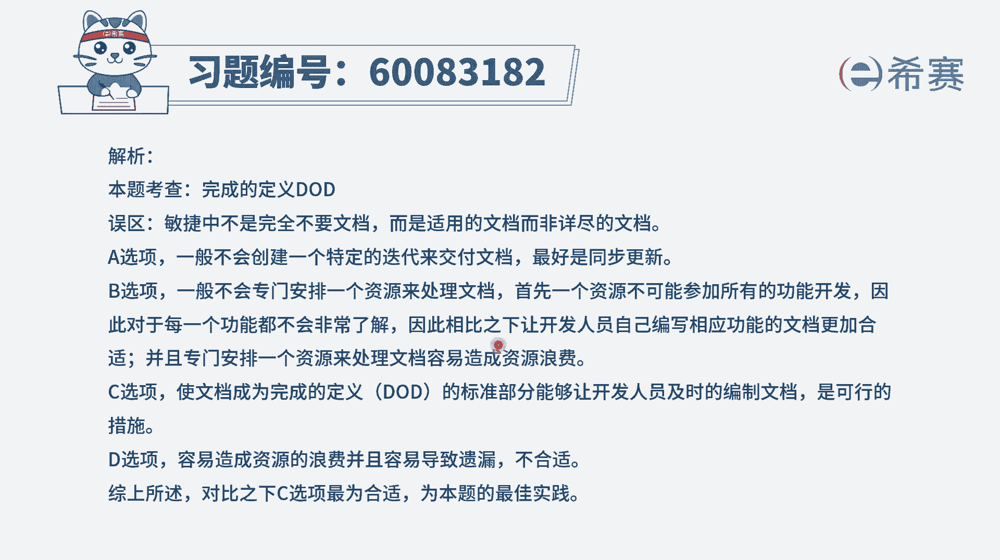

# 24年PMP-pmp项目管理零基础模拟题精讲视频，免费观看（含解析） - P44：44 - 冬x溪 - BV1Qs4y1M7qP

在每个迭代中向客户交付增值功能时，项目团队的表现非常出色，但是呢他们缺乏文档，部分项目经理必须要找到一种方法，来确保文档保持最新，项目经理应该采取什么行动啊，这是一个很有意思的一个话题。

这可能也是很多团队会遇到这样一个困境，就是虽然做的东西不错，但是缺乏一些对应的这样一些文档，让别人看起来用起来不那么方便，那怎么样去做才能够保证配套的这些功能，它有文档，并且文档是能够跟当下的这些功能。

是相匹配的吗，我们来看四个选项，看能不能够给到你所需要的这个解决方案啊，a选项，创建一个特定的冲刺来交付项目的文档，这肯定不合适，一看就不合适，因为我们的这些功能交付是怎么交付的呀。

每一轮冲刺里面都会交付一些功能，我们是一种不断的去做这个增值功能的交付，所以你专门搞一个迭代来去做自己，有的时候一个是时间也晚了，第二个呢是不需要这么劳师动众，太浪费了，第二个。

在项目期间分配一个专门的资源来去处理文档，这个太过于浪费了，对不对，并且敏捷中我们说唯一不变的就是变化，所以很多东西都是你做的差不多那个样子，你才能够知道啊，确切的哪些东西是重要的。

所以这个一方面是很浪费，第二方面是嗯你在过程中你还没有办法预先性，通常是那种自己去完成这个部分功能的人，他来去整理文档会又快又简洁又好好，c选项使得文档称为去完成定义的标准部分。

也就是说你要去把这个功能交付完，不只是交房功能，你还要顺便把这一些文档也带上，这都是作为这验收的一个部分诶，只要涉及到跟验收相关的，跟检查相关的，他就是必须要去做，他就会认真去对待，如果你虽然做了功能。

但是你没有做文档，那么这一部分也没有完成，你也拿不到对应的绩效，或者是你的这个呃那个打分，你可能就是分值还是没那么高对吧，哎这个是一种很好的方式，最后一个交付功能以后专注于文档呃。

这就是通常很多同学做i t的同学，在做那种预测型项目管理的时候，都会这样去做，但是敏捷中呢，你是呃分阶段一段一段的去交付的，你每一次交付完了以后，你还专门去补文档，你开玩笑呢。

所以更好的方式就是c b c，这种方式呢真的是在生活中可以用起来，如果你是这样一个敏捷教练，或者你是一个领导，你就可以要求，但在交付这样一些功能的时候，一定要带上的是它的相对应的文档，这个没有文档的话。

就表示这个功能没有全部完成。

那文字版解析呢。

