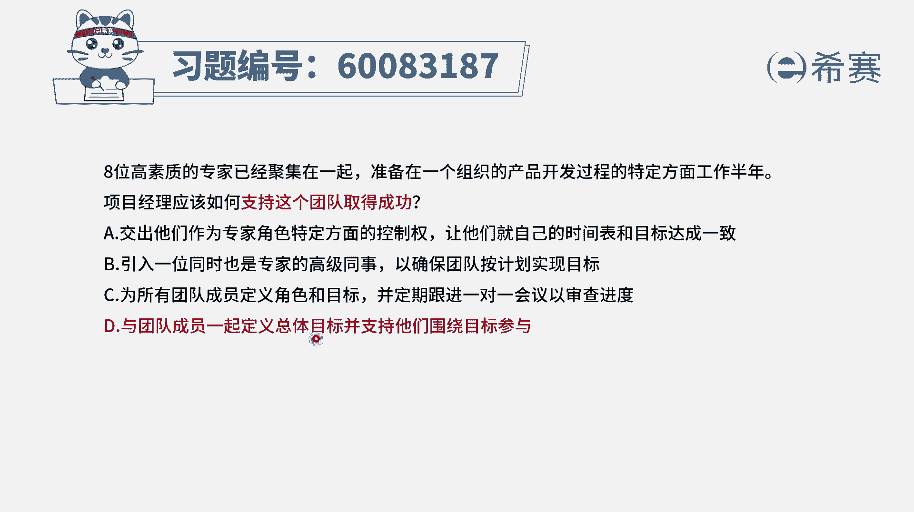
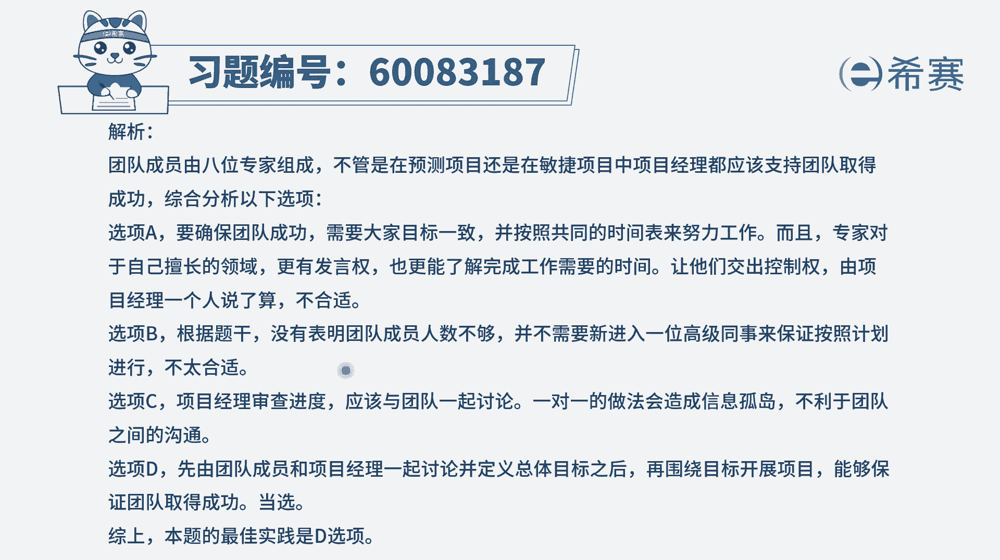

# 24年PMP-pmp项目管理零基础模拟题精讲视频，免费观看（含解析） - P48：48 - 冬x溪 - BV1Qs4y1M7qP

八位高数字的专家已经聚集在一起，准备在一个组织的产品开发过程，的特定方面工作半年，项目经理应该如何支持这个团队来取得成功，首先你作为一个项目经理，你要能够让这个八个高素质人才一起工作，取得成功。

你肯定是要学到一个粘合剂，并且让每一个人，他的那个专业技能得到一个有效的发挥，那么在这个过程中，我们肯定是要去先定义好目标，然后呢能够给他们授权，让他们去施展他们的才华，应该是这个逻辑对吧。

有了这个认知以后，我们再来看一下这四个选项，选项a交出他们作为专家角色，特定方面的控制权，让他们就自己的时间表和目标达成一致，呃这个前半句呢一看就不太合适，他们因为是专家，所以才被挑选进来。

那一定要让他在发挥这个专家的这个重要作用，能够给团队或者给这个项目提供更多的支持，好b选项引入一位同时也是专家的高级同事，以确保按照计划来去实现提高，农其实没有讲到说我说人少了。

所以没有要求说非得要去加一个人进来，c选项为所有的团队成员来去定义角色和目标，并定期跟进一对一的会议来去审查，首先你为团队来去定义角色和目标啊，也不是不可以啊，其实也一定程度上也是可以的。

但是呢一定是要去发挥他们所长，所以要是根据他们的特色来去定义，他们的这些角色和目标，还有就是去跟进这些信息的时候，一对一的这种方式，会有点像什么一种很分离的制度，那会导致有更多的信息孤岛。

并且大家感受不到团队的这样一个力量，好，最后一个选项与团队成员一起定义总体的目标，并支持他们围绕目标来参与，那这样的话呢它就会更有参与感，他又有目标，又有参与感，又能够去发挥他作为专家的这个总特别技能。

这是一个非常理想的状态，所以这个题目的答案只有d选项，可以选a选项错在哪里呢，你不能够把它这个专家特色给干掉了，而b选项呢他没有说要非得加一个人进来，你你有作为一个项目经理。

你能够带领这八个人就已经非常好了，好c选项说是你来去为团的定义，其实在一定程度上跟大家共同探讨，然后让大家去出谋划策，每一个人都是专家，他们一定有很多他自己的这些见解和想法，还有就是会议呢。

应该也不是一对一的这种会议来进行，而能够更多的是让大家体会到这种团队的力量，团队价值，而第一选项既能够具有团队力量，同时又有这个目标的这些展现啊，这是一个非常棒的一个选项，那文字版解析在这里。

