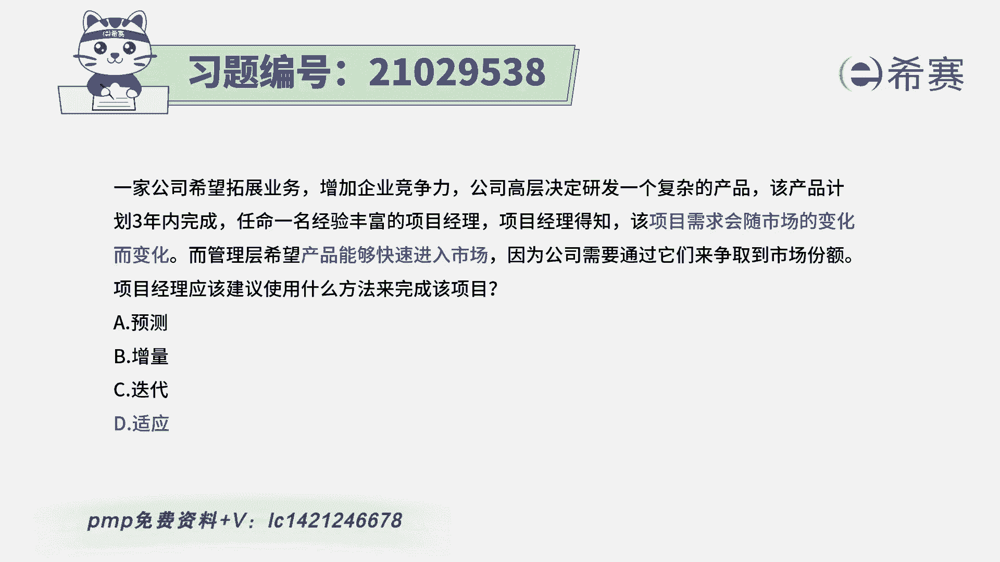
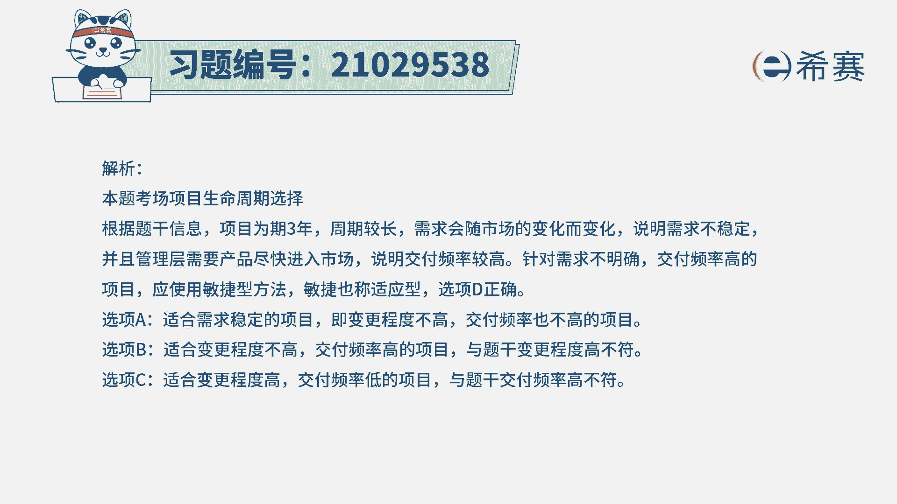
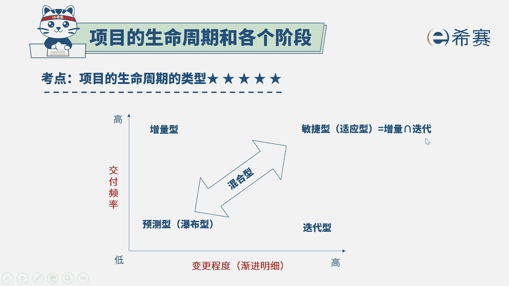

# 24年PMP敏捷-100道零基础付费pmp敏捷模拟题免费观看（答案加解析） - P1：1 - 冬x溪 - BV1Zo4y1G7UP

一家公司希望拓展业务，增强企业竞争力，公司高层决定研发一个复杂的产品，该产品计划3年内完成，任命一名经验丰富的项目经理，项目经理得知，该项目需求会随着市场的变化而变化。

而管理层希望产品能够尽快速的进入到市场，因为公司需要通过他们来争取到市场份额，项目经理应该建议，采用什么样的方法来完成项目，是预测型，增量型，迭代型还是适应型，那这个题目的话呢。

其实我们重点去关注到这样几个词，其实就够了啊，首先第一个这个产品它比较复杂，然后呢同时它可能需求会随着市场变化而变化，所以是需求可能会发生一些变化，还有一个呢，就是管理层希望产品能够快速的进入到市场。

也就是说是，不要等到所有东西都完成以后才交付，而是要多次交付，尽早的交付，那这很显然就是既要交付很多次，它又需要去有大量变化，这是适用于一种敏捷型，敏捷型呢我们也会取名字叫适应性，所以答案是d选项。

解释呢大家有兴趣可以看一下啊，重点是看这张图。

其实就能够清晰的了解到，既然是需求可能会有大量的变化，所以呢是属于变更会比较频繁，同时他又希望能够快速的走向市场，来占领上份额，所以是增量型的方式，而敏捷型或者叫适应型，它就是增量加迭代对这种方式。

