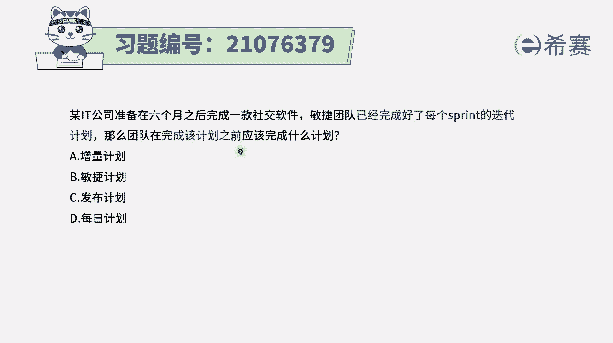
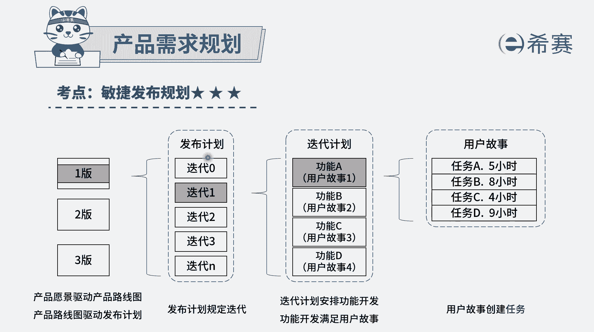
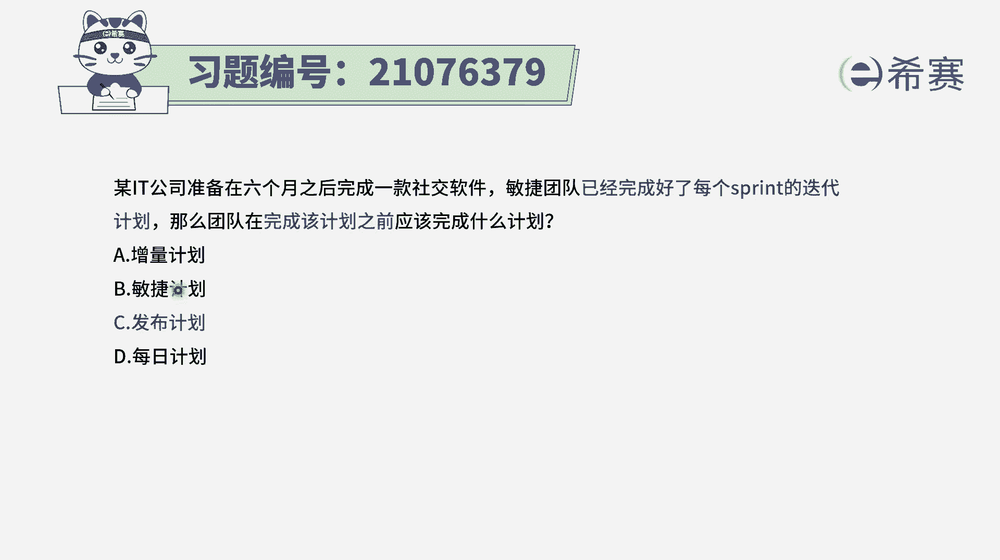
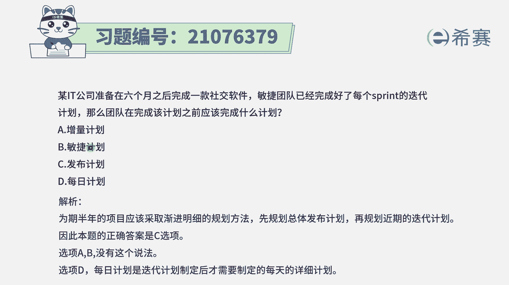

# 24年PMP敏捷-100道零基础付费pmp敏捷模拟题免费观看（答案加解析） - P10：10 - 冬x溪 - BV1Zo4y1G7UP

某it公司准备在六个月之后完成一款社交软件，敏捷团队已经完成了每一个迭代的迭代计划，那么团队在完成该计划之前，应该先完成什么，也就是说我们是先有了什么东西，然后再依据这个东西来去做这个迭代计划。

那这里我们需要知道一个很重要的知识点，一般来讲我们在做软件项目的时候呢，也有一个大的需求，那这些大的需求从大方向来讲，到我们需要什么东西，那这样一个需要呢就叫产品愿景，那基于产品愿景。

我们因为说是没有办法一次就满足，所以我们会拉一条长线，在这个时间轴线上，我们在什么时间段能够去交付，哪一些具有的功能，那这样的话就做了一个叫产品路线图，而这个产品路线图呢会分到几轮来去交付对吧。

那每一轮交付我们给它取一个名字叫发布，那每一轮发布呢它又会分到多轮迭代，所以是发布计划里面又会包含很多轮迭代，每一轮迭代它可能会是2~4周左右，那这一轮迭代呢你又会有一个迭代计划。

那这个迭代里面具体的就是每一天都要开，有了这样一个信息以后，我们知道它题干中已经告诉我们说，已经做好了这个迭代计划，那么前提是应该先有什么东西，那当然就是先有这样一个发布计划。

所以答案就是选发布计划，每日计划是在之后的内容，然后在整个敏捷里面没有提到这个增量的计划，和敏捷计划这一概念，因为敏捷计划不管说是发布计划也好，迭代计划也好，还是说呃每日的间隔计划也好。

它都算是米见面计划，它是一个比较笼统的东西，所以答案是选c，发布计划，先有发布计划，然后在这个发布的这个周期中，然后去分成多轮迭代，每一轮迭代都有一个迭代计划。

