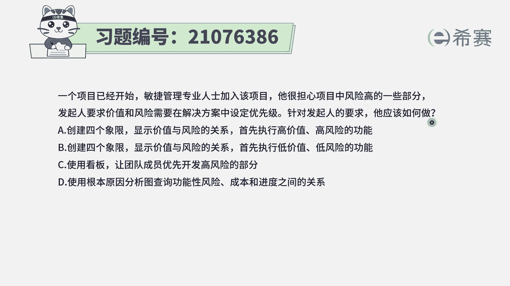
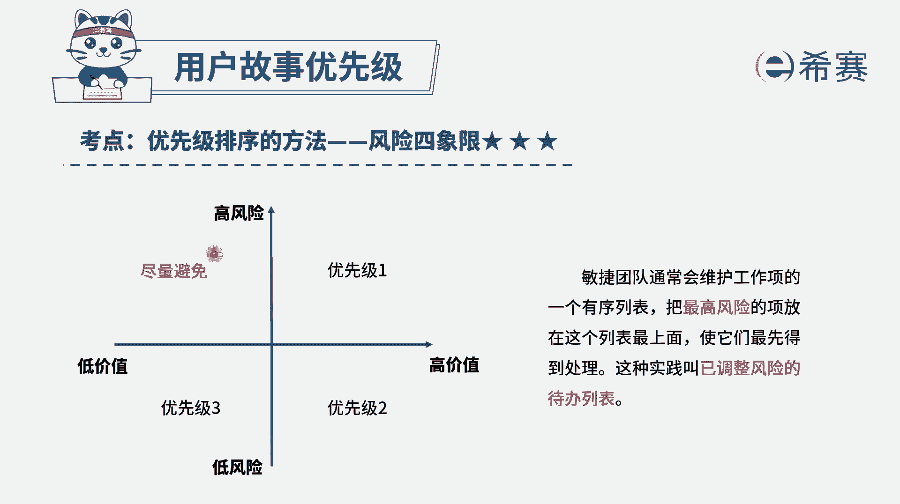
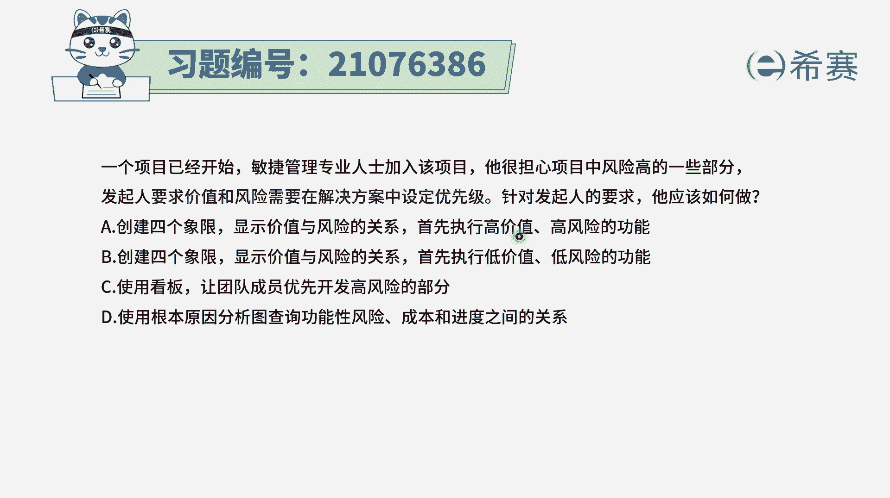
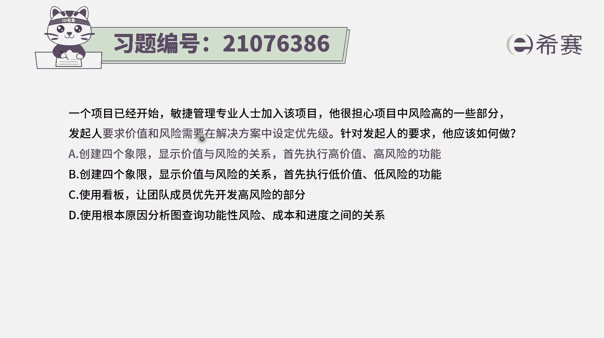
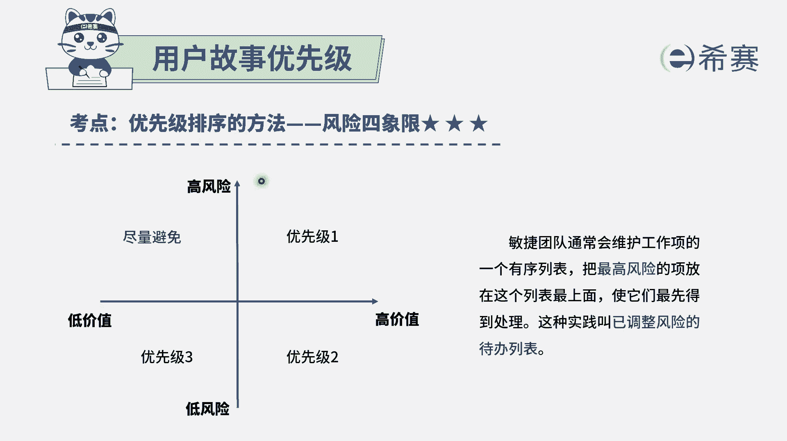
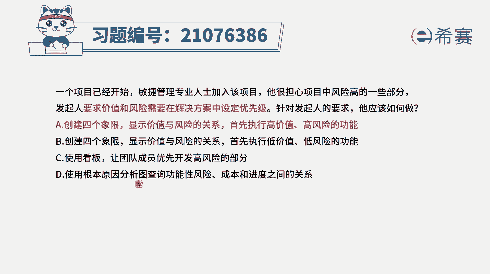
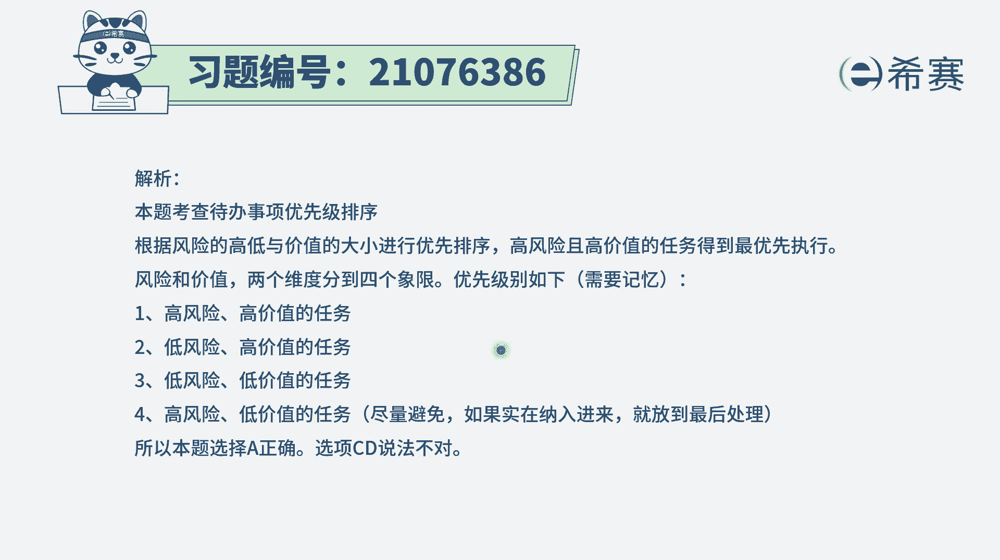

# 24年PMP敏捷-100道零基础付费pmp敏捷模拟题免费观看（答案加解析） - P11：11 - 冬x溪 - BV1Zo4y1G7UP

一个项目已经开始敏捷管理，专业人士加入该项目，他很担心项目中风险高的一些部分，发起人要求价值和风险，需要在解决方案中设定优先级，针对发起人的要求，他应该如何做，那这个题目呢其实坦白说啊。

他题目的那个四个选项，它没有为难你，因为首先你得要知道一个点，就是在我们整个敏捷中呢，会有一个叫风险的四象限。

这个风险四象限，它其实是帮助我们去对这个用户故事进行，排序的这一种方法，也就是说它会将某一些风险，按照它风险发生的频度是比较高还是比较低，这是频度比较高，这是风险发生的频度比较低，较高风险和低风险。

另外呢是这个风险，它有可能会导致的损失比较大，还是损失比较小，他如果导致的损失比较大呢叫高价值，它导致的损失比较小的叫低价值，也是它的破坏程度，那么对于这个高风险，低风险，高价值。

低价值会把我们的这样一些风险分为四个象限，在第一个象限中，他特指的是说风险比较高，同时呢风险那个他可能的破坏比较大，就是它的价值也比较高，对于这种风险呢，优先级是放的最高的，这一点上面。

其实很多同学会有疑问，说，为什么是优先做那个高风险高价值的，而不是优先做这个低风险高价值，那是因为在敏捷中它会有这样一个特质，我们说敏集中如果遇到风险以后，我们要快速去做刺探。

来快速去了解这个技术的可行性，我们通过提前去做这些高风险的东西，让高风险能够提前报关出来，这样的话我们后续去应对它，去管理它，就会更方便更好管理，所以呢关于风险四象限。

你要记得是优先做了一个高风险高价值的，然后才是做那个呃低风险高价值，那做完这些价值比较高了以后呢，再去做，至于第三个象限，低风险低价值和第四个象限高风险低价值，那么对于这样一个用户故事。

或者对于这样一些风险的话，理论上来讲，我们是优先做这个低风险低价值，而对于这个高风险低价值，尽量是不要去做它，所以优先级排序是先做这个高风险，高价值这个区间，然后再去做啊，低风险高价值这个区间。

第三是做这个低风险低价这个区间，然后最后不得已才是做这个高风险，低价值这个区间，有了这样一个认知以后呢。

我们这个题目其实非常好选的啊，呃选项a和b它都是说创建四个象限，来显示价值和风险的关系，差别就在后面一句话，选项a说是优先执行高价值高风险的功能，选项b的是优先执行低价值低风险的功能。

那很显然我们说第一要务是先做这个板块。

先做这个高价值高风险的功能，也解释了为什么先做这个高风险呢，是因为让风险提前报关，这样的话能够让风险的应对成本相对降低一些。

所以答案是选a，至于其他两个选项选项c使用看板，让团队成员能够优先开发高风险的部分嗯，使用看板，把这些风险放到看板中能够去同步，这个是没有问题的，然后呢，同时呢。

让团队成员应该是优先做了一个高价值的部分，是做了一个高风险高价值的部分，这也没有问题，问题在于，题干中明确告诉你说是要求价值和风险来去呃。

设定优先级，所以这就是用风险四象限，也就是就用这个模型来去完成。

而c选项是不是这个模型，而最后一个选项使用根本原因分析，来去查询他们的一个可能的风险啊，成本啊，进度，这个完全跟价值风险的这个风险四象限，没有什么关系。

所以答案就选a了。

