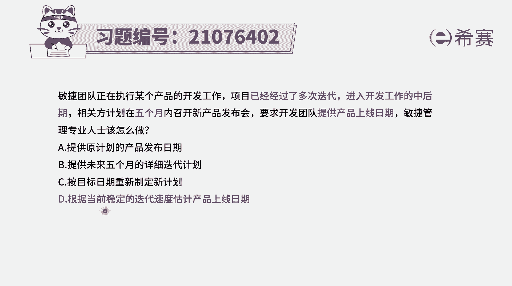

# 24年PMP敏捷-100道零基础付费pmp敏捷模拟题免费观看（答案加解析） - P15：15 - 冬x溪 - BV1Zo4y1G7UP

敏捷团队正在执行某个产品的开发工作，项目已经经过了多次迭代，已经进入到开发工作的中后期，项目的相关方，计划在五个月内召开新产品发布会，敏捷管理专业人士应该怎么做，那首先我们要知道这个项目。

它当前的状态是什么状态，已经是一个比较平稳的状态了，已经是做的非常熟练，因为他已经经过多次迭代，进入到了后中后期了啊，有了这个认知以后呢，我们再来看对方，他想要你提供一个产品上线的日期。

是不是我们其实可以通过当下的这个速度，能够预测未来的速度，预测未来还有多少工作没有做，以及大概速度是什么样子，我们就能够给到一个信息对吧，应该是可以的啊，我们来看一下四个选项。

选项a提供原计划的产品发布日期，那这个就是没有做任何改动，而事实上我们知道在最前的时候做的计划呢，是一个大致的规划，但是我们在做的时候，做开发的时候啊，那开发的速度它其实是一开始可能不太高。

然后做一做逐渐会变得越来越高，所以它会有一个趋向于稳定的过程，而选项一中完全没有考虑到这个过程的变化，这种方式呢肯定不太恰当，选项b提供未来五个月详细的迭代计划，你只要看到详细这种词，基本上是个敏捷。

不太匹配，不太搭，就可以pass掉，选项c按照目标日期来重新制定新的计划，这就完全是从目标来倒推的这种方式，他不会是一种很主动的来去，从我们的，基于我们当下的速度来去推测未来的这种方式。

这种呢就有点显得不太合适啊，而最后一个选项，根据当前稳定的迭代速度，来估计产品的上线日期，这是可行的，因为整个做产品呢，它就是在做的过程中敏捷的迭代，前几轮迭代可能都是速度有点不稳定，忽上忽下的。

然后做了一定程度以后就会越来越稳定，因为大家也都越来越熟练，对这个项目本身的认知也会越深入，所以我们会基于当前稳定的速度，来对未来做一个预测，大概能知道剩下的工作量，我们可能还需要多长时间去完成。

剩下的这样一些用户故事点数，我们可能还需要多长时间就能够去完成。

以后去上线，所以答案选最后一个。

