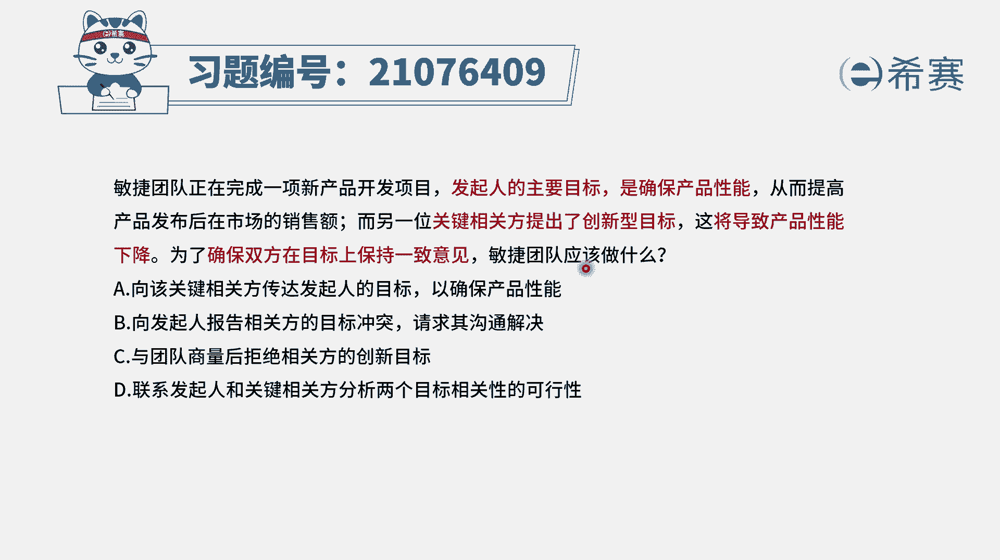
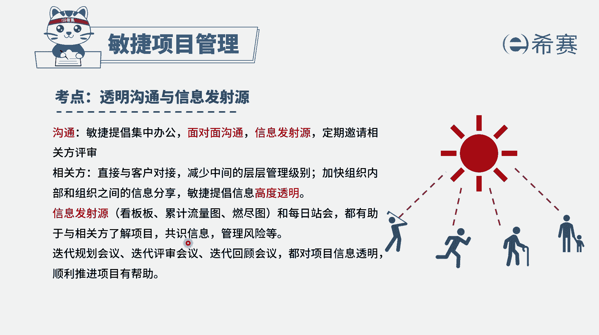
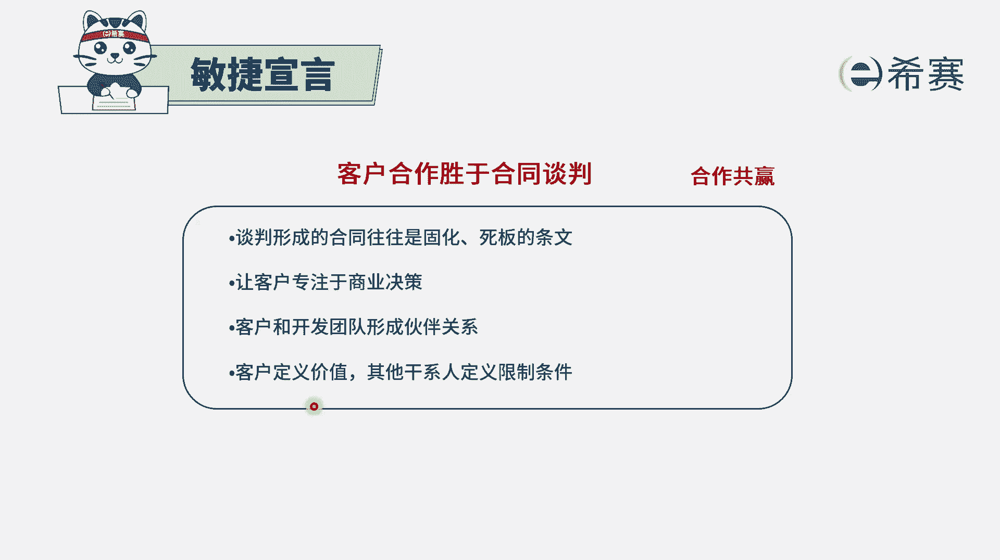
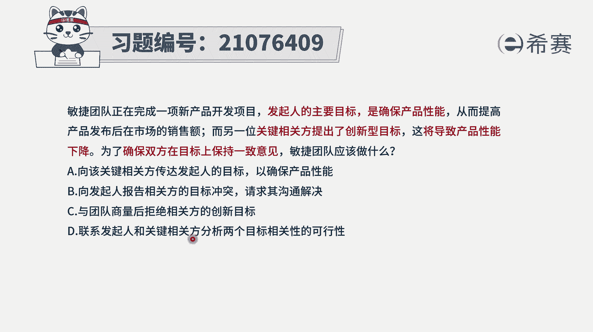
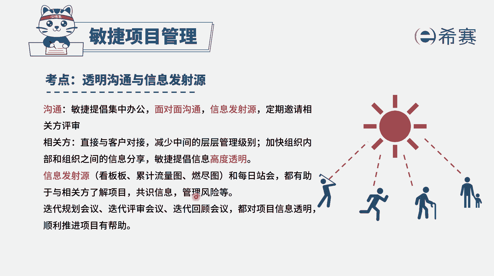
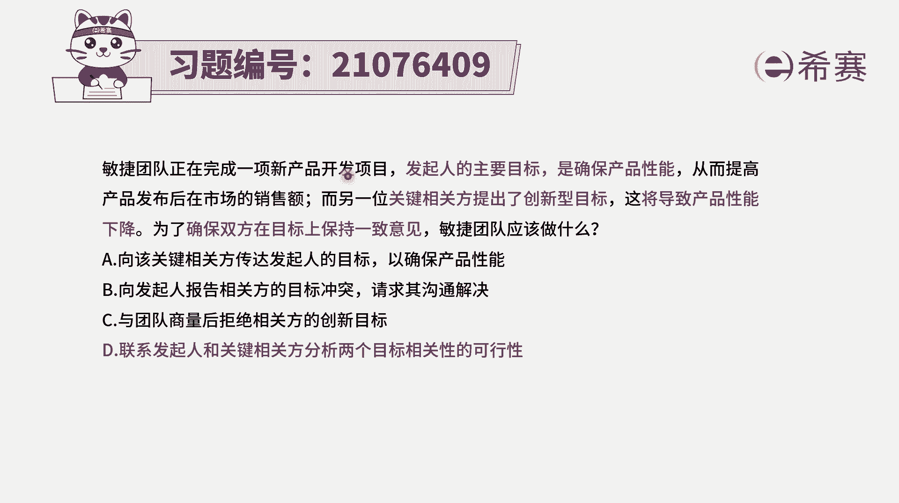
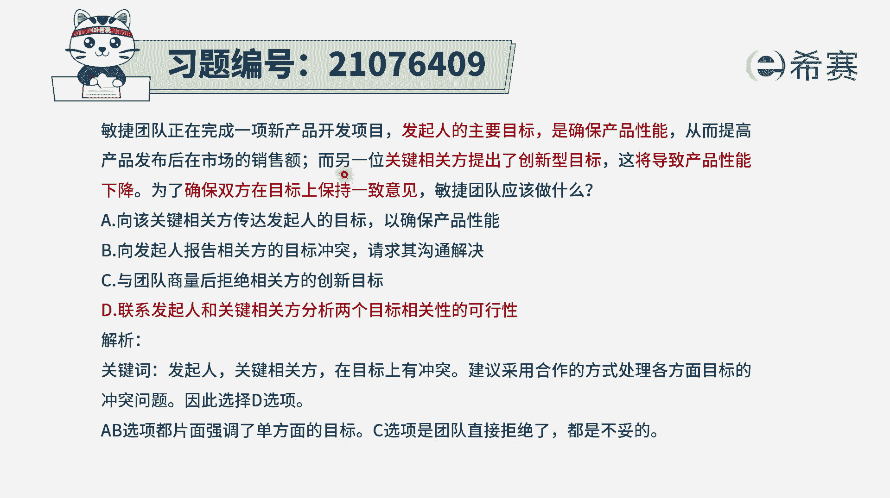

# 24年PMP敏捷-100道零基础付费pmp敏捷模拟题免费观看（答案加解析） - P16：16 - 冬x溪 - BV1Zo4y1G7UP

敏捷团队正在完成一项新产品开发项目，发起人的主要目标是确保产品性能，从而提高产品发布后在市场上的销售额，而另外一位关键相关方，他提出了创新型的目标，而这个创新型的目标将会导致产品性能下降。

为了确保双方在目标上保持一致的意见，敏捷团队应该怎么做，那这个题干中已经明确告诉你，就是有两个很重要的相关班，他们的这些目标是有冲突的，那当他们的目标不一致的时候呢，其实团队是没有办法很好的去开展工作。

因为你不管怎么开展工作，一定有一些人的需求是没有得到满足，所以我们怎么样才能够去让他们的这样一个，信息保持一致，目标保持一致呢。

当然至少得要通过沟通呢对吧，至少得通过沟通，而在敏捷中非常提倡重沟通的透明性，要多做沟通和交流来达成某种共识，所以是通过这种沟通来达成共识，嗯然后呢另外在米集中还有一个点。

就是说客户合作胜过合同谈判，他会强调是多去协作，合作共赢的这种方式来完成事情。

有了这些认知以后呢，我们再来看一下这四个选项怎么样做，才能够去确保双方在目标上完成一致呢，选项a说向该关键相关方传达发起人的目标，以确保产品性能，这就是取一方不取另外一方，这种方式的话呢，呃就没有商量。

不太合适不太合适，至少不太合适，本题的场景，选项b向发起人报告相关方案的目标冲突，请求其沟通解决，也就是把锅甩给了发起人，让发起人来解决这样一个冲突，这肯定不合适，要不然的话请你来干什么呢。

选项c与团队商量后，拒绝相关方的这个创新的目标，那就还是直接去，没有满足相关方的这样一个需求，而选项d联系发起人和关键相关方，分析两个目标相关性的可行性，虽然这句话非常拗口，但是你能够从这一句话中。

能够感受到一个什么信息，就是我们要把这两个重要人联合到一起来，然后让他们一起去讨论这个事情，通过讨论再来解决问题。

所以这就刚好是满足了我们这种信息沟通透明，然后并且呢是能够通过这种合作共赢的方式。

多多协作的方式来解决问题，所以答案就是选最后一个选项了，就是当有两个重要的相关方，他们意见不一致的时候，我们应该是要想办法让他们去坐下来，一起去沟通协商，而不是只取一方。

不取另外一方的这种方式，就答案是选d，选项解析。

