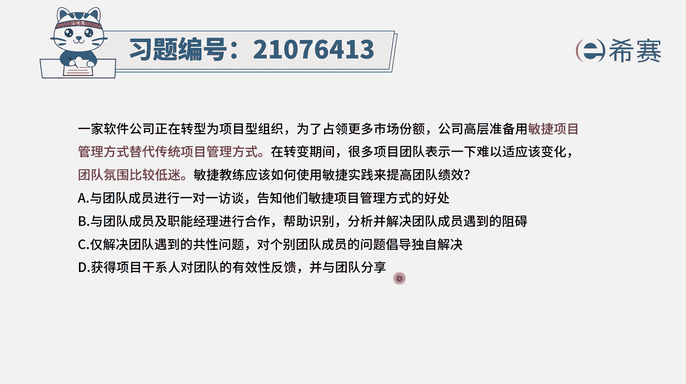
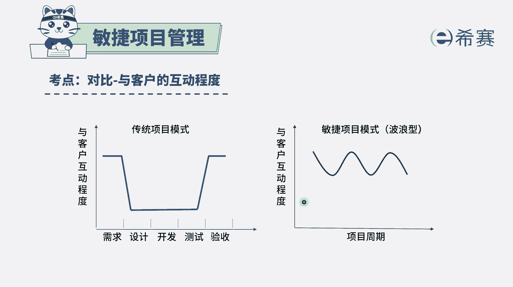
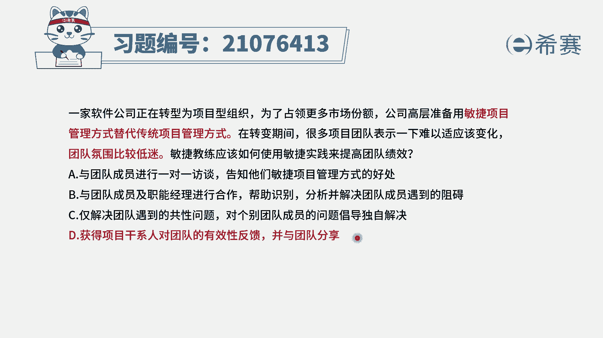

# 24年PMP敏捷-100道零基础付费pmp敏捷模拟题免费观看（答案加解析） - P17：17 - 冬x溪 - BV1Zo4y1G7UP

一家软件公司正在转型为项目型组织，为了占领更多的市场份额，公司高层准备用敏捷项目管理的方式，来替代传统项目管理方式，在转变期间，很多项目团队都表示一下子难以适应这种变化，团队氛围比较低迷。

敏捷教练应该如何使用敏捷实践，来去提高团队的绩效，那我们知道一下，就说一般来讲，其实要去转型都不是一件很容易的事情，他中间都会历经很多的波折，因为大家其实一般来讲，还是会习惯用一种原来的方式来行为处事。

可是现在要去做到敏捷，怎么样用敏捷实践的方式来提高他的绩效，我们就来看一下这四个选项，哪一个是敏捷实践，并且确实这种方式能够提高团队的技巧，选项a与团队成员进行一对一的访谈。

告知他们敏捷项目的管理方式是有效的啊，在敏捷中其实有一个词语是什么呢，在精益思想中有一个词叫消除浪费，也就是说如果有些东西它不产生价值，它就是有浪费，那包括说多余的库存啊，多余的等待时间呢都是浪费。

而选项a做的这种方式呢，其实是显得非常低效的，方式是有点浪费的，它更敏捷的时间，方式呢其实有出入，选项b与团队成员以及职能经理来进行合作，帮助识别分析，并解决团队成员所遇到的这样一些阻碍。

这个呢其实是一个可选项，事实上它确实是一个可选项，但是我们会更重视的是什么，就团队的整个氛围比较低，我们能否用一种更好的方式，因为呃他还是不够敏捷，因为在敏捷中他会提倡的是什么呢，就是敏捷教练。

你是一个仆人式领导，是用服务的方式来做，就是当你有需要你来找我的时候，我来去帮助你，来对个别团队成员的问题呢提倡自己独自解决，那就刚好就是不符合敏捷，因为敏捷中它其实除了要解决共性问题。

你还要解决个人的问题，在敏捷中呢其实有一个词叫消除障碍，也就是说是如果团队成员他遇到了一些障碍，遇到一些困难和挑战，然后他需要帮助的时候呢，敏捷教练应该是要出来去帮助他解决这些挑战，清除障碍。

所以呢这个c选项是不正确的啊，然后再来看最后一个，获得项目干系人对于团队的有效反馈，然后与团队进行分享，这是一种什么。

就通过正向反馈的方式来激励大家，那在敏捷中呢有一个很重要的点，就是我们会通过这种快速交付信息，然后快速去获取客户的评审，以及得到客户的反馈的作用方式，从而能够知道下一步应该怎么样去调整和改进。

所以快速获取反馈，从而能够去调整改进，这就是敏捷的一种所提倡的这种实践的方式。

而最后一个选项获得干系人，对于团队的这样一个有效反馈，刚好是跟这样一个信息是相一致，所以如果说团队本身氛围比较低迷的时候呢，我们其实要想办法去多帮助他们，多支持他们，以及能够给他们一些正向的反馈。

事实上人都需要鼓励呃。

在个体心理学流派中有讲过这样一句话，说，人需要鼓励，这项植物需要水，你想人多么需要鼓励，如果有人给我们一些正向的反馈，会促使我们更加奋发向上，好解析。

