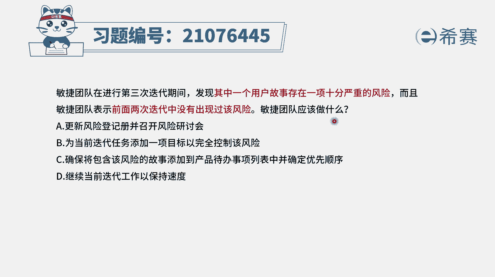
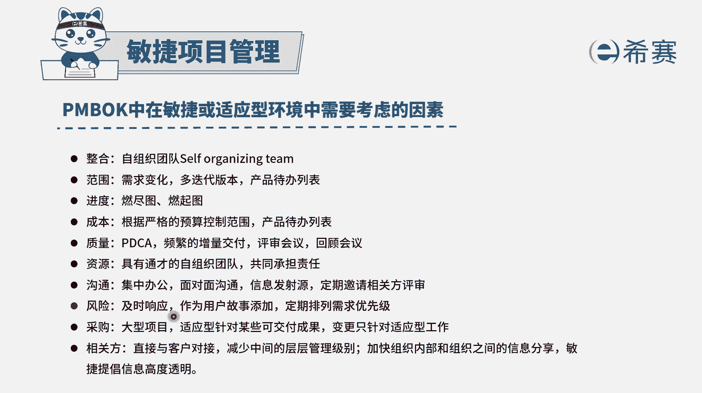
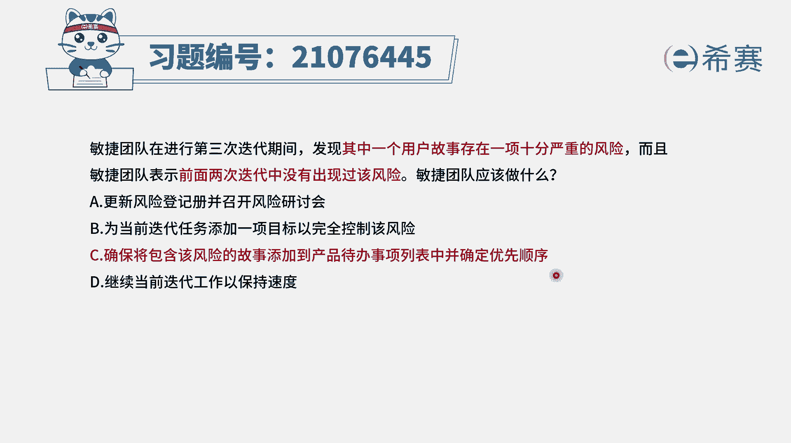
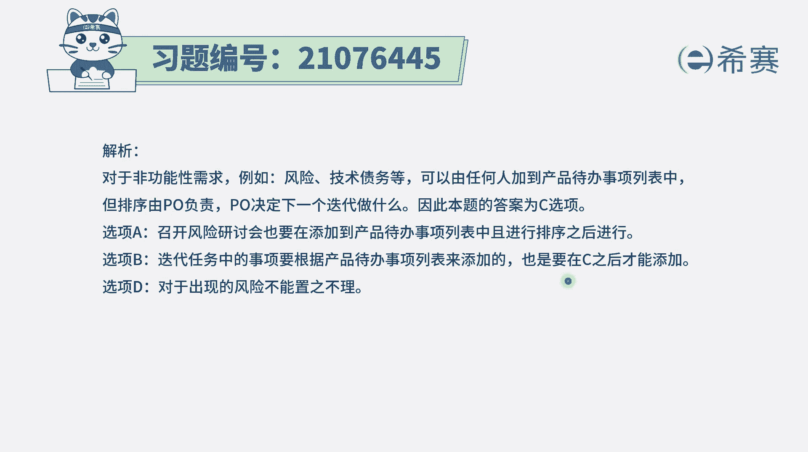
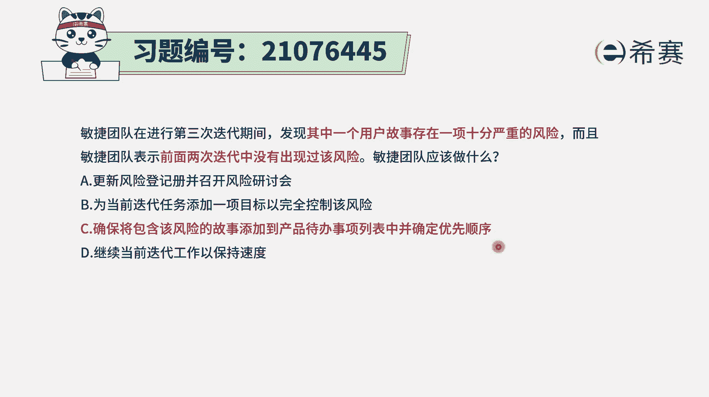

# 24年PMP敏捷-100道零基础付费pmp敏捷模拟题免费观看（答案加解析） - P24：24 - 冬x溪 - BV1Zo4y1G7UP

敏捷团队在进行第三次迭代期间，发现，其中一个用户故事成了一项十分严重的风险，而且敏捷团队表示，前两次迭代中没有出现过该风险，那敏捷团队应该怎么做，这里其实表示的是一种突发的风险。

对于这种突发的风险应该怎么办呢，在敏捷中其实会有这样一个规则。

就是对于风险，一般来讲，首先我们是要去及时响应，并且有一些重要的风险，我们是可以把它专门作为一个用户故事，添加到产品待办事项列表中来，并且对于他进行这样一些排序，就是风险，它会有一个词叫反价值。

就是风险它其实会造成一些损失，那这样一个损失呢，他如果说你做的某一个需求，能够产生价值是4000，而你产生某个风险，它产生的这个损失可能是5000，那么对于这个风险的处理。

它可能比这个呃这个原来那个用户故事，四线的故事可能还会显得更重要一点。

所以有了这个逻辑以后，我们再来看一下这四个选项，选项a更新风险登记册，并召开风险研讨会啊，在敏捷里面呢，其实已经不再去校正一种风险能力测的东西，当然有的时候有一些题目中也会有这种叫法。

但是更关注的是什么，它会是一种可视化的方式来去操作，那么可视化的方式中，就会有这样一个产品代办事项列表，各路用户故事，并且会把风险都是放在看板上面来进行，所以不再那么提倡第二个选项。

为当前的迭代添加一项项目目标，已完全控制该风险，这个说法其实说有点怪异，我们怎么样能够去对于当前的迭代，来添加一个目标来控制风险呢，你只能说是我们说在这个任务中，如果说是加一个这种刺探来去刺探这个风险。

倒是反而是可行的，所以这个表达其实是有问题的啊，选项c确保将包含该风险的用户故事，添加到产品待办事项列表中来，并且去进行优先级排序的这一个确定，这个刚好是符合了咱们刚看到这个内容。

所以它就是这个题目的正确答案，而最后一个选项继续当前迭代工作，以保持速度，这很显然它就是对风险视而不见是不合适的，所以在敏捷中如果出现风险的话呢，我们优先是要去响应它的。

我们可以把它添加到这个产品，代办市场率表中来。

