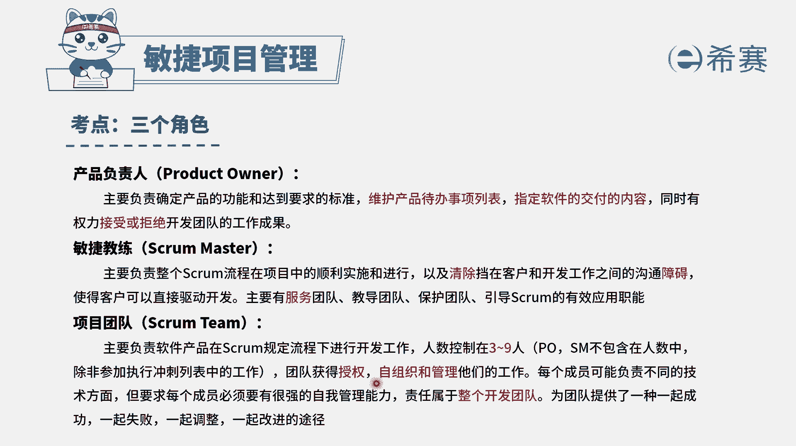

# 24年PMP敏捷-100道零基础付费pmp敏捷模拟题免费观看（答案加解析） - P26：26 - 冬x溪 - BV1Zo4y1G7UP

敏捷团队由原职能部门的专业人才组成，现在都专注于敏捷团队，为了给客户创造价值而努力，每个团队成员都有自己擅长的部分，在迭代开发期间，一名测试人员表现出想要编写代码的意愿，但是这是他非常不擅长的领域。

敏捷团队应该怎么做，那在这里呢，首先我们需要去知道两个重要的信息，首先第一个是在敏捷中，会提倡我们的人员是什么样的人，是通才型的专家，也就是说一专多能是t字型的人才，复合型人才，就是各方面都略懂一些。

同时在某一方面比较专业，这样的话呢大家才能够形成一个比较好的团队，比较有这样一个强大的力量，来去完成重要的事情，我们说最好的架构，需求和设计都是出自于自组织团队，这是第一个。

第二个呢就是在敏捷中会提倡的是，如果团队成员有一些意向或者是需求，而这些意向和需求它不是那种不正当的，也就是说不会违背这样一些自序啊，规则呀啊这样一些法律法规啊等等的东西。

只要它是一种积极上进的一种需求，或者是有热情，有兴趣的这样一些需求，那么理论上来讲，我们其实都应该是去支持的，但是这里有一个前提是不能够影响团队的绩效，不能够拖团队的后腿，好有了这样一些信息以后。

我们再来看第四个选项，既然这个测试人员他想要去编写代码，理论上来讲我们是要去支持，但是呢它又是非常不擅长于编写代码，那这样的话我们怎么办，好像我们就是应该要去给他培训对吧，那我们来看一下四个选项。

选项a要求敏捷教练对其进行培训，这种方式就写了什么，这没有说是团队自己来去解决，而是有人去从上往下压的这种方式，他不适合敏捷的这一套，不适合敏捷的价值观，选项b要求一名团队成员对其进行指导。

这种要求就是直接去下命令的，这种方式来做事情也不合适，另外这种要求是否会影响到知名团队成员，他的积极性以及他的这种工作绩效呢，整个团队它本身就是一个一荣俱荣，一损俱损的。

因为我们团队是什么，他是一个自我组织做管理团队，同时呢，他要求每个团队成员有较强的自我管理能力，带自己去认领任务，我们是一起成功，一起失败的这个团队，那如果说你直接要求一个人去来指导他。

那是否会对这个人的绩效也产生一些影响呢，所以也不太合适，选项c组织会议，与团队共同商议是否让其承担开发的工作，而这种方式，他就是把这样一份责任权力还给了团队。

让团队真的是作为一个自组织。

自管理的这个角色，所以这就是它的正确答案了，团队如果决定了以后，说是好来让他去做开发，同时呢有人会带他，那就是共同决定的结果，如果大家决定说暂时可能时机还不合适，那可能暂时先不做。

因为我们要去做一些事情，他不能够影响整个团队的利益，这是一个前提条件，而选项d呢说认同他的想法，马上让他做事情，那这种方式有可能会影响团队利益。

所以在这里有这样一条，说是通常型的专家，也是建立在不影响团队利益的基础上来，去做事情，我们理论上来讲是要去鼓励大家，然后发挥更多的这种技能啊，学习更多的东西。

