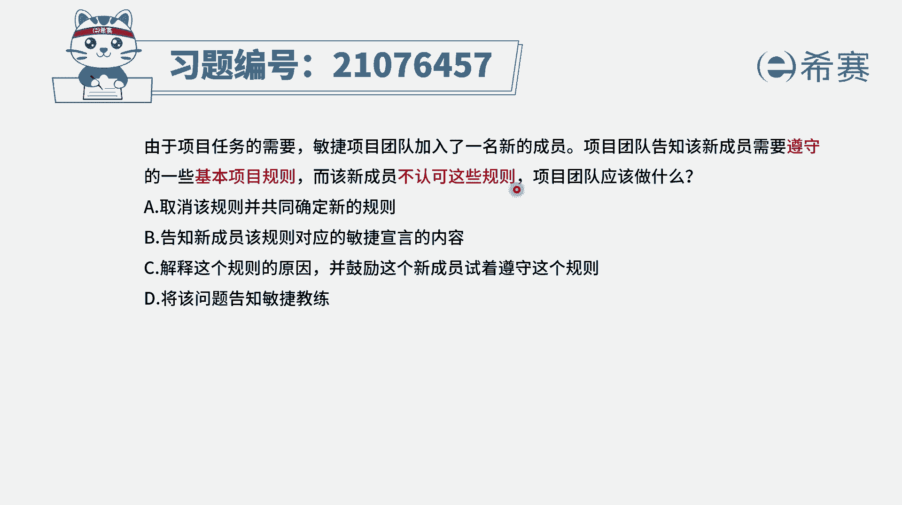
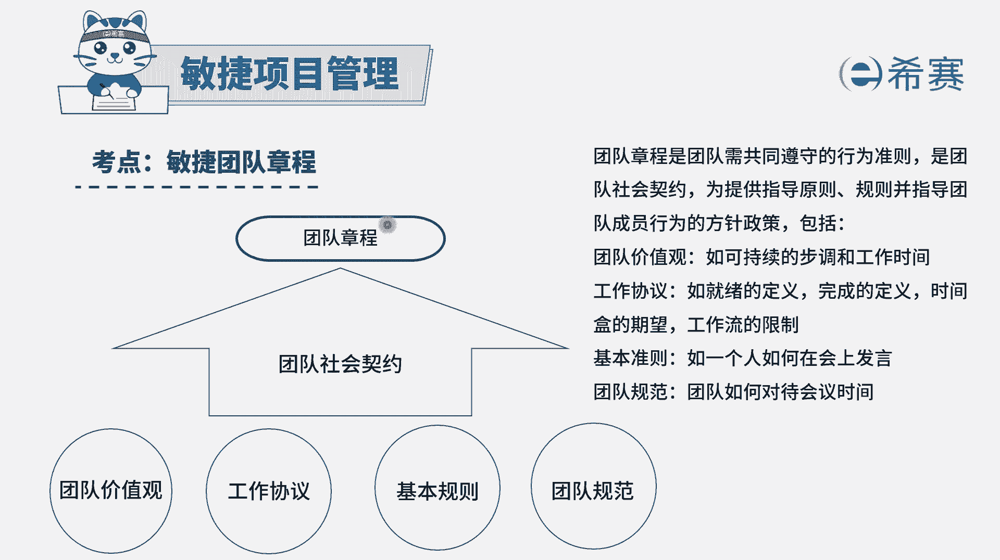
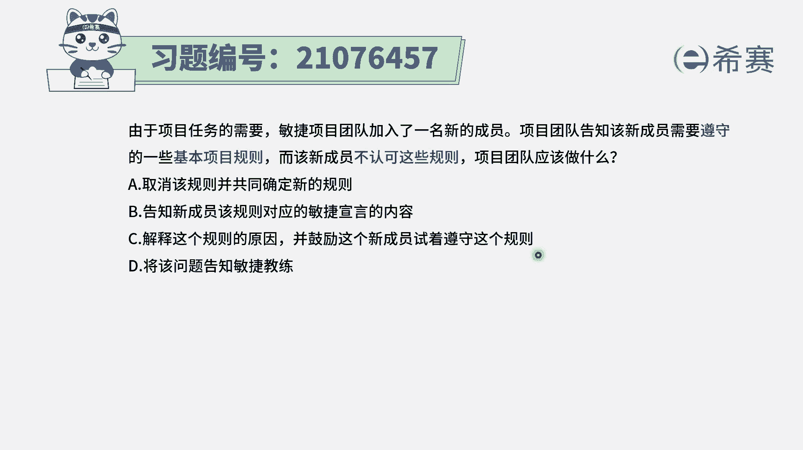
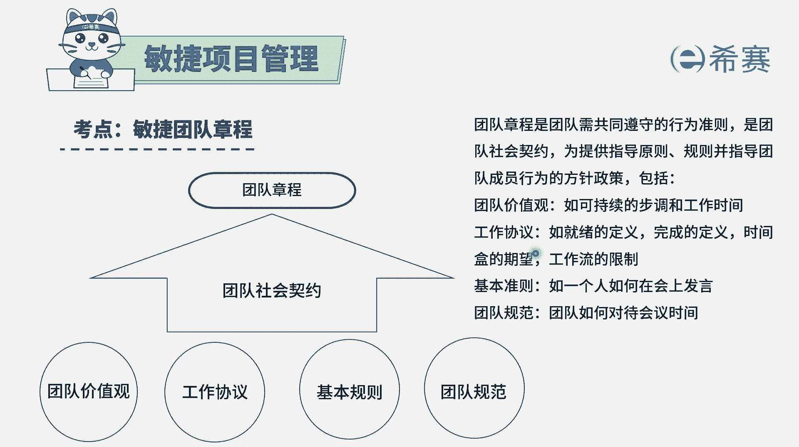
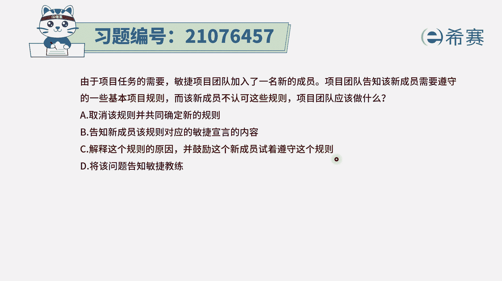
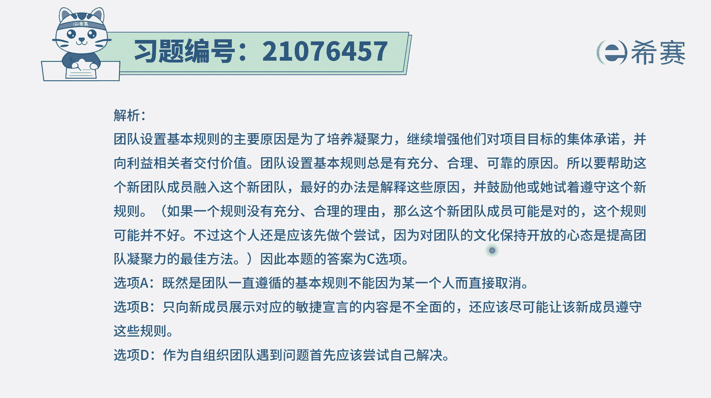

# 24年PMP敏捷-100道零基础付费pmp敏捷模拟题免费观看（答案加解析） - P27：27 - 冬x溪 - BV1Zo4y1G7UP

由于项目任务的需要，敏捷项目团队加入了一名新的成员，项目团队告知该新成员，需要遵循一些基本的项目规则，项目团队告知该新成员，需要遵循一些基本的项目规则，而该新成员不认可这样一些基本规则。

那团队应该怎么办，首先我们需要去知道，其实没有规矩不成方圆，那整个一个团队能够去行为处事，虽然大家都是自组织，团队都是自觉性比较高的人，但是我们还是要有一些共同遵守的规则，而这样一份共同遵守的规则呢。

我们叫团队章程。

这个团队章程，通常情况下是由团队一起来共同讨论决定的，或者是有人去提了一个草案以后呢，大家去讨论以后，一起商讨过决定的，而日本团的章程，是团队共同遵守的一些行为准则，一些社会契约。

就是告诉我们说要怎么样去行为处事啊，要去遵循一些什么样的价值观呢，一些标准这种方式对我们及时约束更是保护。

有了这个信息以后，我们知道就是这个规则肯定是要去遵守的，那么在题干中，这个新成员他不认可这样一些规则，这个时候团队应该怎么办呢，选项取消该规则并共同制定新的规则，请注意，如果说在新规则出台之前。

旧规则应该是依然适用的，只有等到新规则已经出现以后，然后在同时颁布，说旧规则取消应该是这个逻辑，而不是中间有一段时间是没有规则，没有规则，那就是会乱套啊，所以这个a选项是错误选项，选项b告知该新成员。

该规则对应的敏捷宣言的内容，就是说呃一种压制的方式，那这种方式呢显得不够友好，他不是不可行，但是显得不够友好，不够人性化，选项c解释这个规则的原因，并鼓励这个新成员试着去遵守这个规则，这个方式更好一点。

更可选一点，他的这种处理方式会显得比较柔和，来告诉他原因是什么，能够帮助这样一个新成员更好地融入到团队，能够接受这样一些基本的规则，即便说这个规则有问题，那我们也是先要尝试着去接受它。

然后再提出一些问题，而不可能说是为了这一个人去打破，另外事实上整个团队之前能够用这样一套规则，用的比较好，那它一定有它存在的这样一个合理性，所以这个题目的答案就是c选项。

就是我们需要去指导团队，要去遵守基本规则。

那如果新人他觉得不太合适的话呢，我们还是要想办法去引导他来遵守，然后在后续我们可以再来讨论说，是否有一些新的方式能够去调整，修改一些这种基本规则，然后在新的规则确定了以后才取消原来的规则。

最后一个选项将该问题告知敏捷团队，请注意，这里有一个点，就是我们的团队是一个什么团队，是一个自组织，团队是自我组织，自我管理，所以一般来讲遇到的一些问题，我们能够内部解决，就内部解决。

在实在解决不了的时候才去寻找更多的帮助，所以答案还是选c更合适一些。

那解析呢在这边比较长。

