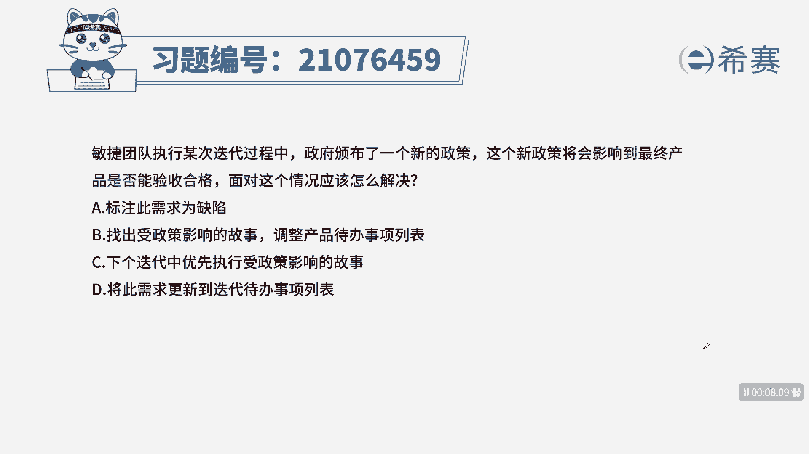
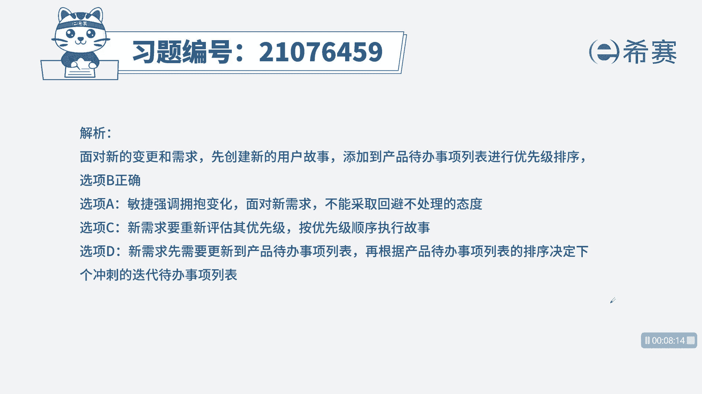
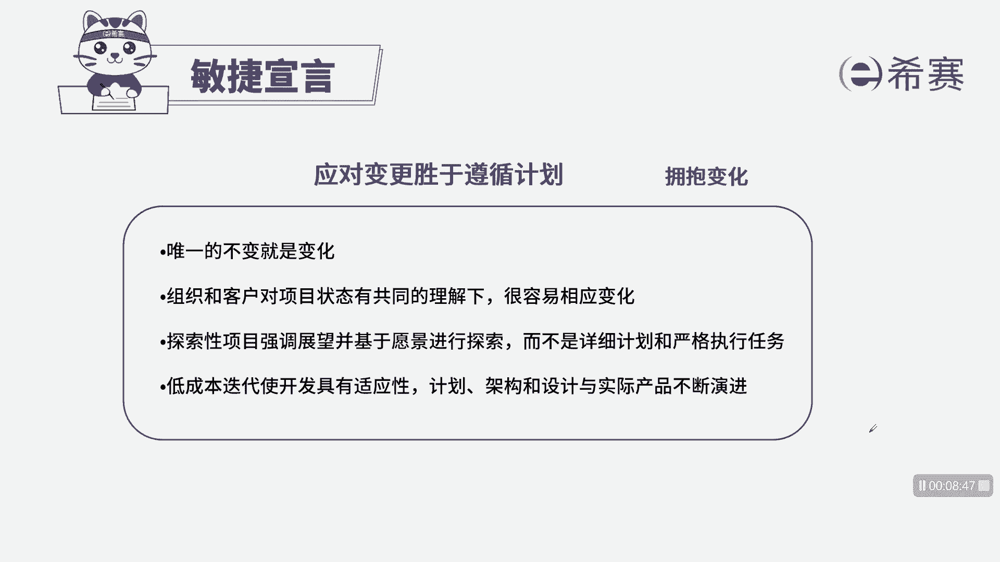

# 24年PMP敏捷-100道零基础付费pmp敏捷模拟题免费观看（答案加解析） - P29：29 - 冬x溪 - BV1Zo4y1G7UP

敏捷团队执行某次迭代过程中，政府颁布了一项新的政策，这个新政策将会影响到最终产品是否验收合格，面对这个情况应该怎么解决，a标注此需求为缺陷，找出受政策影响的故事，调整产品待办事项列表。

c下个迭代中优先执行受政策影响的故事，d将此需求更新到迭代代办事项列表，本题的考法是最佳实践，首先通过题干找到关键信息，题干告诉我们，有一个新的政策影响到了我们的最终产品，问题问的是如何解决这种情况。

其实就是针对于项目有一个新的因素，这个因素呢会导致我们的项目的需求有所变化，那我们如何应对这个新的变化，我们来看四个选项诶，标注此需求为缺陷，标注也解决不了这种情况啊，是一个消极的方式。

只是做了一个记录而已，所以暂时先不选b，找出受政策影响的故事，调整产品待办事项列表，先进行一个分析，针对新政策影响的地方，我们进行调整，至于说代办生列表里面的删除还是细化，还是把优先级调整。

那带我们分析之后啊，再进行操作啊，b项描述没有问题，下个迭代中优先执行受政策影响的故事，下次迭代中它之前我们首先要进行分析，来确定哪些故事受到了影响啊，所以c是在b之后，将此需求更新到迭代代办事项列表。

d项呢也是在b之后确定在产品待办事项列表，在下一次迭代开始的时候，我们在规划会议上再来确定，是否加入到迭代代办市场列表中，所以我们选出正确选项b为最佳时间。

这是本题的解析。

本题的相关知识点，敏捷宣言，敏捷宣言体现了我们敏捷项目的价值观，这里面提到了我们应对变化的时候，一定要快速响应。

